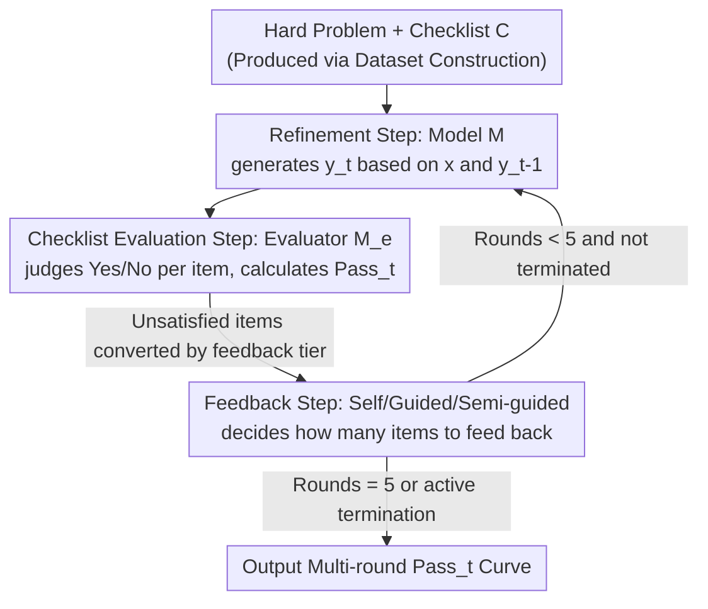

# RefineBench: Evaluating Refinement Capability of Language Models via Checklists

**Conference**: ICLR 2026  
**OpenReview**: [https://openreview.net/forum?id=GYJFJz9Dy5](https://openreview.net/forum?id=GYJFJz9Dy5)  
**Code**: TBD (Website / Code / Dataset links provided in paper)  
**Area**: LLM Evaluation / Benchmark  
**Keywords**: Self-correction, Guided refinement, Checklist evaluation, Multi-round interaction, Reasoning models

## TL;DR
The authors propose RefineBench—a multi-round refinement evaluation benchmark covering 11 domains and 1,000 difficult problems scored via "checklists." By systematically distinguishing between "self-refinement (no feedback)" and "guided refinement (with feedback)," the study finds that even frontier models like Gemini-2.5-Pro and GPT-5 achieve extremely low scores (31.3%/29.1%) after five rounds of self-refinement. However, they approach near-perfect scores when explicitly told "what is wrong," suggesting that current models do not lack the capability to "refine" but rather the capability to "detect their own errors."

## Background & Motivation
**Background**: Enabling language models to refine their previous responses based on user feedback is a critical capability for intelligent systems. This requirement is common in real-world data—approximately 10.24% of 159,134 dialogues in WildChat contain some form of refinement request. These requests are broadly categorized into "guided refinement," where users explicitly point out what to change, and "self-refinement," where users simply ask the model to "try again" without specifying the issue.

**Limitations of Prior Work**: The question of whether models can effectively self-refine remains a subject of debate. Early work (Self-Correct, Self-Refine) claimed they could, while subsequent analyses (Huang et al. 2024) argued otherwise. The authors point out three major flaws in past research: first, most experiments were restricted to "verifiable" tasks like math or code, whereas conclusions might differ for free-form tasks like writing or law; second, self-refinement performance depends heavily on the amount of feedback provided, which was rarely controlled precisely; third, it remains unknown whether emerging reasoning models (with long CoT and self-reflection) follow the same patterns.

**Key Challenge**: Existing refinement-related benchmarks (CriticBench, CriticEval, RealCritic) mostly treat "refinement" as a proxy for "critique quality," relying on model-generated feedback. They fail to distinguish between "external feedback" and "no feedback," lack fine-grained control over the amount of feedback, and do not simultaneously cover verifiable and non-verifiable tasks. Consequently, self-refinement capability cannot be measured cleanly.

**Goal**: To build a unified evaluation platform that decouples and controls "self-refinement vs. guided refinement," "feedback quantity," "verifiable vs. free-form generation," across 11 domains with itemized scoring.

**Key Insight**: Use "checklists" as the atomic unit of evaluation. By breaking down the quality standards of each question into multiple binary judgment items (Yes/No), the "unsatisfied items" naturally serve as the source of feedback. Self-refinement is tested by providing nothing, guided refinement by feeding back all unsatisfied items, and semi-guided refinement by feeding back a partial subset.

**Core Idea**: Use "checklists" simultaneously as the scoring yardstick and the feedback source, measuring refinement capability by separating "the ability to fix (known feedback)" from "the ability to discover what to fix (unknown feedback)."

## Method

### Overall Architecture
RefineBench is not an algorithm but a suite consisting of a "hard problem set + checklists + multi-round evaluation protocol." It consists of two main parts: **offline dataset construction** producing 1,000 hard problems with checklists, and an **online evaluation protocol** where the model under test $M$ iteratively modifies its answer for up to $t=5$ rounds. In each round, an evaluator model $M_e$ (using GPT-4.1) judges each checklist item as Yes/No, determining whether and how to provide feedback for the next round. Three feedback tiers (self-refinement / guided refinement / semi-guided refinement) share the same checklist, varying only in how many items are fed back to create a comparable curve along the feedback intensity axis.

The following shows the multi-round loop for a single problem in the evaluation protocol:

### Key Designs

**1. Checklist Evaluation Framework & Pass_t Metric: Decomposing vague "quality" into binary items**
Evaluating free-form tasks (writing, legal discourse) is difficult because there is no single correct answer. RefineBench assigns each problem a checklist $C$, breaking down high-quality standards into an average of 9.9 (up to 23) binary judgment items, such as "Does the answer accurately identify the core phenomenon in Passage A?" or "Does it synthesize human attributes from sections B–E?". Scoring uses two metrics: $\text{Acc}_t = 100 \times \frac{N_c}{N}$ measures the proportion of satisfied items ($N_c$ is the count of correct items, $N$ is the total); however, the primary metric $\text{Pass}_t$ is an all-or-nothing standard—granting 1 point only if all items are satisfied ($N_c=N$), and 0 otherwise. This design highlights true difficulty: models often satisfy most items but fail on one or two, causing $\text{Pass}_5$ to stagnate below 32%, leaving room for future improvement.

**2. Three-tier Feedback Protocol: Decoupling "fixing" from "localizing what to fix"**
The same checklist is repurposed as the feedback source. By adjusting the number of unsatisfied items fed back, three scenarios are created. **Self-refinement**: $f_t=\varnothing$, where no feedback is given, testing the model's ability to independently discover and fix errors. **Guided refinement**: All unsatisfied items from the previous round are fed as feedback, testing if the model can fix errors when explicitly told what is wrong. **Semi-guided refinement**: Only a subset $N' = \lfloor N \times \text{ratio} \rfloor$ of items are provided as "known feedback," while the remaining $N-N'$ are "unknown feedback" that the model must identify itself. Comparing these tiers helps attribute refinement failure to either "refinement inability" or "detection inability"—the core diagnostic capability of this benchmark.

**3. Dataset Construction & Quality Assurance: Covering 11 domains with backtranslation filtering**
Problems are sourced from Humanities/Social Science essays from Korean universities, California Bar Exam essays, Stanford Math/Statistics problems, and HLE, totaling 1,000 questions across 11 domains (239 subjects). Math accounts for the largest share (32%). It includes both "free-form" and "exact match" tasks. Figures/tables were converted to detailed text descriptions via GPT-4o/4.1/Claude-Sonnet-3.7 and manually verified. Checklists were generated by various LLMs based on original questions and reference answers, then manually refined. Quality was ensured via **backtranslation filtering**: the evaluator GPT-4.1 judged the reference answers against the checklist; any item that even the reference answer failed was removed. This only eliminated 1.1% of items. Additionally, 6 PhD experts manually verified 100 problems (854 items), finding 96.1% to be appropriate.

## Key Experimental Results

### Main Results
The evaluation covered 34 frontier models (Open/Closed, Instruct/Reasoning). $M_e$ was fixed as GPT-4.1 for up to 5 rounds. Metrics used were $\text{Pass}_t$ and $\Delta = \text{Pass}_5 - \text{Pass}_1$.

| Model | Self-Refine t=1 | Self-Refine t=5 | Self-Refine Δ | Guided Refine t=5 | Guided Refine Δ |
|------|------|------|------|------|------|
| Gemini-2.5-Pro | 29.5 | 31.3 | +1.8 | 94.7 | +65.2 |
| GPT-5 | 27.5 | 29.1 | +1.7 | 79.0 | +51.6 |
| Claude-Opus-4.1 | 18.7 | 20.8 | +2.1 | 98.4 | +79.7 |
| DeepSeek-R1 | 8.1 | 7.9 | -0.1 | 91.4 | +83.3 |
| GPT-4.1 | 23.4 | 21.8 | -1.6 | 95.5 | +72.2 |
| LLaMA-3.1-8B-Instruct | 1.4 | 1.0 | -0.3 | 30.1 | +28.7 |

Core Conclusion: **Self-refinement fails significantly**—the strongest model, Gemini-2.5-Pro, only reached 31.3% after five rounds. Most models had a $\Delta$ between −2.5% and 0%, with only closed-source reasoning models showing slight gains. **Guided refinement shows a massive difference**—most ≥70B open-source and closed-source models approached near-perfect scores within 5 rounds, but small models (<8B) failed to improve significantly even with feedback.

### Ablation Study
Providing evaluation criteria without the specific correction method ($\text{Pass}_t$):

| Model | Setting | t=1 | t=5 |
|------|------|------|------|
| LLaMA-3.1-70B-Instruct | Pure Self-Refinement | 4.7 | 4.6 |
| LLaMA-3.1-70B-Instruct | + Rubric/Criteria Provided | 4.7 | 48.2 |
| Gemini-2.5-Pro | Pure Self-Refinement | 29.5 | 31.3 |
| Gemini-2.5-Pro | + Rubric/Criteria Provided | 29.5 | 75.8 |

Simply providing the full checklist (telling the model which items were not satisfied, but not how to fix them) caused LLaMA-3.1-70B's score to jump from 4.6 to 48.2 (+43.6) and Gemini-2.5-Pro's to jump from 31.3 to 75.8 (+44.5). This confirms the core diagnosis: models are capable of fixing errors but are unable to identify them independently.

### Key Findings
- **Bottleneck is "Error Localization" not "Error Correction"**: Providing criteria leads to huge gains; in semi-guided settings, models fix "provided" items but fail "unprovided" ones.
- **Reasoning models are slightly stronger but still weak**: Qwen3-30B-Thinking (+1.4) outperformed its Instruct version (−1.6), and o1 (−0.2) outperformed GPT-4o (−1.4), but absolute scores remain very low.
- **DeepSeek series performance degrades over rounds**: DeepSeek-R1 (−0.1%) and its Qwen-32B distillation (−2.5%) showed performance drops. Analysis shows R1's reasoning token count drops by 69.7% after the first round, as it tends to terminate early by deciding "no further changes needed."
- **Longer thinking $\neq$ better refinement**: Increasing token budgets for Gemini-2.5-Pro improves single-round accuracy, but the multi-round self-refinement curve remains flat. Termination round and $\text{Pass}_5$ are negatively correlated ($R^2=-0.477$, p<0.01).
- **Domain differences**: Most models show negligible gains in STEM self-refinement but clear positive gains in Law (Claude-Opus-4.1 +7.8, Gemini-2.5-Pro +5.0). GPT-5 showed the opposite: poor in Law, better in Math.
- **Cost-effective**: Using GPT-4.1 to evaluate Gemini-2.5-Pro costs ~$0.038 and takes ~51.1 seconds per sample for self-refinement.

## Highlights & Insights
- **Decoupling refinement capability along the feedback intensity axis** is a clever design. Using the same checklist as both a metric and a feedback source allows for clean separation of "correction" and "diagnosis."
- **Pass_t "All-or-Nothing" metric** avoids the saturation trap seen in benchmarks like AIME24 or MATH-500, providing a low performance ceiling (32%) that allows for tracking long-term progress.
- **"Providing criteria leads to a 40-point gain"** is the most significant empirical finding. it transforms a philosophical debate (can LLMs self-correct?) into a diagnostic conclusion: the missing link is "self-diagnosis."
- **Transferability**: This paradigm (checklist for scoring and feedback + feedback ablation) can be applied to multi-round error correction in agents, code self-repair, or writing assistants.

## Limitations & Future Work
- **Evaluator dependency**: The reliance on GPT-4.1 as the sole evaluator $M_e$ means evaluator bias may affect scores.
- **Checklist generation subjectivity**: Checklists were generated by LLMs and refined by humans; the granularity and "passing standards" still involve subjective judgment.
- **Strictness of Pass_t**: The "all-or-nothing" metric may be too harsh for long, free-form tasks, potentially underestimating models that are "mostly correct but miss a minor detail."
- **Diagnostic only**: The paper focuses on diagnosis and does not propose a new refinement algorithm.

## Related Work & Insights
- **vs. Huang et al. (2024)**: While they focused on verifiable reasoning tasks like GSM8K finding that models can't self-correct without external feedback, this paper expands the scope to 11 domains including free-form tasks and identifies *why* it fails (error localization).
- **vs. CriticBench / CriticEval / RealCritic**: These treat refinement as a proxy for critique quality and rely on model-generated feedback. RefineBench is the first to support three tiers of feedback with fine-grained checklist control across 11 domains.
- **vs. MT-Eval / MultiChallenge**: These cover multiple interactive dimensions. RefineBench focuses deeply on the "refinement" dimension using a transparent checklist to measure progress.

## Rating
- Novelty: ⭐⭐⭐⭐ (The decoupling of feedback tiers using checklists is a clean and effective paradigm.)
- Experimental Thoroughness: ⭐⭐⭐⭐⭐ (34 models, 11 domains, multiple feedback tiers, and extensive ablation studies.)
- Writing Quality: ⭐⭐⭐⭐⭐ (Well-structured motivation, formalized protocols, and clear diagnostic logic.)
- Value: ⭐⭐⭐⭐⭐ (Provides a measurable diagnostic platform for a long-debated topic and points the research direction toward self-diagnosis.)

<!-- RELATED:START -->

## Related Papers

- [\[ICLR 2026\] Evaluating Language Models' Evaluations of Games](evaluating_language_models_evaluations_of_games.md)
- [\[ICLR 2026\] ExpertLongBench: Benchmarking Language Models on Expert-Level Long-Form Generation Tasks with Structured Checklists](expertlongbench_benchmarking_language_models_on_expert-level_long-form_generatio.md)
- [\[ICLR 2026\] CMPhysBench: A Benchmark for Evaluating Large Language Models in Condensed Matter Physics](cmphysbench_a_benchmark_for_evaluating_large_language_models_in_condensed_matter.md)
- [\[ACL 2026\] Evaluating Memory Capability in Continuous Lifelog Scenario](../../ACL2026/llm_evaluation/evaluating_memory_capability_in_continuous_lifelog_scenario.md)
- [\[ICLR 2026\] Cost-of-Pass: An Economic Framework for Evaluating Language Models](cost-of-pass_an_economic_framework_for_evaluating_language_models.md)

<!-- RELATED:END -->
