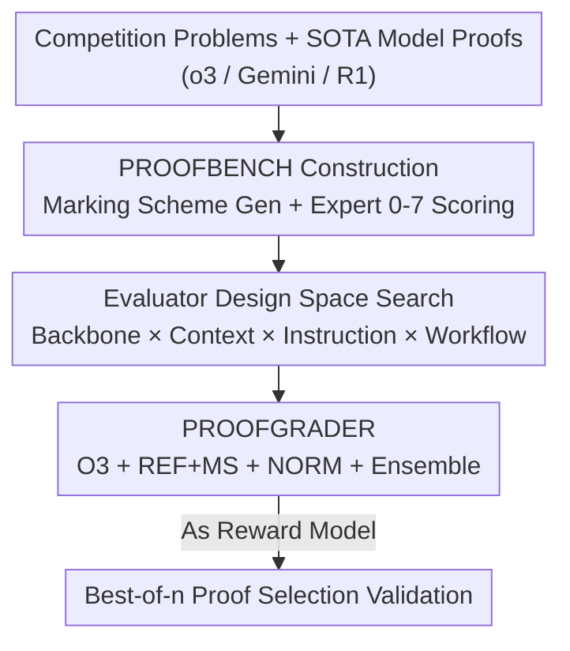

# Reliable Fine-Grained Evaluation of Natural Language Math Proofs

**Conference**: ICLR 2026  
**OpenReview**: [https://openreview.net/forum?id=ky5iqwZSXI](https://openreview.net/forum?id=ky5iqwZSXI)  
**Code**: Dataset [huggingface.co/datasets/wenjiema02/ProofBench](https://huggingface.co/datasets/wenjiema02/ProofBench)  
**Area**: LLM Evaluation / Math Reasoning / LLM-as-a-judge  
**Keywords**: Natural Language Proofs, Fine-grained Scoring, Benchmark, Reward Model, Best-of-n  

## TL;DR
Addressing the gap where "LLM-generated natural language math proofs cannot be reliably scored," this paper first constructs the first fine-grained expert-annotated set, PROOFBENCH (145 problems / 435 proofs / 0–7 scale). It then systematically searches the evaluator design space (backbone model, context, instructions, workflow) to derive PROOFGRADER (O3 + reference solutions and marking schemes + simple ensemble), which achieves a Mean Absolute Error as low as 0.926 compared to expert scores and approaches the human upper bound in best-of-n selection.

## Background & Motivation
**Background**: In the past two years, LLMs have made rapid progress in mathematical reasoning, but the vast majority of advances are concentrated on problems with a "unique verifiable final answer"—as these tasks can use simple answer checking as a reinforcement learning reward.

**Limitations of Prior Work**: Proof generation is entirely different. Many proof problems have no single verifiable final answer (e.g., "Prove that for all sufficiently large odd numbers n..."); even if a final answer exists, verifying it alone is insufficient because the intermediate reasoning may contain fatal errors. To promote proof generation, it is necessary to first reliably "grade" natural language proofs, but a reliable, fine-grained evaluator is currently missing.

**Key Challenge**: Existing approaches are inadequate. Expert grading is accurate but slow and expensive; formal mathematics (e.g., Lean), while absolutely rigorous, is detached from the natural language used in human education and scientific research, and automatic translation from natural language to formal language is extremely fragile. Using LLM-as-a-judge seems feasible, but it is highly sensitive to evaluator design (model choice, available context, marking schemes, prompts), factors that have seen little systematic research.

**Goal**: Design an automatic evaluator $E$ that takes a problem $p$, a model-generated proof $s$, and optional context materials $C_{\text{context}}$ as input, and outputs a fine-grained integer score $\hat{y}\in\{0,1,\dots,7\}$ that aligns highly with expert scores and can serve as a reward signal.

**Key Insight**: The authors deliberately **do not train** an evaluator but instead view the problem as a search over a discrete configuration space $C$—decoupling and conducting controlled experiments on which design factors truly improve scoring quality. A 0–7 scoring scale is adopted (aligned with top-tier competition standards) because binary "correct/incorrect" labels lose the fine-grained characterization of proof quality.

**Core Idea**: Use an "expert fine-grained annotation set + systematic search of the design space" to identify the optimal evaluator configuration, proving that a well-configured LLM evaluator can approach human performance on downstream tasks.

## Method

### Overall Architecture
Ours aims to solve "how to reliably score natural language math proofs on a 0–7 scale." The workflow is divided into three steps: first, creating a "standard ruler"—the expert fine-grained annotation set PROOFBENCH; second, using it as a testbed to systematically search the evaluator design space across four axes to see the impact of each factor; finally, assembling the optimal configuration into PROOFGRADER and validating its utility as a reward model through a best-of-n selection task.

### Key Designs

**1. PROOFBENCH: The First Fine-Grained Expert-Annotated Proof Benchmark**

To study "evaluator accuracy," a human-calibrated ruler is required, while existing resources are either too small in scale or only provide binary granularity. The authors collected 145 proof problems from six major competitions (APMO, EGMO, IMO, Putnam, USA TST, USAMO) between 2022–2025 (parsing from official PDFs and including official human solutions for reliability). Three SOTA reasoning models (OpenAI o3, Gemini-2.5-Pro, DeepSeek-R1-0528) were used to generate proofs, totaling 435 proofs for evaluation. Annotation followed two stages: **Stage 1** involved an LLM $M_{\text{MS}}$ (Gemini-2.5-Pro) automatically generating a "marking scheme" (MS) based on the problem and reference solution—listing point-awarding/deducting conditions and trivial cases. After expert refinement, approximately 85% of marking schemes were judged high-quality. **Stage 2** involved five experts (Putnam or National Olympiad level) using the MS as a "detailed reference" rather than a "rigid checklist" to score each proof from 0–7, paying special attention to proofs using valid alternative methods. 41% of proofs were cross-scored, achieving an **87.5% agreement rate within 1 point**, with disagreements resolved by discussion. The data reveals the current state: the overall mean score is only 2.38 (median 1), with the strongest models scoring above 6 on fewer than 30% of problems; difficulty-wise, TST is hardest (mean 1.26) and Putnam easiest (mean 3.09); scores consistently decline on problems released after model knowledge cutoffs, suggesting data contamination or generalization gaps.

**2. Systematic Search of Evaluator Design Space along Four Axes**

With the testbed ready, the authors decompose "what makes a good evaluator" into comparable axes to answer "which factors truly matter." Single-pass evaluators are analyzed across: **Backbone Model** (comparing O3, GPT-5, Gemini-2.5-Pro, O4-MINI, R1, GPT-4O), **Context** (REF+MS: reference solution plus marking scheme; MS: marking scheme only; REF: reference solution only; NONE: no context), and **Instruction** (NORM: flexible adherence to MS allowing equivalent paths; STRICT: rigid deductions based on MS; BASIC: minimal guidance). Additionally, two workflows are explored: **Ensemble** (running the same evaluator multiple times and aggregating via mean/median/majority to reduce variance) and **Staged** (splitting scoring into "binary error detection → fine-grained scoring"). This search yields three key conclusions: ① Stronger backbones lead to more accurate scoring (O3 leads in nearly all metrics); without context, O3's MAE is 1.680, which drops to 0.964 with REF+MS. ② **Marking Schemes (MS) contribute the bulk of the performance gain** in the context, while reference solutions only provide a small additional boost for the strongest backbone, O3. ③ Instruction style should be tailored: the strongest model (O3) performs best with flexible NORM instructions, achieving near-zero bias, while mid-tier models (Gemini, O4-MINI) require STRICT instructions to suppress over-scoring.

**3. PROOFGRADER: Assembling the Optimal Configuration**

The search concludes in PROOFGRADER: **O3 backbone + REF+MS context + NORM instructions + simple ensemble**. The ensemble step is crucial—running O3 independently five times with REF+MS and using mean aggregation reduces RMSE from 1.225 (single best) to 1.169 and improves Kendall-$\tau$ from 0.540 to 0.578. Median aggregation yields the lowest MAE of 0.926 and highest WTA$_{\le1}$. Its true value lies in **variance reduction**—single-pass evaluators fluctuate significantly even with rich context, whereas ensembles provide stability. Notably, staged workflows are not a silver bullet: they help mid-tier models (reducing O4-MINI's MAE from 1.367 to 1.245) but hinder the strong O3 (increasing MAE to 1.065); thus, PROOFGRADER does not use a staged approach. Its final MAE relative to expert scores is only 0.926, significantly outperforming various naive baselines.

### Evaluation Metrics
The paper uses per-problem metrics on the 0–7 scale to measure alignment: $MAE_p=\frac{1}{n}\sum_i|\hat{y}_{pi}-y_{pi}|$ and $RMSE_p=\sqrt{\frac{1}{n}\sum_i(\hat{y}_{pi}-y_{pi})^2}$ for error (RMSE penalizes large errors more); $Bias_p=\frac{1}{n}\sum_i(\hat{y}_{pi}-y_{pi})$ for systematic shift (positive values = over-scoring); $WTA_p(\le1)$ for the proportion of scores within ±1 of expert scores; and ties-adjusted Kendall-$\tau_b$ for intra-problem ranking consistency.

## Key Experimental Results

### Main Results: Backbone × Context (Single-pass Evaluator)

| Backbone | Context | RMSE ↓ | MAE ↓ | WTA≤1(%) ↑ | Kendall-τ ↑ | Bias ≈0 |
|----------|---------|--------|-------|------------|-------------|---------|
| O3 | REF+MS | 1.273 | **0.964** | 76.5 | 0.502 | −0.008 |
| O3 | MS | 1.418 | 1.069 | 72.8 | 0.477 | −0.381 |
| O3 | NONE | 1.901 | 1.680 | 49.5 | 0.435 | 0.924 |
| GPT-5 | REF+MS | 1.353 | 1.055 | 73.2 | 0.532 | 0.295 |
| Gemini | REF+MS | 1.696 | 1.342 | 62.7 | 0.529 | 0.626 |
| GPT-4O | NONE | 3.402 | 3.001 | 31.9 | 0.208 | 2.614 |

Stronger backbones and more complete contexts lead to lower error; MS contributes the most, and O3 is the best backbone.

### Ablation Study: Ensemble vs. Staged (O3 Backbone, REF+MS)

| Scheme | RMSE ↓ | MAE ↓ | WTA≤1(%) ↑ | Kendall-τ ↑ |
|--------|--------|-------|------------|-------------|
| Best Single | 1.225 | 0.944 | 77.1 | 0.540 |
| Ensemble-Mean | **1.169** | 0.940 | 69.7 | **0.578** |
| Ensemble-Median | 1.185 | **0.926** | **77.7** | 0.540 |
| Staged (Binary+Errors→Fine) | 1.375 | 1.065 | 73.0 | 0.444 |

Ensembles consistently improve performance and reduce variance; staged workflows hinder the strong O3 backbone (MAE 0.964 → 1.065) but are effective for O4-MINI (1.367 → 1.245).

### Downstream: Best-of-n Proof Selection (O3 generates 16 candidates × 29 problems, Expert Scored)

| Selector | n=16 Avg. Human Score (/7) | Description |
|----------|----------------------------|-------------|
| Binary Evaluator | 2.48 | Cannot distinguish between multiple "correct" proofs |
| **PROOFGRADER** | **4.14** | Closes 78% of the gap between binary and upper bound |
| Human Oracle | 4.62 | Performance ceiling |

PROOFGRADER closely follows the human oracle curve and outperforms computationally expensive pairwise comparison methods like Tournament and Knockout.

### Key Findings
- **Fine-grained scoring is key for reward models**: Binary evaluators compress all "correct" proofs into one class, losing ranking ability and failing to distinguish a 5/7 adequate proof from a 7/7 excellent one, leading to significant lags in best-of-n performance.
- **Marking schemes are indispensable**: Without context (NONE), evaluators overestimate proof correctness in over 60% of cases, and this overestimation is strongly correlated with proof quality ($r=0.699$)—overestimating low-quality proofs (0–2 points) by an average of 1.7 points; this suggests evaluators struggle to judge proof progress without reference material.
- **Symmetric failure modes**: Over-scoring (10.8%) and under-scoring (12.2%) occur at similar rates. Over-scoring often results from surface heuristics (rewarding "structure looking like the MS / using fancy frameworks" even if core claims are wrong); under-scoring often stems from fixating on minor early errors or requiring excessive detail. Algebra and geometry problems show the most failures (~25% each).
- **Marking schemes must align with humans**: Replacing the original MS with one re-sampled via the same prompt or generated by a different model leads to performance degradation across all metrics.

## Highlights & Insights
- **Reframing "evaluator construction" as "configuration search" rather than "model training"**: By conducting controlled experiments in a discrete space (backbone × context × instruction × workflow) without additional training, the conclusions are clear, reproducible, and provide an actionable optimal recipe.
- **Bridging offline metrics and downstream utility**: Beyond reporting MAE/RMSE, the best-of-n validation demonstrates that a low error of 0.926 translates into "near-human candidate selection," linking evaluation accuracy to reward model utility.
- **"Simple Ensemble + Flexible Instructions" are surprisingly effective**: Running five times to take the median and using NORM to let strong models map equivalent reasoning paths pushes O3 to SOTA, outperforming much more expensive pairwise comparison methods—this can be directly migrated to other open-ended generation scoring tasks.
- **The "Reference over Checklist" philosophy of MS**: Treating the marking scheme as a detailed reference while allowing valid alternative solutions prevents the evaluator from becoming a rigid "grading machine" that only recognizes standard answer paths.

## Limitations & Future Work
- **Dependence on strong closed-source backbones**: The optimal configuration relies on O3, which has high computational/accessibility requirements; using the open-source R1 as a backbone results in significantly higher error, limiting cost-effectiveness and reproducibility.
- **MS generation remains a bottleneck**: Approximately 15% of automatically generated marking schemes are sub-standard, and evaluators are sensitive to the quality of the MS—performance drops if the MS is changed, making the reliability of the pipeline dependent on MS generation quality.
- **Home-field bias**: Evaluators exhibit the highest MAE on proofs generated by their own model family; Gemini and R1 tend to give higher scores to their own outputs, which may introduce self-serving bias when used as RL rewards.
- **Scale and Scope**: The study uses 145 problems, 435 proofs, and only 29 problems for best-of-n, focused on competition math; its generalizability to research-level or longer proofs remains to be verified. (Self-reflection: A 0–7 integer scale, while finer than binary, may still be coarse for qualitative differences like "missing one lemma" vs. "completely off-track.")

## Related Work & Insights
- **vs. Formal Verification (Lean, etc.)**: Formal methods provide absolute certainty but are detached from natural language and suffer from fragile automatic translation; Ours specializes in fine-grained evaluation of natural language proofs, complementing the formal approach.
- **vs. Binary LLM-as-a-judge**: Previous methods judge proofs as "correct/incorrect," losing ranking capability; Ours uses 0–7 fine-grained scoring, improving best-of-n scores from 2.48 to 4.14.
- **vs. Pairwise Comparison (Tournament / Knockout)**: Pairwise methods require $O(\binom{n}{2})$ or $n-1$ comparisons, which are computationally expensive and may degenerate for large $n$; PROOFGRADER independently scores each candidate, making it more efficient and stable.

## Rating
- Novelty: ⭐⭐⭐⭐⭐ First fine-grained expert-annotated proof set + systematizing evaluator construction as a design space search, filling a genuine gap.
- Experimental Thoroughness: ⭐⭐⭐⭐⭐ Comprehensive comparison across six backbones, four contexts, three instructions, and two workflows, plus downstream best-of-n validation and failure mode analysis.
- Writing Quality: ⭐⭐⭐⭐ Clear conclusions and complete metric definitions, though the parallel narrative of the benchmark and methodology requires reader focus.
- Value: ⭐⭐⭐⭐⭐ Provides a reproducible recipe for a reward model, significant for advancing training in proof generation.

<!-- RELATED:START -->

## Related Papers

- [\[ICLR 2026\] FRABench and UFEval: Unified Fine-grained Evaluation with Task and Aspect Generalization](frabench_and_ufeval_unified_fine-grained_evaluation_with_task_and_aspect_general.md)
- [\[ACL 2026\] IF-Critic: Towards a Fine-Grained LLM Critic for Instruction-Following Evaluation](../../ACL2026/llm_evaluation/if-critic_towards_a_fine-grained_llm_critic_for_instruction-following_evaluation.md)
- [\[ACL 2026\] LoCar: Localization-Aware Evaluation of In-Vehicle Assistants through Fine-Grained Sociolinguistic Control](../../ACL2026/llm_evaluation/locar_localization-aware_evaluation_of_in-vehicle_assistants_through_fine-graine.md)
- [\[ACL 2026\] Rethinking Meeting Effectiveness: A Benchmark and Framework for Temporal Fine-grained Automatic Meeting Effectiveness Evaluation](../../ACL2026/llm_evaluation/rethinking_meeting_effectiveness_a_benchmark_and_framework_for_temporal_fine-gra.md)
- [\[ACL 2026\] K-MetBench: A Multi-Dimensional Benchmark for Fine-Grained Evaluation of Expert Reasoning, Locality, and Multimodality in Meteorology](../../ACL2026/llm_evaluation/k-metbench_a_multi-dimensional_benchmark_for_fine-grained_evaluation_of_expert_r.md)

<!-- RELATED:END -->
