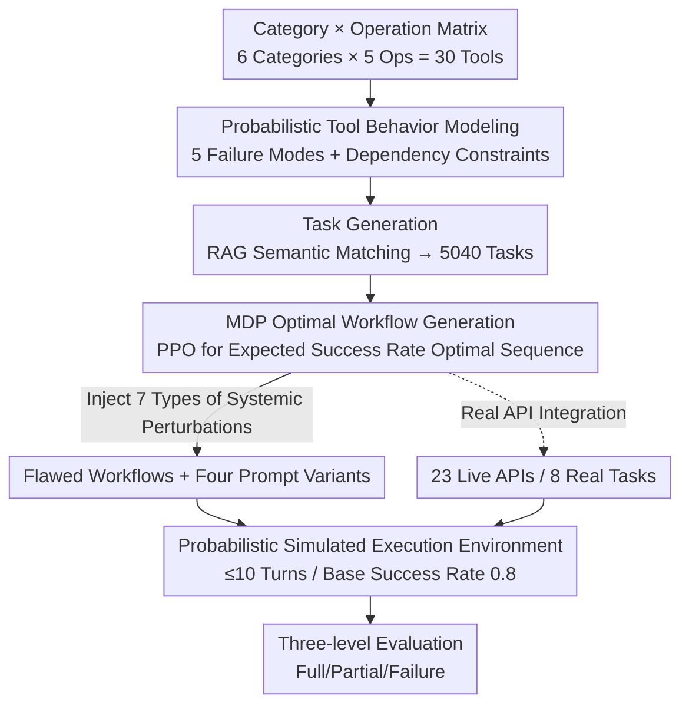

# ResiliBench: Evaluating Agentic Workflow Adaptation in Stochastic Environments

**Conference**: ICLR 2026  
**OpenReview**: [https://openreview.net/forum?id=KTZ56LG7jZ](https://openreview.net/forum?id=KTZ56LG7jZ)  
**Code**: https://github.com/Archer222arc/ResiliBench  
**Area**: Agent / LLM Evaluation  
**Keywords**: Agentic Workflow, Tool Calling, Robustness Evaluation, MDP Optimal Workflow, Stochastic Environments

## TL;DR
ResiliBench treats two types of real-world deployment uncertainties—"probabilistic tool failure" and "flaws in user-provided workflow instructions"—as the primary evaluation targets. Using a tool library of 30 APIs, it automatically generates 5040 tasks, each paired with an MDP-derived optimal workflow and seven types of systematically perturbed flawed workflows, to quantify LLMs' error correction and replanning capabilities in stochastic environments.

## Background & Motivation
**Background**: Existing tool-calling and workflow execution benchmarks (ToolBench, ToolQA, Gorilla, etc.) primarily measure whether LLMs can correctly call APIs, perform multi-step reasoning, and follow instructions. They establish a baseline for tool-use capabilities under "controlled conditions."

**Limitations of Prior Work**: LLMs in real deployments face far more than just "functional tools and clear instructions." APIs experience timeouts, service disruptions, validation failures, and resource overflows, often without the model knowing the exact cause. Furthermore, user instructions are frequently incomplete, ambiguous, or contradictory, and the provided workflow plans themselves may be incorrect. Existing benchmarks treat these as "data noise"—they filter and clean APIs and instructions to activeley remove uncertainty, failing to evaluate the model's ability to "recover from errors."

**Key Challenge**: There is a conflict between evaluation controllability and real-world deployment stochasticity. Controllability requires filtering out noise, but this leaves only ideal scenarios of "perfect instructions + reliable tools," failing to address a critical question: can the model complete the task when tools fail probabilistically or when the provided workflow plan is flawed?

**Goal**: To construct a benchmark that treats uncertainty as a "systematic research object" rather than "noise to be cleared," decomposed into three sub-problems: (1) how to controllably simulate probabilistic failures of real APIs; (2) what to use as a reference for a "correct workflow"; and (3) how to systematically manufacture "flawed instructions" to measure robustness.

**Key Insight**: The authors realized that measuring "robustness" requires a theoretical "optimal behavior" as a reference. They formulated the objective as "maximizing the expected success rate given known tool failure probabilities" using an MDP to derive the optimal workflow. Using this as a baseline, they systematically injected seven types of perturbations to generate flawed workflows. The gap in success rates between optimal and flawed workflows directly quantifies the model's robustness.

**Core Idea**: A triplet consisting of a "probabilistic tool error model + MDP optimal workflow + seven types of systematic perturbations" to transform workflow execution uncertainty into controllable and quantifiable experimental variables.

## Method

### Overall Architecture
ResiliBench is not a new model but an "automated task generation + controlled evaluation" pipeline. Its data consists of three main components: task specifications (5040 tasks across 5 types and 3 difficulties), a tool registry (30 APIs with probabilistic behaviors and dependency constraints), and reference workflows (4 prompt variants per task). The construction involves three steps: first, generating a tool library via a "category × operation" matrix and assigning error models; second, using RAG semantic matching to map operation sequences to specific tools to generate tasks; and finally, using MDP to solve for the optimal workflow and systematically injecting perturbations to obtain flawed workflows. The evaluation side executes tasks in a probabilistic simulation environment (base success rate 0.8, max 10 dialogue turns), where the model calls tools using syntax like `<tool_call>`, receives feedback with error messages, and is scored on a three-level scale (Full Success / Partial Success / Failure).

### Key Designs

**1. Probabilistic Tool Behavior Modeling: Parameterizing API Failure**

Addressing the issue where existing benchmarks filter tool failures, ResiliBench actively injects probabilistic failures into every tool. The tool library is organized in two layers: the bottom layer is a matrix of 6 functional categories (data processing, file operations, network, computation, integration, utility) × 5 operations, resulting in 30 tools named `{category}_{operation}`. The top layer categorizes them by workflow roles: sources (reader/fetcher), processors (parser/transformer/analyzer), aggregators, outputs (writer/poster), and utilities, establishing dependency relationships (e.g., processor depends on source). Each tool explicitly declares 5 failure modes: input validation failure (INVALID_INPUT), operation failure (OPERATION_FAILED), timeout (TIMEOUT), calculation error (CALCULATION_ERROR), and resource overflow (OVERFLOW). During execution, the simulator uses a base success rate $\rho_{base}=0.8$, combined with tool dependencies and execution history, to probabilistically decide if a call succeeds or returns an error. The model receives realistic API errors without knowing the underlying cause (e.g., random seed), forcing it to adapt based on observations—accurately capturing the "unreliable tool" aspect of real deployments.

**2. MDP Optimal Workflow Generation: A Computable Reference for "Correctness"**

To measure robustness, a baseline of "optimal behavior" is required. The authors formalize tool sequence selection as an MDP: states are composite representations capturing tool execution status and progress tracking; the action space consists of structured tool calls; and the optimization goal is to maximize the expected cumulative reward given known tool failure probabilities. The reward uses a two-stage adaptive strategy: a coverage-focused stage encouraging the discovery and use of necessary tools, followed by a sequence-optimized stage emphasizing execution order and efficiency. The policy is trained using PPO with a Transformer network, mixed-precision training, and curriculum learning across 5 difficulty stages. The sequence produced by the trained policy represents the workflow with the highest expected success rate under the MDP assumptions. The paper identifies three theoretical upper bounds: (i) 100% (often unreachable due to turn/retry limits); (ii) a policy with foreknowledge of tool seeds; (iii) the upper bound for a policy aware only of failure probabilities. The MDP solves for a computable approximation of bound (iii). This "optimal workflow" serves as both a high-quality prompt and the template for generating flawed workflows.

**3. Seven Perturbations + Four Prompt Variants: Controlling Instruction Quality**

To address the dimension of "flawed user instructions," the authors systematically inject seven types of controlled perturbations into the MDP optimal workflow: order errors, tool misuse, parameter configuration errors, missing key steps, redundant operations, logic breaks, and semantic drift. Consequently, each task has four prompt variants: Baseline (only task description/I/O/tool documentation, testing basic instruction following), Chain-of-Thought (adding explicit reasoning instructions, testing reasoning/planning), MDP-Optimal Workflow (providing the optimal execution plan, testing workflow following), and Flawed Workflow (providing a plan with systemic errors, testing error detection and robustness). The success rate difference between a task under "optimal" vs. "flawed" workflows directly measures the model's sensitivity to instruction quality. Analyzing by perturbation type helps locate specific weaknesses (e.g., advanced models are resilient to order/parameter errors but vulnerable to semantic drift).

**4. Real API Integration: Validating Transferability of Simulated Conclusions**

To prove the simulation environment is grounded, the authors selected APIs from the public-apis repository. Each candidate was tested 20 times to identify APIs with naturally stochastic behavior (sporadic timeouts/rate limiting/interruptions) and significant latency fluctuations. Ultimately, 23 live APIs were used to design 8 sequential workflow tasks (e.g., fetching random facts/jokes/quotes in order to draft a social media post). Real components were aligned with the infrastructure: MCP-compatible tool registrations were created (matching simulation tool parameters/returns/error classes) and tasks were formatted to the uniform specification. This allowed simulation and real-world sides to share the same prompt generation and evaluation methods. Real experiments exhibited robustness patterns consistent with simulations, confirming that findings from controlled simulations transfer to real APIs.

### Loss & Training
"Training" here refers specifically to solving for the MDP optimal workflow: PPO + Transformer policy network, two-stage adaptive rewards (coverage then sequence), curriculum learning across 5 difficulty stages, and mixed-precision training. The LLMs being evaluated undergo no training and perform only zero-shot inference.

## Key Experimental Results

### Main Results
Full Success Rates (FSR) measured across 7 models (GPT-4o-mini, O3, Gemini-2.5-Flash, GPT-5-mini, Llama-3.3-70B, Qwen2.5-32B, DeepSeek-V3) for three prompt types:

| Prompt Type | Avg. Full Success Rate | Top Model | Description |
|------|------|------|------|
| Baseline | 51.4% | Gemini-2.5-Flash 54.3% | Basic information only |
| Chain-of-Thought | 50.8% | GPT-4o-mini 56.1% | Explicit reasoning; avg. slightly lower |
| MDP-Optimal Workflow | 62.1% | GPT-4o-mini 67.7% | With optimal execution plan; significantly highest |

Notably, the average success rate for CoT (50.8%) was slightly lower than Baseline (51.4%), indicating that in workflows with unreliable tools, adding reasoning chains is not necessarily helpful. Providing an explicit MDP-optimal workflow, however, raised the average success rate to 62.1%.

### Ablation Study
Comparison between Optimal and Flawed workflows reveals each model's robustness to "bad instructions":

| Model | Optimal Workflow | Flawed Workflow | Drop | Interpretation |
|------|---------|---------|------|------|
| GPT-4o-mini | 67.7% | 62.2% | −5.5pp | Strong implicit error correction; most robust |
| GPT-5-mini | 60.7% | 63.5% | +2.8pp | Virtually unaffected by flawed instructions |
| Qwen2.5-32B | 65.0% | 62.9% | −2.1pp | Relatively robust |
| DeepSeek-V3 | 56.8% | 58.4% | +1.6pp | Unaffected |
| Gemini-2.5-Flash | 60.1% | 20.0% | −40.1pp | Severe collapse; closely follows flawed plans |

On average, FSR was 62.1% for Optimal vs. 54.3% for Flawed workflows.

### Key Findings
- **Robustness to instruction quality is an independent capability dimension**: GPT-4o-mini dropped only 5.5pp under flawed instructions, whereas Gemini-2.5-Flash plummeted 40.1pp (67.3% direct failure). This indicates that "detecting and correcting errors in a given plan" is distinct from overall model capability.
- **Emergence in workflow execution**: On the Qwen2.5 series, the 3B model's FSR was only 0.5%, jumping to 63.5% for the 7B model, while 32B/72B plateaued at 65.0%. This suggests that multi-step tool use emerges "suddenly" at certain parameter thresholds.
- **Complexity degradation**: As tasks moved from simple content analysis to complex calculation pipelines, GPT-4o-mini's FSR dropped from 72.4% to 53.7%, a trend consistent across all models.
- **Real API validation consistency**: On 23 live APIs and 8 tasks, GPT-4o-mini dropped 7.8pp while Gemini-2.5-Flash dropped 21.2pp under flawed instructions, mirroring the simulation results.

## Highlights & Insights
- **Using MDP to define "Optimal Workflow" computationally**: This is the key to moving robustness evaluation from subjective to objective. With the MDP optimal solution as a template, flawed workflows are generated by systematically injecting seven types of perturbations, making the robustness metric (the drop in success rate) precise.
- **Uncertainty as a protagonist rather than noise**: This approach flips the script—while others filter out probabilistic failures, this benchmark deliberately amplifies and parameterizes them to reflect production deployments.
- **Fine-grained attribution for the seven perturbations**: Categorizing "bad instructions" (order, parameters, semantic drift, etc.) allows for diagnosing exactly which types of errors a model is sensitive to.
- **CoT may be ineffective or harmful in unreliable tool scenarios**: The finding (Avg. 50.8% < Baseline 51.4%) is a counter-intuitive insight, suggesting that the benefits of reasoning enhancement are highly task-dependent.

## Limitations & Future Work
- **MDP Optimal is an approximation of theoretical bound (iii)**: It relies on the assumption of "known tool failure probabilities." The "optimality" is relative to this modeling assumption; in real-world scenarios, probabilities are often unknown or drifting.
- **Strict Full Success criteria**: Requiring 100% tool coverage, perfect order, output presence, and an explicit finish signal is rigorous. The boundary for "Partial Success" (meeting at least two conditions) has some subjectivity.
- **Small scale of real API tasks**: With only 8 tasks and 23 APIs, it validates transferability but lacks the scale for statistically robust real-world conclusions.
- **Future Directions**: Incorporate "unknown/drifting failure probabilities" into the MDP to evaluate the model's ability to estimate reliability online; expand the real API task set for better domain coverage.

## Related Work & Insights
- **vs ToolBench**: ToolBench scales to larger API sets and multi-tool tasks but filters noise. Ours focuses on probabilistic failures and flawed instructions to evaluate error correction/replanning at the cost of relying on simulation fidelity.
- **vs ToolQA**: ToolQA analyzes tool-use reasoning by separating knowledge-based vs. tool-dependent questions but is limited to single tool calls. Ours focuses on the robustness of multi-step workflow execution in stochastic environments.
- **Insight**: The methodology of "using an MDP optimal solution as a baseline + systematic perturbation for contrastive samples" provides a framework for evaluating agent robustness in any noise-prone scenario.

## Rating
- Novelty: ⭐⭐⭐⭐ Treating uncertainty as a primary factor and using MDP for a computable optimal definition are innovative.
- Experimental Thoroughness: ⭐⭐⭐⭐ Covering 7 models × 4 prompts × 5040 tasks + fine-grained perturbation attribution + scaling + real API validation.
- Writing Quality: ⭐⭐⭐⭐ Clear structure; well-explained components and pipeline.
- Value: ⭐⭐⭐⭐ Directly addresses the core bottleneck of LLM workflow deployment and provides a reusable robustness evaluation paradigm.

<!-- RELATED:START -->

## Related Papers

- [\[ICML 2026\] Agent World Model: Infinity Synthetic Environments for Agentic Reinforcement Learning](../../ICML2026/llm_evaluation/agent_world_model_infinity_synthetic_environments_for_agentic_reinforcement_lear.md)
- [\[ICLR 2026\] Agentic Reinforced Policy Optimization](agentic_reinforced_policy_optimization.md)
- [\[ICLR 2026\] Evaluating Language Models' Evaluations of Games](evaluating_language_models_evaluations_of_games.md)
- [\[ICLR 2026\] Pitfalls in Evaluating Language Model Forecasters](pitfalls_in_evaluating_language_model_forecasters.md)
- [\[ACL 2025\] Towards Dynamic Theory of Mind: Evaluating LLM Adaptation to Temporal Evolution of Human States](../../ACL2025/llm_evaluation/towards_dynamic_theory_of_mind_evaluating_llm_adaptation_to_temporal_evolution_o.md)

<!-- RELATED:END -->
