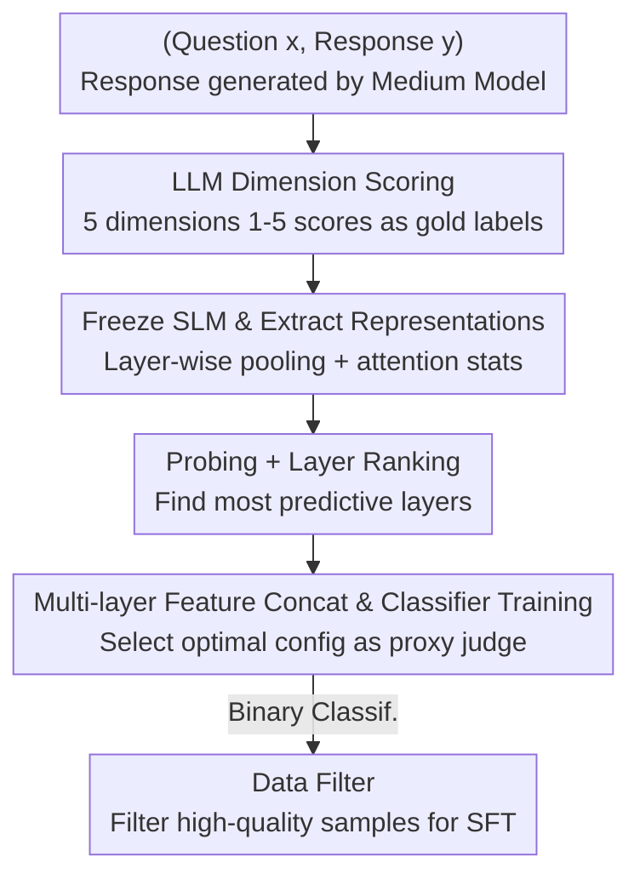

# Rethinking LLM-as-a-Judge: Representation-as-a-Judge with Small Language Models via Semantic Capacity Asymmetry

**Conference**: ICLR 2026  
**OpenReview**: [https://openreview.net/forum?id=VAISvCsrvG](https://openreview.net/forum?id=VAISvCsrvG)  
**Code**: https://github.com/zhuochunli/Representation-as-a-judge  
**Area**: LLM Evaluation / Probing / Data Filtering  
**Keywords**: Reference-free evaluation, representation probing, small language models, semantic capacity asymmetry, data filtering

## TL;DR
This paper proposes the "Representation-as-a-Judge" paradigm: instead of requiring small language models (SLMs) to generate scoring text, they are frozen and a lightweight probe classifier reads evaluation scores directly from their hidden layer representations. This approach significantly outperforms prompt-based scoring by models of the same size on reasoning tasks like GSM8K/MATH/GPQA, approaches the performance of LLM judges, and effectively serves as a data filter to enhance downstream SFT.

## Background & Motivation
**Background**: Current mainstream reference-free evaluation relies on "LLM-as-a-Judge"—using a powerful proprietary model (e.g., GPT-4) as a judge and prompting it to score the quality of generated outputs. This performs well on tasks like summarization and complex reasoning.

**Limitations of Prior Work**: Prompt-based evaluation has three major flaws. First, it requires autoregressive decoding, making it computationally expensive even for a single score. Second, it relies on closed-source LLMs with opaque and unverifiable internal mechanisms. Third, performance is highly dependent on prompt engineering, leading to issues with reproducibility, robustness, and scalability.

**Key Challenge**: A natural alternative is using small open-source models as judges, but their performance is poor and unstable when prompted directly. The core question is: do SLMs fail at evaluation because they "do not understand" or simply because they "cannot express it"? Prior work (Li et al. 2024, Waldis et al. 2024) suggests that while generating weakly, SLMs often possess semantic understanding comparable to larger models—implying evaluation failure stems from surface-level generation bottlenecks rather than fundamental comprehension deficits.

**Goal**: To verify a more fine-grained question—whether evaluation-related signals are already encoded in the internal representations of SLMs, even when their generation is poor.

**Key Insight**: The authors formulate this intuition into the **Semantic Capacity Asymmetry Hypothesis**: the semantic capacity required for accurate evaluation is much lower than that required for generation. Thus, evaluation can be grounded in the compressed intermediate representations of SLMs, even if the generation itself still requires full decoding by larger models.

**Core Idea**: Replace "prompt-based text generation" with "representation-based probing"—freeze the SLM and train a lightweight classifier to fit the scores of an LLM judge, bypassing the high cost, opacity, and prompt sensitivity of decoding.

## Method

### Overall Architecture
The method is instantiated as INSPECTOR (INternal Signal Probing and EvaluaTion Of Representations), a three-stage pipeline: first, a powerful LLM provides "gold labels" for responses across multiple evaluation dimensions; second, the same evaluation prompts are fed into a frozen SLM to extract layer-wise representations; third, a lightweight probe classifier is trained on these representations to approximate the gold labels. Once trained, this probe serves as a decoding-free "proxy judge" that runs extremely efficiently at inference time.

The key to the process is that gold labels come from an LLM (expensive but used once during dataset construction), while inference only requires one forward pass through a frozen SLM plus the probe classifier, with no text generation.

### Key Designs

**1. Multidimensional Annotation: Decomposing "Evaluation" into 5 Probatable Semantic Dimensions**

Training a probe requires gold labels. This paper follows rubrics from ROSCOE and SOCREVAL, decomposing reference-free reasoning quality into 5 dimensions $K$: Semantic Consistency (faithfulness to the prompt), Logicality (validity of reasoning and arithmetic), Informativeness (inclusion of necessary steps), Fluency, and Factuality. In the pipeline, a **medium-sized model** $M_{med}$ (10–50B, Llama-3-8B-Instruct used here) generates responses—intentionally avoiding the strongest models to ensure a "varied" quality distribution for the probe to learn from. Then, a powerful judge $M_{large}$ (DeepSeek-V3) provides scalar scores 1–5 for each dimension $s_{i,k}=M_{large}(I_k(x_i,y_i))$, forming the probe dataset $D_{prob}$. To prevent class imbalance, the authors downsample overrepresented score bins. Scores are used for 5-way classification or binarized with a threshold $\tau$ for high/low-quality classification.

**2. Layer-wise Representation Probes: "Digging" for Evaluation Signals Instead of Output Text**

This is the core paradigm shift. The pain point is that SLMs $M_{small}$ (0–10B) fail at direct prompt scoring. Instead of looking at decoded text, the same prompt $I_k(x_i,y_i)$ is fed into the frozen SLM to extract hidden states $H_i^{(\ell)}$ and attention weights $A_i^{(\ell)}$. Various pooling methods yield complementary feature vectors: mean, last, min, max, and concat. For example, mean pooling: $r_{i,\text{mean}}^{(\ell)}=\frac{1}{S_i}\sum_{t=1}^{S_i}H_i^{(\ell)}[t,:]$. Beyond pooling, attention entropy statistics $\mu_i^{(\ell)},\sigma_i^{(\ell)},\max_h e_{i,h}^{(\ell)}$ are calculated per head, along with norm, variance, and entropy of pooled vectors. Features are assembled by concatenating PCA-reduced pooled vectors, statistics, and attention summaries into $X^{(\ell,p)}$ (Eq. 4). Data-dependent transformations (PCA, scaler) are performed within the cross-validation pipeline to avoid leakage. A logistic probe is trained on each $X^{(\ell,p)}$ and evaluated via stratified cross-validation to rank the "layer-pooling-feature" configurations. Probes are kept at minimum capacity so any predictive signal reflects the model's semantics rather than the probe's learning capability.

**3. Multi-layer Feature Concatenation and Optimal Classifier Selection: Aggregating Distributed Signals**

The probing stage yields a ranked list of configurations $\pi$, but a single layer is often insufficient. This design takes Top-K unique layers from $\pi$, starts with the top-ranked layer, and greedily appends subsequent layers **only if performance improves**, forming concatenated multi-layer features $\tilde{x}_i^{(S,p)}=[r_{i,p}^{(\ell_1)};\dots;r_{i,p}^{(\ell_{|S|})}]$ (Eq. 5). A family of simple, interpretable classifiers (Logistic Regression, Random Forest, small MLP, Linear SVM) is trained on each candidate feature assembly. The optimal configuration $(S^\star,p^\star,\theta^\star)=\arg\max \bar a_\gamma^{(S,p,clf)}$ (Eq. 6) is selected based on task-related metrics $\bar a_\gamma$, where $\gamma\in\{bin,multi\}$. In case of ties, simpler (fewer layers) and more stable (lower $\sigma$) configurations are preferred. Since all variants operate on cached hidden representations, searching these combinations incurs near-zero additional compute. The result is a compact proxy judge using only a few layers that is orders of magnitude cheaper than an LLM.

### Loss & Training
No end-to-end LLM training is involved—the SLM remains frozen, and only the probe/classifier is trained. The objective is to fit LLM gold labels: 5-way classification for raw 1–5 scores, or binary classification for $\mathbb{1}[s_{i,k}\ge\tau]$. Key hyperparameters: threshold $\tau=4$ (≥4 is high quality), PCA dimensions $d=50$, Top-K $K=5$. Evaluation results are reported as weighted average F1 under zero-shot prompting.

## Key Experimental Results

### Main Results
On three reasoning benchmarks (GSM8K, MATH, GPQA), the probe was compared against three baselines: direct prompting of $M_{small}$, fine-tuned SLMs, and RoBERTa probes.

| Setting | Metric | Probe (Ours) | Same-model Prompt | Gain |
|------|------|------|----------|------|
| Task Average | Weighted F1 | Significant Lead | Baseline | > +20% on most |
| Binary (Data Filtering) | Weighted F1 | 80–90% | Low | Reliable Filter |
| Multi-class (5 bins) | Weighted F1 | ~50–60% | Lower | Leads despite difficulty |

Key Finding: Probing far outperforms prompt-based reasoning—poor generation in SLMs does not mean they lack knowledge; critical information is embedded in internal representations but "buried" by the final decoding. This phenomenon is consistent across all dimensions and different SLM sizes/families (Qwen3-0.6B/1.7B, Llama-3.2-1B, Llama-3.1-8B).

### Ablation Study
Ablations on pooling and classifiers were conducted using binary classification on the Informativeness dimension of MATH with Qwen3-0.6B and Llama-3.2-1B.

| Config | Key Finding | Description |
|------|---------|------|
| Mean pooling | Optimal | Preserves key info with compact features |
| last/min/max/concat | Weaker | Less comprehensive than mean pooling |
| Logistic Regression | Optimal Classifier | More stable with regularization/calibration for small, noisy labels |
| PCA Features | Optimal Feature | Better reveals evaluation signals than scalar/attention stats |

### Key Findings
- **Larger models do not necessarily evaluate better**: On MATH, Qwen3-0.6B's prompt scoring for logicality outperformed Qwen3-1.7B (18.18% vs 15.06%); Llama-3.2-1B's binary probe for fluency outperformed Llama-3.1-8B (96.32% vs 92.65%)—different models excel in different dimensions, cautioning against blind belief in scaling laws.
- **Binary probes are highly reliable data filters**: Using a Qwen3-1.7B probe for knowledge distillation (Llama-3-8B teacher, Llama-2-7B-Chat student), filtering sub-sets by 5-dimensional binary scores yielded SFT performance comparable to using DeepSeek-V3 as a filter, both significantly outperforming random filtering.
- **Quality vs. Quantity "up-down-up"**: The SFT curve shows an up-down-up trend—performance gains from high quality, drops as low-quality data is added, and rises again once data scale is sufficiently large, confirming "quality dominates in low-resource settings, scale dominates when large enough."
- **Evaluation signals are strongest in middle-to-upper layers**: Layer-wise analysis shows hidden representations correlate highly with LLM scores, with signals concentrated in middle to upper layers rather than the output layer. PCA subspaces reveal these signals more clearly than scalar or attention features.

## Highlights & Insights
- **Elegant Paradigm Shift**: Redefining "evaluation" from a generation task to a representation probing task elegantly bypasses expensive decoding, opacity, and prompt sensitivity—the primary "aha" moment.
- **Explanatory Power of Semantic Capacity Asymmetry**: Generation requires discourse planning and long-range dependencies (high capacity + full decoding); evaluation only needs to identify inconsistencies or factual errors, which are readable in intermediate states. This provides a clear theoretical narrative for why SLM probes work.
- **Near-Zero Cost Configuration Search**: Running all pooling/layer/classifier combinations on cached representations makes exploring the hyperparameter space nearly cost-free, a design transferable to any "frozen model + probe" scenario.
- **Minimal Training Data**: Due to the downsampling strategy, strong probes can often be trained with fewer than 100 samples per score bin, making it attractive for cost-sensitive labeling scenarios.

## Limitations & Future Work
- Task scope is limited to mathematical/scientific reasoning (GSM8K/MATH/GPQA); generalization to summarization, dialogue, or open-ended generation remains unverified.
- Gold labels depend entirely on DeepSeek-V3; the probe is essentially "distilling an LLM judge"—if the LLM judge is biased, the probe inherits that bias, which is not deeply discussed.
- Multi-class performance is only 50–60%, which may be insufficient for scenarios requiring fine-grained grading rather than high/low binary labels.
- Probing requires access to internal hidden states, making it naturally applicable only to open-source/white-box SLMs, not closed-source models.

## Related Work & Insights
- **vs LLM-as-a-Judge (e.g., SOCREVAL, RECEVAL)**: Those methods use LLM prompt-generated scores (expensive, opaque, prompt-sensitive); this work probes SLM representations directly (cheaper, interpretable, reproducible) at the cost of needing initial LLM-labeled gold data.
- **vs Traditional Probing (Shi et al. 2016, Starace et al. 2023)**: Prior probes were mostly used to "understand what knowledge is encoded" (syntax, POS, world state); this work applies probes to a new direction—extracting internal representations predictive of evaluation quality—bridging probes and LLM-as-a-Judge for the first time.
- **vs Sentinel (Zhang et al. 2025)**: Sentinel probes SLM attention for relevance signals in context compression; this work shares the "probe as a lightweight understanding task" philosophy but focuses on reference-free evaluation and data filtering.

## Rating
- Novelty: ⭐⭐⭐⭐⭐ Reframing evaluation as a probing task and proposing the Semantic Capacity Asymmetry Hypothesis is a clear paradigm shift.
- Experimental Thoroughness: ⭐⭐⭐⭐ Solid validation across three benchmarks, multiple model families, ablations, and downstream SFT, though limited to reasoning tasks.
- Writing Quality: ⭐⭐⭐⭐ The hypothesis-method-validation logic is smooth and the illustrations are intuitive.
- Value: ⭐⭐⭐⭐⭐ Provides a cheap, interpretable, and scalable solution for evaluation and data filtering with high practical utility.

<!-- RELATED:START -->

## Related Papers

- [\[ICLR 2026\] TrustJudge: Inconsistencies of LLM-as-a-Judge and How to Alleviate Them](trustjudge_inconsistencies_of_llm-as-a-judge_and_how_to_alleviate_them.md)
- [\[ICLR 2026\] BiasScope: Towards Automated Detection of Bias in LLM-as-a-Judge Evaluation](biasscope_towards_automated_detection_of_bias_in_llm-as-a-judge_evaluation.md)
- [\[ICLR 2026\] Preference Leakage: A Contamination Problem in LLM-as-a-judge](preference_leakage_a_contamination_problem_in_llm-as-a-judge.md)
- [\[AAAI 2026\] LLM-as-a-Judge for Scalable Test Coverage Evaluation](../../AAAI2026/llm_evaluation/llm-as-a-judge_for_scalable_test_coverage_evaluation_accuracy_operational_reliab.md)
- [\[ICML 2026\] On Cost-Effective LLM-as-a-Judge Improvement Techniques](../../ICML2026/llm_evaluation/on_cost-effective_llm-as-a-judge_improvement_techniques.md)

<!-- RELATED:END -->
