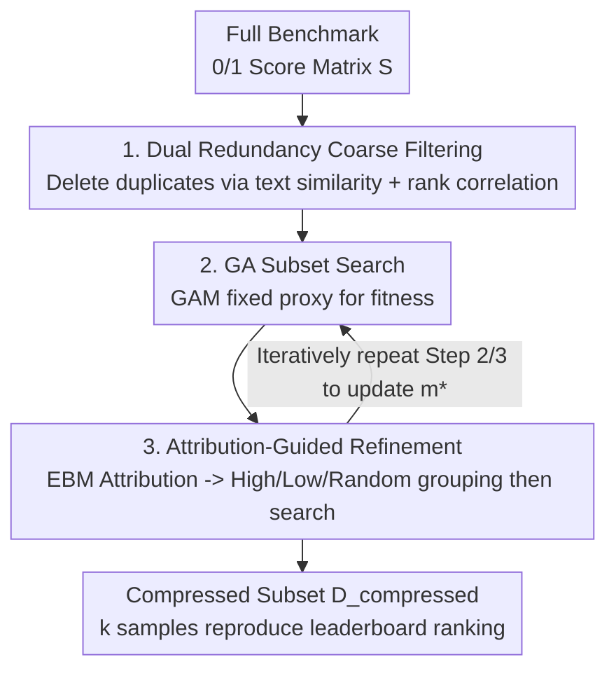

# Rethinking LLM Evaluation: Can We Evaluate LLMs with 200× Less Data?

**Conference**: ICLR 2026  
**OpenReview**: [https://openreview.net/forum?id=lZlZjSxdio](https://openreview.net/forum?id=lZlZjSxdio)  
**Code**: https://github.com/gszfwsb/EssenceBench  
**Area**: LLM Efficiency / Benchmark Compression  
**Keywords**: Benchmark Compression, Subset Selection, Rank Preservation, Genetic Algorithm, Redundancy Analysis

## TL;DR
To address the bottleneck of expensive LLM benchmarking across numerous models, this paper reframes benchmark compression as a subset optimization problem aimed at "preserving overall leaderboard ranking." The proposed EssenceBench utilizes a three-step pipeline: dual-redundancy filtering (text + rank), genetic algorithm search with a fixed proxy predictor, and attribution-guided refinement. On HellaSwag (10,000 samples), it controls model ranking error within 5% using only 50 samples, achieving 200× compression.

## Background & Motivation
**Background**: LLM evaluation benchmark suites are continuously expanding, growing from single-task NLU to comprehensive suites covering multilingual capabilities, long context, mathematical reasoning, code generation, and tool use. Platforms like OpenCompass and the Open LLM Leaderboard have made evaluating "many models on many tasks" the norm.

**Limitations of Prior Work**: Evaluation is not a one-time process. In actual workflows, evaluation must be repeated across different checkpoints, ablation variants, and competing systems. As benchmarks grow longer, the overhead in tokens and compute becomes a bottleneck. Existing compression methods (TinyBenchmark, MetaBench, SMART, etc.), while reducing test set size, mostly fail to explicitly model "inter-sample interactions," making scalable subset search under extremely tight budgets difficult.

**Key Challenge**: Training scenarios focus on whether a sample is useful for training a single model, but leaderboard evaluation has a completely different goal—its primary output is the **relative ranking between models**. Thus, the real question is: which samples are essential to maintain a stable collective ranking? The authors find massive redundancy in benchmarks across two levels: semantic similarity in prompt text and behavioral redundancy where different prompts induce nearly identical correct/incorrect patterns across a group of models. If two samples are similar in wording or model performance, keeping both doubles the cost while adding almost no discriminatory information.

**Goal**: Compress benchmarks to be as small as possible without altering the leaderboard conclusions (model ranking), while balancing two coupled objectives—accurate reconstruction of full scores and maintenance of model rankings.

**Key Insight**: View compression as a "column selection" problem in a 0/1 score matrix. By utilizing per-sample correctness signals from public leaderboards, model performance can be organized into a matrix $S \in \{0,1\}^{N_{model} \times N}$. Compression is then equivalent to selecting a set of columns whose aggregated statistics can reproduce the full evaluation results.

**Core Idea**: First, define and quantify text and rank redundancy to prune obvious duplicates. Second, use a genetic algorithm within the remaining search space to find a compact core set that reproduces full scores. Finally, use sample attribution-guided refinement to improve coverage and avoid local optima under tight budgets.

## Method

### Overall Architecture
EssenceBench aims to solve the following: given a benchmark of size $N$ and a budget $k \ll N$, select a subset of $k$ samples such that it reconstructs full scores and preserves the relative ranking of models. Since optimizing directly over all $k$-subsets is an NP-hard combinatorial problem, the authors decompose it into a three-stage "coarse-to-fine" pipeline: low-cost pruning of near-duplicates, global optimization for the core set, and local refinement for coverage.

Formally, benchmark compression is defined as selecting columns via a 0/1 mask $m \in \{0,1\}^N$ ($\sum_j m_j = k$) to obtain a submatrix $S_m$, with the goal of minimizing reconstruction error $\min_m L(y, g(S_m))$, where $y$ is the full accuracy vector and $g$ is an aggregate scoring function.

The pipeline consists of three serial steps: **Step 1 Coarse Filtering** uses text and rank signals to delete near-duplicate samples, reducing the search space from $N$ to $M$. **Step 2 Subset Selection** uses a genetic algorithm on the filtered set with a fixed proxy predictor (GAM) to calculate fitness. **Step 3 Attribution Refinement** estimates attribution scores for each sample from the elite subset, groups them, and runs the genetic algorithm again to fix coverage. Steps 2 and 3 are repeated iteratively, updating the global optimal mask $m^\star$ whenever a lower error is found.

### Key Designs

**1. Dual-Perspective Redundancy Metric: Quantifying "What to Delete" using Text and Rank**

The authors argue that benchmark redundancy cannot be judged by surface text alone; model behavior must also be considered. They define two complementary metrics. **Text Redundancy** (Definition 3): Measures semantic overlap using embedding inner products. The redundancy of a sample pair is $R_{text}(i,j) = \langle \text{Emb}(x_i), \text{Emb}(x_j)\rangle$. **Rank Redundancy** (Definition 4): Measures behavioral consistency using Pearson correlation $R_{rank}(i,j) = \rho(s_i, s_j) \in [-1,1]$ between performance vectors $s_i, s_j \in \mathbb{R}^{N_{model}}$ of two samples across all models. High correlation indicates consistent model behavior, representing redundant information for model differentiation. The coarse filtering stage scans samples according to thresholds $\tau_{text}, \tau_{rank}$, keeping only the first occurrence in high-redundancy pairs: $\epsilon_i = \prod_{j<i} \mathbb{1}(R_{text}(j,i) \le \tau_{text} \wedge R_{rank}(j,i) \le \tau_{rank})$, resulting in $M$ samples.

**2. Genetic Algorithm + Fixed Proxy Predictor: Searching for the Core Set**

To handle the remaining combinatorial space, a Genetic Algorithm (GA) is used to find the $k$-subset. Each individual is a $k$-ones mask $m \in \{0,1\}^M$. Every generation performs: (i) fitness evaluation; (ii) tournament selection; (iii) crossover $m_j^{(c)} = (m_j^{(a)} \wedge \xi_j) \vee (m_j^{(b)} \wedge \neg\xi_j)$ and mutation; (iv) population adjustment to satisfy the budget constraint $\|m\|_1 = k$. To avoid expensive full evaluations, a Generalized Additive Model (GAM) is trained **once per GA run** as a proxy. It maps "model accuracy on the subset" $s_i(m) = \frac{1}{k}\sum_j S_{filtered}[i,j]\cdot m_j$ to "full model accuracy" $\hat y_i = g(s_i(m))$. Fitness is defined as the negative RMSE on a held-out model set $V$: $\text{fitness}(m) = -\sqrt{\frac{1}{|V|}\sum_{i\in V}(\hat y_i - y_i)^2}$.

**3. Attribution-Guided Grouped Refinement: Using EBM to Force Discovery of Ignored Information**

To prevent GA from getting stuck in local optima near the elite subset, an Explainable Boosting Machine (EBM) $g_m(D_{filtered}) = \sum_j f_j^m(x_j)$ is trained on the elite mask set $E$. The norm $\|f_l^m\|_2$ serves as the attribution of sample $l$. Global attribution $A_l$ is aggregated across masks. Samples are then divided into three groups: $G_{high}$ (top attribution), $G_{low}$ (bottom), and $G_{rand}$ (random). Separate GA runs are performed for each group to find the best subset. This forcing of the GA to search across different attribution regions allows high-attribution information to be amplified while giving ignored signals (hidden in low-attribution/random groups) a chance to be rediscovered.

### Loss & Training
The core optimization objective is the subset reconstruction error (RMSE). GA fitness uses the negative RMSE on a held-out model set. The proxy GAM is retrained once per round and then fixed. The EBM learns the mapping from "sample correctness matrix → full accuracy." Step 2 and Step 3 are iterated multiple times to update the global optimal mask. Data preprocessing follows the MetaBench protocol, using a strict 9:1 train-test split stratified by model performance.

## Key Experimental Results

### Main Results
Data is sourced from the Open LLM Leaderboard, covering 5 standard benchmarks (GSM8K, ARC, HellaSwag, WinoGrande, MMLU) and 8 difficult modern benchmarks (LiveMCP, MathVista, GPQA, BBH, MATH, MUSR, IFEval, GSM-Plus). Metrics are reconstruction RMSE↓ and Rank Correlation↑.

| Dataset | Subset Size k | EssenceBench RMSE | MetaBench RMSE | Note |
|---------|---------------|-------------------|----------------|------|
| GSM8K | 200 | 0.864 | 1.760 | k=200 outperforms MetaBench k=500 (0.958) |
| GSM8K | 500 | 0.377 | 0.958 | ~60.7% relative reduction |
| ARC | 200 | 0.802 | 1.447 | Lowest error across all levels |
| WinoGrande | 200 | 0.777 | 1.530 | k=200 matches MetaBench k=500 (0.785) |
| MMLU | 300 | 0.846 | 1.287 | PPL/GraNd fail significantly (>7) |
| MathVista | 300 | 0.001 | 4.389 | Near-perfect reconstruction |
| GSM-Plus | 300 | 0.010 | 0.195 | Significant lead on robustness suite |
| LiveMCP | 90 | 0.001 | 8.210 | Agent tool use |

Ranking Fidelity (GSM8K, k=200): EssenceBench achieves a Kendall correlation of 0.968, exceeding MetaBench's 0.964 at k=450. Pearson correlation reaches 1.000 starting from k=250.

### Ablation Study

| Configuration | Phenomenon | Explanation |
|---------------|------------|-------------|
| Full (Iterative Refinement) | RMSE 2.77 → 2.47 (GSM8K) | Refinement rounds consistently reduce error |
| w/o Coarse Filtering | Significantly worse at small k | Critical for pruning at low budgets |
| w/o Attribution | RMSE increases at small k | Essential for maintaining low error at tight budgets |
| Highest / Lowest / Random only | All performed worse than combined | Missing any group leads to performance drops |

Comparison with SMART (ARC-Challenge): EssenceBench with 8% samples (100) achieves RMSE 1.104, outperforming SMART using 39% samples (460) with 1.193. Replacing coarse filtering with SMART yields only marginal gains.

### Key Findings
- Attribution-guided grouping and coarse filtering primarily provide value at **low budgets (small k)**; methods converge as k increases.
- Larger datasets allow for higher acceleration (up to 6.2× on HellaSwag) due to higher redundant capacity.
- Training-focused heuristics like PPL/GraNd fail on MMLU (RMSE >7), proving "useful for training ≠ useful for evaluation."

## Highlights & Insights
- **Reframing Evaluation as Ranking Stability**: The primary shift is from "per-sample value" to "collective ranking stability." Training asks if a sample helps one model; evaluation asks if it helps distinguish many models.
- **Dual-Perspective Redundancy**: Explicitly modeling "model behavior" as a quantifiable metric (Pearson correlation of performance vectors) captures behavioral redundancy that semantic similarity misses.
- **Fixed Proxy + GA Efficiency**: Using a GAM as a proxy for GA fitness evaluations avoids the cost of full evaluations for every candidate, making evolutionary search feasible for large benchmarks.

## Limitations & Future Work
- The method relies heavily on per-sample correctness matrices from public leaderboards; without multi-model signals, rank redundancy cannot be computed.
- The selected subset is optimized for the ranking of "current models"; its generalization to next-gen models with different distributions needs further validation.
- Thresholds and GA hyperparameters require tuning, and absolute RMSE values vary significantly across benchmark scales.

## Related Work & Insights
- **vs MetaBench**: Both do benchmark compression. MetaBench uses IRT difficulty estimation; Ours explicitly models dual redundancy and uses GA+Attribution, achieving lower RMSE with fewer samples.
- **vs SMART**: SMART performs filtering but requires larger sample counts (39% on ARC). EssenceBench uses only 8% for better results.
- **vs Data Selection (GraNd/PPL/IRT)**: These optimize for learning efficiency, not leaderboard reconstruction. EssenceBench demonstrates their failure in evaluation contexts on MMLU.

## Rating
- Novelty: ⭐⭐⭐⭐⭐ Reframing benchmark compression as rank-preserving subset optimization is highly novel.
- Experimental Thoroughness: ⭐⭐⭐⭐⭐ 13 benchmarks, multiple baselines, and comprehensive ablation.
- Writing Quality: ⭐⭐⭐⭐ Clear coarse-to-fine narrative, though some details require the appendix.
- Value: ⭐⭐⭐⭐⭐ Directly addresses evaluation cost with 200× compression and open-source code.

<!-- RELATED:START -->

## Related Papers

- [\[ICML 2026\] Nonparametric LLM Evaluation from Preference Data](../../ICML2026/llm_evaluation/nonparametric_llm_evaluation_from_preference_data.md)
- [\[ICLR 2026\] Talk, Evaluate, Diagnose: User-aware Agent Evaluation with Automated Error Analysis](talk_evaluate_diagnose_user-aware_agent_evaluation_with_automated_error_analysis.md)
- [\[ICLR 2026\] Rethinking LLM-as-a-Judge: Representation-as-a-Judge with Small Language Models via Semantic Capacity Asymmetry](rethinking_llm-as-a-judge_representation-as-a-judge_with_small_language_models_v.md)
- [\[ICLR 2026\] DARE-bench: Evaluating Modeling and Instruction Fidelity of LLMs in Data Science](dare-bench_evaluating_modeling_and_instruction_fidelity_of_llms_in_data_science.md)
- [\[ICLR 2026\] Detecting Data Contamination in LLMs via In-Context Learning](detecting_data_contamination_in_llms_via_in-context_learning.md)

<!-- RELATED:END -->
