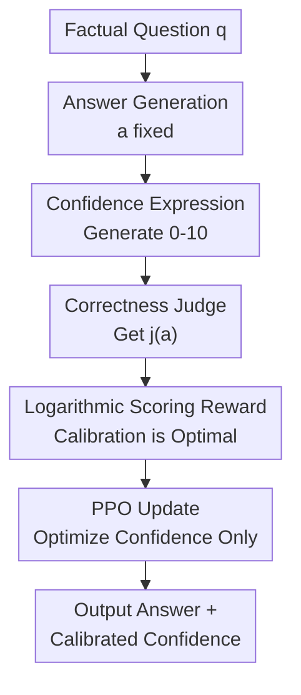

# Rewarding Doubt: A Reinforcement Learning Approach to Calibrated Confidence Expression of Large Language Models

**Conference**: ICLR 2026  
**OpenReview**: [https://openreview.net/forum?id=yResLmrVO1](https://openreview.net/forum?id=yResLmrVO1)  
**Code**: https://github.com/pasta99/RewardingDoubt  
**Area**: LLM Evaluation / Confidence Calibration / Uncertainty Expression  
**Keywords**: Confidence Calibration, Reinforcement Learning, Logarithmic Scoring Rules, Uncertainty Expression, LLM Evaluation  

## TL;DR
This paper models the numerical confidence expression of LLMs as a "betting-style" reinforcement learning problem. By rewarding high confidence for correct answers and penalizing overconfidence for incorrect ones using strictly proper logarithmic scoring rules, the authors significantly improve model calibration and cross-task generalization without compromising response accuracy.

## Background & Motivation
**Background**: LLMs already provide fluent answers in scenarios such as Q&A, summarization, medicine, and law. However, for real-world deployment, users need to know how certain the model is. Ideally, if a model claims "70% confidence," approximately 70% of such answers should be correct—a property known as confidence calibration.

**Limitations of Prior Work**: Many LLMs habitually answer with high-confidence tones, even when the answers are factually incorrect. In high-risk scenarios like medical diagnosis or legal consultation, overconfidence is more dangerous than simple error, as users can easily mistake fluency for reliability.

**Key Challenge**: Most existing methods decouple "answer generation" from "confidence estimation." Black-box methods infer confidence from multiple samplings, consistency, or prompts, leading to high inference costs and unstable calibration. White-box methods use token probabilities, hidden state probes, or external estimators but do not enable the model itself to express calibrated numerical confidence in natural language output.

**Goal**: The authors aim to directly train LLMs to output a numerical confidence score after answering factual questions, aligning this number with the true probability of correctness. This involves two sub-problems: designing rewards that prevent both blind overconfidence and excessive conservatism, and training confidence expression without damaging the original task performance.

**Key Insight**: The paper views confidence expression as "betting." A correct answer with a high bet yields high returns, while an incorrect answer with a high bet incurs a heavy penalty. This perspective aligns with proper scoring rules in probability prediction, where the optimal strategy for logarithmic scoring rules is to report the true success probability.

**Core Idea**: Use reinforcement learning rewards based on logarithmic scoring rules to directly optimize LLM-generated confidence tokens, allowing the model to learn "when to be confident and when to express doubt" within its internal generation process.

## Method

### Overall Architecture
The training pipeline for Rewarding Doubt is straightforward: given a factual question, the model first generates an answer; then, with the answer fixed, it generates a confidence score from 0 to 10. A judge determines the correctness of the answer, and both correctness and confidence are fed into a logarithmic scoring reward function. Finally, PPO updates the policy specifically for the confidence generation part. The key is not a new Q&A model, but transforming "whether confidence should be high" into an optimizable reward that theoretically leads to calibration.

Formally, the model outputs an answer-confidence pair $(a, \hat{p})$, where $a$ is the text answer and $\hat{p}\in[0,1]$ is the subjective probability. Calibration aims for $P(j(a)=1\mid \hat{p}=x)=x$, meaning the true correctness ratio among samples reporting confidence $x$ should be near $x$.

### Key Designs
**1. Betting-style Logarithmic Reward: Rewarding "Expressing Doubt"**

The core design utilizes logarithmic scoring rules: if the answer is correct, the reward is $\log(\hat{p})$; if incorrect, it is $\log(1-\hat{p})$. This prevents the model from blindly reporting high confidence, as high confidence on a wrong answer is severely penalized by $\log(1-\hat{p})$. Conversely, it cannot always report low confidence, as low $\hat{p}$ for correct answers yields poor $\log(\hat{p})$.

This reward has a clear probabilistic interpretation. If the true probability is $p^*$, the expected reward is $p^*\log(\hat{p})+(1-p^*)\log(1-\hat{p})$, which is maximized at $\hat{p}=p^*$. Thus, it encourages the model to align its numerical confidence with the actual probability of correctness.

**2. Decoupled Generation: Calibration Without Altering Answers**

Instead of optimizing both answer content and confidence, the authors fix the generated answer and subsequently prompt the model to generate a confidence score. This decoupling ensures that reward changes stem from better calibration rather than changes in answer quality. In experiments, accuracy remained stable, confirming that Rewarding Doubt primarily improves calibration and discriminative ability rather than retreading task performance.

**3. Strictly Proper Scoring Rules: Embedding Calibration into the Objective**

Unlike methods that fit pseudo-labels (e.g., from self-consistency or probes), Rewarding Doubt uses a proper scoring rule directly. The authors prove that the global maximum of the expected reward occurs at $\hat{p}=p^*$. To avoid $\log(0)$ in practice, confidence bounds are clipped at $\epsilon=0.001$, ensuring numerical stability during training.

**4. Uniform Adaptation for Single and Multiple Answers**

The method scales from single-answer tasks like TriviaQA to multi-answer tasks like QAMPARI. In multi-answer settings, the model enumerates multiple possible answers and outputs a confidence score for each, treating each fact as a calibratable event. This makes the framework applicable to real-world generation where a response contains multiple facts with varying reliability.

### Loss & Training
The objective is optimized via PPO. In single-answer tasks, Meta-Llama-3-8B-Instruct (4-bit quantized via Unsloth) is fine-tuned using LoRA for 2 epochs with a learning rate of $1e^{-5}$. In multi-answer QAMPARI, the model is trained for 24,000 steps with a batch size of 8. 

Confidence is output as an integer from 0 to 10, then normalized to $[0,1]$ for reward calculation. Rewards are normalized to $[-1,1]$. An out-of-format penalty of $-3$ is applied if the model fails to follow the response structure, preventing training pollution. Training was conducted on an Nvidia A40 for approximately 7 days.

## Key Experimental Results

### Main Results
Evaluation on TriviaQA compared Rewarding Doubt against zero-shot verbalized confidence, CoT, Top-K, Surrogate Token, Sequence Probability, Self-Consistency, PPO-M/PPO-C, LACIE, and Trained Probes. Metrics included ECE, AUROC, and Accuracy.

| Dataset / Setting | Method | ECE ↓ | AUROC ↑ | Accuracy ↑ |
|--------|------|------|----------|------|
| TriviaQA / Single-Answer | Verbalize | 0.3459 | 0.5858 | 0.6310 |
| TriviaQA / Single-Answer | Self-Consistency | 0.1134 | 0.8213 | 0.6224 |
| TriviaQA / Single-Answer | Trained Probe | 0.0189 | 0.8173 | 0.5925 |
| TriviaQA / Single-Answer | Rewarding Doubt | 0.0226 | 0.8592 | 0.6309 |
| QAMPARI / Multiple-Answer | Verbalize | 0.5319 | 0.6047 | 0.2550 |
| QAMPARI / Multiple-Answer | Trained Probe | 0.1117 | 0.6481 | 0.2233 |
| QAMPARI / Multiple-Answer | Rewarding Doubt | 0.0816 | 0.6947 | 0.2480 |

### Ablation Study
The authors analyzed cross-architecture performance (LLaMA, Qwen, Gemma) and cross-task generalization (training on TriviaQA and testing on CommonsenseQA/MedQA).

| Configuration | Key Metrics | Note |
|------|---------|------|
| LLaMA-3.1-8B Verbalize | ECE 0.2771 / AUROC 0.6766 / Acc 0.6662 | Significant overconfidence remains |
| LLaMA-3.1-8B Rewarding Doubt | ECE 0.0256 / AUROC 0.8793 / Acc 0.6497 | Large gains in calibration/discrimination |
| Qwen-2.5-3B Rewarding Doubt | ECE 0.1483 / AUROC 0.9065 / Acc 0.4193 | Strong AUROC gain even on small models |

| Generalization Setting | Method | ECE ↓ | AUROC ↑ | Accuracy ↑ |
|------|------|------|------|------|
| CommonsenseQA | Verbalize | 0.2820 | 0.5425 | 0.6860 |
| MedQA | Verbalize | 0.4480 | 0.5075 | 0.5067 |
| MedQA | Rewarding Doubt | 0.1145 | 0.6649 | 0.5161 |

### Key Findings
- The most stable gain is in **AUROC**: the model becomes much better at ranking correct vs. incorrect answers, which is vital for risk control.
- **Accuracy is preserved**: the method modifies confidence expression without reshaping the underlying answer generation capability.
- **Generalization**: Training on TriviaQA effectively transfers to MedQA, reducing ECE from 0.4480 to 0.1145.
- **Distribution shift**: Confidence becomes more dispersed rather than clustering at the high end, reflecting improved uncertainty awareness.

## Highlights & Insights
- The technical highlight is linking LLM confidence expression directly to proper scoring rules via PPO rewards, which is more theoretically sound than SL-based imitation.
- "Rewarding Doubt" captures the essence: the model is incentivized to admit uncertainty.
- Decoupling answer and confidence generation is a reusable trick for hallucination detection and fact-checking.
- The shift from ECE to AUROC reflects a more mature understanding of calibration in high-stakes decision-making.

## Limitations & Future Work
- **Model Scale**: Experiments focused on 3B to 9B parameters; effectiveness on much larger frontier models is unverified.
- **Correctness Signal**: Reliance on exact match or F1 is suitable for facts but remains coarse for long-form reasoning or open-ended legal/medical analysis.
- **Training Cost**: 7 days on an A40 is considerable, though inference remains cheap.
- **Numerical Risk**: Statistical calibration does not eliminate individual high-risk failures; human-in-the-loop interfaces remain necessary.

## Related Work & Insights
- **vs. Verbalize/CoT**: Prompting lacks optimization constraints, leading to inherited pre-training biases. Rewarding Doubt reshapes the expression distribution.
- **vs. Self-Consistency**: This method offers single-pass inference confidence, which is much cheaper than high-sampling consistency checks.
- **vs. Trained Probe**: While probes are calibrated, they are external. Rewarding Doubt integrates confidence into the natural language generation itself.
- **vs. LACIE**: While LACIE focuses on listener understanding via DPO, this work focuses on numerical factual correctness using PPO.

## Rating
- **Novelty**: ⭐⭐⭐⭐☆ Simple but addresses a critical gap by using proper scoring rules as PPO rewards.
- **Experimental Thoroughness**: ⭐⭐⭐⭐☆ Strong results across single/multi-answer and generalization; limited by model size and text complexity.
- **Writing Quality**: ⭐⭐⭐⭐☆ Clear structure and strong theoretical-empirical alignment.
- **Value**: ⭐⭐⭐⭐⭐ Highly practical for trustworthy LLM deployment and serves as a strong baseline for uncertainty-aware models.

<!-- RELATED:START -->

## Related Papers

- [\[ICLR 2026\] Detecting Data Contamination from Reinforcement Learning Post-training for Large Language Models](detecting_data_contamination_from_reinforcement_learning_post-training_for_large.md)
- [\[ICML 2026\] HiPER: Hierarchical Reinforcement Learning with Explicit Credit Assignment for Large Language Model Agents](../../ICML2026/llm_evaluation/hiper_hierarchical_reinforcement_learning_with_explicit_credit_assignment_for_la.md)
- [\[NeurIPS 2025\] ConfTuner: Training Large Language Models to Express Their Confidence Verbally](../../NeurIPS2025/llm_evaluation/conftuner_training_large_language_models_to_express_their_confidence_verbally.md)
- [\[ICML 2026\] Agent World Model: Infinity Synthetic Environments for Agentic Reinforcement Learning](../../ICML2026/llm_evaluation/agent_world_model_infinity_synthetic_environments_for_agentic_reinforcement_lear.md)
- [\[ICLR 2026\] Prompt and Parameter Co-Optimization for Large Language Models](prompt_and_parameter_co-optimization_for_large_language_models.md)

<!-- RELATED:END -->
