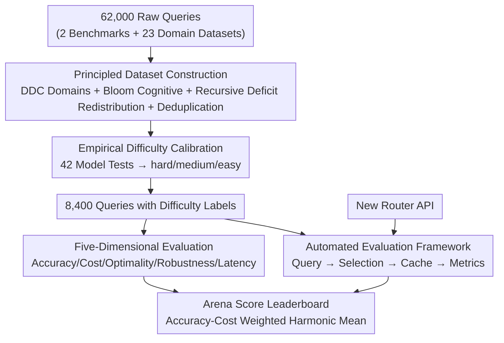

# RouterArena: An Open Platform for Comprehensive Comparison of LLM Routers

**Conference**: ICLR 2026  
**OpenReview**: [https://openreview.net/forum?id=9HsaIi4ngF](https://openreview.net/forum?id=9HsaIi4ngF)  
**Code**: https://routeworks.github.io/ (Platform Homepage)  
**Area**: LLM Evaluation / LLM Routing / Benchmarks  
**Keywords**: LLM Routers, Evaluation Benchmarks, Leaderboard, Accuracy-Cost Trade-off, Automated Evaluation

## TL;DR
RouterArena is the first open evaluation platform for LLM routers. It utilizes the DDC library classification method to build a query dataset covering 9 major domains and 44 categories with approximately 8,400 difficulty-labeled entries. It features five-dimensional metrics—accuracy, cost, optimality, robustness, and latency—alongside an Arena Score that synthesizes accuracy and cost. Through an automated framework that refreshes leaderboards, it compares academic and commercial routers on a unified scale, revealing that no single router excels across all metrics and current methods generally struggle with "using small models when appropriate."

## Background & Motivation

**Background**: In the modern LLM ecosystem, models vary significantly in scale, capability, and price. No single model is optimal for all scenarios: powerful models are expensive but solve hard problems, while small models are cheap but fail on complex tasks. Consequently, "LLM Routers" have emerged to automatically select the most suitable model for a given query. This field has expanded from a few academic papers in 2023 to dozens of academic methods and commercial products (e.g., NotDiamond, Azure Model Router) in 2024–2025, with internal routing even built into GPT-5.

**Limitations of Prior Work**: While routers have proliferated, evaluation has lagged. Each study uses its own dataset and metrics, making cross-comparison impossible. Existing benchmarks (RouterBench, RouterEval, FusionBench, EmbedLLM) suffer from narrow category coverage, lack of difficulty distinction, limited metrics (often only deferral curves or accuracy), lack of support for commercial routers, and the absence of a unified leaderboard.

**Key Challenge**: Router quality is inherently **multi-dimensional**, requiring a balance between accuracy and cost, optimality (choosing the cheapest model that is correct), robustness to noisy inputs, and the overhead latency introduced by the router itself. Current benchmarks focus only on one or two dimensions, leaving the question of "which router is better" without an objective answer. Furthermore, evaluating routers is more complex than models: it requires datasets that distinguish difficulty, multi-angle metrics, and a framework capable of real-time updates.

**Goal**: To create a "Router Arena" similar to LMArena for models, systematically evaluating all routers under a unified protocol. This requires a broad, difficulty-aware dataset, multi-dimensional metrics relevant to deployment, and an automated framework for real-time leaderboard updates.

**Core Idea**: Use the Dewey Decimal Classification (DDC) to ensure domain coverage, define difficulty empirically by "how many models can answer correctly," and synthesize accuracy and cost into a single Arena Score using a weighted harmonic mean within an automated framework.

## Method

### Overall Architecture
RouterArena is not a new router but an infrastructure for evaluation. It comprises four components: (1) A query dataset built on DDC for domain coverage, Bloom’s taxonomy for cognitive levels, and empirical difficulty labels (hard/medium/easy); (2) Evaluation metrics across five dimensions: accuracy, cost, optimality, robustness, and latency; (3) A leaderboard mechanism utilizing an Arena Score based on a weighted harmonic mean; (4) An automated framework that takes a router’s API endpoint, issues queries, retrieves choices, calculates metrics, and updates the leaderboard. This allows for a fair comparison of 12 existing routers (9 academic, 3 commercial).

### Key Designs

**1. Principled Dataset Construction: Addressing Narrow Coverage with DDC and Bloom**
To address narrow and arbitrary category distributions, RouterArena uses two established knowledge organization systems. **DDC Domain Coverage** adopts the Dewey Decimal Classification to divide human knowledge into hierarchical domains, covering 9 top-level domains and 44 categories. **Bloom Cognitive Skill Coverage** uses Bloom's taxonomy (labeled via DeepSeek-V3.1 as a judge) to categorize whether a query tests simple recall or high-level reasoning. 

The construction involves collecting 62,000 raw queries from 2 general and 23 domain-specific datasets. A **Recursive Deficit Redistribution** algorithm ensures balanced distribution across categories and cognitive levels (e.g., maintaining a 2:1 STEM to Humanities ratio). Deduplication is performed using `sentence-transformers/all-MiniLM-L6-v2` based on cosine similarity to remove redundancy.

**2. Empirical Difficulty Calibration: Measurable Rather than Subjective Difficulty**
To test accuracy-cost trade-offs, the dataset must have clear difficulty tiers. The authors define difficulty **empirically**: each query is processed by 42 models, and difficulty is determined by the number of correct models. Queries are categorized as: hard ($\le 4/42$), medium ($5–19/42$), and easy ($\ge 20/42$). The resulting distribution (47.5% easy, 29.1% medium, 23.4% hard) reflects real-world query distributions where simple queries are more frequent.

**3. Five-Dimensional Metrics + Arena Score: Synthesizing Multi-dimensional Performance**
Five dimensions are defined: **(1) Accuracy**; **(2) Cost** (calculated as $cost = c_{in}\cdot N_{in} + c_{out}\cdot N_{out}$ based on official API pricing); **(3) Routing Optimality** (including Best Selection Rate, Optimal Accuracy Ratio, and Optimal Cost Ratio); **(4) Robustness** (consistency in selection after query perturbations); **(5) Latency** (additional TTFT and end-to-end overhead).

The **Arena Score** synthesizes accuracy ($A_i$) and cost ($C_i$) using a weighted harmonic mean. Cost is normalized using a base-2 log transform to distinguish low-cost routers: $C_i = \frac{\log_2(c_{max}) - \log_2 c_i}{\log_2(c_{max}) - \log_2(c_{min})}$, where $c_{min}=0.0044$ and $c_{max}=200$. The final score is $S_{i,\beta} = \frac{(1+\beta)A_i C_i}{\beta A_i + C_i}$, with a default $\beta=0.1$ to slightly favor accuracy.

**4. Automated Evaluation Framework: Evaluation via API**
The framework enables "one-click" inclusion of any router with an API endpoint. It issues queries, records the router’s model selection, monitors latency, and executes inference on the selected model (using prefix caching to ensure efficiency). It supports both open-source routers (trained according to their original implementations) and commercial routers (via direct API calls).

## Key Experimental Results

### Main Results: Arena Score Leaderboard
Arena Score rankings for 12 routers (higher is better):

| Rank | Router | Type | Arena Score |
|------|--------|------|-------------|
| 1 | MIRT-BERT | Academic | 67.3 |
| 2 | Azure-Router | Commercial | 66.4 |
| 3 | CARROT | Academic | 63.9 |
| 4 | vLLM-SR | Academic | 63.8 |
| 5 | GPT-5 | Commercial | 62.7 |
| 6 | NIRT-BERT | Academic | 60.8 |
| 7 | GraphRouter | Academic | 60.5 |
| 12 | RouterDC | Academic | 35.2 |

**Key Insight**: Commercial routers do not necessarily outperform academic ones. GPT-5 ranks 7th due to its limited model pool and high costs, while NotDiamond ranks 12th due to its frequent selection of expensive models.

### Key Findings

| Dimension | Key Finding | Data |
|------|---------|------|
| Oracle Accuracy | All routers fall short of the theoretical upper bound | Oracle Acc. = 90.89% |
| Efficiency | vLLM-SR and CARROT save ~35% cost with <2% accuracy loss | Figure 7 |
| Optimality | RouterDC has the highest Best Selection Rate (93.5%) but worst accuracy; MIRT-BERT has high accuracy but 5x the optimal cost | Figure 8 |
| Robustness | Generally low; BERT-based academic routers are very sensitive to surface perturbations | Figure 9 Left |
| Latency | High for vLLM-SR (546.8ms) due to OpenAI embedding calls; others are mostly sub-100ms | Figure 9 Right |

- **Current routers struggle to use small models**: Most routers cluster near (100% cost, 100% accuracy), indicating over-reliance on the strongest models and missed opportunities for cost-saving.
- **Difficulty tiers are non-trivial**: Accuracy for most routers is >89% on easy queries but drops below 10% on hard queries, validating the empirical calibration.

## Highlights & Insights
- **Standardized Knowledge Classification**: Using DDC and Bloom's taxonomy provides a reproducible and systematic way to ensure broad knowledge and cognitive coverage compared to manual ad-hoc selection.
- **Empirical Difficulty Definition**: Defining difficulty by model performance avoids subjectivity and aligns perfectly with the router's decision-making goal—identifying queries that are too difficult for cheap models.
- **Logarithmic Cost Normalization**: The Arena Score's cost processing ensures that routers in the low-cost zone are differentiated without being overshadowed by the absolute prices of extreme models.
- **Open vs. Commercial Parity**: The platform provides the first quantitative evidence that paying for a commercial router does not always yield better value compared to open-source alternatives.

## Limitations & Future Work
- **Skewed Difficulty Distribution**: The dataset focuses on easy queries (47.5%), which may reduce the ranking stability of the "hard" subset.
- **Judge Bias**: Dependence on LLM-as-Judge (DeepSeek-V3.1) for correctness and Bloom labeling may introduce biases.
- **Maintenance Effort**: As a live leaderboard, the platform is sensitive to changes in API pricing and model updates, requiring continuous maintenance.
- **Transparency**: Some commercial routers do not expose model choices, preventing full calculation of optimality and latency metrics across all samples.

## Related Work & Insights
- **Comparison to RouterBench/RouterEval**: These are offline, narrow in category (~27), lack difficulty levels, and do not support commercial routers. RouterArena provides a live, 44-category, multi-metric platform.
- **Comparison to LMArena (Chatbot Arena)**: While LMArena focuses on model output and human preference, RouterArena focuses on routing strategy and objective metrics (cost/optimality).

## Rating
- **Novelty**: ⭐⭐⭐⭐ First open platform for academic+commercial router comparison; strong integration of DDC and empirical difficulty.
- **Experimental Thoroughness**: ⭐⭐⭐⭐⭐ Comprehensive 12-router evaluation across 5 dimensions and difficulty tiers.
- **Writing Quality**: ⭐⭐⭐⭐ Clear logical flow and well-defined metrics/formulas.
- **Value**: ⭐⭐⭐⭐⭐ Highly valuable for the community as a unified scale to guide the development of efficient routing strategies.

<!-- RELATED:START -->

## Related Papers

- [\[ICML 2026\] RouteJudge: An Open Platform for Reproducible and Preference-Aware LLM Routing](../../ICML2026/llm_evaluation/routejudge_an_open_platform_for_reproducible_and_preference-aware_llm_routing.md)
- [\[ICLR 2026\] DeepResearch Bench: A Comprehensive Benchmark for Deep Research Agents](deepresearch_bench_a_comprehensive_benchmark_for_deep_research_agents.md)
- [\[ICLR 2026\] The Open Proof Corpus: A Large-Scale Study of LLM-Generated Mathematical Proofs](the_open_proof_corpus_a_large-scale_study_of_llm-generated_mathematical_proofs.md)
- [\[ICLR 2026\] An Open-Ended Benchmark and Formal Framework for Adjuvant Research with MLLM](an_open-ended_benchmark_and_formal_framework_for_adjuvant_research_with_mllm.md)
- [\[ICLR 2026\] AnesSuite: A Comprehensive Benchmark and Dataset Suite for Anesthesiology Reasoning](anessuite_a_comprehensive_benchmark_and_dataset_suite_for_anesthesiology_reasoni.md)

<!-- RELATED:END -->
