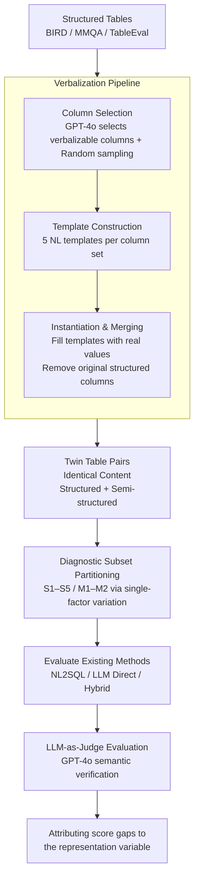

# Same Content, Different Representations: A Controlled Study for Table QA

**Conference**: ICLR 2026  
**arXiv**: [2509.22983](https://arxiv.org/abs/2509.22983)  
**Code**: [https://github.com/megagonlabs/RePairTQA](https://github.com/megagonlabs/RePairTQA)  
**Area**: LLM Evaluation  
**Keywords**: Table QA, Structured Tables, Semi-structured Tables, Representations, Diagnostic Benchmark  

## TL;DR
The first controlled-variable study: By keeping table content identical while varying representation forms (structured vs. semi-structured), this work systematically evaluates the robustness of NL2SQL, LLM, and hybrid methods across different table sizes, schema qualities, and query complexities, identifying representation as a first-order factor affecting Table QA performance.

## Background & Motivation

**Background**: Table QA methods primarily follow three paradigms: NL2SQL (converting natural language to SQL for execution), direct LLM reasoning, and hybrid methods (SQL retrieval + LLM reasoning). Existing benchmarks fix the table format, and models are typically optimized for a single representation.

**Limitations of Prior Work**: Real-world tables exist in both structured forms with strict schemas and semi-structured forms with irregular columns or cells containing free text. However, existing benchmarks lack a systematic study of the "representation form itself" on model performance, resulting in unknown model behavior in cross-format scenarios.

**Key Challenge**: To fairly compare the impact of different representations, one must ensure table "content is identical" while only changing the "representation form." Existing datasets fail to meet this condition because the underlying data for structured and semi-structured benchmarks differ.

**Goal**: (a) How to generate paired structured/semi-structured tables while controlling content? (b) How do table size, join operations, query complexity, and schema quality respectively affect different paradigms? (c) How to select the best method for actual deployment?

**Key Insight**: Columns in structured tables are transformed into natural language descriptions through a verbalization pipeline to generate semantically equivalent but structurally different table pairs.

**Core Idea**: Representation is a first-order variable in Table QA—NL2SQL is strongest on structured input but drops by 30-45% on semi-structured data; LLMs are most robust but limited in precision; hybrid methods are optimal for semi-structured scenarios.

## Method

### Overall Architecture
The core question of this paper is: will different Table QA paradigms fail when table "content remains exactly the same, with only the representation changed"? To answer this, it constructs a diagnostic benchmark, **RePairTQA**, treating "representation" as a tunable experimental knob. The pipeline consists of three stages: first, taking structured tables with strict schemas and using a verbalization pipeline to rewrite specific columns into free text, resulting in semantically equivalent "twin tables" with different forms; second, partitioning the data into 7 diagnostic subsets based on table size, join operations, query complexity, and schema quality, varying only one dimension per subset; third, evaluating three categories of **existing** methods—direct LLM reasoning (GPT-4o, Gemini-2.5-flash, Qwen3-235B), NL2SQL (LLM-NL2SQL, XiYan), and Hybrid (H-STAR, Weaver)—using a unified LLM-as-Judge protocol. Since each twin table pair has identical content, any performance gap between structured and semi-structured versions is attributed solely to the "representation" variable.

### Key Designs

**1. Verbalization Pipeline: Converting structured to semi-structured without changing content**

The premise of fair comparison is that two tables must be semantically identical but different in form. Since existing benchmarks for structured and semi-structured data have different underlying data, they cannot be directly compared. This pipeline first uses GPT-4o to select candidate columns suitable for verbalization and performs random sampling of column combinations to increase diversity. It then generates natural language templates conditioned on the table schema for each combination. Finally, it instantiates the templates with real row values to create a free-text column while deleting the original structured columns. Any subsequent performance difference can thus be cleanly attributed to the representation itself.

**2. Diagnostic Subset Partitioning: Isolating single-factor influence**

Overall accuracy mixes multiple factors, obscuring whether a drop is due to table size, messy schemas, or query difficulty. The benchmark aggregates three datasets—BIRD for clean schemas, MMQA for multi-table reasoning, and TableEval for noisy web schemas—and partitions them into 7 subsets (S1–S5 for single tables, M1–M2 for multi-tables). Each subset fixes other dimensions while varying one: S1 vs S4/S5 for table length, S1 vs S2 for schema quality, S1/S4 lookup vs S3/S5 compositional queries for complexity, and S1–S5 vs M1–M2 for join operations.

**3. LLM-as-Judge Evaluation Protocol: Semantic matching over surface matching**

Semi-structured answers often involve different number formats or synonymous phrasing. Traditional Exact Match or Partial Match would penalize semantically correct but surface-different answers. GPT-4o is employed as a judge to determine if the predicted answer is semantically consistent with the gold standard, tolerating rounding, formatting differences, and synonyms. Human validation on 100 random samples showed a 96% agreement rate with the judge, justifying large-scale benchmarking.

## Key Experimental Results

### Main Results (RQ1: Structured vs. Semi-structured Comparison)

| Model | Structured Acc(%) | Semi-structured Acc(%) | Drop(%) |
|------|---------------|-----------------|---------|
| GPT-4o | 45.37 | 41.93 | 3.44 |
| Gemini-2.5-flash | 52.07 | 50.78 | 1.29 |
| LLM-NL2SQL | 69.14 | 38.65 | **30.49** |
| XiYan | 69.55 | 24.08 | **45.47** |
| H-STAR | 49.48 | 47.14 | 2.34 |
| Weaver | 62.19 | 57.70 | 4.49 |

### Ablation Study (Analysis by Dimension)

| Factor | Key Finding | Most Impacted Method |
|------|---------|---------------|
| Table Size | Long tables cause drops across all methods; LLMs are most sensitive. | GPT-4o: 70%→28.9% |
| Join Operations | NL2SQL benefits from structured multi-tables (+10%) but collapses in semi-structured settings. | LLM-NL2SQL: Multi-table drop |
| Query Complexity | LLMs reach ~70% on lookup but drop sharply under compositional reasoning. | All methods |
| Schema Quality | Noisy schemas severely affect NL2SQL; Hybrid methods are most robust. | XiYan: Severe drop |

### Key Findings
- **Representation is a first-order factor**: NL2SQL methods suffer a 30-45% performance crash under semi-structured data, making them the most fragile paradigm.
- **No "silver bullet" method**: Use NL2SQL for structured data, Hybrid methods for semi-structured data, and LLMs for simple queries.
- **Verbalization sometimes aids LLMs**: Natural language descriptions in semi-structured tables are closer to LLM pre-training data; Hybrid methods even perform better in some semi-structured lookup tasks.
- **Long tables are a universal bottleneck**: All methods decline significantly as table length increases, though NL2SQL maintains a 62.9% accuracy on long structured tables.
- **Model scale does not resolve representation sensitivity**: Larger models like Gemini-2.5-Pro exhibit the same structured-to-semi-structured gap.

## Highlights & Insights
- The **controlled variable experimental design** is clever: by maintaining identical information content across representations, performance differences are directly attributable to the representation itself. This methodology is transferable to other modalities (e.g., Knowledge Graphs vs. Documents).
- The **decision-tree style selection guide** is highly practical, recommending optimal methods based on data conditions (structured/semi-structured × table size × schema quality × query complexity).
- The discovery that verbalization occasionally improves LLM reasoning challenges the intuition that "structured data is always superior."

## Limitations & Future Work
- Only three benchmark datasets are covered; domain diversity (e.g., finance, biomedicine) is lacking.
- Table sizes are restricted to fit within the context window; ultra-long tables requiring chunking or RAG are not considered.
- Verbalization templates generated by GPT-4o might introduce model-specific biases.
- Newer paradigms, such as RAG-based table QA systems, were not evaluated.
- Support for multi-table scenarios in Hybrid methods is limited, requiring better cross-table reasoning modules.

## Related Work & Insights
- **vs BIRD/Spider**: While those benchmarks fix structured formats, RePairTQA adds a semi-structured dimension via verbalization, becoming the first controlled benchmark for representation.
- **vs H-STAR/Weaver**: Instead of proposing a new model, this work systematically evaluates the representation robustness of these existing paradigms.
- **Insight for system design**: Post-deployment systems should adaptively select the reasoning paradigm based on data conditions rather than relying on a single fixed approach.

## Rating
- Novelty: ⭐⭐⭐⭐ 
- Experimental Thoroughness: ⭐⭐⭐⭐⭐ 
- Writing Quality: ⭐⭐⭐⭐ 
- Value: ⭐⭐⭐⭐ 

<!-- RELATED:START -->

<!-- RELATED:END -->

## Related Papers

- [\[ACL 2026\] Same Voice, Different Lab: On the Homogenization of Frontier LLM Personalities](../../ACL2026/llm_evaluation/same_voice_different_lab_on_the_homogenization_of_frontier_llm_personalities.md)
- [\[ICLR 2026\] LFQA-E: Carefully Benchmarking Long-form QA Evaluation](lfqa-e_carefully_benchmarking_long-form_qa_evaluation.md)
- [\[ICLR 2026\] AirQA: A Comprehensive QA Dataset for AI Research with Instance-Level Evaluation](airqa_a_comprehensive_qa_dataset_for_ai_research_with_instance-level_evaluation.md)
- [\[ACL 2025\] RealHiTBench: A Comprehensive Realistic Hierarchical Table Benchmark for Evaluating LLM-Based Table Analysis](../../ACL2025/llm_evaluation/realhitbench_a_comprehensive_realistic_hierarchical_table_benchmark_for_evaluati.md)
- [\[ACL 2026\] Pressure-Testing Deception Probes in LLMs: Scaling, Robustness, and the Geometry of Deceptive Representations](../../ACL2026/llm_evaluation/pressure-testing_deception_probes_in_llms_scaling_robustness_and_the_geometry_of.md)

<!-- RELATED:END -->
