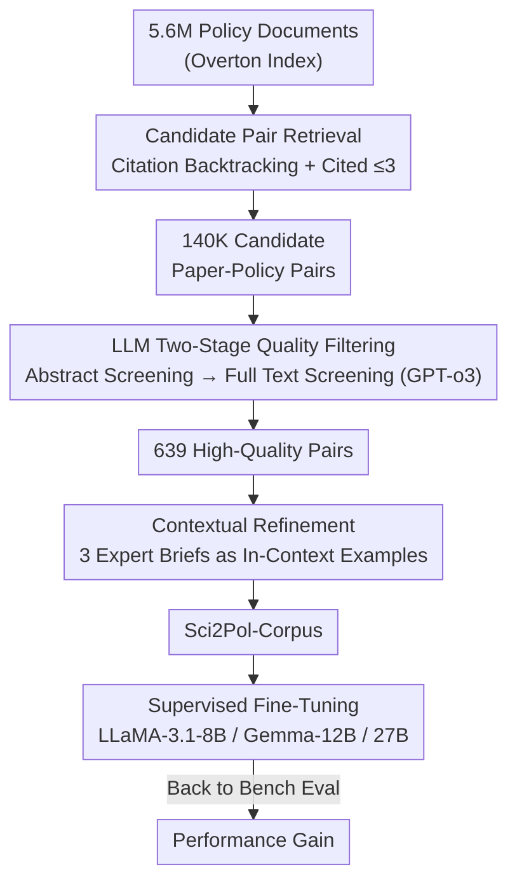

# Sci2Pol: Evaluating and Fine-tuning LLMs' "Science-to-Policy Brief" Generation Capabilities

**Conference**: ICLR 2026  
**OpenReview**: [https://openreview.net/forum?id=S6gJESWNSX](https://openreview.net/forum?id=S6gJESWNSX)  
**Code**: https://github.com/WeiminWu2000/Sci2Pol  
**Area**: NLP Understanding / LLM Evaluation / Datasets & Benchmarks  
**Keywords**: Policy brief generation, Evaluation benchmark, Training corpus, LLM-as-a-judge, Supervised fine-tuning

## TL;DR
This paper introduces **Sci2Pol-Bench**, the first benchmark for the "generating policy briefs from scientific papers" task (decomposing the five-stage writing process into 18 tasks), and **Sci2Pol-Corpus**, a training corpus (filtering 639 high-quality "paper-brief" pairs from 5.6 million policy documents). The authors point out that BERTScore/ROUGE cannot measure the quality of briefs and instead use an LLM evaluation metric aligned with expert judgment. After fine-tuning on the corpus, Gemma-3-27B outperforms much larger models like GPT-4o and DeepSeek-V3 (671B).

## Background & Motivation
**Background**: Transforming scientific evidence into usable policy briefs is a vital but difficult task—issues like climate change, public health, and technological shifts urgently require timely input from the scientific community. However, policymakers often find it hard to read dense, technical research as clear, actionable guidance, while most scientists lack experience in policy writing. As LLM capabilities improve, a natural question arises: To what extent can LLMs help, and how can they be improved?

**Limitations of Prior Work**: Previous studies have shown that LLMs produce hallucinations in scientific content, incorrectly verify claims, and provide unstable or biased policy reasoning. Through expert-reviewed examples, the authors categorize four typical defects in policy brief generation: (i) **Missing core content**—omitting quantitative findings, methods, or context, or including irrelevant information; (ii) **Hallucinated claims**—fabricating numbers or causal statements not found in the original text; (iii) **Inappropriate tone**—common technical jargon and verbosity unsuitable for policy readers, even if accurate; (iv) **Low actionability**—vague recommendations lacking evidence support.

**Key Challenge**: To rigorously evaluate this capability, one must **decompose the general process of "writing a brief" into gradable sub-abilities** and obtain **real, domain-matched data**. However, this field previously lacked **both benchmarks and training data**: common metrics like BERTScore/ROUGE only consider lexical overlap and fail to reflect the quality of reasoning, structure, and evidence linking; furthermore, there were no paired corpora for fine-tuning that matched the style of expert briefs.

**Goal**: (1) Build a fine-grained, gradable evaluation benchmark to answer "to what extent can current LLMs perform"; (2) Create a targeted training corpus to answer "how to make them better."

**Key Insight**: Drawing on "progressive, capability-oriented" evaluation frameworks, the authors decompose brief writing to **mimic the human writing process** into five stages (Autocompletion → Understanding → Summarization → Generation → Verification), with each stage corresponding to a set of quantifiable tasks. By using strict criteria where the "same authors write both the paper and the brief," they ensure that 85 pairs reflect genuine expert interpretations.

**Core Idea**: Using a "five-stage taxonomy → 18-task Bench" for diagnostic evaluation and a three-step process of "citation backtracking + LLM filtering + contextual refinement" to extract training data from massive policy documents, bridging the "science-policy" gap from both the "how to evaluate" and "how to train" perspectives.

## Method

### Overall Architecture
This paper does not propose a new model architecture but rather a twofold infrastructure of "Evaluation + Training," divided into two tracks:

- **Sci2Pol-Bench (Evaluation Track)**: Uses the **Sci2Pol-Taxonomy**'s five stages (Autocompletion / Understanding / Summarization / Generation / Verification) as a framework to create 18 tasks, covering both multiple-choice and open-ended writing formats. Specifically for the most difficult "Generation" stage, it designs a set of reference-based LLM-as-a-judge metrics to replace BERTScore/ROUGE. This is used to evaluate 13 open-source and commercial LLMs.
- **Sci2Pol-Corpus (Training Track)**: Starting from 5.6 million policy documents indexed in Overton, it follows a three-step pipeline: "Citation backtracking retrieval → LLM two-stage quality filtering → Contextual style refinement." This results in 639 high-quality "paper-brief" pairs for supervised fine-tuning (SFT) of three open-source models, which are then validated back on the Bench.

Both tracks share a gold standard set of 85 expert-written "paper-brief" pairs: the Bench uses them to construct domain targets, while the Corpus uses them as in-context references for style refinement. The following diagram illustrates the corpus refinement pipeline of the "Training Track":

### Key Designs

**1. Sci2Pol-Taxonomy and 18-task Bench: Decomposing "Writing a Brief" into Gradable Stages**

The foundation of the entire benchmark is a five-stage decomposition mimicking the human writing process: **Autocompletion** (selecting/restoring the third sentence given the first two, testing local coherence), **Understanding** (sentence intent classification + scientific knowledge MCQs, testing factual understanding), **Summarization** (condensing technical paragraphs for policy readers), **Generation** (drafting briefs from scratch, testing evidence synthesis and persuasive expression), and **Verification** (fact-checking claims against the original text, testing anti-hallucination). The five stages represent a progression in capability across 18 tasks (Table 1): 4 Autocompletion (Tasks 1–4, 255 items each, Micro F1), 2 Understanding (Task 5 intent classification 1200 items, Task 6 scientific MCQs via MMLU-Pro 1000 items), 4 Summarization (Tasks 7–10, 200 items each, reference-free score), 5 Generation (Tasks 11–15, 85 items each, reference-based score, including sectional generation of "Policy Problem/Findings/Methods/Implications" + full brief generation), and 3 Verification (Task 16 original 850 items, Task 17 via SciRIFF 1000 items, Task 18 implication verification 700 items).

The value of this decomposition is that "how well a brief is written" is often an ambiguous overall score that fails to locate whether a model failed due to "missing content," "hallucinated numbers," or "incorrect tone." By further splitting generation into sectional tasks (11–14) and a full-text task (15), **factual accuracy** and **overall coherence** are decoupled—sectional tasks emphasize grounding, while the full-text task tests readability. Both are evaluated to expose trade-offs.

**2. Reference-based LLM-as-a-judge for Generation Tasks: Aligning Scores with Expert Judgment**

The authors empirically rejected old metrics: BERTScore remains high even when key paragraphs are entirely missing because overlapping tokens inflate similarity; ROUGE penalizes paraphrasing excessively, showing a drop in score even if the meaning is preserved. Neither captures reasoning, structure, or evidence linking. Thus, Tasks 11–15 use content-aware scoring based on "paper-grounded rubrics + LLM judge (Gemini-2.1-Pro)," where rubrics are tailored for each section.

Specifically: **Task 11 (Policy Problem)** is scored by content + structure, breaking problems into background/existing issues/consequences/focus points/supporting details, judging "how important it is in the paper" and "how well the candidate wrote it." **Task 12 (Findings)** is scored purely by content, evaluating completeness, importance, accuracy, whether it captures key points rather than long lists, and whether the scope is clear. **Task 13 (Methods)** evaluates clarity/purpose, technical detail suitability for policy readers, and use of plain language for terminology. **Task 14 (Implications)** evaluates accuracy (no hallucinations), coverage, conciseness, and alignment with the paper’s main theme. **Task 15 (Whole Brief)** evaluates content + style together, focusing on contextual depth, hallucination risk (every claim traceable to the original), readability, and actionability.

**3. Sci2Pol-Corpus Three-Step Refinement: Reverse-Mining "Paper-Brief" Pairs from 5.6M Policy Docs**

Since "real policy briefs are rare," the authors created a three-step pipeline to purify massive document sets:

(i) **Candidate Pair Retrieval**: Starting from 5.6 million policy documents in Overton, they used citation metadata to find scientific papers cited by each document. A key heuristic is "the fewer papers a policy document cites, the more likely it focuses on each," so they only kept policy documents citing **no more than 3 papers**, resulting in 140,000 candidate pairs.

(ii) **LLM Two-Stage Quality Filtering**: Using GPT-o3 to judge if the policy document truly focuses on the cited paper. For cost efficiency, they used a coarse-to-fine approach: **Coarse screening** only provided paper abstracts (retrieved from SciSciNet) to judge alignment, yielding 1,407 pairs; they then handled long documents—of the 1,407, 777 policy documents under 10 pages were kept, while the 630 longer ones had their "executive summaries" extracted as pseudo-briefs and the remaining text as pseudo-papers, recovering 234 pairs for a total of 1,011 pairs. **Fine screening** used GPT-o3 on full texts for detailed judgment, adding a "paper-policy document similarity" criterion to filter out split documents that were too similar, leaving 639 pairs.

(iii) **Contextual Refinement**: Official policy documents often lack the specific format of a "policy brief." Thus, 3 pairs from the expert set were used as in-context examples for GPT-o3 to rewrite documents into standard briefs while preserving facts and citations. The authors emphasize that this step **only transfers writing style and structure, not scientific content**, and and verified no data leakage from the Bench.

**4. SFT Verifying Corpus Value: Small Models Outperforming Large Ones via Domain Supervision**

Finally, they applied Supervised Fine-Tuning (SFT) using Sci2Pol-Corpus on LLaMA-3.1-8B-Instruct, Gemma-3-12B, and Gemma-3-27B. Results showed consistent improvements across all three on the Bench, with the fine-tuned Gemma-3-27B surpassing much larger models like GPT-4o and DeepSeek-V3 (671B). This indicates that for highly domain-specific tasks like "science-to-policy," **targeted domain supervision can outweigh sheer parameter scale**.

## Key Experimental Results

### Main Results: Performance of 13 LLMs on Sci2Pol-Bench
Means ± variance reported using 1000 bootstrap significance tests (seed=42). Gemini-2.1-Pro served as the judge for Generation/Summarization.

| Rank | Model | Auto.(1-4) | Under.(5-6) | Sum.(7-10) | Gene.(11-15) | Ver.(16-18) | Average |
|------|-------|-----------|------------|-----------|-------------|------------|---------|
| 1 | Grok-3-beta | 50.77 | 80.12 | 83.26 | 86.70 | 85.45 | **77.01** |
| 2 | DeepSeek-R1 | 44.76 | 86.61 | 80.83 | 84.75 | 83.84 | 75.05 |
| 3 | Qwen3-235B | 47.22 | 87.19 | 77.02 | 84.80 | 83.76 | 74.81 |
| 4 | DeepSeek-V3 | 39.54 | 79.35 | 78.97 | 86.23 | 85.48 | 73.35 |
| 5 | GPT-4o | 52.17 | 77.17 | 74.23 | 76.39 | 85.45 | 72.12 |
| 6 | Gemma-3-27B | 43.60 | 67.82 | 74.55 | 84.82 | 84.29 | 71.40 |
| 13 | LLaMA-3.1-8B-IT | 27.12 | 47.74 | 64.42 | 65.78 | 76.25 | 56.63 |

Even the strongest Grok-3-beta only scored 77.01, far from perfect, suggesting significant room for improvement; the **Autocompletion phase scores were generally low** (40–53 for most), highlighting it as a major bottleneck.

### Ablation Study: Gain from SFT on Sci2Pol-Corpus

| Model | Sum.(7-10) | Gene.(11-15) | Average | Gain |
|-------|-----------|-------------|---------|------|
| LLaMA-3.1-8B-IT | 64.42 | 65.78 | 56.63 | — |
| LLaMA-3.1-8B-SFT | 78.28 | 77.62 | 64.27 | **+7.64** |
| Gemma-3-12B | 71.79 | 77.34 | 68.47 | — |
| Gemma-3-12B-SFT | 84.19 | 78.57 | 71.59 | +3.12 |
| Gemma-3-27B | 74.55 | 84.82 | 71.40 | — |
| Gemma-3-27B-SFT | 86.36 | 81.53 | 73.43 | +2.03 |
| GPT-4o (Ref) | 74.23 | 76.39 | 72.12 | — |
| DeepSeek-V3 (Ref) | 78.97 | 86.23 | 73.35 | — |

### Key Findings
- **Small models outperform large ones**: The fine-tuned Gemma-3-27B (73.43) surpassed GPT-4o (72.12) and DeepSeek-V3/671B (73.35), confirming that domain supervision can compensate for scale.
- **Gains primarily from Summarization**: Summarization scores jumped significantly after SFT, suggesting the corpus most directly strengthens the ability to "condense science into policy language."
- **Generation trade-off**: Gemma-3-27B's Generation score dropped slightly (84.82 → 81.53) after fine-tuning, suggesting SFT potentially sacrifices some grounding precision while improving readability—a trade-off visible thanks to the sectional task decomposition.
- **Legacy metrics fail**: Empirical evidence showed BERTScore remains high despite missing segments and ROUGE penalizes paraphrasing, reinforcing the shift to LLM-as-a-judge metrics.

## Highlights & Insights
- **Using "writing workflow" as the eval taxonomy framework**: Mirroring human writing via five stages allows for precise localization of model weaknesses; this paradigm is transferable to any complex writing/reasoning evaluation.
- **Debunking old metrics before establishing new ones**: Proving that BERTScore and ROUGE fail via specific counter-examples makes the shift to rubric-anchored LLM judging very convincing.
- **Mining pairs from massive policy docs**: The pipeline involving "citation backtracking + citation counts + dual screening + executive summary extraction" effectively retrieves rare high-quality pairs from 5.6M noisy docs.
- **Commercial Value**: Achieving parity with 671B models using only 639 pairs on a 27B model suggests that for specialized tasks, high-quality domain data is more efficient than scaling.

## Limitations & Future Work
- **Small gold standard set**: 85 expert pairs represent the total set of published pairs found, limiting statistical power for Generation tasks (11–15). Source journals were dominated by Nature titles (climate/energy/sustainability).
- **Heavy dependence on LLM judge**: Summarization and Generation scores rely on Gemini-2.1-Pro/rubrics; the judge’s bias and stability may affect rankings.
- **Synthetic/Pseudo-pairs in corpus**: Portions of the corpus derived from "executive summary splits" and GPT-o3 refinement may still have a distribution gap compared to genuine expert briefs.
- **Negative transfer in Generation**: The drop in Gemma-27B's Generation score suggests SFT recipes need a more delicate balance between "summarization enhancement" vs "generation grounding."

## Related Work & Insights
- **vs General scientific understanding benchmarks (SciRIFF/MMLU-Pro)**: While those test general scientific knowledge and claim verification, this work integrates them into the Understanding/Verification stages and targets the specialized full-flow "science-to-policy brief" task.
- **vs Traditional metrics (BERTScore, ROUGE)**: This study demonstrates the failure of overlap-based metrics in policy scenarios and advocates for paper-grounded rubrics.
- **vs "Scale-is-all-you-need" paradigm**: Providing a specific counter-example where domain-targeted supervision allows a smaller model to outperform a model 25x larger is highly instructive for resource-constrained scenarios.

## Rating
- Novelty: ⭐⭐⭐⭐⭐ First "Science-to-Policy Brief" benchmark and corpus; the five-stage taxonomy and reverse-mining pipeline are highly original.
- Experimental Thoroughness: ⭐⭐⭐⭐ 13 LLMs evaluated, three fine-tuned; though sample size for generation is small and journal sources are limited.
- Writing Quality: ⭐⭐⭐⭐⭐ Logical flow from motivation to taxonomy to metrics/corpus is clear; the debunking of old metrics is a highlight.
- Value: ⭐⭐⭐⭐⭐ Establishes the first reusable infrastructure for a high-social-value task.

<!-- RELATED:START -->

<!-- RELATED:END -->

## Related Papers

- [\[ICLR 2026\] Multi-LLM Adaptive Conformal Inference for Reliable LLM Responses](multi-llm_adaptive_conformal_inference_for_reliable_llm_response.md)
- [\[ICLR 2026\] RouterArena: An Open Platform for Comprehensive Comparison of LLM Routers](routerarena_an_open_platform_for_comprehensive_comparison_of_llm_routers.md)
- [\[ICLR 2026\] BiasScope: Towards Automated Detection of Bias in LLM-as-a-Judge Evaluation](biasscope_towards_automated_detection_of_bias_in_llm-as-a-judge_evaluation.md)
- [\[ICLR 2026\] Log Probability Tracking of LLM APIs](log_probability_tracking_of_llm_apis.md)
- [\[ACL 2026\] 正确信念的瓦解：临床压力下 LLM 的认知韧性研究](../../ACL2026/llm_evaluation/when_correct_beliefs_collapse_epistemic_resilience_of_llms_under_clinical_pressu.md)

<!-- RELATED:END -->
