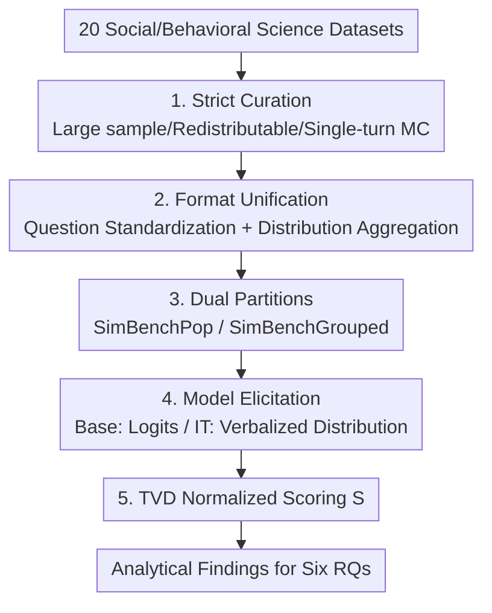

# SimBench: Benchmarking the Ability of Large Language Models to Simulate Human Behaviors

**Conference**: ICLR 2026  
**OpenReview**: [https://openreview.net/forum?id=PL51SpN6ZJ](https://openreview.net/forum?id=PL51SpN6ZJ)  
**Code**: Available (GitHub + HuggingFace, Project Website included in the paper)  
**Area**: LLM Evaluation / Social Simulation / Behavioral Science  
**Keywords**: Human Behavior Simulation, Population Distribution Prediction, Alignment-Simulation Tradeoff, Total Variation Distance, Large-scale Benchmark

## TL;DR
SimBench unifies 20 cross-disciplinary datasets from ethics, economics, psychology, and politics into a "population response distribution prediction" task, constructing the first large-scale standardized LLM human behavior simulation benchmark. Systematic evaluation across 45 models reveals that even the strongest current models achieve only a moderate fidelity of 40.80/100. Simulation capability grows log-linearly with scale but does not improve with increased inference compute, and instruction tuning exhibits a distinct "alignment-simulation tradeoff."

## Background & Motivation
**Background**: Using LLMs to simulate human behavior (to replace or supplement costly and time-consuming human experiments and surveys) is becoming a prominent direction in social, psychological, economic, and political sciences. Early works (Argyle, Horton, Aher, etc.) provided optimistic evidence suggesting "LLMs can serve as simulators."

**Limitations of Prior Work**: Such studies are highly fragmented—the vast majority evaluate only one or two models on specific tasks using customized metrics, leading to contradictory conclusions that are difficult to compare. The field lacks a unified framework to answer when, how, and why LLM simulation succeeds or fails, making it nearly impossible to determine how to train better simulators.

**Key Challenge**: There is no standard for "measuring" simulation fidelity. Different papers use different tasks, populations, and metrics; scores are not on the same scale, leaving the question of whether LLMs can truly simulate humans unresolved.

**Goal**: Establish a large-scale, standardized, and reproducible benchmark to converge scattered empirical evidence into a "measurable science." The objective is to systematically characterize LLM simulation capabilities across six research questions (RQ1–RQ6: overall capability, model characteristics, task selection, response diversity, demographic differences, and correlation with general capabilities).

**Key Insight**: The authors operationalize "simulating human behavior" as a clean, quantifiable proxy task—predicting **population-level response distributions** (rather than individual instances). Population distributions allow for rigorous scoring via distributional distances and naturally mitigate training data contamination (predicting distributions zero-shot rather than memorizing answers).

**Core Idea**: Unify 20 heterogeneous datasets into a standard format of "single-turn multiple-choice + population response probability distribution." Measure fidelity using a normalized score $S$ based on Total Variation Distance (TVD), making simulation capabilities across different models, tasks, and populations **comparable for the first time**.

## Method

### Overall Architecture
SimBench is not a model but a benchmark construction and evaluation pipeline consisting of: "Data Curation → Format Unification → Partitioning → Model Elicitation → Scoring." It takes 20 raw datasets from social and behavioral science repositories (Harvard Dataverse, ICPSR, OSF, etc.) as input and outputs SimBench scores $S \in (-\infty, 100]$ along with analytical findings for the six RQs.

The crux of the pipeline is transcribing "how humans answer" into "one multiple-choice question + one population response probability distribution." Datasets are filtered by strict criteria, questions are standardized into multiple-choice formats, and individual responses are aggregated into population distributions as "simulation targets." These are divided into SimBenchPop (broad population) and SimBenchGrouped (demographically specific). Models are elicited differently based on their type, and predictions are compared against human ground truth using normalized TVD.

### Key Designs

**1. Strict Data Curation Criteria: Ensuring Reliable Distributions and Task Diversity**

Reliable simulation fidelity requires that the underlying human distributions are robust and cover a diverse range of "human behaviors." The authors use hard filtering criteria: large participant counts (to aggregate meaningful distributions), permissive licenses (redistributable), **single-turn self-contained questions** (to avoid confounding variables from multi-turn interactions), and multiple-choice or ordinal formats (for quantification). Curation trade-offs were made: priority was given to new datasets not previously used in LLM simulation evaluations, while mature benchmarks like OpinionQA and ChaosNLI were included for backward compatibility. Datasets with rich socio-demographic annotations were prioritized, though unique tasks like Jester or Choices13k were included despite lacking demographic data.

The final 20 datasets are intentionally diverse across two dimensions: tasks cover Decision Making (Choices13k, MoralMachine), Self-Assessment (OpinionQA, OSPsychBig5), Judgment (ChaosNLI, Jester), and Problem Solving (WisdomOfCrowds, OSPsychMGKT). Populations span 130+ countries across six continents, with the Western Anglosphere accounting for only 27.9%. Eight datasets use representative sampling to enhance ecological validity.

**2. Heterogeneous Data Unification: Question Standardization and Distribution Aggregation**

To ensure comparability, discrepancies across datasets must be eliminated. **Question Standardization** converts all questions to multiple-choice formats with minimal edits—mapping discrete options to standard letter keys (each corresponding to a single token) to extract probabilities from base models accurately. Continuous scales (e.g., Jester) are discretized into bins. Official English versions are used exclusively to disentangle "simulation capability" from "multilingual capability," ensuring score differences reflect only simulation fidelity.

**Response Aggregation** standardizes data into population-level probability distributions. For most datasets, the authors aggregate individual responses and apply post-stratification weights where applicable (e.g., ESS); for others (e.g., GlobalOpinionQA), the data is reshaped to the SimBench schema. Two types of simulation targets are created: **Default Grouping** aggregates all participants for a question to represent a "default population," and **Specific Grouping** filters by attributes (age, gender, etc.) for datasets with demographic labels. Each target includes a prompt describing the corresponding population. The process yields 10,930,271 unique "question-population" simulation targets.

**3. Double Partition Design: SimBenchPop and SimBenchGrouped**

To handle the massive number of targets, two partitions were curated. **SimBenchPop** uses all 20 datasets with default grouping prompts (7,167 test cases) to measure the ability to "simulate a wide and diverse population." **SimBenchGrouped** focuses on 5 large-scale survey datasets (Afrobarometer, ESS, ISSP, Latinobarómetro, OpinionQA) where sample sizes remain reliable after conditioning on demographic attributes. It specifically targets questions with the highest variance across groups (6,343 cases) to measure the ability to "simulate specific narrow populations."

**4. TVD-based Normalized Score $S$: Comparing Datasets with Different Entropy Levels**

To score fairly across datasets with vast differences in entropy, the authors derive the SimBench score $S$ from Total Variation Distance (TVD). It measures how much the model prediction $Q$ improves toward the human ground truth $P$ relative to a uniform baseline $U$:

$$S(P, Q) = 100\left(1 - \frac{\mathrm{TVD}(P, Q)}{\mathrm{TVD}(P, U)}\right)$$

A score of 100 represents perfect alignment, while 0 is equivalent to random guessing (uniform distribution). To maintain stability when human distributions are near uniform ($P=U$), individual test cases $i$ are normalized by a **dataset-level average baseline**:

$$S_i = 100\left(1 - \frac{\mathrm{TVD}(P_i, Q_i)}{\frac{1}{|D|}\sum_{j\in D}\mathrm{TVD}(P_j, U_j)}\right)$$

The denominator is the average TVD between human and uniform distributions within dataset $D$. Model elicitation follows two paths: base models use top-token logits for option probabilities, while Instruction-Tuned (IT) models use **verbalized distributions** (prompting the model to output "Option A: 30%, Option B: 70%"), which Appendix E proves is significantly and consistently superior to direct token probabilities for IT models.

## Key Experimental Results

Evaluation was conducted on 45 LLMs (0.5B–405B, commercial/open-source, base/IT) covering RQ1–RQ6.

### Main Results

Representative SimBench scores (averaged across partitions):

| Model | Type | $S$ (↑) |
|-------|------|--------|
| Claude-3.7-Sonnet | IT/Closed | 40.80 |
| Claude-3.7-Sonnet-4000 (with reasoning budget) | IT/Closed | 39.46 |
| GPT-4.1 | IT/Closed | 34.55 |
| DeepSeek-R1 | IT/Open | 34.52 |
| Llama-3.1-405B-Instruct | IT/Open | 28.40 |
| Qwen2.5-72B-Instruct | IT/Open | 27.61 |
| OLMo-2-32B (Strongest base) | Base/Open | 15.90 |
| Gemma-3-4B-PT | Base/Open | -0.65 |
| Qwen2.5-3B-Instruct | IT/Open | -12.04 |
| OLMo-2-7B-Instruct | IT/Open | -21.36 |

The strongest model, Claude-3.7-Sonnet, achieves only 40.80/100—meaning predicted distributions are still closer to uniform than to human truth, though it did bridge ~40% of the gap, indicating a "real but limited" simulation signal. Most models score $S < 20$, and **10 models score $S < 0$** (worse than providing a uniform distribution), serving as a strong warning against using small models for simulation.

### Ablation Study (Key Findings for RQ2–RQ6)

| RQ | Configuration / Variable | Key Metric | Conclusion |
|----|--------------------------|------------|------------|
| RQ2-Scale | Params vs. $S$ | Log-linear correlation | Simulation capability grows with scale but with diminishing returns. |
| RQ2-Compute | o4-mini low → high | 27.77 → 28.99 | Inference compute provides almost no benefit. |
| RQ2-Compute | Claude-3.7 @ 4000 budget | 40.80 → 39.46 | Slight decrease. |
| RQ2-Compute | GPT-4.1 + CoT | 34.55 → 33.11 | Slight decrease. |
| RQ4-Tradeoff | $\Delta S$: IT minus Base vs. Human Entropy | $r=-0.942$ | Alignment-Simulation Tradeoff: +40 on low-entropy consensus, negative on high-entropy diversity. |
| RQ4-Mediation | Causal Mediation Analysis of IT Effect | Direct +6.46 / Indirect -1.74 | Opposition between positive instruction following and negative entropy reduction. |
| RQ5-Population | Grouped vs. Ungrouped $\Delta S$ | All negative; Religiosity -9.91 worst | Simulating specific groups is harder; religion/political ideology are most difficult. |
| RQ6-Correlation | $S$ vs. Capability Benchmarks | MMLU-Pro $r=0.94$, GPQA $r=0.86$ | Simulation capability aligns most with knowledge-intensive reasoning, not math or chat. |

### Key Findings
- **Alignment-Simulation Tradeoff**: Instruction tuning uses "mode-seeking KL" ($D_{KL}(q\Vert\sigma)$), concentrating probability mass on a single high-reward mode. This improves consensus tasks by up to 40 points but systematically degrades high-entropy multi-modal tasks. At entropy $\approx 0.8$, the improvement crosses the zero line; for higher entropy, IT models perform worse than base models. This contrasts with pre-training "mass-covering KL" ($D_{KL}(p\Vert q)$).
- **Inference Compute is Ineffective**: Boosting inference compute (high power modes, large budgets, or CoT) yields no meaningful improvement in simulation fidelity and may even cause a slight decline. The authors hypothesize that CoT enforces over-rationalized deliberation, which mismatches human heuristic-based intuitive responses.
- **Task Difficulty Varies Greatly**: Models excel at attitude/self-assessment surveys (OpinionQA, Afrobarometer) but perform significantly worse on behavioral choice tasks (Choices13k, MoralMachine), evidencing a "Value-Action Gap." Traits conflicting with alignment goals (Machiavellianism OSPsychMACH, ConspiracyCorr, Humor rating Jester) often result in scores worse than the uniform baseline.
- **Expert Cognitive Fine-tuning vs. General Alignment**: Centaur (Llama fine-tuned on Psych-101) improves by "avoiding the negative indirect effect of entropy reduction" ($S=8.54$), while general IT improves via "positive direct effects" ($S=16.56$). They operate via opposing mechanisms, suggesting future simulators should fuse both paths.

## Highlights & Insights
- **Converging "Simulating Humans" into a Scorable Distribution Prediction Task**: By using population distributions + TVD-normalized scores, SimBench makes 20 heterogeneous datasets comparable while minimizing contamination risks—a key engineering step in turning fragmented research into a measurable science.
- **Causal and Theoretical Evidence for the Tradeoff**: Beyond the $r=-0.942$ empirical relationship, the authors use "RL as Bayesian Inference" to explain the mechanism (mode-seeking vs. mass-covering KL) and use causal mediation to decompose the IT effect, providing a complete argument that can inspire "distribution-preserving alignment" research.
- **Transferable Metric Design**: Normalizing with the dataset-level average TVD prevents divergence when $P=U$. This "baseline-difficulty normalization" technique is transferable to any distribution prediction evaluation where sub-populations exhibit high entropy variance.

## Limitations & Future Work
- **Static Single-turn ≠ Complete Simulation**: Predicting population distributions is a proxy. Real simulation involves interactive, open-ended, and time-evolving dynamics that this benchmark (single-turn MC) does not capture.
- **Lack of Global Representation**: While some subsets use representative sampling, SimBench as a whole does not represent any single global population. Intersectional groups (e.g., "Female + Age 30-49") cannot be reliably evaluated due to sample sparsity.
- **English-Centric Tradeoff**: Using English avoids confounding by multilingual ability but ignores the dimension of how simulation capability correlates with prompt language.
- **Future Directions**: Developing distribution-preserving alignment to mitigate the tradeoff; exploring weight interpolation or system prompt compliance during inference; and expanding from standardized formats to interactive and open-ended behavioral simulations.

## Related Work & Insights
- **vs. Existing LLM Simulation Studies (Argyle / Horton / Binz etc.)**: Most prior work focuses on individual-level, minimal demographic conditioning, and evaluates few models with custom metrics. SimBench shifts to the population level, uses systematic demographic conditioning, scales to 45 models, and uses a unified TVD metric.
- **vs. Centaur (Expert Cognitive Fine-tuning)**: SimBench's diversity makes it a strong OOD test for the generalization of specialized models like Centaur, revealing that expert tuning and general alignment follow different mechanistic paths.
- **vs. Capability Benchmarks (MMLU, etc.)**: The authors position SimBench as an infrastructure to turn simulation from ad-hoc research into a measurable science, similar to MMLU's role in scaling. The strong correlation with MMLU-Pro ($r=0.94$) suggests simulation is rooted in broad knowledge-intensive reasoning.

## Rating
- Novelty: ⭐⭐⭐⭐⭐ First large-scale standardized benchmark for population behavior simulation with theoretical/causal depth.
- Experimental Thoroughness: ⭐⭐⭐⭐⭐ 45 models × 20 datasets × 6 RQs, covering scale, compute, demographics, and correlations.
- Writing Quality: ⭐⭐⭐⭐⭐ RQ-driven, clear conclusions, rigorous explanation of metrics and mechanisms.
- Value: ⭐⭐⭐⭐⭐ Provides reproducible infrastructure for social simulation and identifies "distribution-preserving alignment" as a vital direction.

<!-- RELATED:START -->

## Related Papers

- [\[ICLR 2026\] AlphaBench: Benchmarking Large Language Models in Formulaic Alpha Factor Mining](alphabench_benchmarking_large_language_models_in_formulaic_alpha_factor_mining.md)
- [\[ICLR 2026\] Prompt and Parameter Co-Optimization for Large Language Models](prompt_and_parameter_co-optimization_for_large_language_models.md)
- [\[ICLR 2026\] SparseEval: Efficient Evaluation of Large Language Models by Sparse Optimization](sparseeval_efficient_evaluation_of_large_language_models_by_sparse_optimization.md)
- [\[ICLR 2026\] Multi-turn Evaluation of Anthropomorphic Behaviours in Large Language Models](multi-turn_evaluation_of_anthropomorphic_behaviours_in_large_language_models.md)
- [\[ICLR 2026\] CMPhysBench: A Benchmark for Evaluating Large Language Models in Condensed Matter Physics](cmphysbench_a_benchmark_for_evaluating_large_language_models_in_condensed_matter.md)

<!-- RELATED:END -->
