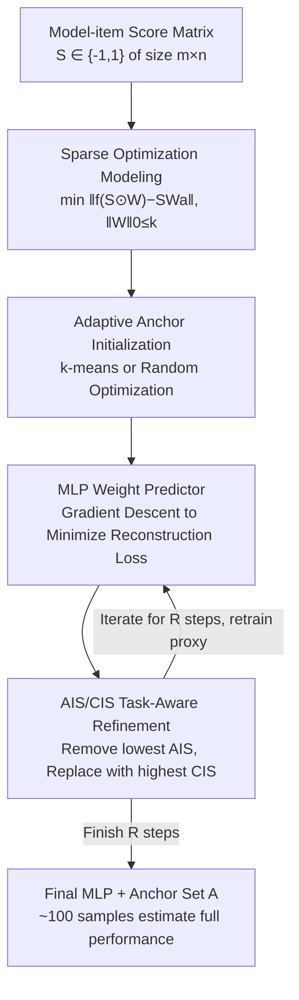

# SparseEval: Efficient Evaluation of Large Language Models by Sparse Optimization

**Conference**: ICLR 2026  
**OpenReview**: [https://openreview.net/forum?id=CZAzAedGSV](https://openreview.net/forum?id=CZAzAedGSV)  
**Code**: https://github.com/taolinzhang/SparseEval  
**Area**: Efficient LLM Evaluation  
**Keywords**: Efficient Evaluation, Anchor Selection, Sparse Optimization, Benchmark Subsets, Performance Prediction

## TL;DR
This paper formalizes "estimating LLM performance on an entire benchmark using a small number of samples" as a sparse optimization problem. It is the first to directly learn anchor weights using an MLP via gradient descent and iteratively replace anchors through AIS/CIS importance scores. Using only approximately 100 samples, it reduces estimation error to 1–2% while maintaining high ranking consistency (Kendall's τ).

## Background & Motivation
**Background**: As LLM scales expand, running benchmarks with thousands of samples like MMLU or HellaSwag becomes increasingly expensive. "Efficient LLM Evaluation" aims to select a small set of representative samples (anchors) to estimate the model's true performance and ranking across the full benchmark. Existing methods follow two paths: fitting item difficulty via IRT (e.g., TinyBenchmark/gp-IRT) followed by clustering, or adaptive clustering (e.g., TailoredBench) to customize subsets for each model.

**Limitations of Prior Work**: Most methods rely on **additional representations**—either prompt embeddings of items or predicted probability distributions to measure sample similarity—which are often expensive or difficult to obtain. More importantly, once anchors are selected by clustering, they remain **fixed**, and weights are assigned statically based on cluster distributions rather than being optimized end-to-end for the goal of "reconstructing full performance from a subset." Consequently, when the number of evaluated models scales to thousands, these clustering/IRT methods struggle, often exceeding 2% estimation error with 100 samples.

**Key Challenge**: The essence of efficient evaluation is using a "weighted average of $k$ samples to approximate the full average," which is naturally an optimization problem under an $\ell_0$ sparsity constraint. Previous methods either restricted the aggregation function to be linear or decoupled point selection from weight assignment, failing to jointly solve "which points to select" and "how to weight them" within a single differentiable objective.

**Goal**: (1) Quantitatively prove the sparsity of the evaluation matrix to justify efficient evaluation; (2) optimize weights for given anchors to represent the full set; and (3) allow anchor selection to be guided by optimized weights and downstream tasks.

**Key Insight**: The authors return to the original model-item score matrix $S\in\{-1,1\}^{m\times n}$ (correct/incorrect). Spectral clustering reveals a strong diagonal block structure (intra-cluster similarity 0.72–0.89) and significant inter-cluster similarity, indicating high predictability between samples and massive information redundancy. This implies that sparsity is inherent in the matrix itself, requiring no additional embeddings.

**Core Idea**: Formulate efficient evaluation as a sparse optimization problem $\min_{W,f}\,\|f(S\odot 1_mW^\top)-SW_a\|_1\ \text{s.t.}\ \|W\|_0\le k$. Use an MLP as the aggregation function $f$, learn anchor weights via gradient descent, and iteratively refine the anchor set using importance scores based on "error-gradient" (AIS/CIS).

## Method

### Overall Architecture
SparseEval takes a large-scale model-item score matrix as input and outputs a subset $A$ containing $k$ anchors and a weight function $f$. This ensures that predicted scores from anchors approximate the true full performance $SW_a$ (where $W_a=\frac1n\mathbf 1_n$ is the uniform average vector). The process consists of two steps: adaptive initialization (via k-means or random selection) to obtain initial anchors, followed by a refinement loop: "train proxy MLP → calculate AIS/CIS → replace worst anchors → retrain." After $R$ iterations, a final MLP is trained on the selected anchors as the weight predictor.

### Key Designs

**1. Sparse Optimization Modeling: Reformulating Evaluation as a Differentiable Objective**

Instead of treating "representative sample selection" as a pure clustering problem, this work defines it as an optimization. Given sparsity $k$, a weight vector $W\in\mathbb R^n$ ($\|W\|_0\le k$) is introduced for each item. A sparse input $S'=S\odot(1_mW^\top)$ is constructed, and an aggregation function $f$ maps this to the benchmark total score. The goal is to approximate the true performance:

$$\min_{W,f}\ \big\|f(S\odot 1_mW^\top)-SW_a\big\|_1\quad\text{s.t.}\ \|W\|_0\le k.$$

This unifies existing views: if $f$ is linear, it can be absorbed into $W$, reverting to the "weighted average" approach of prior works ($\min_W\|SW-SW_a\|_1$). By using a non-linear MLP for $f$, the model can express richer "anchor-to-full" mappings. The authors use spectral clustering to empirically justify sparsity (intra-cluster similarity 0.72–0.89), proving that reconstruction from few anchors is theoretically viable.

**2. MLP Weight Predictor: End-to-End Weight Learning via Gradient Descent**

Addressing the issue of static weights, this design treats anchor predictions as MLP inputs and full performance as the regression target. The reconstruction loss is minimized end-to-end:

$$L=\frac1M\big\|f(S_{\text{train}}\odot 1_MW^\top)-S_{\text{train}}W_a\big\|^2.$$

Here $S_{\text{train}}\in\mathbb R^{M\times n}$ represents the training model scores. The MLP (4 layers) automatically learns which anchors to amplify or suppress via backpropagation. This allows SparseEval to handle large datasets (e.g., 5,000 models) where IRT and k-means struggle.

**3. Adaptive Anchor Initialization: Choosing Between k-means and Random Selection**

Based on the observation that most datasets have strong cluster structures, k-means is used by default to ensure initial anchors cover the data distribution. However, for datasets with weaker intra-cluster similarity (e.g., MMLU at 0.72), random initialization can perform better. SparseEval adopts an adaptive strategy: testing both k-means and random initialization on a validation set and selecting the superior one.

**4. AIS/CIS Task-Aware Refinement: Iterative Anchor Replacement Driven by Error and Gradients**

Initial anchors are not necessarily optimal for performance estimation. Two importance scores are constructed. First, the model-level calibration residual is calculated as $e=f(S\odot 1_mW^\top)-SW_a$. 

For each **candidate** (non-anchor) item $i$, its importance is defined by how well its "correctness pattern" $S_{:,i}$ aligns with the residual structure:

$$\text{CIS}_i=\big|(S_{:,i})^\top e\big|=\big|(S_{:,i})^\top\big(f(S\odot 1_mW^\top)-SW_a\big)\big|.$$

A high CIS indicates the item is a stable indicator of whether a model's score is over- or underestimated. For each **anchor** $i$, importance is measured by the gradient magnitude in the first layer during backpropagation:

$$\text{AIS}_i=\Big\|\frac{\partial L}{\partial S_{:,i}}\Big\|_1.$$

Refinement step: Train proxy MLP → compute AIS for anchors and CIS for candidates → remove the anchor with the lowest AIS ($i^\star$) and add the candidate with the highest CIS ($j^\star$). This is repeated for $R=10$ steps. The authors show that in a linear setting, this replacement rule does not increase reconstruction error.

### Loss & Training
The core involves the squared reconstruction loss $L$ optimized via gradient descent with a learning rate of 6e-4. The procedure follows Algorithm 1: initialize anchors → perform $R=10$ steps of AIS/CIS refinement (each with $E$ training epochs) → train the final MLP for $F$ epochs. Experiments expanded the model count from 300 (TinyBenchmark) to 5,000, using 200 models for validation/testing and the rest for training.

## Key Experimental Results

### Main Results
Evaluation across six benchmarks (ARC, GSM8K, HellaSwag, MMLU, TruthfulQA, Winogrande) comparing against Anchor Points, gp-IRT, and TailoredBench. Metrics include MAE (lower is better) and Kendall's τ (higher is better). Results shown for $k=100$:

| Dataset | Metric | SparseEval | TailoredBench | gp-IRT | Anchor Points |
|--------|------|-----------|---------------|--------|---------------|
| ARC | MAE↓ / τ↑ | **1.165** / **0.917** | 2.413 / 0.873 | 2.274 / 0.787 | 10.620 / 0.578 |
| GSM8K | MAE↓ / τ↑ | **1.619** / **0.936** | 4.203 / 0.912 | 2.424 / 0.887 | 5.295 / 0.842 |
| HellaSwag | MAE↓ / τ↑ | **0.827** / **0.918** | 1.968 / 0.876 | 1.750 / 0.783 | 2.012 / 0.889 |
| MMLU | MAE↓ / τ↑ | **0.842** / **0.908** | 2.019 / 0.862 | 2.202 / 0.829 | 7.890 / 0.764 |
| TruthfulQA | MAE↓ / τ↑ | **1.027** / **0.931** | 1.577 / 0.895 | 1.808 / 0.847 | 1.733 / 0.891 |
| Winogrande | MAE↓ / τ↑ | **1.027** / **0.897** | 3.120 / 0.788 | 1.957 / 0.725 | 3.019 / 0.810 |

SparseEval consistently achieves the lowest MAE and highest τ across all benchmarks and anchor counts (20-100), reducing error by up to 2% and increasing τ by roughly 0.1 compared to the strongest baselines.

### Ablation Study
Ablation of anchor selection strategies ($k=100$):

| Dataset | Random (MAE/τ) | k-means (MAE/τ) | SparseEval (MAE/τ) |
|--------|----------------|------------------|---------------------|
| ARC | 1.339 / 0.890 | 1.218 / 0.913 | **1.165 / 0.917** |
| GSM8K | 1.857 / 0.928 | 1.631 / 0.938 | **1.619 / 0.936** |
| MMLU | 0.850 / 0.903 | — | **0.842 / 0.908** |
| TruthfulQA | 1.204 / 0.915 | 1.058 / 0.926 | **1.027 / 0.931** |
| Winogrande | 1.104 / 0.886 | 1.104 / 0.886 | **1.027 / 0.897** |

AIS/CIS refinement further reduces error beyond initialization, confirming that refinement shifts anchors to positions more useful for downstream estimation. Architecture ablations show that MLP outperforms linear weights across all settings.

### Key Findings
- **Refinement gains depend on initialization**: For datasets with strong cluster structures, k-means is sufficient and refinement adds marginal value; for MMLU, random initialization is better, highlighting the need for adaptive initialization.
- **MLP > Linear**: Generalizing the aggregation function to an MLP is a major source of error reduction.
- **Data Robustness**: SparseEval maintains superior performance even as the proportion of training data decreases.

## Highlights & Insights
- **Optimizing Efficient Evaluation**: The core insight is that prior linear methods are special cases of $\min_{W,f}\|f(\cdot)-SW_a\|$. This allows for a unified framework using MLP and gradient descent.
- **No Extra Embeddings Required**: Operating directly on the $\{-1,1\}$ score matrix avoids the need for expensive prompt embeddings or probability distributions.
- **Residual Alignment via AIS/CIS**: Using the dot product of candidate patterns and residuals to identify informative samples provides a theoretically grounded and computationally efficient refinement rule.

## Limitations & Future Work
- **Dependence on Historic Data**: The method requires a large historic model-item score matrix, making it difficult to apply to new benchmarks with no prior data.
- **Benchmark Scope**: Validated primarily on objective multi-choice or correct/incorrect benchmarks; applicability to open-ended generation or judge-based evaluation remains unverified.
- **Theoretical Constraints**: Theoretical guarantees for refinement are currently limited to linear settings.

## Related Work & Insights
- **vs gp-IRT / TinyBenchmark**: Unlike these which fit IRT difficulty and use static weights, SparseEval learns weights end-to-end, showing clear advantages at large model scales.
- **vs TailoredBench**: While TailoredBench customizes subsets per model, SparseEval uses a unified MLP predictor, achieving lower MAE/higher τ with less per-model overhead.
- **vs Anchor Points**: SparseEval's iterative refinement allows anchors to adapt to downstream entry errors, preventing the instability seen in static clustering at high model counts.

## Rating
- **Novelty**: ⭐⭐⭐⭐ Formulates evaluation as sparse optimization and uses gradient-based MLP weight learning.
- **Experimental Thoroughness**: ⭐⭐⭐⭐ Extensive comparison across six benchmarks and multiple anchor counts, though limited to objective formats.
- **Writing Quality**: ⭐⭐⭐⭐ Clear logical progression from sparsity evidence to formal methods.
- **Value**: ⭐⭐⭐⭐ Significantly reduces evaluation costs, requiring only ~100 samples for high-accuracy estimation.

<!-- RELATED:START -->

## Related Papers

- [\[ICLR 2026\] DISCO: Diversifying Sample Condensation for Efficient Model Evaluation](disco_diversifying_sample_condensation_for_efficient_model_evaluation.md)
- [\[ICLR 2026\] Prompt and Parameter Co-Optimization for Large Language Models](prompt_and_parameter_co-optimization_for_large_language_models.md)
- [\[ICLR 2026\] Multi-turn Evaluation of Anthropomorphic Behaviours in Large Language Models](multi-turn_evaluation_of_anthropomorphic_behaviours_in_large_language_models.md)
- [\[ICLR 2026\] Don't Pass@k: A Bayesian Framework for Large Language Model Evaluation](dont_passk_a_bayesian_framework_for_large_language_model_evaluation.md)
- [\[ICLR 2026\] Fewer Battles, More Gain: An Information-Efficient Framework for Arena-based LLM Evaluation](fewer_battles_more_gain_an_information-efficient_framework_for_arena-based_llm_e.md)

<!-- RELATED:END -->
