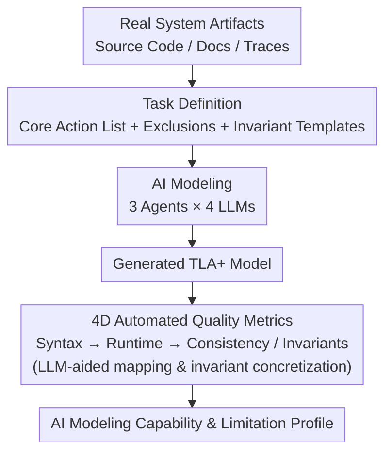

# SysMoBench: Evaluating AI on Formally Specifying Complex Real-World Systems

**Conference**: ICLR 2026  
**OpenReview**: [https://openreview.net/forum?id=SAeaTz8YoM](https://openreview.net/forum?id=SAeaTz8YoM)  
**Code**: https://github.com/specula-org/SysMoBench  
**Area**: LLM Evaluation / Formal Modeling / Agent  
**Keywords**: TLA+, Formal Specification, System Modeling, Automated Evaluation, Distributed Systems

## TL;DR
Ours proposes SysMoBench—the first benchmark to evaluate the capability of AI in automatically generating formal models (TLA+) for real-world complex systems (concurrency/distributed). By scoring with four automatically verifiable metrics (syntax, runtime, code consistency, and invariants), it is discovered that LLMs can handle small systems like spinlocks but significantly struggle with large-scale protocol implementations like Etcd Raft.

## Background & Motivation

**Background**: Formal models are the mathematical foundation for verifying the correctness of large-scale complex systems—abstracting system behavior into state variables, initial predicates, actions (next-state relations), and temporal properties, then using model checkers like TLC to exhaust the state space to prove safety/liveness. TLA+ is the de facto specification language for concurrent and distributed systems, used by companies like Amazon, Microsoft, and Google to verify critical infrastructure such as Etcd, ZooKeeper, and CosmosDB.

**Limitations of Prior Work**: Writing and maintaining these models is notoriously expensive. Unlike protocols/algorithms, system **implementation code** is filled with low-level details, is more complex, and constantly evolves. Abstracting it into a formal model often requires experts to spend months or even years. While generative AI (LLMs + agents) has recently shown potential in generating function-level specifications (pre/post-conditions, loop invariants), a natural question arises: Can AI directly write a formal model for a complete, real-world system?

**Key Challenge**: Existing work targets almost exclusively small programs; no one has systematically evaluated the capability of AI to model a **complete system**. The capabilities required for system modeling differ completely from synthesizing function pre/post-conditions—it requires the AI to understand system design (underlying protocols and algorithms), reason about safety/liveness under failures and external events, and abstract system behavior into an executable program. More critically, there are no off-the-shelf evaluation metrics: most existing TLA+ generation work only checks if TLC can run, which "running" does not imply "correctly describing the system"; comparisons against human-written reference specifications are brittle, and real-world systems often lack such low-level specifications entirely.

**Goal**: Establish a benchmark that does not rely on human judgment or reference models and can be automatically scored, answering "to what extent today's LLMs/agents can perform formal modeling for real-world complex systems."

**Key Insight**: The authors realized that the "basic requirements" of a high-quality system model can be objectively verified by tools—whether the syntax is valid (SANY), whether it is executable (TLC), whether it is consistent with real code execution traces (trace validation), and whether it satisfies the safety/liveness invariants of the system. Automating these four aspects bypasses the dependency on human judgment and reference models.

**Core Idea**: Replace human judgment and reference model comparison with four automatically verifiable quality metrics (Syntax / Runtime / Code Consistency / Invariants), constructing SysMoBench covering 11 real-world concurrent/distributed system artifacts, allowing AI formal modeling capabilities to be quantified and reproduced for the first time.

## Method

### Overall Architecture
SysMoBench decomposes "evaluating AI formal modeling" into a clear pipeline: given a real system artifact (e.g., source code, documentation, execution traces of Etcd Raft), the task definition specifies which core actions must be modeled, which details should be excluded, and provides invariant templates describing system correctness. AI (three types of agents × four LLMs) generates a TLA+ model based on this; the model is then fed into a four-dimensional automated metric evaluation sequence—first checking syntax statically, then using TLC for runtime if passed, and finally checking consistency with real code traces and invariant satisfaction for executable models. Finally, a profile of AI capabilities and limitations is summarized. Note that these four metrics are a **dependent cascade**: failing syntax results in zero scores for subsequent metrics.

### Key Designs

**1. Task Definition: Specifying "What to Build" with Core Action Lists + Invariant Templates**

Formal modeling lacks a unique correct answer; too coarse a granularity misses key behaviors, while too fine a granularity sinks into irrelevant implementation details. The primary challenge of evaluation is defining "how much modeling is enough." SysMoBench defines a task for each system artifact, explicitly listing **core actions that must be modeled** and **actions that should be excluded**. For example, in a spinlock: `lock()`/`unlock()`, atomic compare-exchange on the lock variable, and spin-waiting under contention must be modeled; implementation details like RAII guards, debug formatting, and trait implementations are excluded. Task granularity is determined by target use cases—ours targets system verification based on model checking, requiring a level of detail similar to existing verification/bug-finding work. The key is that it evaluates **behavioral consistency rather than structural equivalence**: as long as the model preserves the semantic obligations required for verification, fine-grained modeling of core actions is allowed without requiring line-by-line correspondence with a reference model. Tasks also require generating a companion TLC configuration and an invariant template describing system safety/liveness. This design frees SysMoBench from dependency on human-written reference models—the authors even hope some AI-generated models might eventually be adopted by real projects.

**2. Four-dimensional Automated Quality Metrics: Decomposing "Model Quality" into Verifiable Tasks**

This is the core contribution of SysMoBench. It decomposes the basic requirements of a high-quality system model into four interdependent metrics that can be automatically measured and normalized to percentages:

$$
\text{Syntax}=0.5\cdot S_{\text{full}} + 0.5\cdot \frac{n_c}{n_t},\quad
M_r=\frac{n_r}{n_t},\quad
M_c=\frac{n_c}{n_t},\quad
M_i=\frac{n_i}{n_t}
$$

**Syntax Correctness** uses SANY to check TLA+ syntax statically: a full model passing SANY gets full marks ($S_{\text{full}}$ as PASS/FAIL), but many AI models fail as a whole. Thus, a per-action partial score is introduced—encapsulating each action along with necessary dependencies (constant declarations, variable definitions) into small independent models for SANY checks; $n_c/n_t$ is the ratio of passing actions. A score of 100% is given for the whole model passing, 50% for only partial passes, as per-action checks ignore inter-action dependencies. Only models with 100% syntax proceed to subsequent metrics. **Runtime Correctness** $M_r$ uses TLC for bounded model checking and simulation; $n_r$ is the number of actions covered without runtime errors during state space exploration, serving as a proxy for model logical self-consistency. **Code Consistency** $M_c$ is measured via trace validation: instrumentation in the real system code collects execution traces, which are fed to TLC to see if the model can reproduce them; $n_c$ is the number of code actions covered and without consistency errors—using the number of instrumented code actions as the denominator (rather than model actions) to ensure consistency across different AI models. **Invariant Correctness** $M_i$ runs TLC for each invariant separately; $n_i$ is the number of invariants that hold within the state space. Later metrics increasingly reflect the true understanding of system behavior rather than just "compilable syntax."

**3. LLM-aided Mapping and Invariant Concretization: Automating Consistency/Invariant Checks**

Consistency and invariant checks in Metric 2 face a major hurdle: AI-generated models often use **different names** from system code and invariant templates, preventing direct alignment. SysMoBench uses a coding LLM (e.g., Claude-Sonnet-4) for two tasks: first, extracting constants/variables/actions from the generated model and mapping them to corresponding code elements in the task requirements, enabling trace validation to align model actions with log events; second, concretizing the invariant template (containing natural language, formal definitions, and TLA+ examples) for the specific model—for instance, replacing `pc`/`in cs` from the template with model-specific `status`/`locked`. The authors justify this reliance by arguing that the mapping task is simple and well-defined, generated models generally follow system naming conventions, and their trace validation technique is resilient to missing variables/actions. To address concerns about "LLM-aided bias," the authors conducted controls using "gold standard models" for Etcd Raft and spinlock—creating 10 variants by manual renaming and granularity adjustment; the gold models received full marks on all metrics, empirically validating the reliability of the metrics and mapping.

**4. 3 Representative Agents × 4 LLMs Evaluation Design: Isolating Capabilities of Different Modeling Paradigms**

To characterize different aspects of AI modeling capabilities, SysMoBench uses three agents to probe different paradigms. The **Base Modeling Agent** directly prompts the LLM with system source code and task requirements, reflecting raw LLM modeling ability; the **Code Translation Agent** (utilizing Specula) asks the LLM to translate system code to TLA+ statement-by-statement and then organize control flow, reflecting code-translation-based capacity, which benefits from rigorous synthesis via symbolic control-flow analysis and suppresses logical hallucinations via code-closeness; the **Trace Learning Agent** infers models only from system traces without looking at code, reflecting LLM-powered automata learning. Each agent is driven by four LLMs: Claude-Sonnet-4, GPT-5, Gemini-2.5-Pro, and DeepSeek-R1. Evaluation follows the HumanEval protocol—running each agent 5 times to pick the best model, with up to 3 iterative feedback loops for compilation or runtime errors, all without human intervention. This orthogonal design allows authors to separate and analyze the contributions of "different modeling paradigms" versus "different LLMs."

### A Complete Example
Using the simplest Asterinas spinlock in SysMoBench as an example: The system artifact is a piece of Rust spinlock code (`SpinLock` uses `AtomicBool` for the lock, `acquire_lock` spin-waits); the task definition requires modeling `lock()`/`unlock()`, atomic compare-exchange, and spinning, excluding RAII guard details. The AI agent generates a TLA+ model, introducing auxiliary variables `pc` (thread program counter) and `lock_state`, defining three atomic actions `StartLock`/`Acquire`/`Unlock` (each activated by a precondition and updating all variables), and writes a mutual exclusion invariant `Cardinality({t \in Threads : pc[t] = "locked"}) <= 1`. During evaluation: SANY checks syntax → TLC runs model checking for runtime coverage → trace validation uses execution traces from instrumented Rust code to measure consistency → the LLM concretizes templates for mutual exclusion, lock consistency, and deadlocks for individual TLC checks. Results show almost all LLMs achieve near-perfect scores on the spinlock; however, for Etcd Raft (2000+ lines of Go code with nested log structures), most LLMs fail even the syntax check.

## Key Experimental Results

### Main Results
Evaluation covers 11 system artifacts (Asterinas' Spinlock/Mutex/Rwmutex/Ringbuffer, Etcd Raft, Redis Raft, Xline CURP, ZooKeeper FLE, and PGo-synthesized dqueue/locksvc/raftkvs). The table below compares the Base Modeling Agent and Code Translation Agent on two representative artifacts (best model selected).

| System | Agent | LLM | Syntax | Runtime | Consistency | Invariants |
|------|-------|-----|------|--------|--------|--------|
| Spinlock | Base Modeling | Claude-Sonnet-4 | 100% | 100% | 100% | 100% |
| Spinlock | Base Modeling | GPT-5 | 100% | 100% | 80% | 100% |
| Spinlock | Code Translation | Claude-Sonnet-4 | 100% | 100% | 100% | 100% |
| Etcd Raft | Base Modeling | Claude-Sonnet-4 | 100% | 25% | 7.69% | 69.23% |
| Etcd Raft | Base Modeling | GPT-5 | 47.87% | — | — | — |
| Etcd Raft | Base Modeling | Gemini-2.5-Pro | 50% | — | — | — |
| Etcd Raft | Code Translation | Claude-Sonnet-4 | 100% | 66.67% | 15.38% | 92.31% |
| Etcd Raft | Code Translation | GPT-5 | 100% | 20% | — | — |

Key Findings: **Simple systems (spinlock) are modeled with high quality by almost all LLMs, but performance declines sharply on complex distributed protocol implementations (Etcd Raft)**—among Base Modeling Agents, only Claude-Sonnet-4 could achieve 100% syntax for Etcd Raft to proceed to further metrics, and its consistency was as low as 7.69%; other LLMs failed even syntax. The difficulty of Etcd Raft stems from three points: verbose code (containing debug tools and implementation-specific comments, causing agents to miss core logic), protocol complexity (state transition orders and conditions in Raft are far more complex than spinlocks), and abstraction difficulty (distributed logs require nested data structures, demanding precise TLA+ construction).

### Ablation Study

| Analysis Dimension | Key Findings |
|----------|----------|
| Agent Comparison | Code translation agents outperform base modeling agents on complex systems (Etcd Raft Runtime 66.67% vs 25%, Invariants 92.31% vs 69.23%), as LLMs are stronger at translation and code-closeness suppresses hallucinations. |
| Invariant Types | Only 8.3% of safety invariants are violated, compared to 41.9% of liveness invariants → LLMs have limited temporal reasoning capabilities. |
| Syntax Error Attribution | Token errors 39.8%, symbol definitions 26.1%, operators 16.2%, indentation 13.3% (DeepSeek-R1 often misuses math symbols like ∩/∀; Gemini/GPT-5 often confuse TLA+ with Python syntax). |
| Runtime Error Attribution | Configuration errors 38.0%, structural comparison 28.3%, state enumeration 20.7%, structural operations 13.0%. |
| LLM Comparison | Claude-Sonnet-4 leads in most metrics; it not only has high syntax correctness (the threshold for further metrics) but also generally outperforms in runtime/consistency/invariants once syntax is passed. |
| PGo Synthesized Systems | Base modeling agents also perform poorly → LLM understanding of machine-generated code (compiler patterns + runtime libraries, variables without semantic clues) is limited. |

Additionally, qualitative assessment shows that while AI-generated models differ structurally and in completeness from human models, they capture core system behaviors and have successfully reproduced known bugs in 5 systems, proving utility for partial correctness checking.

## Related Work & Insights

**Formal Specification Benchmarks**: Numerous benchmarks exist for evaluating LLM generation of function-level pre/post-conditions, loop invariants (VeriFast, LeetCode programs, etc.), proof generation, and verifiable code generation. However, these target small programs and essentially evaluate code understanding and specification ability rather than **system modeling**. The most relevant, TLAi+Bench, evaluates AI-generated TLA+ specifications but focuses on logic puzzles and only tests syntax and runtime correctness without system understanding; PAT-Agent and Alloy-APR also target puzzles or fixing injected errors in small tasks. SysMoBench is the first benchmark for formal modeling of real-world systems.

**Difference from General AI Benchmarks**: Unlike MMLU, ARC, and HELM, which evaluate general reasoning/knowledge, or Agent-SafetyBench for agent safety, SysMoBench focuses on the specific task of "formal modeling for large-scale complex software systems" as a foundation for system verification, currently covering traditional distributed and concurrent systems implemented in code without neural components.

## Limitations & Future Work

The authors acknowledge: The evaluation currently focuses on TLA+ (while support for Alloy and PAT was extended, current LLMs are less familiar with them, making TLA+ the practical choice); the trace learning agent was omitted due to failing runtime checks; consistency and invariant checks rely on LLM-aided mapping, which is a potential risk despite gold model validation. Regarding **training data contamination**—open-source system code used for evaluation is likely in LLM training sets. The authors argue this is intentional: similar to how human engineers learn system code before writing a formal model, the goal is to let the LLM invoke internalized system knowledge to write effective TLA+ models, and formal system-level TLA+ models for most artifacts (Asterinas locks, Redis Raft, Xline CURP) have never been made public; those in Etcd Raft/PGo repositories are protocol models, not system code models. Looking ahead, authors expect SysMoBench to inspire more advanced agents and domain-specific techniques for formal system modeling, much like SWE-bench did for software engineering.

## Related Papers
- OpenReview: https://openreview.net/forum?id=SAeaTz8YoM
- Code: https://github.com/specula-org/SysMoBench

<!-- RELATED:START -->

## Related Papers

- [\[ICLR 2026\] GDPval: Evaluating AI Model Performance on Real-World Economically Valuable Tasks](gdpval_evaluating_ai_model_performance_on_real-world_economically_valuable_tasks.md)
- [\[ICLR 2026\] CyberGym: Evaluating AI Agents' Real-World Cybersecurity Capabilities at Scale](cybergym_evaluating_ai_agents_real-world_cybersecurity_capabilities_at_scale.md)
- [\[ICLR 2026\] PACEbench: A Framework for Evaluating Practical AI Cyber-Exploitation Capabilities](pacebench_a_framework_for_evaluating_practical_ai_cyber-exploitation_capabilitie.md)
- [\[ICLR 2026\] DeepTRACE: Auditing Deep Research AI Systems for Tracking Reliability Across Citations and Evidence](deeptrace_auditing_deep_research_ai_systems_for_tracking_reliability_across_cita.md)
- [\[ICLR 2026\] Textual Bayes: Quantifying Prompt Uncertainty in LLM-based Systems](textual_bayes_quantifying_prompt_uncertainty_in_llm-based_systems.md)

<!-- RELATED:END -->
