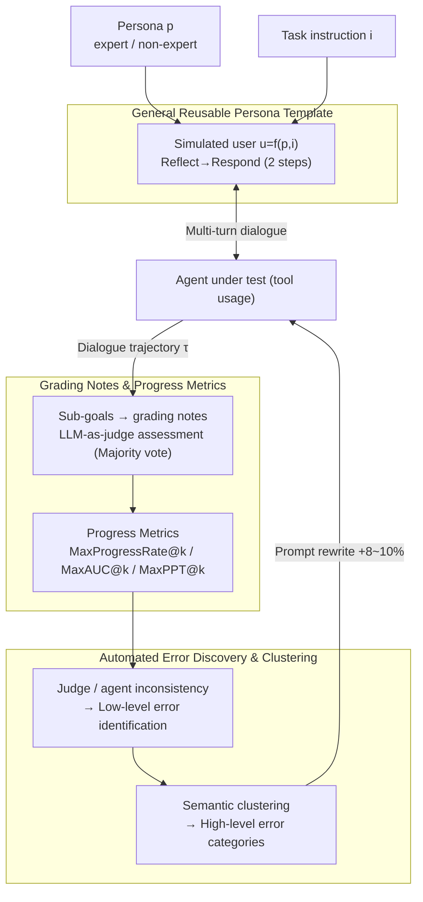

# Talk, Evaluate, Diagnose: User-aware Agent Evaluation with Automated Error Analysis

**Conference**: ICLR 2026  
**arXiv**: [2603.15483](https://arxiv.org/abs/2603.15483)  
**Code**: [GitHub](https://github.com/SAP-samples/agent-quality-inspect)  
**Area**: LLM Evaluation  
**Keywords**: Agent evaluation, User-aware, LLM-as-judge, Error analysis, Efficiency metrics  

## TL;DR

The TED (Talk, Evaluate, Diagnose) framework is proposed to achieve user-aware dynamic Agent evaluation through general and reusable expert/non-expert persona templates. It utilizes new indicators such as grading notes + LLM-as-judge + MaxProgressRate@k for fine-grained efficiency assessment, while providing actionable improvement feedback through automated error discovery and clustering. Evaluation results on τ²-bench and ToolSandbox reveal new insights into Agent performance.

## Background & Motivation

- **Background**: LLM Agents are increasingly utilized to automate various workflows, yet evaluation frameworks remain fragmented—each domain uses independent methods (database queries, regex matching, etc.) to determine success.
- **Limitations of Prior Work**: (1) Lack of a unified cross-domain evaluation method; (2) Systematic disregard for the impact of user personas on Agent performance; (3) Evaluation ends at metric reporting, lacking diagnostics and actionable improvement suggestions.
- **Key Challenge**: Agent behavior is heavily influenced by user interaction, yet user personas are not controlled during evaluation.
- **Goal**: Construct a unified, user-aware, and diagnostic Agent evaluation framework.
- **Key Insight**: Unify the three stages: Talk (user simulation), Evaluate (assessment), and Diagnose (diagnosis).
- **Core Idea**: Effective Agent evaluation requires not only correctness but also conversational quality, efficiency, and systematic error diagnosis.

## Method

### Overall Architecture

TED decomposes Agent evaluation into three serialized stages: Talk, Evaluate, and Diagnose. The framework aims to let the Agent complete multi-turn dialogues under controlled user conditions, quantifying both "progress made" and "failure causes." First, a general persona template decoupled from tasks simulates expert/non-expert users to conduct multi-turn dialogues with the Agent, producing dialogue trajectories. Second, sub-goals of the task are rewritten into natural language grading notes for LLM-as-judge to evaluate step-by-step, deriving a set of metrics characterizing "partial progress + dialogue efficiency." Finally, specific errors are automatically extracted from inconsistencies between the judge and Agent, semantically clustered into high-level error categories, and fed back into Agent prompts to form a "scoring → diagnosis → improvement" closed loop. The framework does not rely on domain-specific success logic, enabling reuse across benchmarks simply by rewriting sub-goals as grading notes.

### Key Designs

**1. General Reusable Persona Template: Detaching "Who is using" from "What is being done"**

Prior user simulations hard-coded personas with task instructions, making it difficult to determine whether poor performance stemmed from task difficulty or user behavior. TED formulates the simulated user as $u = f(p, i)$: where the persona prompt $p$ describes the user profile (expert vs. non-expert who provides vague information), and the task instruction $i$ describes the specific task. These are orthogonal. By keeping $i$ fixed and switching $p$, the independent impact of "user expertise" on the Agent is isolated. Simulated users adopt a "reflect-then-respond" strategy: first assessing if goals are met or if the Agent's previous response was adequate, then generating a reply to mimic real-world user behavior like hesitation or follow-up questions.

**2. Grading Notes and Progress Metrics: Quantifying Success from 0/1 to Partial Progress**

Benchmarks like τ²-bench only measure final success rate, treating "90% completion" and "initial failure" identically. TED reformulates all task sub-goals—specific tool calls or required response content—into natural language grading notes for LLM-as-judge evaluation. Based on this, the progress of a single dialogue $\text{progress}(i)$ is defined as the ratio of achieved grading notes. The expected maximum progress over $k$ trials constitutes $\text{MaxProgressRate@}k$. Complementary metrics include $\text{MaxAUC@}k$ (integrating the progress curve over turns) to measure how quickly goals are approached, and $\text{MaxPPT@}k$ (per-turn progress) to measure efficiency. This distinguishes "near success" from "total failure" while incorporating dialogue efficiency.

**3. Automated Error Discovery and Clustering: Diagnostics Beyond Scoring**

To provide actionable feedback, TED performs two-step error analysis. First, for sub-goals where the judge reports failure or inconsistent results across runs, an LLM extracts a specific low-level error description (e.g., "called correct tool but missed required parameters"). Second, these low-level errors are semantically clustered into high-level categories to produce an actionable improvement list. The framework also tracks judge variance vs. agent variance; high judge variance indicates ambiguous grading notes needing refinement, while high agent variance reflects instability. Injecting high-frequency error categories back into Agent prompts yields an 8–10% improvement in MaxProgressRate.

### Loss & Training

TED involves no model training and is a pure inference-stage evaluation framework. To mitigate stochasticity in judgment, the LLM-as-judge performs majority voting over multiple runs for each grading note. In experiments, gpt-4.1 served as both judge and user proxy to ensure consistent evaluation conditions across different Agents.

## Key Experimental Results

### Main Results

**τ²-bench Airline Easy (Expert | Non-expert)**

| Agent Model | MeanProg@k | MaxProg@k | pass@k |
|-----------|-----------|-----------|--------|
| gpt-4.1 | 0.95 \| 0.82 | 1.00 \| 1.00 | 1.00 \| 1.00 |
| gpt-4o | 0.79 \| 0.86 | 1.00 \| 1.00 | 1.00 \| 1.00 |
| gpt-4o-mini | 0.70 \| 0.61 | 0.90 \| 0.90 | 0.80 \| 0.80 |
| gpt-5 | 0.92 \| 0.92 | 1.00 \| 1.00 | 1.00 \| 1.00 |

### Ablation Study

| Finding | Description |
|------|------|
| Expert vs. Non-expert | Non-expert users systematically reduce MeanProg for most models. |
| Post-fix Improvement | 8-10% gain in MaxProgressRate after fixing identified errors. |
| Judge Variance Analysis | High-variance sub-goals often correspond to vaguely described grading notes. |

### Key Findings

1. User expertise systematically influences Agent performance—non-expert users lead to more dialogue turns and lower average progress.
2. MaxProgressRate@k provides finer granularity than pass@k, distinguishing between "near success" and "complete failure."
3. Automated error patterns can be directly used to improve Agent prompts, resulting in 8-10% gains.
4. Gpt-5 underperformed gpt-4o on certain baselines (ToolSandbox), suggesting that model scaling does not automatically equate to Agent capability enhancement.

## Highlights & Insights

1. The Talk-Evaluate-Diagnose closed-loop design is complete and practical.
2. The decoupling of Personas is a simple but impactful idea—isolating user variables is a prerequisite for fair evaluation.
3. The framework provides a complete loop from evaluation to diagnosis to improvement, going beyond "reporting scores."

## Limitations & Future Work

1. Construction of grading notes still requires manual effort, limiting full automation.
2. Exploration of only two personas (expert/non-expert); finer-grained user modeling remains unexplored.
3. The reliability of the Judge itself remains a systemic risk requiring further validation.

## Related Work & Insights

- AgentBoard introduced progress rates in environmental interactions; TED extends this to multi-turn dialogues.
- τ²-bench included domain-specific personas but lacked generality; TED achieves universal application.
- Insight: Agent evaluation should be integrated into the engineering loop rather than being a standalone academic exercise.

## Rating

| Dimension | Rating |
|------|------|
| Innovation | ★★★★☆ |
| Utility | ★★★★★ |
| Experimental Thoroughness | ★★★★☆ |
| Writing Quality | ★★★★★ |

<!-- RELATED:START -->

## Related Papers

- [\[ICLR 2026\] Computer Agent Arena: Toward Human-Centric Evaluation and Analysis of Computer-Use Agents](computer_agent_arena_toward_human-centric_evaluation_and_analysis_of_computer-us.md)
- [\[ACL 2026\] AJ-Bench: Benchmarking Agent-as-a-Judge for Environment-Aware Evaluation](../../ACL2026/llm_evaluation/aj-bench_benchmarking_agent-as-a-judge_for_environment-aware_evaluation.md)
- [\[ICLR 2026\] MLE-Smith: Scaling MLE Tasks with Automated Multi-agent Pipeline](mle-smith_scaling_mle_tasks_with_automated_multi-agent_pipeline.md)
- [\[ICLR 2026\] Holistic Agent Leaderboard: The Missing Infrastructure for AI Agent Evaluation](holistic_agent_leaderboard_the_missing_infrastructure_for_ai_agent_evaluation.md)
- [\[ICLR 2026\] BiasScope: Towards Automated Detection of Bias in LLM-as-a-Judge Evaluation](biasscope_towards_automated_detection_of_bias_in_llm-as-a-judge_evaluation.md)

<!-- RELATED:END -->
