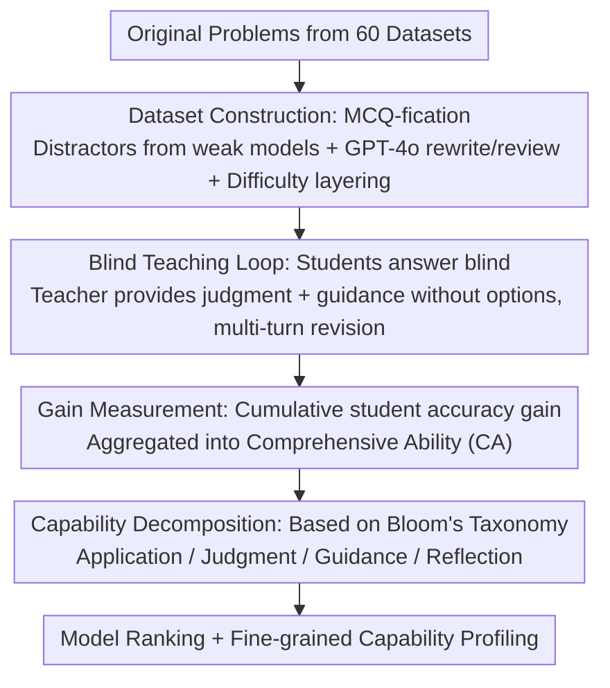

# Teach2Eval: An Interaction-Driven LLMs Evaluation Method via Teaching Effectiveness

**Conference**: ICLR 2026  
**OpenReview**: [https://openreview.net/forum?id=HreYquZ5xs](https://openreview.net/forum?id=HreYquZ5xs)  
**Code**: https://github.com/zhiqix/Teach2Eval  
**Area**: LLM Evaluation  
**Keywords**: Model Evaluation, Teaching Effectiveness, Interactive Evaluation, Data Contamination Robustness, Capability Decomposition

## TL;DR
Teach2Eval redefines "evaluating an LLM" as "tasking it to teach weaker student models." Instead of answering questions directly, the candidate model provides feedback, error correction, and multi-turn guidance without seeing the options or correct answers. The score is determined by the improvement in the students' accuracy. Tested across 33 models and 60 datasets, it achieves a Spearman correlation of 0.94–0.975 with Chatbot Arena and LiveBench, is naturally robust to data contamination, and decomposes into four orthogonal fine-grained capability dimensions.

## Background & Motivation
**Background**: Current LLM evaluations are primarily split into two categories: static, task-specific benchmarks (GSM8K, MATH, MMLU, BIG-bench, etc.) that score models based on fixed-question accuracy, and customized agent environments (code sandboxes, social simulations). Both essentially "directly score the model's performance in solving tasks/environments."

**Limitations of Prior Work**: Because scores are tightly coupled with test content, these methods are highly vulnerable to **data contamination** (leakage into training sets causing memorization), **saturation** (strong models hitting performance ceilings), and **overfitting**. Multiple-choice "option matching" is particularly prone to memorization-based scoring. Crucially, they only measure "problem-solving ability" and fail to capture the interactive reasoning capabilities of modern LLMs as agents.

**Key Challenge**: Evaluation reliability currently depends on the "invisibility" of the test items. However, items are inevitably crawled, leaked, or saturated. As long as evaluation focuses on "whether the model itself answers correctly," it remains locked in an arms race against contamination and saturation, necessitating constant dataset updates or new engineering environments.

**Goal**: To identify an **item-independent** evaluation paradigm that aligns with the interactive/agentic nature of LLMs, ensuring the evaluation signal does not originate from "whether the model itself answers correctly."

**Key Insight**: Inspired by the Feynman Technique (to teach is to understand), the authors shift the question from "how well the model solves problems" to "how well the model teaches others to solve problems." Teaching is inherently interactive, requiring error diagnosis and generalizable corrections. A teacher who has merely memorized answers cannot effectively guide a student to reason.

**Core Idea**: Use the candidate model as a "teacher" to guide a pool of weak "student" models. The **gain in students' accuracy under the teacher's guidance** serves as the teacher's capability score. The teacher never sees the options or ground-truth answers and must rely solely on diagnosing errors in the students' free-form reasoning, completely blocking the "memorized answers" shortcut.

## Method

### Overall Architecture
Teach2Eval is an indirect, interaction-driven evaluation protocol. Input consists of a candidate LLM to be evaluated (teacher $\mathcal{T}$), a fixed pool of weak student models $\{S_m\}$, and a set of datasets standardized as multiple-choice questions (MCQs). The output is the teacher's Comprehensive Ability (CA) score and four fine-grained dimensions. The pipeline follows three steps: first, converting 60 datasets into MCQs with strong distractors and difficulty layering; second, a "blind teaching" loop where students answer first, and the teacher provides judgments and guidance **without seeing the options**; third, aggregating the cumulative accuracy gains across rounds and students, decomposed into Application, Judgment, Guidance, and Reflection based on Bloom's Taxonomy.

### Key Designs

**1. Dataset Construction: Using Real Errors as Distractors for Automatic Scoring**

Directly using open-ended QA requires human or LLM-judge scoring, which is expensive and unstable. However, simple conversion to MCQs risks lowering difficulty if distractors are weak. Ours approach: for each problem, **collect distractors from the actual incorrect answers of weak models** (these represent genuine pitfalls and are naturally deceptive). These are combined with the ground truth into MCQs, which are then standardized by GPT-4o as a rewriter/reviewer. Finally, option positions are randomized to eliminate bias. Students are scored on the final MCQ for consistent, scalable automatic grading, while the teacher **never sees these options**, only the problem and the student's reasoning. This maintains the difficulty of real-world errors while preventing option-leakage shortcuts. Problems are categorized into five difficulty bands based on the accuracy of Qwen-series models.

**2. Blind Teaching Loop: Diagnosis and Guidance Without Answers**

This is the core mechanism addressing the "memorization" loophole. For each problem $d_n$ (ground truth $y_n$), the student $S_m$ first answers the MCQ blind to obtain $a_{m,n,0}$. The teacher $\mathcal{T}$ then views the problem and the complete dialogue history $H_{m,n,t-1}$ (**excluding options**) to output a judgment $j_{m,n,t}$ and guidance $g_{m,n,t}$:

$$j_{m,n,t},\, g_{m,n,t} = \mathcal{T}\big(d_n,\, H_{m,n,t-1}\big),\qquad H_{m,n,t-1} = \{a_{m,n,0}, j_{m,n,1}, g_{m,n,1}, \dots, a_{m,n,t-1}\}$$

The student updates their answer $a_{m,n,t} = S_m(d_n, a_{m,n,t-1}, g_{m,n,t})$. This "blind" setup preserves open-ended reasoning while preventing option-level leakage. The teacher must diagnose the specific errors in the student's reasoning to provide generalizable corrections. Combined with heterogeneous students and shuffled distractors, this creates a "moving target" that is difficult to overfit. Ablation 5 confirms that even if the teacher reveals the answer directly, the correlation with Teach2Eval remains significantly higher than with direct evaluation, indicating the signal rewards "Diagnosis-Guidance-Reflection" rather than just giving answers.

**3. Gain Measurement: Aggregating Student Improvement into CA**

Teaching effectiveness is reduced to a measurable scalar. The accuracy improvement $(\Delta P_t)$ for student $S_m$ at round $t$ is defined as:

$$\Delta P_t(S_m) = \frac{1}{|D|}\sum_{n=1}^{|D|}\Big(\mathbb{I}[a_{m,n,t}=y_n] - \mathbb{I}[a_{m,n,t-1}=y_n]\Big)$$

Given a budget of $T$ rounds, the average cumulative improvement across $M$ students yields the Comprehensive Ability (CA):

$$\mathrm{CA} = \frac{1}{M}\sum_{m=1}^{M}\sum_{t=1}^{T}\Delta P_t(S_m)$$

CA measures how much the teacher elevates the entire pool of weak students. This signal is orthogonal to the items themselves—it rewards the ability to teach rather than the ability to solve, which is the root of its robustness against contamination. In main experiments, the authors use performance after three rounds, as ablation shows convergence for most models by then.

**4. Capability Decomposition: Four Orthogonal Dimensions via Bloom's Taxonomy**

To provide more than just a single CA score, the authors decompose teacher capability into four progressive dimensions. **Application Ability (AA)** is the teacher's zero-shot accuracy, $\mathrm{AA}=\frac{1}{|D|}\sum_n \mathbb{I}[\mathcal{T}(d_n)=y_n]$, equivalent to traditional direct evaluation. **Judgment Ability (JA)** measures if the teacher can correctly identify student errors in the first round $J_{m,n,1}$ relative to the truth $\mathbb{I}[a_{m,n,0}=y_n]$ without seeing options. **Guidance Ability (GA)** measures the success rate of the first guidance round in fixing initially incorrect answers $D_m^{inc}$. **Reflection Ability (RA)** measures multi-turn sustained correction from the second round onwards using a multiplicative multiplier: let $C_{m,t-1}$ be correctly answered problems before round $t$, $\mathrm{Fix}_{m,t}$ be new corrections, and $\mathrm{Reg}_{m,t}$ be regressions (correct to incorrect). The round multiplier is:

$$r_{m,t} = \frac{C_{m,t-1} + \mathrm{Fix}_{m,t} - \mathrm{Reg}_{m,t}}{C_{m,t-1}} = 1 + \frac{\mathrm{Fix}_{m,t} - \mathrm{Reg}_{m,t}}{C_{m,t-1}}$$

(where $r_{m,t}=1$ if $C_{m,t-1}=0$), and $\mathrm{RA}_m=\prod_{t=2}^{T} r_{m,t}-1$. Experiments show that AA (traditional ability) has the lowest correlation with CA (0.849), while higher-order abilities (JA 0.873, RA 0.905, GA 0.936) correlate much more strongly, indicating that high-order skills determine "teaching effectiveness."

### A Complete Example
Consider the problem: "Suzanne walks four miles every three days. What is the minimum she walks in February?" Student Round 0: "February has 30 days → ten 3-day cycles → walks 10×4=40 miles, select A" (Incorrect). Teacher: "Incorrect. You miscounted the days in February; please reconsider" (Does not reveal the answer). Student Round 1: "February has at least 31 days → ten 3-day cycles → still 40, select A" (Incorrect). Teacher: "That's too many days; February is a special month." Student Round 2: "February has at least 28 days → nine 3-day cycles → walks 9×4=36 miles, select B" (Correct). Teacher Judgment: "Correct. You can simplify your steps." Throughout this, the teacher never knew the options were "A.40 B.36 C.44 D.28" and succeeded only by diagnosing the specific reasoning error (days in February).

## Key Experimental Results

### Main Results
Evaluated 33 leading LLMs and 60 datasets. The student pool includes 4 weak models (LLaMA3.2-1B, Qwen2.5-1.5B, MiniCPM-2B, InternLM2.5-1.8B). vLLM inference was used with temperature=0, max_tokens=8k, 4×H100.

| Evaluation Method | vs Chatbot Arena (Spearman) | vs Chatbot Arena (Kendall) | vs LiveBench (Spearman) | vs LiveBench (Kendall) |
| :--- | :---: | :---: | :---: | :---: |
| Direct Evaluation | 0.734 | 0.558 | 0.861 | 0.695 |
| **Teach2Eval** | **0.944** | **0.853** | **0.975** | **0.886** |

Teach2Eval's correlation with human preferences significantly outperforms direct evaluation at a lower cost. Top performers include Claude-Sonnet-4-thinking, o4-mini, and Gemini-2.5-pro. Notably, DeepSeek-R1-Distill-Qwen-14B matched 70B-class performance, while Qwen2.5-32B-Instruct, which showed high AA in direct evaluation, was revealed to have lower real-world teaching capability.

### Ablation Study

| Configuration | Key Metric | Description |
| :--- | :--- | :--- |
| Full Method | Arena 0.944 / LiveBench 0.975 | 4 students, 3 rounds of guidance |
| Drop 1 student (4 groups) | Arena 0.926–0.936; LiveBench >0.94 | Robust to specific student selection |
| Sample Convergence | Arena Spearman >0.92 / Tau >0.8 | More stable and faster convergence than direct |
| 6 rounds of guidance | Largely converged after 3 rounds | 3 rounds chosen for the main metric |
| Teacher Reveals Answer | vs Teach2Eval 0.921 > vs Direct 0.815 | Rewards diagnosis even if answer is given |

### Key Findings
- **High-order skills are key**: Correlation with CA increases with cognitive complexity (AA 0.849 < JA 0.873 < RA 0.905 < GA 0.936). Traditional evaluation only captures the lowest-order AA.
- **Robustness to Contamination (Insight 1)**: For 6 models fine-tuned on contaminated subsets, AA increased while CA often decreased. CA is not "inflated" by contamination, making it useful for detecting overfitting.
- **Judgment is a baseline**: All models exceed 50% in JA, but GA and RA show massive variance. Models like Yi-1.5-6B and InternLM2.5-7B show poor RA, where multi-turn guidance can lead to instability.
- **Scaling Laws for High-order Ability (Insight 2)**: Within model families, CA generally increases with size. However, the DeepSeek-Distill series shows fluctuations in high-order skills due to base model differences; AA may follow scaling laws even when intrinsic high-order capabilities differ.

## Highlights & Insights
- **Reconceptualizing "Evaluation" as "Teaching"**: Using student gain as the signal bypasses the contamination/saturation trap by focusing on transfer rather than self-correctness.
- **Moving Target Strategy**: Blind selection, distractors from weak models, and heterogeneous students prevent overfitting, achieving scalability without manual annotation.
- **Evaluating Strong with Weak**: By translating teaching effectiveness into measurable student gains, it achieves the difficult goal of "weak-to-strong evaluation," potentially applicable to agent collaboration or long-range planning.
- **Fine-grained Diagnosis for Training**: The AA/JA/GA/RA dimensions provide actionable signals during training, such as early warning of overfitting when AA rises but CA falls.

## Limitations & Future Work
- The student pool is fixed to four small models; if the teacher is significantly stronger or the problem is too extreme for the students, the gain signal may saturate.
- Currently relies on MCQ conversion, which limits coverage of open-ended generation, long-form writing, or multimodal tasks.
- While the authors claim low costs compared to human labels, the absolute inference cost for multi-turn, multi-student interactions is higher than single-shot direct evaluation.

## Related Work & Insights
- **vs. Static Benchmarks**: Traditional benchmarks are tightly coupled to items and prone to contamination. Teach2Eval shifts the signal to student gain, which is orthogonal to the items themselves.
- **vs. LLM-as-a-Judge / Chatbot Arena**: Judge-based methods still score answers and depend on judge preference; crowdsourced lists are slow. Teach2Eval provides an automated proxy highly consistent (0.94–0.975) with these lists.
- **vs. Teaching/Distillation**: While existing work uses teaching to improve models, Ours converts the teaching process into an evaluation signal and allows teachers to choose their own optimal strategy.

## Rating
- Novelty: ⭐⭐⭐⭐⭐ High. Redefines evaluation as teaching effectiveness.
- Experimental Thoroughness: ⭐⭐⭐⭐⭐ Extensive validation across 33 models, 60 datasets, and human benchmarks.
- Writing Quality: ⭐⭐⭐⭐ Clear logic and formulas, though some segments in the ablation section appear repetitive.
- Value: ⭐⭐⭐⭐⭐ High utility for detecting contamination and diagnosing fine-grained capabilities in the community.

<!-- RELATED:START -->

## Related Papers

- [\[ACL 2026\] Rethinking Meeting Effectiveness: A Benchmark and Framework for Temporal Fine-grained Automatic Meeting Effectiveness Evaluation](../../ACL2026/llm_evaluation/rethinking_meeting_effectiveness_a_benchmark_and_framework_for_temporal_fine-gra.md)
- [\[ACL 2026\] Teaching Language Models to Forecast Research Success Through Comparative Idea Evaluation](../../ACL2026/llm_evaluation/teaching_language_models_to_forecast_research_success_through_comparative_idea_e.md)
- [\[ICLR 2026\] Rethinking LLM Evaluation: Can We Evaluate LLMs with 200× Less Data?](rethinking_llm_evaluation_can_we_evaluate_llms_with_200_less_data.md)
- [\[ICLR 2026\] Noisy but Valid: Robust Statistical Evaluation of LLMs with Imperfect Judges](noisy_but_valid_robust_statistical_evaluation_of_llms_with_imperfect_judges.md)
- [\[ICLR 2026\] Harnessing Temporal Databases for Systematic Evaluation of Factual Time-Sensitive Question-Answering in LLMs](harnessing_temporal_databases_for_systematic_evaluation_of_factual_time-sensitiv.md)

<!-- RELATED:END -->
