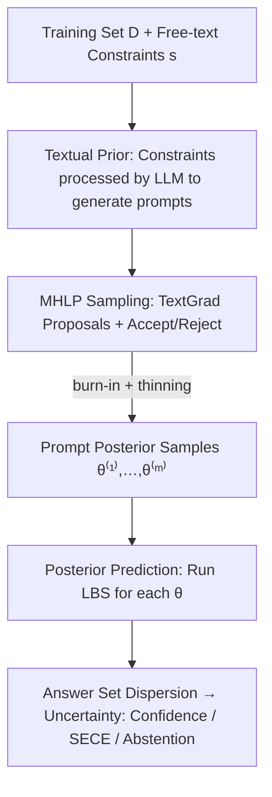

# Textual Bayes: Quantifying Prompt Uncertainty in LLM-based Systems

**Conference**: ICLR 2026  
**OpenReview**: [https://openreview.net/forum?id=VPmsAr1OTl](https://openreview.net/forum?id=VPmsAr1OTl)  
**Area**: LLM Evaluation / Uncertainty Quantification  
**Keywords**: Bayesian Inference, Prompt Uncertainty, MCMC, Calibration, Black-box LLMs

## TL;DR
This paper treats prompts in LLM systems as "textual parameters $\theta$" within a statistical model and performs Bayesian inference using a small training set. It proposes a textual MCMC algorithm, MHLP (Metropolis-Hastings through LLM Proposals), to sample from the prompt posterior. This achieves principled quantification of predictions and uncertainty for black-box LLMs, outperforming several frequentist baselines in both accuracy and calibration (ECE/SECE).

## Background & Motivation
**Background**: LLMs are increasingly deployed in high-risk scenarios like finance and healthcare, but trust remains limited due to hallucinations and jailbreak attacks. A critical step for practical adoption is reliably quantifying the uncertainty of LLM systems: the model should abstain, defer to humans, or invoke retrieval/reasoning subroutines when it "does not know." However, current UQ (uncertainty quantification) research lacks consensus and remains far from solved. Moreover, many SOTA models are black-box systems accessible only via APIs, where weight gradients are unavailable.

**Limitations of Prior Work**: LLM systems are extremely sensitive to the prompts that "glue" components together, yet prompts are often manually tuned via prompt engineering. Mainstream approaches like Chain-of-Thought (CoT) are frequentist: they generate answers using a **single fixed prompt**, completely ignoring the uncertainty inherent in "how the model should be prompted." Consequently, models become overconfident in incorrect answers—treating a specific prompt choice as a certain fact.

**Key Challenge**: Bayesian inference is a principled tool for UQ, successful in VAEs and Bayesian Neural Networks. However, these methods perform inference over continuous high-dimensional variables (like weights), relying on $p(\theta)p(D\mid\theta)$ being differentiable with respect to $\theta$. In LLM systems, the variable truly worth inferring is the **prompt**—which is discrete text. Traditional gradient-based MCMC, variational inference, and Laplace approximations are inapplicable.

**Goal**: To perform Bayesian inference on the discrete textual variable of prompts without opening the black box or modifying anything other than the prompt itself. The objective is to obtain principled uncertainty estimates for the model and downstream predictions while allowing the injection of free-text prior beliefs.

**Key Insight**: The authors observe that while textual variables are discrete and difficult to sample, they are conceptually **better suited for Bayesian modeling than neural network weights**. Humans are naturally adept at expressing prior beliefs about "what a prompt should look like" in natural language (e.g., "describe the task objective, provide solution guidelines, and specify the output structure"). Such priors can be written directly as free text. The remaining challenge is sampling from the posterior of discrete text.

**Core Idea**: Treat the prompt as a textual parameter $\theta$ and the entire LLM system as a statistical model $p(y\mid x,\theta)$. By framing "prompt optimization as an MCMC proposal distribution," the authors adapt mature prompt optimization methods (TextGrad) into the proposal step of Metropolis-Hastings, enabling sampling from the prompt posterior $p(\theta\mid D)$.

## Method

### Overall Architecture
The method is named **Textual Bayes**. The starting point is formalizing the LLM system as $y=\mathrm{LBS}(x;\theta)$, where $x$ is the input, $\theta=(\theta_1,\dots,\theta_k)$ are textual parameters consisting of multiple prompts, and $y$ is the output. Since each LLM call is stochastic, this naturally forms a statistical model $p(y\mid x,\theta)$. The Bayesian goal is not to find a single optimal prompt $\theta^*$ (Maximum Likelihood, Eq. 3), but to characterize the **posterior** $p(\theta\mid D)\propto p(\theta)\prod_i p(y_i\mid x_i,\theta)$ (Eq. 5) given a prior $p(\theta)$ and a small training set $D$. Uncertainty is then propagated to downstream outputs via the posterior predictive distribution (Eq. 6).

The pipeline consists of three steps: ① Construct the prompt prior $p(\theta)$ using free-text constraints; ② Use MHLP, a textual MCMC, to draw prompt samples $\{\theta^{(r)}\}_{r=1}^m$ from the posterior; ③ During inference, run the system for each sampled prompt to obtain an answer set $\{y^{(r)}_{\mathrm{new}}\}$, and use the **dispersion** of these answers as the system's uncertainty.

### Key Designs

**1. Textual Prior: Encoding Human Intuition as Free-text Constraints**

Bayesian inference requires specifying a prior $p(\theta)$, but prompts exist in an infinite and semantically complex discrete text space, making it impossible to write a density like a Gaussian prior. This work leverages human intuition about "what makes a good prompt" by encoding beliefs for each parameter $\theta_j$ into human-written constraint strings $s_j$ (e.g., "should describe the purpose of the LLM call, solution guidelines, and expected output structure"). An LLM then generates a prompt satisfying these constraints: $\theta_j=\mathrm{LLM}(s_j;\text{"Generate an LLM prompt satisfying the given constraints."})$ (Eq. 7). For simplicity, parameters are assumed independent $p(\theta)=\prod_{j=1}^k p(\theta_j)$, though joint constraints can be modeled. This design highlights a "textual advantage": while specifying priors for neural network weights is nearly impossible, humans can easily and naturally express priors here.

**2. MHLP: Prompt Optimization as a Metropolis-Hastings Proposal Distribution**

This is the core of the paper. To sample from $p(\theta\mid D)$, MCMC is required, but the success of MH (Alg. 1) depends on the proposal distribution $q(\theta'\mid\theta)$. Randomly perturbing characters or words in $\theta$ rarely changes semantics effectively and fails to converge. The authors observe that a good proposal should satisfy two properties of $p(\theta\mid D)\propto p(D\mid\theta)p(\theta)$: (i) the new prompt $\theta'$ should fit the prior constraints, and (ii) it should perform well on $D$. This is precisely what **iterative prompt optimization** aims to achieve. Thus, prompt optimization is formalized as a Markov update $\theta^{(t)}=\mathrm{UPDATE}(\theta^{(t-1)})$ (Eq. 4), and the proposal is set as $\theta'=\mathrm{UPDATE}(\theta)$. By analogy: Langevin MC uses gradients to exploit the differentiable structure of $p(\theta\mid D)$, while MHLP uses LLM calls to exploit its **linguistic structure**. Specifically, UPDATE is implemented via TextGrad—which backpropagates "constructive feedback" as textual gradients. The authors provide these two criteria as natural language objectives to TextGrad.

Crucially, MHLP retains the **Accept/Reject** step of MH: calculating the acceptance probability
$$\gamma=\min\!\left(1,\ \frac{g(\theta')\,q(\theta^{(t-1)}\mid\theta')}{g(\theta^{(t-1)})\,q(\theta'\mid\theta^{(t-1)})}\right),$$
where $g(\theta)=p(\theta)p(D\mid\theta)$ is the unnormalized numerator of the posterior. The move is accepted with probability $\gamma$; otherwise, the old value is kept. This step is the fundamental difference from "vanilla TextGrad." TextGrad lacks accept/reject and effectively "accepts everything," potentially absorbing modifications that are not beneficial for the initial prompt; MHLP incorporates quantitative downstream performance into the decision, equivalent to **stochastic prompt optimization with filtering**, biasing samples toward high-posterior values. Since UPDATE itself is an LLM system, $q(\theta'\mid\theta)$ is estimated using open-source models on the final LLM call of UPDATE (see Appendix for approximation details). Practical implementation uses tempered posteriors and mini-batch stochastic estimation, along with burn-in (discarding first $d$ samples) and thinning (taking every $h$-th sample) to increase diversity.

**3. Semantic ECE (SECE): Measuring Calibration for Free-text Outputs**

With posterior prompt samples, how is "calibration quality" measured? Standard ECE requires a confidence score, but in free-text tasks, correct answers have infinite variations, making confidence difficult to compute. Inspired by semantic entropy, this paper proposes **Semantic ECE**: for input $x_i$, sample $m$ outputs $y^{(1)}_i,\dots,y^{(m)}_i$, then use an LLM to cluster them semantically. The empirical probability of a cluster is the proportion of samples falling into it. The **maximum cluster probability** is taken as the "semantic confidence" for that input, which is then fed into standard ECE calculations. This extends ECE beyond closed-form answers, allowing quantitative evaluation on generative tasks like SimpleQA and QASPER.

### Mechanism Example: Propagating Uncertainty to Downstream Answers
Consider the multiple-choice question: "What color is a ripe banana?" CoT with a single fixed prompt "Answer the question. Think step-by-step." might sample 10 times and get "Yellow" every time, yielding 100% confidence—remaining confident even if it answers a different question incorrectly. Textual Bayes samples multiple semantically distinct yet reasonable prompts from the posterior (e.g., "Analyze each option before answering," "Answer cautiously as a knowledgeable expert"). Each prompt generates an answer. If 67% of the 10 prompts point to the same answer, the system treats 67% as the confidence. Prompt-level uncertainty is thus explicitly propagated to answer-level uncertainty—this is the distinction between frequentist (left) and Bayesian (right) approaches shown in Figure 1.

## Key Experimental Results

### Main Results
Evaluations were conducted on three QA tasks: AIME 2024 (closed answer, 30 questions), SimpleQA (free-text, 100 fixed questions), and QASPER (free-text with context, 100 fixed questions). Models used were black-box GPT-4o / GPT-4o-mini. Results are mean ± standard error over 10 independent runs. Four frequentist baselines were compared: Paraphrasing, System-Message (prompt perturbation methods), CoT, and TextGrad. All methods used the same $m$ system calls during inference to ensure fair compute comparison.

Accuracy (%, Tab. 1):

| Method | AIME | SimpleQA | QASPER |
|------|------|----------|--------|
| Paraphrasing | 12.6 | 43.7 | 43.7 |
| System-Message | 7.2 | 47.3 | 59.7 |
| CoT | 9.0 | 47.8 | 56.5 |
| TextGrad | 11.9 | 46.6 | 58.8 |
| **MHLP (Ours)** | **15.0** | **48.6** | **60.9** |

Calibration ECE / SECE (%, lower is better, Tab. 2):

| Method | AIME | SimpleQA | QASPER |
|------|------|----------|--------|
| Paraphrasing | 21.1 | 18.7 | 28.5 |
| System-Message | 19.7 | 18.4 | 23.9 |
| CoT | 31.5 | 18.0 | 26.2 |
| TextGrad | 27.4 | 17.7 | 21.6 |
| **MHLP (Ours)** | 22.0 | **15.4** | **17.7** |

Abstention Capability (ROC AUC for "no-context/random-context" unanswerable questions on QASPER, %, higher is better, Tab. 3): MHLP reached 77.9 on no-context and 71.7 on random-context, both being the highest and exceeding all baselines.

### Ablation Study

| Configuration | Key Difference | Explanation |
|------|---------|------|
| MHLP (Full) | With Accept/Reject | Incorporates performance into sampling; stays on high-posterior prompts. |
| TextGrad (No Accept/Reject) | "Always Accept" | Absorbs modifications that may not help initial prompts; performance and calibration drop. |

A second experiment applied MHLP to a different scenario—**Conformal Factuality**. Without ground truth labels, the unnormalized posterior is unavailable. Instead, a proxy objective $g(\theta)=\mathbb{E}_{p(y'\mid x,\theta)}[\frac{1}{|y'|}\sum_{c\in y'}F(c;\theta)]$ (Eq. 10) was used. MHLP samples different prompts to generate diverse candidate answers for frequency scoring. On the FactScore biography subset, MHLP and GPT-4 frequency scores both satisfy conformal coverage bounds (Fig. 2a), but MHLP **removes fewer statements** at the same empirical factuality level (Fig. 2b), indicating better calibration and higher information retention.

### Key Findings
- **Accept/reject is the fundamental reason MHLP outperforms TextGrad**: It functions as stochastic prompt optimization with quantitative filtering, ensuring samples are concentrated on high-posterior prompts.
- MHLP is the only method to **consistently lead in accuracy** across all datasets. Its only minor weakness is ECE on AIME (22.0, slightly behind System-Message's 19.7), but its accuracy (15.0) significantly higher, showing it doesn't "pretend to be unconfident" just to improve calibration.
- The method is **plug-and-play** for black-box LLMs: it only modifies the prompt sampling step, requires no internal access, and can be orthogonally combined with methods like semantic entropy for scoring.

## Highlights & Insights
- **Prompts as Bayesian Parameters**: This perspective translates the engineering pain point of "unprincipled prompt engineering" into a statistically grounded problem of "posterior inference over textual parameters."
- **MHLP = Prompt Optimization ∪ MCMC**: This bridge is ingenious. By using TextGrad as the proposal distribution for MH, it reuses mature optimizers while wrapping them in valid sampling semantics. Furthermore, MHLP is not limited to Bayesian inference—changing the proxy goal $g(\theta)$ allows sampling from any textual distribution (as shown in conformal factuality).
- **SECE Utility**: Semantic ECE is a reusable tool. Any work needing to measure calibration for free-text outputs can utilize the "semantic clustering → maximum cluster probability as confidence" approach.
- The argument that textual variables are "better suited for Bayesian modeling than continuous weights" is counter-intuitively convincing—humans can directly write priors in natural language, something impossible for continuous high-dimensional parameters.

## Limitations & Future Work
- **Reliance on Open-source Proxy Likelihood**: Evaluating $p(y\mid x,\theta)$ and $q(\theta'\mid\theta)$ for black-box models requires approximations using open-source "surrogate" models (Appendix A.1), which introduces error and ties the method to the availability of suitable surrogates.
- **MCMC Cost**: Sampling each chain requires burn-in/thinning, and the proposal step involves multiple LLM calls, leading to high fixed setup costs. While inference calls are aligned with baselines, the compute for chain construction is not explicitly factored into the comparison.
- **Small Evaluation Scale**: Datasets used (AIME 30, SimpleQA/QASPER 100 questions) are limited in size. The generalizability of findings needs validation on a larger scale.
- **Approximation Bias**: The impact of approximations like tempered posteriors on final uncertainty estimates is not fully explored; hyperparameter sensitivity (e.g., temperature) remains a subject for future research.

## Related Work & Insights
- **vs TextGrad**: Both use textual gradients to iteratively optimize prompts, but TextGrad produces a single point estimate. This work uses it as a proposal to "sample from the posterior," enabling UQ rather than just performance gains.
- **vs Paraphrasing / System-Message (Gao et al. 2024)**: These inject stochasticity via heuristic perturbations. This work provides principled prompt diversity from the Bayesian posterior, leading to stronger calibration and abstention.
- **vs Semantic Entropy**: These methods solve the second step of the UQ pipeline (summarizing an answer set into a score); this work solves the first step (generating a diverse answer set). They are orthogonal and combinable.
- **vs Conformal Factuality (Mohri & Hashimoto 2024)**: The original method uses fixed prompts for frequency scoring; this work uses MHLP to sample diverse prompts, removing fewer statements under the same coverage guarantee and demonstrating MHLP's general-purpose utility.

## Rating
- Novelty: ⭐⭐⭐⭐⭐ First to perform Bayesian inference in free-text prompt space; "prompt optimization as MCMC proposal" is highly original.
- Experimental Thoroughness: ⭐⭐⭐⭐ Covers accuracy, calibration, and abstention with extensions to conformal factuality, but dataset size is small and chain construction cost is not fully compared.
- Writing Quality: ⭐⭐⭐⭐⭐ Clear derivation from statistical modeling to algorithm; Figure 1 is intuitive and motivation is clear.
- Value: ⭐⭐⭐⭐⭐ Provides a plug-and-play, mathematically grounded UQ for black-box LLMs, connecting rich Bayesian literature to the LLM era.

<!-- RELATED:START -->

ob

## Related Papers

- [\[ICLR 2026\] EIP: Weighted Ranking of LLMs by Quantifying Question Difficulty](eip_weighted_ranking_of_llms_by_quantifying_question_difficulty.md)
- [\[ICML 2025\] Are LLM Belief Updates Consistent with Bayes' Theorem?](../../ICML2025/llm_evaluation/are_llm_belief_updates_consistent_with_bayes_theorem.md)
- [\[ICLR 2026\] Prompt and Parameter Co-Optimization for Large Language Models](prompt_and_parameter_co-optimization_for_large_language_models.md)
- [\[ICLR 2026\] vCache: Verified Semantic Prompt Caching](vcache_verified_semantic_prompt_caching.md)
- [\[ICLR 2026\] Complementing Self-Consistency with Cross-Model Disagreement for Uncertainty Quantification](complementing_self-consistency_with_cross-model_disagreement_for_uncertainty_qua.md)

<!-- RELATED:END -->
