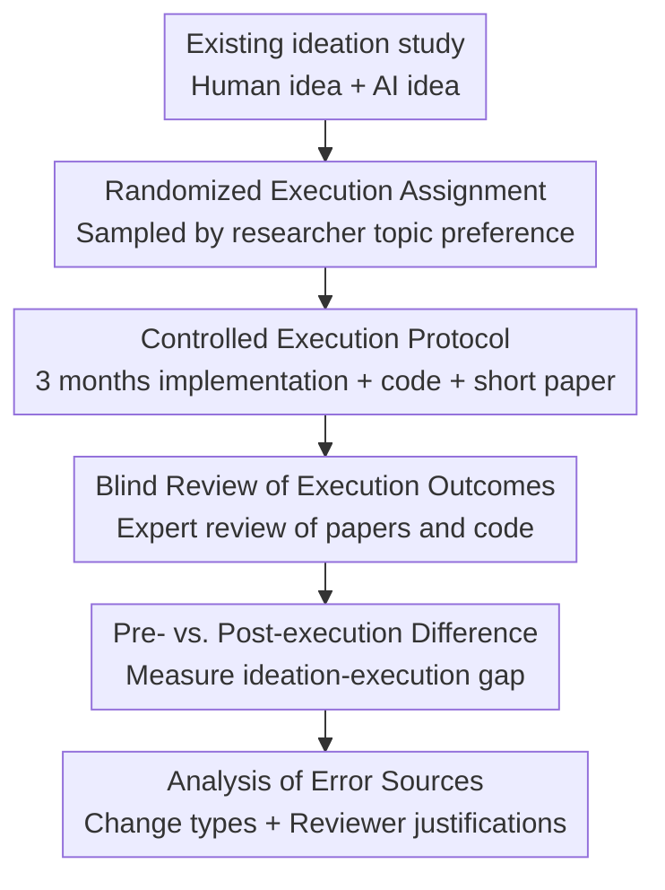

# The Ideation-Execution Gap: Execution Outcomes of LLM-Generated versus Human Research Ideas

**Conference**: ICLR 2026  
**OpenReview**: [https://openreview.net/forum?id=Fllp8l6Puy](https://openreview.net/forum?id=Fllp8l6Puy)  
**Code**: https://github.com/NoviScl/AI-Researcher  
**Area**: LLM Evaluation  
**Keywords**: Research idea evaluation, AI Scientist, Execution outcomes, Randomized controlled experiment, Expert review  

## TL;DR
This paper employs a randomized controlled experiment—involving expert execution and blind review—to verify whether research ideas generated by LLMs truly translate into superior research outcomes. It finds that while LLM ideas receive higher scores when evaluated as standalone "proposals," they suffer significantly larger drops in novelty, excitement, effectiveness, and overall quality after execution.

## Background & Motivation
**Background**: LLMs are increasingly integrated into research pipelines, with efforts to build "AI Scientists" spanning literature reviews, hypothesis generation, experimental planning, and code implementation. Many systems generate research ideas and filter them using LLM judges or small-scale human evaluations to remove schemes that appear unoriginal or infeasible.

**Limitations of Prior Work**: The core issue is that "appearing to be a good idea" is distinct from "yielding results after execution." During proposal-only evaluation, reviewers tend to assign high scores based on novel phrasing, grand motivations, and hypothesized successful experiments. However, true execution brings a prototype back to reality, where the existence of datasets, the strength of baselines, the appropriateness of metrics, and cost constraints become critical.

**Key Challenge**: LLMs may be adept at generating research concepts that seem novel at first glance, but they are not necessarily proficient at grounding those ideas within the constraints of what is executable, verifiable, and capable of producing stable empirical signals. Consequently, the ideation capability of LLMs might be overestimated by "execution-free evaluation," whereas the true measure of research quality is the execution outcome.

**Goal**: The authors aim to address a more rigorous question: If research ideas generated by LLMs and those authored by human experts are both assigned to qualified researchers for serious execution, does the performance of these two categories of ideas still differ when final papers and code are evaluated by blind experts? Specifically, the paper compares pre-execution idea scores, post-execution project scores, and the magnitude of the drop between the two.

**Key Insight**: This study reuses a set of NLP research ideas previously collected and reviewed by Si et al. (2025) as the starting point for an execution study. This allows the authors to map "pre-execution idea scores" to "post-execution project scores" one-to-one, directly quantifying the ideation-execution gap rather than conducting a simple cross-sectional comparison.

**Core Idea**: By utilizing randomized assignment, expert execution, double-blind review, and the difference between pre- and post-execution scores, the study isolates the true value of LLM ideas from the "attractiveness at the proposal stage."

## Method

### Overall Architecture
The paper does not propose a new model but designs an experimental workflow for evaluating research ideas. The authors take human and AI ideas (from Claude-3.5-Sonnet) from an existing ideation study and randomly assign them to 43 implementers with NLP research backgrounds. Each implementer completes experiments, code, and a 4-page short paper within three months. Finally, 58 expert blind reviewers evaluate the execution outputs without knowing the source of the ideas.

The key to this pipeline is treating the idea source as a randomizable treatment variable while controlling for execution quality and review standards. This allows the paper to demonstrate that systematic differences in score changes before and after execution stem from the ideas themselves, rather than from differences in implementer ability or reviewer preference.

### Key Designs
**1. Randomized Controlled Execution: Making Idea Source a Comparable Variable**

Research execution outcomes are often confounded by implementer ability, topic familiarity, personal interest, and resource investment. To address this, the authors first requested each implementer’s preference across 7 NLP topics, then randomly assigned anonymized ideas from either the Human or AI condition within those preferred topics. This avoids assigning researchers to completely unfamiliar fields and reduces self-selection bias.

This design shifts the comparison from "who writes a better-looking proposal" to "whether the idea source affects the final outcome when execution and review are both conducted by experts." Ultimately, 19 human ideas and 24 AI ideas were executed, covering NLP subfields such as bias, coding, safety, multilingualism, factuality, math, and uncertainty.

**2. Minimal Idea Modification: Evaluating Original Conceptions rather than Re-inventions**

If implementers significantly alter the methodology during the project, the final result no longer represents the quality of the original idea. Therefore, the authors required implementers to retain the original methodology, forbidding substantial algorithmic changes while allowing adjustments to experimental details (e.g., datasets, models, baselines, prompts, hyperparameters, metrics, and analysis). All changes were recorded and manually audited by the authors.

This constraint is crucial as it focuses the study on whether the idea itself can withstand execution, rather than whether an implementer can "rescue" a poor idea. Only one project was terminated and excluded because the original idea was too vague, requiring the implementer to invent the core method.

**3. Pre- vs. Post-execution Difference: Using the Gap to Control for Heterogeneity**

Directly comparing post-execution average scores is unstable due to the small sample size ($N=43$) and high natural variance in idea quality. The truly powerful metric in this paper is the difference between the execution score and the ideation score: $\text{gap}=\text{score}_{\text{execution}}-\text{score}_{\text{ideation}}$. A negative value indicates a drop in score after execution; a larger drop suggests the proposal's attractiveness failed to translate into results.

This differencing approach effectively compares each idea to its own pre-execution baseline. The study found that Human ideas experienced almost no drop in novelty, excitement, and effectiveness, whereas AI ideas dropped by approximately $1.049$, $1.760$, and $1.879$ points, respectively; the overall score also dropped by $1.976$ points. Crucially, the gap for AI ideas was significantly larger than for Human ideas, with FDR-corrected $p < 0.05$ across four shared metrics.

**4. Attribution of Review Reasons: Explaining Why Execution "Exposes" Certain Ideas**

Beyond reporting scores, the authors manually analyzed the free-text justifications from both ideation and execution reviews. Comments were categorized into ten factors, including novelty/motivation, impact, method flaws, experiment design, baseline comparison, ablation/analysis, feasibility/resource, empirical performance, generalizability/scope, and missing details/writing.

This analysis revealed the source of the gap: ideation-stage reviewers often grade based on the assumption that "if the experiments succeed," whereas execution-stage reviewers are forced to confront real data, the adequacy of baselines, metric appropriateness, whether ablations explain mechanisms, and resource costs. Execution evaluation makes visible problems often ignored in proposals, particularly the high cost of human evaluation, lack of baselines, loose experimental design, and unstable performance common in AI ideas.

### A Concrete Example
Consider an AI idea described in the paper regarding "cross-cultural role-playing prompts." The proposal planned to recruit native speakers from various linguistic and cultural backgrounds to manually evaluate model outputs. At the ideation stage, this human evaluation plan made the project seem highly contributive as it appeared to address the unreliability of automatic metrics.

However, during execution, the cost of recruiting native speakers and cultural experts proved prohibitive. The implementer substituted this with LLM-as-a-judge automatic evaluation. When the final output was blind-reviewed, experts pointed out that without human evaluation, it was difficult to determine if the output truly aligned with cultural contexts or if the LLM judge was simply misled by surface patterns. This example illustrates how the highlights of an AI idea during the ideation phase often rely on expensive or unrealistic experimental promises; once these promises are scaled back during execution, the effectiveness and excitement of the idea plummet.

### Loss & Training
This study does not involve training models or neural network loss functions. Its "training strategy" corresponds to its statistical evaluation strategy. For post-execution review scores, the authors used two aggregation methods: treating each review as an independent sample, or averaging multiple reviews per idea and treating the idea as the independent sample. The former yielded $N=181$ reviews, while the latter yielded $N=43$ ideas.

For the core gap analysis, the authors focused on four shared metrics: novelty, excitement, effectiveness, and overall. Significance tests used t-tests with FDR correction for multiple hypotheses. Control metrics included faithfulness and codebase quality to ensure no systematic differences existed in implementation fidelity or code quality between the two groups.

## Key Experimental Results

### Main Results
The main results are analyzed at two levels. The first is the scores of the final executed products: if each review is treated as an independent sample, Human ideas score significantly higher than AI ideas in excitement, effectiveness, soundness, and overall quality. However, when using the average score per idea, the differences are no longer statistically significant, indicating limited statistical power for direct mean comparisons.

| Evaluation Method | Human ideas | AI ideas | Conclusion |
| :--- | :--- | :--- | :--- |
| Pre-execution novelty | 4.912 | 5.778 | AI significantly higher, $p=0.035$ |
| Pre-execution excitement | 4.404 | 5.653 | AI significantly higher, $p=0.004$ |
| Pre-execution effectiveness | 4.833 | 6.003 | AI significantly higher, $p=0.001$ |
| Pre-execution overall | 4.596 | 5.382 | AI significantly higher, $p=0.035$ |
| Post-execution novelty | 4.903 | 4.729 | Human slightly higher (non-sig) |
| Post-execution excitement | 4.482 | 3.896 | Human higher (non-sig at idea level) |
| Post-execution effectiveness | 4.782 | 4.125 | Human higher (non-sig at idea level) |
| Post-execution overall | 3.968 | 3.406 | Human higher (non-sig at idea level) |

The second level is the core "pre- vs. post-execution gap." This metric controls for the initial variance of different ideas, providing a clearer statistical signal.

| Metric | Human gap | AI gap | $\Delta$(Human - AI) | FDR Corrected p-value |
| :--- | :--- | :--- | :--- | :--- |
| Novelty | -0.010 | -1.049 | 1.039 | 0.025 |
| Excitement | +0.078 | -1.760 | 1.835 | 0.001 |
| Effectiveness | -0.052 | -1.879 | 1.827 | 0.003 |
| Overall | -0.628 | -1.976 | 1.348 | 0.004 |

### Ablation Study
The paper lacks traditional model module ablations but performs two critical robustness and attribution analyses: checking the types of modifications made during execution and recalculating the gap after excluding 6 cases where "AI ideas originally planned for human evaluation were changed to automatic evaluation."

| Analysis Configuration | Key Metric | Description |
| :--- | :--- | :--- |
| All 43 execution projects | AI gap significantly larger across all 4 metrics | Main conclusion: AI ideas drop more significantly after execution |
| Excluding 6 AI ideas with removed human eval | Novelty gap: -1.107; Excitement gap: -1.843; Effectiveness gap: -1.921; Overall gap: -2.009 | Conclusion holds, showing the gap isn't just due to expensive human eval replacement |
| Modification statistics | Human avg 2.9 changes, AI avg 3.1 changes | Both groups modified experimental details, not core methods |
| Control metrics | Faithfulness: Hum 6.48 / AI 6.42; Code quality: Both 3.58 | Fidelity and code quality are similar, dismissing the "AI group executed poorly" explanation |

### Key Findings
- LLM ideas are indeed more likely to be rated as novel, exciting, and expectedly effective pre-execution, but this advantage vanishes—and even reverses—after execution.
- Direct comparison of post-execution scores has limited power due to the small sample size ($N=43$); comparing the pre- vs. post-execution gap is the most reliable analysis.
- The issues with AI ideas do not primarily stem from implementers altering the plans, as modification counts and faithfulness scores are similar across groups.
- Execution reviews force attention toward empirical performance, baselines, ablations, resources, and generalizability—factors frequently overlooked during proposal-only phases.
- Reviewer consensus is not low; the consistency for effectiveness reached 84.3, higher than reference levels from NeurIPS 2021 and ICLR 2024, indicating that execution-related metrics are relatively evaluatable.

## Highlights & Insights
- The strongest contribution is advancing the evaluation of AI research ideas from "reading proposals" to "evaluating outcomes." This is more convincing than designing another LLM-as-a-judge benchmark because it tests the ultimate utility of research ideas.
- The randomized controlled design is clean: neither implementers nor reviewers knew the idea sources, and ideas were randomly assigned within personal topic preferences, making the causal explanations robust.
- The gap metric is ingenious. It does not require human and AI ideas to have identical initial quality; instead, it tracks the change from proposal to paper for each idea, making it suitable for small-sample, high-variance research evaluation.
- The paper provides a reality check for the "AI Scientist" field: the optimization objective for automated ideation cannot merely be "alignment with reviewer preference" but must align with "reliability of outcomes post-execution." Future idea generators may need to incorporate execution feedback, cost estimation, and verifiability into their training or search processes.
- The study also offers insights for research peer review: many proposal scores rely on implicit assumptions (e.g., "if human eval is done"). This paper suggests these assumptions should be explicitly decomposed and evaluated during the ideation phase.

## Limitations & Future Work
- The sample size remains limited. While 43 execution projects are costly, they are insufficient for granular analysis by sub-topic, implementer experience, or idea type.
- The scope of ideas is narrow. The ideas reused in this study focused on NLP prompting; results might not generalize to domains requiring large-scale training, complex systems, theoretical proofs, or wet-lab experiments.
- The AI condition used Claude-3.5-Sonnet available at the start of the study. Newer models, tool-augmented research agents, or multi-turn revision processes might alter the gap size.
- Implementers were still human experts. The authors discuss future scaling using automated coding/research agents, but current systems lack sufficient reliability for open-ended research execution.
- Post-execution review remains subjective. While consistency was acceptable, a gap remains between short-paper reviews and actual conference acceptance, particularly regarding long-term impact which cannot be observed in a 3-month window.
- Future directions include training proxy reward models to predict the execution effectiveness of ideas or building closed-loop systems where low-cost execution feedback improves ideation.

## Related Work & Insights
- **vs Si et al. (2025)**: Si et al. evaluated whether LLM-generated research ideas are perceived as novel or interesting in the proposal phase; this paper inherits those ideas and scores but tests the actual quality of finished products, leading to more conservative conclusions.
- **vs The AI Scientist**: Automated scientist frameworks emphasize end-to-end paper generation; this paper does not build an autonomous scientist but evaluates whether the upstream quality of generated ideas can withstand expert human execution.
- **vs LLM-as-a-judge / automatic idea evaluation**: Automatic methods are cheap but tend to reward surface-level novelty and writing fluency. This paper shows that in the absence of execution, even human experts overestimate certain ideas, let alone LLM judges.
- **vs AI research outcome prediction**: Work predicting empirical outcomes attempts to estimate experiment success; this paper provides valuable supervisory signals (score changes for the same idea) to train or calibrate such predictors.
- **Key Insight**: For those using LLMs for research brainstorming, one should not simply ask for the "most novel" idea but also require the model to provide minimal executable experiments, strong baselines, failure conditions, cost estimates, and alternative evaluation paths. If these are unclear, the risk of a post-execution score drop is high.

## Rating
- **Novelty**: ⭐⭐⭐⭐⭐ Advances LLM research idea evaluation from proposal to large-scale expert execution.
- **Experimental Thoroughness**: ⭐⭐⭐⭐☆ Extremely high execution cost and rigorous design, though sample size/scope limits generalization.
- **Writing Quality**: ⭐⭐⭐⭐⭐ Clear structure with logical progression from main results to robustness checks and error analysis.
- **Value**: ⭐⭐⭐⭐⭐ Crucial warning for AI Scientists, automated ideation, and research peer review.

<!-- RELATED:START -->

## Related Papers

- [\[ICLR 2026\] AutoMetrics: Approximate Human Judgments with Automatically Generated Evaluators](autometrics_approximate_human_judgments_with_automatically_generated_evaluators.md)
- [\[ICLR 2026\] The Open Proof Corpus: A Large-Scale Study of LLM-Generated Mathematical Proofs](the_open_proof_corpus_a_large-scale_study_of_llm-generated_mathematical_proofs.md)
- [\[ICLR 2026\] Human-LLM Collaborative Feature Engineering for Tabular Learning](human-llm_collaborative_feature_engineering_for_tabular_data.md)
- [\[ICLR 2026\] Towards Personalized Deep Research: Benchmarks and Evaluations](towards_personalized_deep_research_benchmarks_and_evaluations.md)
- [\[ACL 2026\] Idiom Understanding as a Tool to Measure the Dialect Gap](../../ACL2026/llm_evaluation/idiom_understanding_as_a_tool_to_measure_the_dialect_gap.md)

<!-- RELATED:END -->
