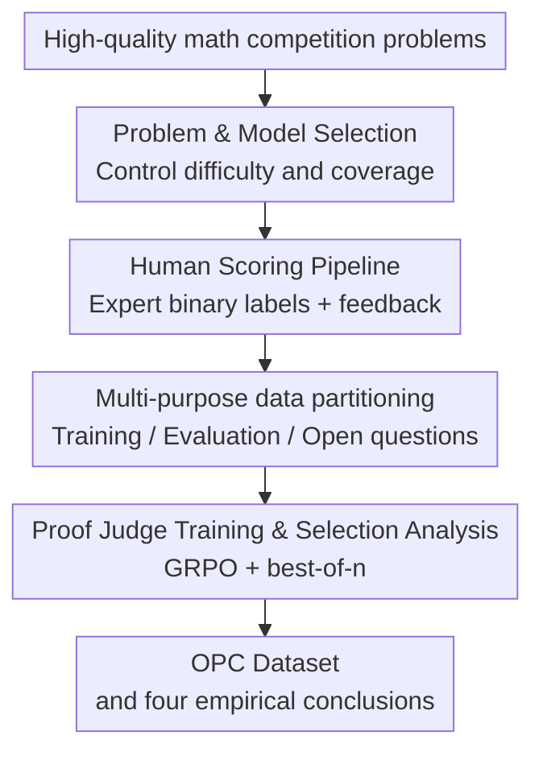

# The Open Proof Corpus: A Large-Scale Study of LLM-Generated Mathematical Proofs

**Conference**: ICLR 2026  
**OpenReview**: [https://openreview.net/forum?id=a2XmC7rHIU](https://openreview.net/forum?id=a2XmC7rHIU)  
**Paper**: [Open Proof Corpus](https://proofcorpus.ai/)  
**Code**: [https://huggingface.co/datasets/INSAIT-Institute/OPC](https://huggingface.co/datasets/INSAIT-Institute/OPC)  
**Area**: LLM Evaluation / Mathematical Reasoning / Datasets & Benchmarks  
**Keywords**: Mathematical Proof Evaluation, Human-Annotated Corpus, LLM-as-a-judge, best-of-n, Formal Proofs  

## TL;DR
This paper constructs the Open Proof Corpus (OPC), containing 5,062 human-judged LLM mathematical proofs, and uses it to systematically answer key differences between natural language and formal proofs, final answers and complete proofs, best-of-n selection, and proof judge training.

## Background & Motivation
**Background**: LLMs have made rapid progress on final-answer mathematical benchmarks such as AIME, HMMT, and MathArena, with many models now providing answers close to the level of top contestants. However, mathematical ability is not just about writing the final number; real mathematical research, education, and theorem-proving systems care more about whether a model can provide a checkable, accountable, and logically complete proof.

**Limitations of Prior Work**: Existing proof evaluations are often too small in scale, use outdated models, provide too few correct proof samples, or lack open human annotation results. More troublingly, errors in complete proofs are often subtle: an invalid inequality transformation, a heavy calculation treated as "obvious," or a non-existent reference can invalidate the final conclusion. These errors are difficult to detect relying solely on final answers or automatic parsers.

**Key Challenge**: Proof generation research requires large-scale, high-quality labels to train and analyze models, but high-quality labels can only be scored slowly by experts with competitive mathematics backgrounds. The challenge faced is not simply "collecting more problems," but how to reliably judge each proof as correct or incorrect under limited expert time while retaining sufficient information to support follow-up research.

**Goal**: The paper aims to address four things: first, build an open, large-scale LLM-generated proof corpus; second, use human judgment to answer how much stronger natural language proofs are compared to formal proofs; third, measure whether a complete proof is actually correct when the final answer is correct; and fourth, study whether LLMs as proof judges and best-of-n selectors can improve proof quality.

**Key Insight**: Instead of simplifying the proof task into a new leaderboard, the authors connect "proof generation, expert scoring, data partitioning, and downstream training and analysis" into a single pipeline. The advantage of this perspective is that the same human verification data can serve as a training set, an analytical tool, and a standard for comparing different models under the same criteria for proof correctness.

**Core Idea**: Build an open corpus, OPC, using LLM-generated proofs and expert binary judgments on competitive math problems, pushing proof generation from "is the final answer correct" to "is the complete argument sound."

## Method

### Overall Architecture
The OPC method is not to propose a new reasoning model, but to present a reproducible data construction and analysis pipeline. The input consists of problems from high-quality math competitions like IMO, USAMO, PutnamBench, and MathArena. Multiple strong LLMs generate complete natural language proofs, which are then scored by 13 experts with competitive math backgrounds through a dedicated interface. The output is a proof corpus with correctness labels, justifications, and some sentence-level annotations, which is further used for proof judge training, NL/formal proof comparison, final answer/complete proof comparison, and best-of-n analysis.

The key to this pipeline is standardization. Problems come from different competitions; models include O4-MINI, O3, GEMINI-2.5-PRO, GROK-3-MINI, QWEN3-235B-A22B, and DeepSeek-R1; and judges have different backgrounds. Without unified problem selection principles, proof generation prompts, scoring instructions, and consistency monitoring, the resulting data would easily become a collection of incomparable samples. The authors solidify these stages so that OPC can serve as a common foundation for subsequent proof generation research.

### Key Designs
**1. Problem and Model Selection: Making the corpus both difficult and analytical**

OPC problems are not randomly scraped from math websites but selected from competitions and benchmarks like IMO Shortlist, USAMO, Putnam, EGMO, Baltic Way, and MathArena. The authors filter problems using two criteria: the source must be authoritative enough, and the problem difficulty should place strong models roughly in the range where they "solve some and fail many." This setting is crucial because if problems are too easy, the corpus will consist only of correct proofs, making it impossible to train judges; if they are too hard, the corpus will consist only of failed samples, making it difficult to analyze already acquired capabilities.

Model selection serves the same goal. The paper uses strong mathematical reasoning models available at the time to generate proofs and requires models to write a complete solution rather than just a proof outline. For subsets like MathArena that originally have final answers, the authors only keep results where the final answer is correct and then check if the proof is correct; this isolates the phenomenon of "correct answer but wrong proof." For PutnamBench, authors also attach existing informal final answers to the prompt, allowing natural language proofs and formal proof systems to be compared under similar information conditions.

**2. Human Scoring Pipeline: Converting hidden proof errors into reliable labels**

The heaviest engineering load of the paper lies in scoring. The 13 reviewers mainly come from IMO participants or late-stage national team selection candidates, possessing the ability to identify subtle errors in competition proofs. Each sample contains a problem, a model proof, a binary correct/incorrect label, and a scoring justification; some also include sentence-level annotations. A few boundary samples can be marked as uncertain, accounting for less than 3% overall. This design is more suitable for training and evaluating LLM judges than a simple numeric score, as the downstream task is precisely to judge whether a proof is valid.

To reduce expert burden, the authors built a dedicated web scoring interface showing the problem, reference solution, anonymous model proof, and scoring form. After several hundred samples, the system also added "problem summaries" generated by O4-MINI, which only suggest potential flaws without directly giving a final verdict. The paper specifically checked the consistency rate between O4-MINI and humans before and after introducing summaries and found no significant change, concluding that this assistant tool improved efficiency without introducing significant bias.

**3. Multi-purpose Data Partitioning: Serving training and scientific questions simultaneously**

OPC is not just a large table but is divided into four subsets based on research questions. The MathArena subset is used to compare final answer correctness vs. complete proof correctness; the PutnamBench subset is used to compare natural language proofs with formal proofs like Lean; the Best-of-n subset lets O4-MINI generate multiple proofs for the same problem to study different selection strategies; and the Generic subset covers broader competition sources, mainly used for training, validation, and general analysis.

This partitioning avoids common confusions. For example, when training a proof judge, MathArena and PutnamBench should not be included in the training set as they serve as evaluation roles for independent conclusions. Best-of-n conclusions cannot be randomly averaged over all samples, as only some selected generations have human labels for certain problems. Dividing data usage at the construction stage ensures that the four subsequent conclusions correspond to appropriate subsets.

**4. Proof Judge Training and Selection Analysis: Turning OPC from a static dataset into an evaluation tool**

Another contribution of OPC is demonstrating how human labels can be transformed into usable models. The authors split the Generic subset into training/testing sets by problem to ensure no problem leakage, then fine-tuned R1-QWEN3-8B using GRPO. Rewards were derived from human binary labels, resulting in OPC-R1-8B: it achieved 88.1% majority-vote accuracy in proof correctness judgment, close to GEMINI-2.5-PRO and approximately 17 percentage points higher than the base R1-QWEN3-8B.

In the best-of-n analysis, the authors compared not only pass@n but also four selection strategies: discrete binary judgment, continuous 0-7 scoring, tournament-style pairwise ranking, and Swiss round-robin ranking. The Swiss method uses a Bradley-Terry model to fit pairwise comparison results into scores, with the core probability form being $P(i \text{ beats } j)=1/(1+\exp(r_j-r_i))$. Results showed that pairwise ranking is more effective than direct scoring in selecting better proofs, suggesting that "letting a model compare which of two proofs is better" might be more stable than "letting a model score a proof in isolation."

### Mechanism Example
Taking the MathArena subset as an example, a problem is first used by a model to generate a complete proof with a final answer. The authors only keep generations where the final answer is correct, then hand them to experts to see if the proof is truly valid. Suppose a model gives the correct numerical answer but writes "clearly holds" for a complex inequality transformation. Reviewers will check whether this step can actually be derived with minor reasoning; if not, it is marked as incorrect, with the error location and reason specified.

This example explains why final-answer benchmarks can be over-optimistic. Models might reach the correct answer through guessing, memorization, local patterns, or rigourless derivation, but their proofs might not be acceptable to a reader. OPC labels explicitly record these "correct answer but unreliable argument" cases, pushing the evaluation target from outcome supervision toward proof correctness.

### Loss & Training
While the paper does not propose a new loss function for proof generation, it uses GRPO when training the proof judge. The training set consists of 1,733 proof samples, and the test set contains 293 proof samples, partitioned by problem to avoid leakage. Training settings include a learning rate of $10^{-6}$, a maximum response length of 14,000 tokens, 10 rollouts per problem, a batch size of 16, and the same scoring prompt used for evaluation.

The Swiss ranking stage for best-of-n can be viewed as a selection model rather than a training objective: pairwise comparisons are performed for multiple proofs of the same problem to obtain win/loss/draw results, then a Bradley-Terry score is used to select the highest. Its cost is $O(n^2)$ comparisons, which is more expensive than discrete scoring or bracket ranking, but it yielded the strongest selection performance in the paper's experiments.

## Key Experimental Results

### Main Results
The main experiments of OPC are divided into three categories: proof generation capability, proof judge capability, and empirical answers to several key open questions. The following table retains core figures illustrating the paper's conclusions.

| Task / Subset | Metric | Representative Model / Method | Results | Key Info |
|-------------|------|-----------------|------|----------|
| OPC Scale | Human-scored proofs | OPC | 5,062 proofs / 1,010 problems | Covers 6 major LLMs, 43% of proofs correct |
| Human Consistency | Inter-rater agreement | Human judges | 90.4% | ~10% samples disagreed; estimated per-reviewer error rate ~5% |
| Proof Judge | maj@5 | GPT-5 | 90.8% | Closes in on human consistency upper bound |
| Proof Judge | maj@5 | OPC-R1-8B | 88.1% | 8B open model after OPC training approaches Gemini-Pro |
| NL vs. Formal | PutnamBench accuracy | GEMINI-2.5-PRO vs. GOEDEL-PROVER-V2 | ~83% vs. <19% | NL proofs solved ~4x more problems in this setting |
| Final Answer vs. Proof | MathArena | O3 | Final Answer 87.6%, Proof 59.5% | Correct answer does not imply correct proof |
| best-of-n | Best-of-n large subset | Rank (Swiss) | 40.0% | Significant gain compared to pass@1 of 22.7% |

Proof judge results are particularly critical, as they show that human-annotated proof corpora are not just the "endpoint" for evaluating models but can also train stronger automatic judges. GPT-5 achieved 89.3% in a single trial and 90.8% in maj@5, while OPC-R1-8B improved from a base of 70.7% pass@1 to 83.8% pass@1 and 88.1% maj@5, proving these labels have direct training value.

### Ablation Study
Strictly speaking, this paper does not have traditional model component ablation; its "ablation/analysis" primarily concerns control trials on evaluation conditions, selection strategies, and out-of-distribution generalization.

| Configuration / Contrast | Key Metric | Description |
|-------------|----------|------|
| R1-QWEN3-8B Base Judge | 70.7% pass@1 / 71.3% maj@5 | Weak ability to judge proof correctness without OPC training |
| OPC-R1-8B | 83.8% pass@1 / 88.1% maj@5 | Significant gain after using OPC labels with GRPO |
| OPC-R1-8B on undergraduate OOD | 75.0% pass@1 / 77.0% maj@5 | Still outperforms base despite no undergrad problems in training; shows transfer |
| Providing ground-truth solution to GPT-5 | 89.3% → 89.0% pass@1 | Seeing reference solutions does not significantly improve error detection; limited contamination impact |
| Best-of-n Discrete | 31.5% | Better than pass@1, but gains are limited |
| Best-of-n Continuous | 32.9% | Continuous scoring slightly higher than discrete judgment |
| Best-of-n Rank (Swiss) | 40.0% | Pairwise ranking significantly stronger than direct grading/scoring |

The core of this table is not to prove a module "dropped points," but to show that OPC can support multiple verifiable questions: whether training data is effective, whether there is still benefit out-of-distribution, whether providing official solutions changes scoring, and whether selection strategies are truly more important than sampling itself.

### Key Findings
- LLMs can already generate many correct natural language proofs, but incorrect proofs remain very common; especially on high-difficulty sources like IMO Shortlist, the average correctness of even the best models is much lower than final-answer benchmarks suggest.
- Proof judge capabilities are stronger than shown in previous small-scale studies, with GPT-5 and GROK-4 approaching human inter-rater consistency; however, self-evaluation bias exists, as most models perform worse when judging proofs they generated themselves.
- Natural language proofs currently lead formal proofs significantly, but the automatic verifiability of formal proofs remains a long-term advantage. This doesn't mean "NL proofs replace formal proofs," but rather indicates large room for bridging the two.
- Final answer correctness and complete proof correctness are misaligned. The gap for GEMINI-2.5-PRO on MathArena is small, while the gap for O3 is nearly 30 percentage points, indicating that a model's ability to "calculate a correct answer" and its ability to "write a reliable proof" are not the same.
- The gain of best-of-n comes not only from multi-sampling but also depends on the selector. Pairwise ranking is more stable than individual binary or continuous scoring, particularly Swiss ranking, which improved accuracy from 22.7% to 40.0% on a large subset.

## Highlights & Insights
- The most solid aspect of this paper is returning the task of "is the proof correct" to experts rather than substituting it with final answers, model self-evaluation, or the limited scope of formal verifiers. This choice is expensive but gives the subsequent conclusions credibility.
- The design of OPC is clever: it is not a single leaderboard but a multi-purpose experimental field. The four subsets correspond to different research questions, allowing the same corpus to answer several long-standing unresolved problems.
- The observation that "models won't admit when they can't do it" has practical significance. Out of over 1,700 incorrect solutions, models explicitly stated they could not solve the problem in only 114 cases, mostly from O3; in fields requiring verifiability like math, false confidence is more dangerous than mere low accuracy.
- LLM-as-a-judge results provide a pragmatic direction: in the future, it might not be necessary for humans to judge all proofs from scratch. Strong judges can be used first to filter, rank, and suggest problems, letting experts focus on boundary cases. OPC itself provides a starting point for training such judges.
- The ranking experiments in best-of-n are also worth porting to other high-stakes reasoning tasks. Compared to letting a model give an absolute score to a single answer, letting a model compare the relative quality of two candidates often mirrors how human peer review and competition grading actually work.

## Limitations & Future Work
- OPC problems are still mainly high-school competition level, with ~84% being high-school level; research-level math, advanced undergraduate courses, and real paper proofs are under-represented. It measures competition proof ability and should not be directly extrapolated to mathematical research automation.
- Data construction occurred before GROK-4 and GPT-5 were used as generation models; thus, these two models only participated as judges. The proof generation capabilities of the latest models need subsequent data updates for evaluation.
- While human scoring is reliable, noise still exists. The 90.4% consistency rate is high, but it also means there is still non-negligible room for subjectivity or oversight in boundary proofs, complex geometry problems, and long calculations.
- Most problems come from public competitions, so contamination risk cannot be entirely ruled out. The paper uses standard/non-standard competitions and experiments providing ground-truth solutions to show contamination is not the dominant factor, but it cannot prove its total absence.
- The $O(n^2)$ cost of Swiss ranking in best-of-n is high for large-scale deployment. Future work could study ranking that saves on comparison counts, active selection of boundary candidates, or distilling the comparator into a lightweight model.
- NL proofs are currently much stronger than formal ones, but they still rely on human or LLM judges. A truly scalable math system may need to combine the strong generation of natural language with formal verification, rather than choosing just one paradigm.

## Related Work & Insights
- **vs. final-answer benchmarks**: Benchmarks like AIME, HMMT, and MathArena look at outcomes; OPC looks at full proof correctness. The former are cheap and easy to score automatically, while the latter is closer to mathematical ability itself and can reveal "correct answer, wrong proof" scenarios.
- **vs. formal proof generation**: Formal proofs like Lean/Isabelle are automatically verifiable, but current general LLMs are still limited by formal syntax, library calls, and proof search. OPC shows that NL proofs are significantly stronger on PutnamBench while serving as a reminder of the long-term value of formal verifiability.
- **vs. Proof or Bluff / IMO Shortlist small-scale evaluations**: These works revealed vulnerabilities in LLM proofs but were limited in scale or model range. OPC's advantage lies in releasing 5,000+ human-judged proofs across multiple sources, models, and downstream analyses.
- **vs. LLM-as-a-judge research**: General LLM judges are common for open-QA, chat quality, or code evaluation; OPC pushes this paradigm into mathematical proof and provides human labels for training small models. It inspires building specialized judge corpora for specific high-difficulty evaluation tasks.
- **vs. math training datasets**: Datasets like NuminaMath, Big-Math, and DeepMath focus more on training problem-solving skills and usually lack human correctness labels for LLM-generated error proofs. OPC's value lies in containing both correct and incorrect model proofs, particularly for training verifiers, judges, and selectors.

## Rating
- Novelty: ⭐⭐⭐⭐☆ The direction of datasets and human-judged proof corpora is not entirely new, but OPC integrates scale, openness, multi-subset design, and downstream judge training very comprehensively.
- Experimental Thoroughness: ⭐⭐⭐⭐⭐ The paper covers proof generation, proof judges, formal comparison, final answer gaps, best-of-n, contamination analysis, and OOD generalization, with a solid chain of evidence.
- Writing Quality: ⭐⭐⭐⭐☆ The main thread is clear and the information density in charts is high; however, there are many appendix experiments, requiring readers to cross-reference subset definitions to fully grasp the boundaries of the conclusions.
- Value: ⭐⭐⭐⭐⭐ Direct reference value for mathematical reasoning evaluation, proof verifier training, LLM-as-a-judge, and bridging natural language and formal proofs.

<!-- RELATED:START -->

## Related Papers

- [\[ICLR 2026\] RouterArena: An Open Platform for Comprehensive Comparison of LLM Routers](routerarena_an_open_platform_for_comprehensive_comparison_of_llm_routers.md)
- [\[ICLR 2026\] Reliable Fine-Grained Evaluation of Natural Language Math Proofs](reliable_fine-grained_evaluation_of_natural_language_math_proofs.md)
- [\[ICLR 2026\] The Ideation-Execution Gap: Execution Outcomes of LLM-Generated versus Human Research Ideas](the_ideation-execution_gap_execution_outcomes_of_llm-generated_versus_human_rese.md)
- [\[ICLR 2026\] AutoMetrics: Approximate Human Judgments with Automatically Generated Evaluators](autometrics_approximate_human_judgments_with_automatically_generated_evaluators.md)
- [\[ICML 2026\] RouteJudge: An Open Platform for Reproducible and Preference-Aware LLM Routing](../../ICML2026/llm_evaluation/routejudge_an_open_platform_for_reproducible_and_preference-aware_llm_routing.md)

<!-- RELATED:END -->
