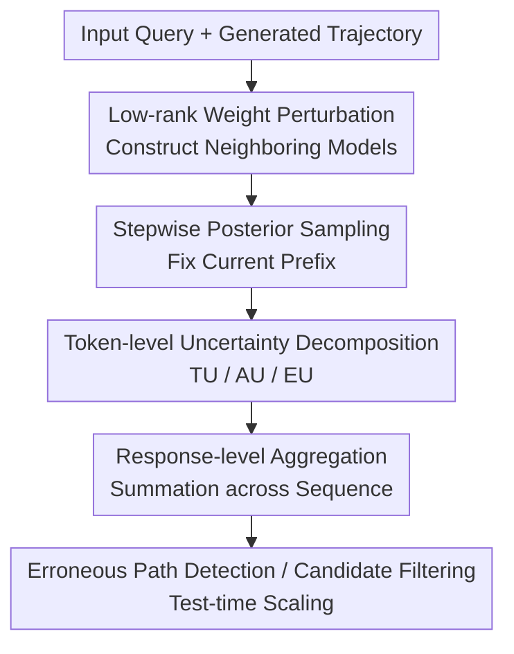

# TokUR: Token-Level Uncertainty Estimation for Large Language Model Reasoning

**Conference**: ICLR2026  
**OpenReview**: [https://openreview.net/forum?id=VHQc7wzmYv](https://openreview.net/forum?id=VHQc7wzmYv)  
**Code**: https://github.com/Wang-ML-Lab/TokUR  
**Area**: LLM Evaluation / Uncertainty Estimation / Reasoning Reliability  
**Keywords**: token-level uncertainty, LLM reasoning, Bayesian perturbation, erroneous path detection, test-time scaling  

## TL;DR
TokUR utilizes low-rank random perturbations of attention weights to construct a lightweight Bayesian model ensemble. It estimates total, aleatoric, and epistemic uncertainty for each generated token, then aggregates these signals into a response-level confidence score to identify faulty reasoning, filter high-quality answers, and assist in test-time scaling.

## Background & Motivation
**Background**: While LLMs can produce lengthy chain-of-thought (CoT) outputs in mathematical reasoning, logical deduction, and code generation, the reliability of these long-form answers remains inconsistent. In practical deployment, the issue is not just whether the model can answer correctly, but whether it can "know when it might be wrong." Specifically in multi-step reasoning, an intermediate token with a calculation error often leads the subsequent reasoning astray.

**Limitations of Prior Work**: Existing uncertainty estimation methods are generally categorized into two types. The first is query-level methods, which estimate the overall uncertainty $U(y|x)$ of an input question $x$. These identify question difficulty but fail to judge the credibility of a specific generated response $y$. The second comprises response-level empirical signals, such as log-likelihood, predictive entropy, P(True), Self-Certainty, or DeepConf. While useful, most lack a clear Bayesian decomposition and struggle to localize where errors occur during generation.

**Key Challenge**: There is a fundamental tension in uncertainty estimation for long-text reasoning: theoretically, sequence-level uncertainty requires marginalization over all possible output sequences, which is computationally infeasible due to exponential growth. If one settles for the final sequence log-probability, model preference, length bias, and genuine knowledge uncertainty become conflated, making it difficult to distinguish between "semantically incorrect" and "merely long or short."

**Goal**: The authors aim to establish an uncertainty estimation framework that requires no retraining and can be embedded into existing LLM reasoning pipelines. This framework must achieve three objectives: first, provide computable uncertainty at the token level; second, aggregate token signals into a response-level score to evaluate a complete reasoning trajectory; and third, ensure this score correlates with accuracy while serving candidate selection and test-time scaling.

**Key Insight**: The critical observation of TokUR is that LLM autoregressive generation is a token-by-token decision process, and errors often manifest near a specific key token. Rather than scoring a whole text post-hoc, it is better to fix the current prefix $y_{<t}$ and observe the consistency of "neighboring models" (constructed via lightweight weight perturbations) regarding the next token $y_t$. High disagreement among neighboring models indicates higher epistemic uncertainty at that position.

**Core Idea**: TokUR approximates the Bayesian posterior using low-rank random weight perturbations to decompose the uncertainty of long-chain reasoning into token-level estimates. These are then summed along the reasoning trajectory to derive a response-level uncertainty for quality assessment and reasoning enhancement.

## Method

### Overall Architecture
TokUR takes a reasoning problem $x$ and a candidate response $y=(y_1,\dots,y_T)$ generated by a base LLM as input. It outputs the total, aleatoric, and epistemic uncertainty scores for the response. Without training new models, TokUR adds low-rank random perturbations to the query/key weights of attention layers during inference to sample multiple neighboring models. For each token, TokUR performs Bayesian Model Averaging (BMA) using the predictive distributions of these neighboring models to calculate token-level uncertainty, which is then aggregated into a response-level score.

The core contributions include: low-rank weight perturbation, stepwise posterior sampling, token-level uncertainty decomposition, and response-level aggregation. These designs allow for approximating the posterior at a low cost, conditioning uncertainty on the actual prefix, decomposing Bayesian components, and deriving rankable scores for entire reasoning chains.

### Key Designs
**1. Low-rank Weight Perturbation: Bayesian Ensembling without Training**

TokUR addresses how to obtain parameter uncertainty without retraining large models. Full Bayesian LLMs or deep ensembles are too expensive, and LoRA-style Bayesian adaptation requires additional training. The authors apply SVD to existing weights $W_0=U\mathrm{diag}(d)V^\top$, selecting the top $r'$ columns $U'$ of left singular vectors and sampling a small noise matrix $\epsilon$ to construct perturbed weights:

$$
W = W_0 + U'\epsilon^\top, \quad \epsilon_{ij}\sim \mathcal{N}(0,\sigma_q^2).
$$

This approximates the posterior $q(\theta|\sigma_q)$ by adding isotropic Gaussian noise in a low-rank subspace. Perturbations are applied to $W^Q$ and $W^K$ in all attention layers with default settings $r'=8$, $\sigma_q=0.1$, and $M=2$ samples. This concentrates perturbations on weights influencing attention patterns, ensuring sufficient predictive variance without destroying semantic capabilities.

**2. Stepwise Posterior Sampling: Binding Uncertainty to Prefixes**

Traditional query-level uncertainty $U(y|x)$ requires marginalization over unobserved prefixes $y_{<t}$, describing the problem's openness rather than a specific answer's quality. TokUR fixes the generated prefix $y_{<t}$ and estimates only the next token's distribution:

$$
\bar p(y_t|y_{<t},x)=\mathbb{E}_{\theta\sim q(\cdot|D)}[p(y_t|y_{<t},x;\theta)].
$$

Crucially, the paper adopts stepwise posterior sampling where perturbed weights are not shared across decoding steps. The sequence probability is modeled as $\prod_t \mathbb{E}_{\theta_t}[p(y_t|x,y_{<t};\theta_t)]$. This aligns with autoregressive decoding where the context is re-evaluated at each step and prevents an early perturbation from overly coupling the entire distribution.

**3. TU/AU/EU Decomposition: Distinguishing Stochasticity from Ignorance**

TokUR calculates three types of uncertainty per token. Total uncertainty (TU) is the entropy of the averaged predictive distribution:

$$
\mathrm{TU}(y_t|y_{<t},x)=H[\bar p(y_t|y_{<t},x)].
$$

Aleatoric uncertainty (AU) is the expected entropy of individual perturbed models:

$$
\mathrm{AU}(y_t|y_{<t},x)=\mathbb{E}_{\theta\sim q(\cdot|D)}[H[p(y_t|y_{<t},x;\theta)]].
$$

Epistemic uncertainty (EU) is the difference, representing the mutual information between the token and parameters:

$$
\mathrm{EU}(y_t|y_{<t},x)=\mathrm{TU}(y_t|y_{<t},x)-\mathrm{AU}(y_t|y_{<t},x)=I(y_t;\theta|y_{<t},x).
$$

AU captures diversity inherent in the context, while EU reflects model disagreement, often highlighting knowledge gaps or calculation errors. Case studies show uncertainty spikes near erroneous tokens (e.g., miscalculation or incorrect final values).

**4. Response-level Aggregation: Transforming Hotspots into Quality Scores**

To rank candidates, TokUR accumulates token uncertainty along the sequence:

$$
\widetilde U(y|x)=\sum_{t=1}^T U(y_t|y_{<t},x),
$$

where $U$ can be TU, AU, or EU. The authors prove this is an unbiased estimate of query-level uncertainty. In practice, this score can be used to select top-$P\%$ candidates for majority voting or as an intrinsic reward for particle filtering during generation.

### Loss & Training
TokUR is training-free. Its performance depends on inference-time hyperparameters: low-rank noise rank $r'=8$, perturbation strength $\sigma_q=0.1$, and number of samples $M=2$. If $\sigma_q$ is too small, neighboring models show no divergence (low EU gain); if too large, semantic consistency breaks (lower AUROC). Length normalization is used for ranking in test-time scaling but is less effective for error detection where cumulative uncertainty serves as a signal.

## Key Experimental Results

### Main Results
Evaluations were conducted across mathematical reasoning, logical reasoning, and code generation using Llama-3.2, Llama-3.1, and Qwen-2.5.

| Task / Model | Metric | Strong Baseline | TokUR Best | Main Conclusion |
|---|---|---:|---:|---|
| MATH500 / Llama-3.2-1B | AUROC | DeepConf 71.77 | TokUR-TU 80.64 | Significant improvement in error detection for small models |
| MATH500 / Llama-3.1-8B | AUROC | Self-Certainty 76.41 | TokUR-EU 82.86 | EU effectively captures high-order errors in large models |
| DeepScaleR / Llama-3.1-8B | AUROC | DeepConf 73.05 | TokUR-TU 85.33 | TokUR advantage grows with task difficulty |
| Zebra Puzzles / Qwen-2.5-3B | AUROC | Self-Certainty 47.77 | TokUR-AU 71.66 | Generalizes well to non-math logic puzzles |

In test-time scaling, TokUR consistently outperformed log-likelihood (LL) baselines:

| Test-time scaling Setup | Pass@1 / Baseline | LL | TokUR Best | Gain |
|---|---:|---:|---:|---|
| GSM8K, Llama-3.2-1B, $N=16$ | 44.43 | 47.10 | TokUR-EU 50.38 | +3.3 over LL at low budgets |
| MATH500, Llama-3.1-8B, $N=256$ | 48.60 | 64.10 | TokUR-EU 65.32 | Maintains lead in large-scale settings |

### Key Findings
- TokUR scores correlate strongly with problem difficulty and answer correctness.
- Epistemic uncertainty (EU) is particularly valuable for mathematical reasoning as it identifies disagreements on critical logic tokens.
- Aleatoric uncertainty (AU) excels in factual evaluation, likely due to the inherent stochasticity in fact-based statements.
- Stepwise sampling outperforms joint modeling in test-time scaling efficiency and accuracy.

## Highlights & Insights
- TokUR identifies that errors in long-chain reasoning are often localized. Token-level heatmaps provide diagnostic value that global log-probability scores lack.
- The low-rank perturbation approach is a pragmatic compromise, enabling Bayesian-style estimation without the overhead of retraining or multiple large-model instances.
- Decomposing TU/AU/EU makes uncertainty interpretable, allowing for a better analysis of whether an error stems from model ignorance or context-driven stochasticity.

## Limitations & Future Work
- **Inference Cost**: Even with $M=2$, TokUR incurs extra forward pass costs and weight management overhead.
- **Global Logic Errors**: Token-level aggregation might miss holistic failures, such as misinterpreting the core problem, where no single token appears "uncertain."
- **Approximation Gap**: Low-rank Gaussian noise is an approximation of the true posterior and relies on engineering assumptions regarding perturbation strength and rank.
- **Factual vs. Reasoning Balance**: Different tasks require different uncertainty components; automated component selection remains an open question.

## Related Work & Insights
- **Comparison with LL/PE**: Log-likelihood and predictive entropy are cheap but sensitive to length bias. TokUR’s use of parameter perturbation captures epistemic signals these methods miss.
- **Comparison with Self-Certainty/DeepConf**: TokUR outperforms internal-signal baselines like DeepConf by explicitly modeling parameter uncertainty through Bayesian ensembling.
- **Comparison with Semantic Entropy**: Unlike Semantic Entropy which requires external NLI models, TokUR is a self-contained internal signal method, making it more suitable for integrated LLM services.

## Rating
- **Novelty**: ⭐⭐⭐⭐☆ (Strong application of low-rank Bayesian methods to token-level reasoning).
- **Experimental Thoroughness**: ⭐⭐⭐⭐☆ (Broad coverage of models and tasks).
- **Writing Quality**: ⭐⭐⭐⭐☆ (Clear theoretical and practical linkage).
- **Value**: ⭐⭐⭐⭐⭐ (Highly valuable for reliability, verifiers, and test-time scaling).

<!-- RELATED:START -->

## Related Papers

- [\[ICLR 2026\] Addressing Pitfalls in the Evaluation of Uncertainty Estimation Methods for Natural Language Generation](addressing_pitfalls_in_the_evaluation_of_uncertainty_estimation_methods_for_natu.md)
- [\[ICLR 2026\] Complementing Self-Consistency with Cross-Model Disagreement for Uncertainty Quantification](complementing_self-consistency_with_cross-model_disagreement_for_uncertainty_qua.md)
- [\[ICLR 2026\] When to Ensemble: Identifying Token-Level Points for Stable and Fast LLM Ensembling](when_to_ensemble_identifying_token-level_points_for_stable_and_fast_llm_ensembli.md)
- [\[ACL 2026\] Challenging the Boundaries of Reasoning: An Olympiad-Level Math Benchmark for Large Language Models](../../ACL2026/llm_evaluation/challenging_the_boundaries_of_reasoning_an_olympiad-level_math_benchmark_for_lar.md)
- [\[ICLR 2026\] Don't Pass@k: A Bayesian Framework for Large Language Model Evaluation](dont_passk_a_bayesian_framework_for_large_language_model_evaluation.md)

<!-- RELATED:END -->
