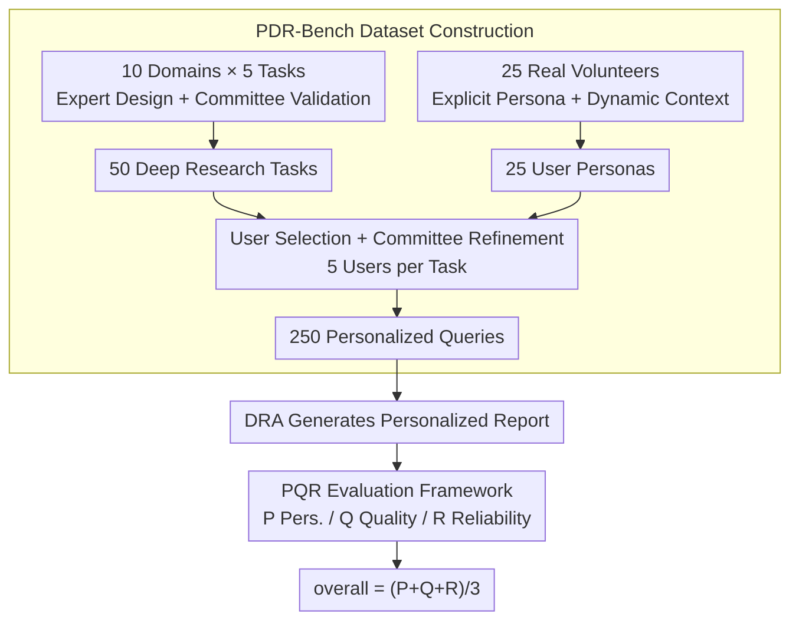

# Towards Personalized Deep Research: Benchmarks and Evaluations

**Conference**: ICLR 2026  
**OpenReview**: [https://openreview.net/forum?id=51LIRzF53v](https://openreview.net/forum?id=51LIRzF53v)  
**Code**: https://github.com/OPPO-PersonalAI/PersonalizedDeepResearchBench (Available)  
**Area**: Agent / LLM Evaluation / Deep Research  
**Keywords**: Deep Research Agents, Personalized Evaluation, Benchmark Construction, LLM-as-Judge, User Persona

## TL;DR
The authors propose **PDR-Bench**, the first benchmark for "Personalized Deep Research," consisting of 250 personalized queries generated from 50 research tasks across 10 domains paired with 25 real user personas. Accompanying this is the **PQR Evaluation Framework** (Personalization alignment P / content Quality Q / factual Reliability R). Evaluations reveal that existing deep research systems "know how to write reports but fail to personalize," and while more user information improves personalization, implicit context is significantly less effective than explicit personas.

## Background & Motivation
**Background**: Deep Research Agents (DRAs) have become capable of autonomous multi-round retrieval, tool invocation, information aggregation, and producing structured long reports. Commercial (Gemini/O3/Perplexity Deep Research) and open-source (DeerFlow, OAgents, MiroFlow, etc.) systems are proliferating, regarded as one of the agent forms with the highest deployment potential.

**Limitations of Prior Work**: Evaluation methodologies have lagged significantly. One category consists of **close-ended** benchmarks (GAIA, BrowseComp, HLE, X-Bench) that rely on synthetic tasks and unique answers, failing to reflect real-world research scenarios. Another category includes **open-ended** deep research benchmarks (DeepResearch Bench, ResearcherBench, DeepResearchGym), which focus solely on factual accuracy and comprehensiveness. Both categories assume a "good report is equally good for everyone."

**Key Challenge**: In reality, critical decisions—which car to buy, how to invest, or which PhD program to apply for—depend heavily on the user’s **needs, budget, preferences, and prior knowledge**. The same "PhD application" task should yield entirely different reports for a fresh graduate versus a professional switching careers. However, the dimension of **personalization** is a blind spot in existing DRA evaluations. Furthermore, existing personalization benchmarks (LaMP, PersonaGym, PersonaLens, PersonaFeedback) only cover narrow tasks like dialogue or recommendation, failing to reach the complexity of deep research.

**Goal**: This work formally introduces "personalization" into DRA evaluation by addressing three questions: (1) How to create task-user data that is both realistic and capable of distinguishing personalization abilities; (2) How to quantify if a report is "written for me"; and (3) How current systems perform and where the bottlenecks lie.

**Key Insight**: Personalization evaluation cannot rely on a "global correctness" standard. Instead, it requires **dynamically generating unique evaluation criteria for each user-task pair**—because the dimensions that matter to a user are themselves personalized (e.g., whether a report should emphasize part-time admission factors is crucial for a professional but irrelevant for a full-time student).

**Core Idea**: Utilizing real volunteer personas and a committee validation process to create 250 personalized queries, followed by a **three-axis, dynamic criteria, LLM-driven** PQR framework to separately score personalization alignment, content quality, and factual reliability.

## Method

### Overall Architecture
Rather than proposing a new agent, this paper introduces a **benchmark and evaluation methodology**. The method consists of two parts: the data generation pipeline (**PDR-Bench construction**) and the report scoring mechanism (**PQR evaluation framework**).

The data side involves a three-stage pipeline: First, domain experts design 50 deep research tasks (5 per domain across 10 domains), validated by a committee based on "complexity, clarity, and alignment." Simultaneously, 25 real volunteers are recruited to map their real-world information into a structured persona schema (explicit persona) and simulate daily interactions via a mobile app to accumulate memory fragments and dialogues (dynamic context). Finally, tasks are paired with users through a "user-selection + committee-refinement" protocol, selecting 5 related users per task to yield 250 personalized queries.

The evaluation side uses the PQR framework: each generated report is scored along three orthogonal axes: **P (Personalization alignment), Q (content Quality), and R (factual Reliability)**. P and Q utilize a three-stage "dynamic weights → dynamic sub-criteria → LLM scoring" process, while R utilizes a three-stage "claim extraction → web verification → FA/CC calculation" process. The final overall score is the arithmetic mean of the three axes.

### Key Designs

**1. PDR-Bench Construction: Grounding "Personalization" in Real Volunteers rather than Synthetic Personas**

Addressing the issue that existing benchmarks either lack personalization or use stereotypical personas, the authors anchor benchmark credibility in **real user data**. Tasks are drafted by domain experts (travel bloggers, financial advisors, education consultants) and filtered by a committee of PhD researchers, data scientists, and product managers based on: complexity (requiring multi-step reasoning-retrieval-analysis), clarity (clear objectives), and alignment (suitability for personalized research). A balanced set of 50 tasks $T=\{t_i\}_{i=1}^{50}$ is retained, with semantically aligned Chinese and English versions.

The innovation lies with the users: 25 volunteers of diverse ages, occupations, and life stages are recruited. After privacy training, their **real information** is mapped into a persona schema to create 25 explicit ground-truth personas $P_s$. Annotators then simulate the daily lives of these personas on an app—recording memory fragments $m_j$ (e.g., travel wishes, health goals) and dialogues $c_j$—which are processed by a management system $f_\theta$ into **dynamic personalization context** $P_{c_j}=f_\theta(m_j,c_j)$. The full persona is $P=\{(P_{s_j},P_{c_j})\}_{j=1}^{25}$. Pairings are not random; volunteers pick tasks they genuinely care about, followed by committee refinement, ensuring 5 diverse yet relevant users per task: $Q=\{(p,t_i)\mid p\in P_i,|P_i|=5\}$, with $|Q|=250$. 

**2. P-Score Personalization Alignment: Dynamically Generating Custom Criteria for Each User-Task Pair**

This is the core of the work. Personalization is subjective and multi-dimensional; using a fixed rubric would be inaccurate. The solution is a three-stage, LLM-driven dynamic scoring pipeline centered on four dimensions: GOAL alignment, CONTent alignment, PRESentation fit, and ACTIonability:

- **Stage 1 Dynamic Dimension Weights**: An LLM acts as a meta-evaluator to read the task $T$ and persona $P_s$, determining the relative importance of the four dimensions for **this specific pair**, outputting a weight vector $W=\{w_d\}$ where $\sum_{d}w_d=1$.
- **Stage 2 Fine-grained Sub-criteria Generation**: For each dimension $d$, the LLM generates specific sub-criteria $C_d^P=\{c_1,\dots,c_n\}$ conditioned on $T, P_s$ (e.g., "Does the school selection match the user's background?"). Each criterion is assigned a weight $w_{c_i}$ where $\sum_i w_{c_i}=1$.
- **Stage 3 LLM Scoring**: Another LLM evaluates the report against each sub-criterion, providing $s_{c_i}\in[0,10]$ with justifications.

The final P-Score is a two-level weighted average:

$$S_P=\sum_{d\in D_P} w_d\cdot S_d=\sum_{d\in D_P} w_d\left(\sum_{c_i\in C_d^P} w_{c_i}\cdot s_{c_i}\right)$$

This differs from "global correctness" evaluations because the criteria are **created on-the-fly** for the person and task.

**3. Q-Score Content Quality and R-Score Factual Reliability**

To ensure report quality beyond personalization, two independent axes are used. **Q (Content Quality)** is task-dependent but user-independent, evaluating Depth & Insight (DEIN), Logical Coherence (LOGC), and Clarity (CLAR) using the same dynamic weighting/criteria paradigm as P.

**R (Factual Reliability)** uses a mechanism suited for deep research rather than simple atomic fact-checking. It involves three steps: first, a Judge LLM extracts all verifiable claims and their sources into triplets $\{(c_i,idx_i,source_i)\}$; second, the Jina Reader API fetches the actual web content for each source, and a Judge LLM determines support $v_i\in\{0,1\}$; finally, two complementary metrics are calculated:

$$FA=\frac{\sum_{i=1}^{N_{cited}} v_i}{N_{cited}}\times 10,\quad CC=\frac{N_{cited}}{N_{total}}\times 10,\quad S_R=\frac{FA+CC}{2}$$

FA (Factual Accuracy) measures how many citations truly support the claims, while CC (Citation Coverage) measures how many claims are actually cited. Separating these is vital: a system might have accurate citations (high FA) but many uncited claims (low CC). The final score is $S_{overall}=(S_P+S_Q+S_R)/3$.

## Key Experimental Results

### Main Results
Evaluations were conducted on 10 systems across 3 categories under the Task w/Persona setting on 150 representative queries, using GPT-5 as the P/Q judge and GPT-5-Mini as the R judge.

| Category | Representative System | P (overall) | DEIN(Q) | FA | CC |
|------|---------|------|------|------|------|
| Commercial DRA | Gemini-2.5-Pro Deep Research | 6.58 | 4.56 | 6.16 | 8.40 |
| Commercial DRA | O3 Deep Research | 6.11 | 5.10 | 5.58 | 6.84 |
| Open-source DRA | **OAgents** (Ours) | **6.64** | **6.92** | 6.85 | 3.77 |
| Open-source DRA | MiroFlow | 5.78 | 6.65 | 6.68 | 7.29 |
| LLM + Search | Gemini-2.5-Pro w/Search | 5.53 | 4.19 | 5.41 | 6.99 |
| LLM + Search | GPT-4.1 w/Search | 4.28 | 4.07 | 5.54 | **0.10** |

> Note: The P column represents the total personalization score. Systems show varied weaknesses; OAgents' CC is low due to frequent uncited claims.

### Information Availability Gradient Experiment
Comparison of P-Score across Task Only / Task w/Context / Task w/Persona settings:

| System | Task Only | Task w/Context | Task w/Persona |
|------|-----------|----------------|----------------|
| **OAgents** (Ours) | 6.17 | 6.53 | **6.78** |
| O3 Deep Research | 5.13 | **5.48** | 5.46 |
| Gemini-2.5-Pro w/Search | 3.96 | 4.55 | **4.70** |

### Memory System Experiment
In the Task w/Context setting using Perplexity Deep Research (50 queries), testing if memory systems can distill implicit context into explicit personas:

| Method | P-Score | GOAL | CONT |
|------|---------|------|------|
| No Memory | 3.69 | 3.88 | 3.74 |
| Mem0 | 3.55 | 3.73 | 3.55 |
| Memory OS | 3.88 | 4.06 | 3.97 |
| **O-Mem** | **4.26** | **4.47** | **4.43** |
| Task w/Persona (Upper Bound) | 4.58 | 4.69 | 4.93 |

### Key Findings
- **Open-source agents exhibit stronger personalization, but reliability is a weakness**: OAgents (Ours) achieved the highest personalization scores but a factual accuracy of only 3.77. MiroFlow and DeerFlow also suffered from poor citation coverage. Commercial systems showed the opposite: slightly lower personalization but stable FA/CC.
- **Search alone is insufficient**: LLM+Search combinations lagged behind dedicated agents. GPT-4.1 w/Search had a CC near zero (0.10), indicating almost no citation for claims.
- **Personalization improves with more information, but explicit personas >> implicit context**: Scores increased from Task Only → Context → Persona. The jump for OAgents' GOAL score between Context and Persona was larger than the jump from Task Only to Context, suggesting agents struggle to extract comprehensive preferences from non-structured implicit data.
- **Memory systems show potential but remain limited**: O-Mem outperformed the No Memory baseline (4.26 vs 3.69) but still significantly lagged behind the Task w/Persona upper bound (4.58). Current memory systems mainly perform retrieval-style storage and lack the high-level reasoning needed to abstract context into a user model.

## Highlights & Insights
- **"Dynamic Criteria" is the optimal solution for personalization evaluation**: Rather than using a fixed rubric, allowing a meta-evaluator to generate weights and sub-criteria for each user-task pair addresses the inherent subjectivity of personalization. This approach is transferable to any generation task where standards vary by individual.
- **Separating FA and CC reveals distinct failure modes**: High FA/Low CC indicates accurate but unsupported citations; High CC/Low FA indicates frequent but invalid citations. Aggregating these into a single "factuality score" would mask these specific system weaknesses.
- **Framing personalization as a data availability problem**: The three-tier information gradient experiments cleanly demonstrate that the bottleneck lies in the agent's inability to extract implicit preferences, highlighting memory systems as the critical path for improvement.

## Limitations & Future Work
- **Reliance on LLM-as-Judge**: Evaluation of P/Q depends on GPT-5. Although validation with 15 human experts showed reasonable consistency (PCA 0.43), judge-specific biases and costs ($0.68/query) remain concerns.
- **Scale and Coverage**: 250 queries and 25 users represent a relatively small sample size. While demographic diversity was targeted, it may not represent a global distribution.
- **Privacy vs. Data Integrity**: Due to privacy concerns, the public version of personas is de-identified and abstracted, which likely weakens the fine-grained signals present in raw data.
- **R-Axis External Dependencies**: Fact-checking relies on Jina Reader and web availability; broken links or crawler-resistance introduce noise into FA/CC metrics.
- **Future Directions**: The authors emphasize the need for memory systems that move beyond mere retrieval toward abstracting context into dynamic, "persona-like" user models.

## Related Work & Insights
- **vs. DeepResearch Bench / ResearcherBench / DeepResearchGym**: These focus on factuality and comprehensiveness, assuming a one-size-fits-all quality. Ours is the first to formalize personalization (P-axis) while retaining Quality/Reliability (Q/R) as baselines.
- **vs. GAIA / BrowseComp / HLE / X-Bench**: These rely on synthetic tasks with single answers; Ours uses real expert tasks and volunteer personas for open-ended research.
- **vs. LaMP / PersonaGym / PersonaLens**: Existing benchmarks focus on narrow tasks like dialogue; Ours scales personalization to the complexity of multi-round retrieval and long-form reporting.
- **vs. Memory Systems (Mem0 / Memory OS)**: This work uses these systems not just as targets, but to quantify the gap between implicit context distillation and explicit personas, establishing a measurable goal (approaching the Task w/Persona upper bound).

## Rating
- Novelty: ⭐⭐⭐⭐⭐ First to formalize personalization in deep research agent evaluation; the dynamic criteria P-Score is highly original.
- Experimental Thoroughness: ⭐⭐⭐⭐ Covers 10 systems, info gradients, and memory systems, though the human-labeled subset is small.
- Writing Quality: ⭐⭐⭐⭐ Clear logic, well-defined pipeline, and effective use of formulas and diagrams.
- Value: ⭐⭐⭐⭐⭐ Addresses a significant real-world gap; the provided benchmark and framework offer lasting utility for personalized AI research.

<!-- RELATED:START -->

## Related Papers

- [\[ICLR 2026\] ResearchRubrics: A Benchmark of Prompts and Rubrics For Evaluating Deep Research Agents](researchrubrics_a_benchmark_of_prompts_and_rubrics_for_evaluating_deep_research_.md)
- [\[ICLR 2026\] DRBench: A Realistic Benchmark for Enterprise Deep Research](drbench_a_realistic_benchmark_for_enterprise_deep_research.md)
- [\[ICLR 2026\] DeepResearch Bench: A Comprehensive Benchmark for Deep Research Agents](deepresearch_bench_a_comprehensive_benchmark_for_deep_research_agents.md)
- [\[ICLR 2026\] LiveResearchBench: A Live Benchmark for User-Centric Deep Research in the Wild](liveresearchbench_a_live_benchmark_for_user-centric_deep_research_in_the_wild.md)
- [\[ICLR 2026\] Characterizing Deep Research: A Benchmark and Formal Definition](characterizing_deep_research_a_benchmark_and_formal_definition.md)

<!-- RELATED:END -->
