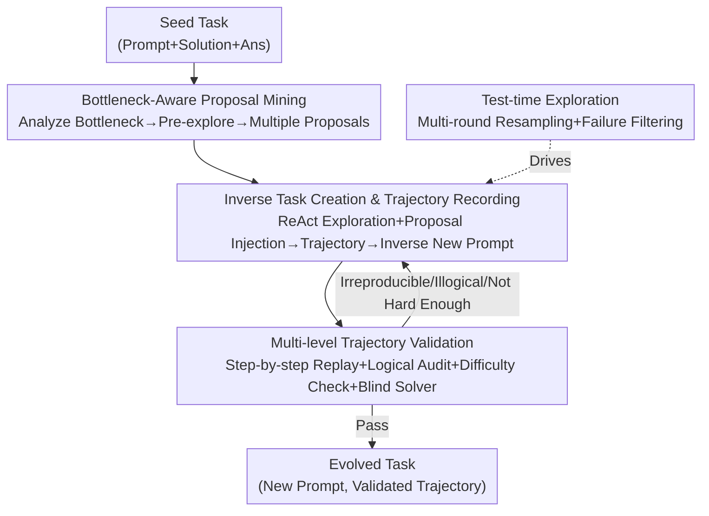

# Towards Self-Evolving Agent Benchmarks: Validatable Agent Trajectory via Test-Time Exploration

**Conference**: ICLR 2026  
**OpenReview**: [https://openreview.net/forum?id=2H03gm4Rq6](https://openreview.net/forum?id=2H03gm4Rq6)  
**Code**: https://github.com/titanwings/trace-benchmark-evolving  
**Area**: Agent / Evaluation Benchmark  
**Keywords**: Self-evolving benchmark, agent evaluation, execution trajectory validation, test-time exploration, task evolution

## TL;DR
The TRACE framework is proposed to allow agents to "freely explore and self-evolve" seed tasks from existing benchmarks into more difficult new tasks. Execution trajectories generated during evolution are treated as first-class citizens, recorded, and subjected to multi-level validation. This transforms static, manually annotated evaluation sets into dynamic evaluation systems capable of sustainable self-upgrading.

## Background & Motivation

**Background**: As the capabilities of LLM agents in reasoning, planning, and tool use soar, mainstream evaluation relies on static benchmarks carefully constructed by humans, such as GAIA, SWE-bench, and USACO, which score based on the correctness of the final answer.

**Limitations of Prior Work**: These static benchmarks are being rapidly "saturated"—top agents have already exceeded 90% on GAIA, approaching the human baseline. Once saturated, benchmarks lose the ability to differentiate advanced agents, and progress risks becoming overfitted to fixed test sets rather than true generalized intelligence. Moreover, manually recreating a batch of novel, complex, and reliable problems is extremely time-consuming and expensive.

**Key Challenge**: Two characteristics of agent tasks make "automatic intensification" particularly difficult: (1) **Procedural nature**: emphasizing multi-step interaction with dynamic real-world environments (web pages, APIs); (2) **Immense diversity**: covering everything from web navigation to software operations. This renders traditional "rule-based parameter mutation" or "simple amplification" largely ineffective: changing a keyword in a dynamic web page might make a task unsolvable, while changing "order one flight ticket" to "order three" only increases repetition without increasing cognitive and planning challenges.

**Goal**: To develop an automatic evolution paradigm that transcends surface-level rewriting and fundamentally enhances the **procedural, logical, and semantic complexity** of agent tasks while ensuring the evolved tasks remain solvable and validatable.

**Key Insight**: The authors observe that human benchmark designers do not write questions from scratch; they first explore, run through a solution, and then define the problem. Thus, the **agentic capability** of the LLM itself is treated as the evolution engine, allowing agents to explore freely in real environments and using the **execution trajectories** generated during exploration as the basis for task construction and validation.

**Core Idea**: Replace "direct rewriting of the task description" with "exploring a more difficult solution trajectory first and then inversely defining the corresponding new task." Reproducibility and logical self-consistency of the trajectory are used as credible evidence for increased difficulty.

## Method

### Overall Architecture

TRACE (Trajectory-based Validated-by-Reproducing Agent-benchmark Complexity Evolution) is a **multi-agent framework**. It takes a seed task from an existing benchmark (description + optional solution path and answer) as input and outputs a pair of `(evolved new task, validatable execution trajectory)`. Task evolution is decomposed into a pipeline performed by three agents with distinct roles collaborating end-to-end, overlaid with an outer loop of "test-time exploration" for repeated attempts and filtering.

The pipeline operates as follows: the **Evolution Proposer** first performs bottleneck analysis and pre-exploration on the seed task to produce multiple "proposals" for intensification; the **Exploration Executor** then conducts ReAct exploration in the real environment, injecting proposals along the original solution path to produce a more complex execution trajectory, and subsequently **inversely** writes a new task description; the **Trajectory Validator** performs step-by-step replay and global logical auditing of this trajectory to determine if difficulty has truly increased, while an additional "blind solver" without access to the trajectory provides a difficulty baseline. Due to the randomness of LLM sampling and the openness of evolution, the entire process is designed as a structured **test-time exploration**: failed attempts are treated as natural components of exploration and filtered by the validator, so only verified trajectories enter the final evaluation set.

### Key Designs

**1. Bottleneck-Aware Proposal Mining: Diagnose before Intensifying, rather than Blind Rewriting**

Addressing the pain point that "rule-based rewriting often makes tasks unsolvable or merely repetitive," the Evolution Proposer does not directly generate modifications. Instead, it starts with a **bottleneck-aware pre-exploration**. It analyzes the seed task and its solution trajectory to determine which capabilities (planning / reasoning / tool use) are primarily tested and where a solver is most likely to encounter intrinsic difficulties. It then probes dimensions for enhancement in the semantic space of the task—extending evidence chains, increasing tool interaction complexity, or deepening reasoning requirements. Based on this diagnosis, it synthesizes multiple **evolution proposals**, each being a clear, imperative modification instruction. Proposals are constrained by a set of "guidelines, not hard rules": encouraging divergent thinking and even allowing shifts to entirely new scenarios under semantic consistency, but strictly requiring that all modifications lead to a **deterministic and verifiable** solution. This "identify where the task gets stuck, then target the difficulty" approach ensures evolution is a purposeful structural enhancement rather than a surface perturbation.

**2. Inverse Task Creation and Trajectory Recording: Generate the Harder Solution first, then Define the Task**

This is the most counter-intuitive step of TRACE. The Exploration Executor follows the principle of **inverse problem creation**—its primary creative action is "not solving a problem, but defining one." Starting from the seed task, it follows the current solution path and performs **step-wise proposal injection** at appropriate steps: it materializes an evolution idea (adding constraints, switching tools, shifting to another capability domain) at an intermediate state to create a "fork" of increased difficulty. It then explores this branch with full tool permissions, producing a trajectory recording `reasoning / action / observation`. The paper formalizes the agent workflow as a DAG, where each node is a quadruple $S_i = (c_{i-1}, r_i, a_i, o_i)$ (context, test-time reasoning, external action, environment observation), and the trajectory distribution is written as $p_\pi(\tau)=\prod_{i=1}^{T}\pi_a(a_i\mid c_{i-1},r_i)\,p(o_i\mid a_i,c_{i-1})$. After obtaining this more complex solution trajectory, the Executor inversely derives a new task description that exactly matches this solution, ensuring the final answer is a single, deterministic, verifiable value without ambiguity. Since the trajectory and task are naturally paired, the introduced complexity remains transparent and checkable.

**3. Multi-level Trajectory Validation + Trajectory-free Blind Solver: Ensuring Reproducibility and True Difficulty**

To mitigate the risk of evolved tasks being irreproducible, logically broken, or only superficially difficult, the Trajectory Validator performs multi-level checks. Level 1 is **step-by-step replay**: re-executing tool calls for every step in the trajectory and verifying if the output matches the recorded observation to ensure reproducibility. Level 2 is **global logical auditing**: determining if the task is solvable and well-defined under the assumption that all intermediate observations are reproducible and the reasoning chain is internally consistent. Beyond trajectory validation, it uses a bottleneck assessment inspired by **theory-of-mind** to judge if the evolved task brings real difficulty improvement—given the trajectories of the seed and evolved tasks, a difficulty judge estimates which task presents a larger intrinsic bottleneck for a similarly capable solver. The most critical safeguard is the **trajectory-free blind solver**: it cannot see the generated trajectory, uses a pure ReAct paradigm, and shares the same tool permissions (multimodal, web browsing, coding) as the main Executor. If the blind solver can consistently solve the evolved task within a limited budget, the task is deemed "not difficult enough" and is rejected or sent back for re-evolution; only tasks that resist this blind solver pass, providing an **empirical difficulty lower bound** independent of the author's trajectory.

**4. Test-time Exploration as a Difficulty Engine: Investing Compute into "Creating Harder Tasks"**

Due to the randomness of LLM sampling and the openness of evolution, creating an evolved task is not a one-shot process but a structured **test-time exploration** in two layers. **Intra-run**: the Executor explores different reasoning paths and tool calls to ground a trajectory into a specific problem instance. **Inter-run**: multiple trajectories are generated and sent for validation; failed attempts are filtered out as natural components of exploration rather than pure noise. The authors thereby extend the concept of "test-time scaling" from "producing more reliable answers" to "exploring and validating harder, trajectory-based tasks"—extra compute is used not to refine an answer, but to construct a harder problem. This allows benchmark evolution itself to be a process continuously driven by compute.

### A Complete Example

Take a single-hop retrieval question from GAIA: "What is the volume in cubic meters of the fish bag calculated in the University of Leicester paper 'Can Hiccup Supply Enough Fish to Maintain a Dragon's Diet?'" (Answer: 0.1777, requires Google search + opening a PDF + extracting a scalar). The Proposer diagnoses the bottleneck as "web search + document understanding." During pre-exploration, it finds the paper is full of mathematical calculations and fish data, so it proposes transforming it into a mathematical modeling problem. The Executor follows the original solution path, reads the paper, extracts mass and volume data for the fish, and injects constraints such as "optimally design a cylindrical container using 5.0 m² of metal plates, with a lifting limit of 80 kg per full container." It runs a multi-step trajectory requiring "formalizing geometric constraints → deriving the objective function $V_{\text{total}}(r)$ → using calculus to find the extremum → solving for $(r^\star, h^\star)$ under constraints," finally deriving the new question: "What is the maximum mass of fish Hiccup can transport in a single trip?" (Answer: 770.0). The Validator passes it after lightweight format checks, step-wise replay, and logical auditing. This "From Seed to Spark" evolution transitions the task from **web retrieval** directly to **math modeling + coding**, representing a transposition of capability domains rather than a surface modification like "adding another hop."

## Key Experimental Results

### Main Results

All evolution stages used a single backend, Qwen3-Coder-480B-A35B (same for Proposer / Executor / Validator, same tool permissions), with Qwen3-235B-A22B-Instruct as the auxiliary blind solver. Evaluation used a unified inspect_eval ReAct Agent (limit of 100 interaction rounds, no access to generated trajectories or validation outputs). Evolved tasks followed the original GAIA evaluation format, with Pass@1 as the metric.

Four tested models on GAIA generally showed significant performance drops after two rounds of evolution (Total Pass@1, Evo. ← Orig.):

| Model | Round 1 Total | Round 2 Total | Change (Orig. → R2) |
|------|---------------|---------------|----------------|
| DeepSeek-V3.1 | 0.247←0.418 (-0.171) | 0.188←0.418 (-0.229) | Significant Decrease |
| Gemini-2.5-flash | 0.151←0.291 (-0.140) | 0.130←0.291 (-0.161) | Significant Decrease |
| KIMI-K2 | 0.192←0.255 (-0.063) | 0.174←0.255 (-0.081) | Decrease |
| GPT-5-Mini | 0.260←0.455 (-0.213) | 0.174←0.455 (-0.281) | Major Decrease |

The most extreme case was Gemini-2.5-flash on Level 1, where Pass@1 dropped by 43.1% (0.040←0.471) after the second round of evolution. Note that when broken down by difficulty Level, some anomalous increases appeared on Level 3 (e.g., GPT-5-Mini R2 Level 3 +0.183). The authors explain that evolved tasks differ so much from original ones that they are almost independent problems; thus, they additionally reported a "Mixed" Pass@1 from combining the two rounds, which still showed a consistent overall decline.

### Corroborating Evidence for Difficulty: Synchronous Growth in Token Length

| Metric | GPT-5-Mini | KIMI-K2 |
|------|-----------|---------|
| Avg. Length (Round 1) | 4898.2←2864.5 (+2033.7) | 6609.0←3389.6 (+3219.4) |
| Avg. Length (Round 2) | 6275.7←2864.5 (+3411.2) | 8454.7←3389.6 (+5065.1) |

The **simultaneous** drop in Pass@1 and substantial increase in average answer length indicates that TRACE is not introducing noise, but truly making tasks harder, forcing models into longer and more taxing reasoning trajectories.

### Generalization to Reasoning Benchmark: AIME-2024

| Model | Round 2 Acc | Round 4 Acc | Change (Orig. → R4) |
|------|-------------|-------------|----------------|
| DeepSeek-R1-Distill-Qwen-7B | 0.4933←0.5667 | 0.3933←0.5667 (-0.1734) | Decrease |
| DeepSeek-R1-Distill-Qwen-32B | 0.6233←0.7300 | 0.5333←0.7300 (-0.1967) | Decrease |
| Qwen3-235B-A22B | 0.9033←0.9400 | 0.7167←0.9400 (-0.2233) | Major Decrease |

After four rounds of evolution, Qwen3-235B-A22B's mean accuracy dropped by 22.33% while the average token count increased by 8000+, proving that TRACE applies not only to general agent tasks but also to continuous intensification of pure reasoning benchmarks.

### Key Findings
- **"Hard Evidence" for Difficulty Increase**: The blind solver safeguard (no trajectory, same tools) ensures that tasks passing validation are indeed resistant to strong solvers. The performance drop is not achieved by introducing ambiguity or unsolvable problems.
- **Inverse Correlation between Tokens and Pass@1**: This is the most convincing signal—harder tasks lead to lower accuracy while requiring longer reasoning, which together rule out the explanation of "simply adding noise."
- **From Seed to Spark**: Evolution can spontaneously cross capability domains, such as turning a single-hop retrieval task into math modeling + coding. This significantly enhances task diversity and reasoning depth, exceeding the authors' expectations and the scope of surface-level "multi-hop" modifications.

## Highlights & Insights
- **Inverse problem creation** is the most ingenious move: redefining "task creation" as "exploring a harder solution first and then defining the task" naturally guarantees that every evolved problem is paired with an executable, reproducible solution trajectory, solving the age-old problem of ensuring solvability and validity in automatic task generation.
- **Trajectory as a first-class citizen**: Compared to static benchmarks that only verify final answers, retaining the full `reasoning-action-observation` trajectory for step-by-step replay upgrades evaluation from "is the answer right" to "is the process sound." This is transferable to any agent evaluation requiring process-level auditing.
- **No-trajectory blind solver** provides an empirical difficulty lower bound independent of the author's subjective judgment. This "adversarial difficulty threshold" idea can be directly applied to any automatic question generation or data synthesis pipeline to prevent generator self-deception.
- **Test-time exploration = Task engine**: Redirecting test-time scaling compute from "refining answers" to "creating harder tasks" provides a sustainable and scalable path for benchmarks to keep pace with model iterations.

## Limitations & Future Work
- The core links of difficulty determination (bottleneck assessment, logical audit) rely on LLM judges, which are subject to judge capability ceilings and potential biases—if a judge misidentifies "whether it is harder," the difficulty guarantee of the pipeline is compromised.
- Main experiments for evolution and validation are based on a single backend, Qwen3-Coder-480B. While helpful for isolating backend variance, the dependence of TRACE evolution quality on the generative backend's capability, and how it performs with weaker backends, is not fully explored.
- Evolution heavily depends on the availability of real-world environments (live internet, accessible URLs); the failure of cited resources affects reproducibility. Rare anomalies in Level-based difficulty breakdowns suggest room for improvement in fine-grained difficulty control.
- Evaluation only covers GAIA and AIME-2024; the effectiveness for broader task families like software engineering (SWE-bench) or multimodality remains to be verified.

## Related Work & Insights
- **vs. Benchmark Self-Evolving / AutoEvoEval**: These use predefined atomic operations for structural or semantic perturbations of reasoning/closed-QA, targeting **robustness** rather than increasing process complexity. TRACE relies on the model's test-time exploration in real environments to autonomously create harder tasks, ensuring they are solvable and validatable through trajectory reproducibility and logical consistency.
- **vs. EvoCodeBench**: It relies on periodic absorption of new repositories to reduce leakage, depending on human-curated data streams and fixed schedules. TRACE does not rely on predefined edits or scheduled refreshes but on model-driven exploratory evolution.
- **vs. WebArena / Mind2Web**: These emphasize process-level evaluation (trajectory playback, step-level metrics) but the task sets remain static and predefined. TRACE upgrades "trajectories" from evaluation signals to **evolutionary material**, using them to generate new tasks rather than just scoring existing ones.

## Rating
- Novelty: ⭐⭐⭐⭐⭐ The combination of "inverse problem creation + trajectory as a first-class citizen + blind solver safeguard" creates a truly sustainable self-evolving evaluation paradigm that is both novel and self-consistent.
- Experimental Thoroughness: ⭐⭐⭐⭐ GAIA + AIME double benchmarks, four models, multi-round evolution, and token corroboration are comprehensive. However, the reliance on a single backend and specific task families is a minor drawback, along with some Level-based anomalies.
- Writing Quality: ⭐⭐⭐⭐ Motivation and the pipeline are clearly explained. The DAG formalization and "From Seed to Spark" case studies are highly illustrative.
- Value: ⭐⭐⭐⭐⭐ Directly addresses the critical pain point of "saturated benchmarks and expensive manual task creation," providing a scalable engineering paradigm for evaluation to keep up with model iteration.

<!-- RELATED:START -->

## Related Papers

- [\[ICLR 2026\] Holistic Agent Leaderboard: The Missing Infrastructure for AI Agent Evaluation](holistic_agent_leaderboard_the_missing_infrastructure_for_ai_agent_evaluation.md)
- [\[ICLR 2026\] AutoLibra: Agent Metric Induction from Open-Ended Human Feedback](autolibra_agent_metric_induction_from_open-ended_human_feedback.md)
- [\[ICLR 2026\] MLE-Smith: Scaling MLE Tasks with Automated Multi-agent Pipeline](mle-smith_scaling_mle_tasks_with_automated_multi-agent_pipeline.md)
- [\[ICLR 2026\] In-Context Learning for Pure Exploration](in-context_learning_for_pure_exploration.md)
- [\[ICLR 2026\] Talk, Evaluate, Diagnose: User-aware Agent Evaluation with Automated Error Analysis](talk_evaluate_diagnose_user-aware_agent_evaluation_with_automated_error_analysis.md)

<!-- RELATED:END -->
