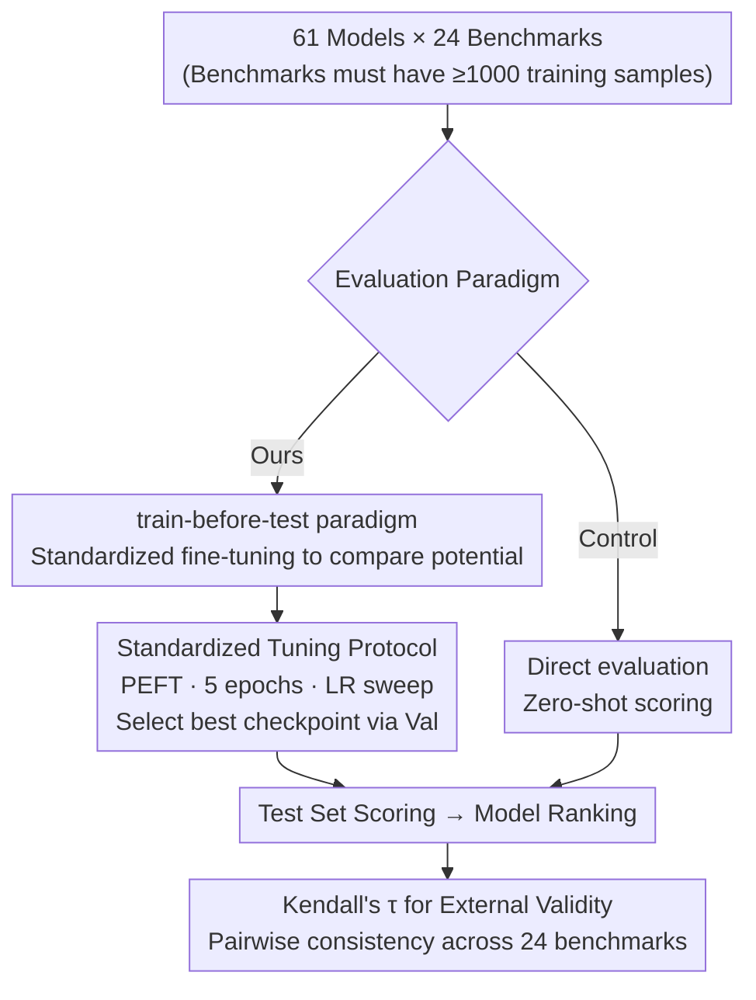

# Train-before-Test Harmonizes Language Model Rankings

**Conference**: ICLR 2026  
**OpenReview**: [https://openreview.net/forum?id=ORv3SAzus1](https://openreview.net/forum?id=ORv3SAzus1)  
**Code**: https://github.com/socialfoundations/lm-harmony  
**Area**: LLM Evaluation / Model Ranking / Benchmark Methodology  
**Keywords**: Model Evaluation, Ranking Consistency, Fine-tuning, External Validity, Perplexity

## TL;DR
The paper proposes **train-before-test**—a standardized protocol where every model undergoes uniform fine-tuning on a benchmark's training set before being evaluated on its test set. Demonstrated across 24 benchmarks and 61 models, this "potential-based" ranking is highly consistent across benchmarks (average Kendall's $\tau$ increased from 0.52 to 0.76). It restores the link between perplexity and downstream performance and reveals that the model-score matrix is nearly rank-one.

## Background & Motivation

**Background**: The dominant paradigm for evaluating large language models (LLMs) is **direct evaluation**, treating models as black boxes and ranking them based on zero-shot performance on various benchmarks. Platforms like Open LLM Leaderboard and HELM are built on this paradigm.

**Limitations of Prior Work**: Rankings provided by different benchmarks often contradict each other, **even when benchmarks claim to measure the same capability**. A poignant example in Figure 1 shows that while NQ-Open and ARC-Challenge both belong to Question Answering (QA), the rankings of 61 models on these two benchmarks differ significantly under direct evaluation, making model selection confusing.

**Key Challenge**: The community often attributes these discrepancies to the "multifaceted nature of LLM capabilities." However, the paper identifies the root cause as **training on the test task**. Models are pre-trained on different datasets (mostly private); some may have "reviewed" data relevant to a specific benchmark. Consequently, out-of-the-box performance is confounded by "readiness," where a weaker model might appear stronger simply due to better test preparation. This unequal readiness leads to unfair comparisons.

**Goal**: Since "unequal readiness" disrupts evaluation, can **leveling the playing field** harmonize these contradictory rankings? Specifically: Will rankings become consistent? Can the gap between perplexity and downstream performance be bridged? How does the latent structure of the score matrix change?

**Key Insight**: Inspired by findings that readiness is a confounder, the authors argue that instead of measuring "out-of-the-box performance," one should measure the "attainable potential after equal preparation." By providing **identical pre-test training** to every model, the comparison returns to a common baseline.

**Core Idea**: Replace direct evaluation with "train-before-test" (evaluation after standardized fine-tuning). This shifts the comparison from *performance* to *potential*, eliminating spurious ranking disagreements caused by differences in pre-training readiness.

## Method

### Overall Architecture

Train-before-test is an **evaluation protocol** used as a contrast to direct evaluation. The pipeline operates as follows: First, benchmarks with $\ge 1000$ training samples are selected from `lm-eval-harness` (resulting in 24 benchmarks covering language understanding, common sense, QA, science, math, and medicine). For every (model, benchmark) pair, a **standardized PEFT fine-tuning** is performed on the training set. The best checkpoint is selected via a validation set before scoring on the test set. Finally, models are ranked by score, and **Kendall's $\tau$** is used to measure ranking consistency between any two benchmarks. Direct evaluation (zero-shot scoring) serves as the control.

### Key Designs

**1. train-before-test Paradigm: Leveling Readiness via Standardized Fine-tuning**

This directly addresses the "training on the test task" confounder. While direct evaluation measures out-of-the-box performance—which is influenced by the "luck" of whether a model saw similar data during pre-training—train-before-test ensures all models are equally "prepared" through **uniform fine-tuning on the same benchmark training set**. The resulting scores reflect the **attainable potential** after adaptation. This shift is crucial for developers who select models specifically for downstream adaptation/fine-tuning; the "zero-shot winner" may not be the "potential winner."

**2. Standardized Fine-tuning Protocol: Reproducible and Scalable Comparison**

To ensure "equal preparation" is valid, the fine-tuning process must be strictly uniform. The paper utilizes **Parameter-Efficient Fine-Tuning (PEFT/LoRA)** rather than full fine-tuning to save computation and unify the adaptation budget. Each model is trained for 5 epochs with a learning rate sweep over $\{1\text{e-}5, 2\text{e-}5, 5\text{e-}5\}$, selecting the best checkpoint based on an **independent validation set**. The study involves $61 \times 24 = 1464$ fine-tuned models, with caps on training (50,000) and test (10,000) samples to control costs. This "one-size-fits-all" adaptation budget transforms "potential" into a comparable and reproducible metric.

**3. Quantifying External Validity with Kendall's $\tau$**

The authors use **Kendall's $\tau$** (rank correlation coefficient) to measure how well rankings between any two benchmarks match across all $\binom{24}{2}=276$ pairs. This assesses **external validity**: if a ranking on Benchmark A generalizes to Benchmark B, it reflects intrinsic model properties rather than task-specific idiosyncrasies. Higher $\tau$ indicates that the rankings are more generalizable and more useful for practical model selection.

### A Complete Example

Consider NQ-Open, an "outlier" under direct evaluation. Its average Kendall's $\tau$ with the other 23 benchmarks is only **0.23**, meaning its ranking barely aligns with others. Using train-before-test, all 61 models are fine-tuned on the NQ-Open training set. After this, the average $\tau$ for NQ-Open jumps to **0.74**, aligning it with the mainstream. This demonstrates that the initial disagreement stemmed from readiness differences rather than a true divergence in capabilities.

## Key Experimental Results

The experiment covers **24 benchmarks × 61 models (from 6 families: LLaMA, Qwen, Gemma, Pythia, GPT-2, Yi; sizes $\le 14$B)**.

### Main Results: Cross-Benchmark Ranking Consistency

| Evaluation Method | Average Kendall's $\tau$ | Improved Benchmark Pairs | NQ-Open Average $\tau$ |
|-------------------|--------------------------|--------------------------|------------------------|
| Direct evaluation | 0.52                     | —                        | 0.23                   |
| Train-before-test | **0.76**                 | **274 of 276 pairs**     | **0.74**               |

Across six categories, train-before-test increased both **intra-category** and **inter-category** consistency. For example, math intra-category $\tau$ rose from 0.52 to 0.75. Inter-category consistency often approached intra-category levels, suggesting that "a model with high potential in one domain tends to be strong in others after adaptation."

### Perplexity and Latent Structure Analysis

| Analysis Dimension | Direct evaluation | Train-before-test |
|--------------------|-------------------|-------------------|
| Perplexity rank $\leftrightarrow$ Downstream rank (Avg $\tau$) | 0.48 | **0.74** |
| Avg Perplexity $\leftrightarrow$ Avg Downstream performance ($\tau$) | 0.55 | **0.84** |
| Score matrix PC1 explained variance (All models) | 70% | **86%** |
| Score matrix PC1 explained variance (Qwen family only) | 74% | **93%** |

### Key Findings

- **Perplexity is "reconnected" to downstream performance**: Perplexity was previously discarded due to its decoupling from downstream scores. Train-before-test realigns them ($\tau$ 0.48 $\to$ 0.74). Remarkably, for **base models**, **pre-tuning** perplexity predicts **post-tuning** downstream performance (avg $\tau=0.78$), suggesting this consistency reflects intrinsic potential.
- **Instruction tuning pollutes the perplexity signal**: This predictive relationship is much weaker for instruction-tuned models ($\tau=0.51$), as instruction tuning simultaneously improves benchmark scores and alters general perplexity.
- **Potential is dominated by a single latent factor**: After train-before-test, PC1 of the score matrix explains 86% of the variance (93% for the Qwen family, nearly rank-one), compared to 70% in direct evaluation. This implies that "potential" is driven by a single latent variable highly correlated with **pre-training compute**.

## Highlights & Insights
- **Addressing the confounder directly**: While others attribute ranking disagreements to "multifaceted capability," this paper identifies "unequal readiness" as the culprit and proves it through a simple, elegant control (equalizing readiness).
- **Quantifying "Potential"**: By using a uniform PEFT budget, the vague notion of "potential" is operationalized into 1464 reproducible fine-tuning results.
- **Revitalizing Perplexity**: The study shows that under fair evaluation, even pre-tuning perplexity can predict downstream potential, justifying the use of cheap perplexity metrics for initial model screening.
- **Insight from Rank-One Structure**: The fact that PC1 explains up to 93% of variance and correlates with compute clarifies that model potential is essentially a scalar, providing insights into Scaling Laws and the nature of rankings.

## Limitations & Future Work
- **Increased Evaluation Cost**: Fine-tuning every model on every benchmark increases overhead; however, the authors argue that the increased ranking consistency allows for using fewer benchmarks, potentially offsetting costs.
- **Non-perfect Consistency**: While $\tau$ improved significantly, it did not reach 1.0, likely due to insufficient PEFT adaptation or irreducible measurement noise.
- **Reliance on Training Sets**: Many new benchmarks do not provide training data; the authors call for future benchmarks to include fine-tuning subsets.
- **Closed-source Models**: Some providers do not allow fine-tuning, limiting the protocol's scope—though this may incentivize making models more tunable.
- **Personal Observation**: The conclusions are based on models $\le 14$B across 6 families. Whether the "rank-one potential" holds for larger models or frontier capabilities (e.g., complex reasoning/coding) remains to be verified.

## Related Work & Insights
- **vs. Direct Evaluation (HELM / Open LLM Leaderboard)**: These measure "deployment readiness" via out-of-the-box performance but suffer from inconsistency. Ours measures "adaptable potential" and offers higher external validity.
- **vs. "Training on the test task" (Dominguez-Olmedo et al., 2024)**: That work diagnosed readiness as a confounder; this paper provides the treatment by "leveling readiness."
- **vs. Ranking Instability (Zhang & Hardt, 2024)**: They used social choice theory to argue that multi-task rankings are inherently unstable; this paper bypasses the aggregation dilemma by making the underlying task rankings converge.
- **vs. Low-rank Analysis (Ruan et al., 2024)**: Previous work found score matrices to be approximately low-rank; this paper shows that train-before-test pushes the matrix toward a true rank-one structure (PC1 86% $\to$ 93%).

## Rating
- Novelty: ⭐⭐⭐⭐⭐ Redefining the object of evaluation (potential vs. performance) via unified fine-tuning.
- Experimental Thoroughness: ⭐⭐⭐⭐⭐ 24 benchmarks, 61 models, 1464 fine-tunings, covering consistency, perplexity, and PCA.
- Writing Quality: ⭐⭐⭐⭐⭐ Clear problem-diagnosis-solution-verification logic with strong supporting evidence.
- Value: ⭐⭐⭐⭐⭐ Addresses real-world model selection pain points and revives the perplexity metric.

<!-- RELATED:START -->

## Related Papers

- [\[ICLR 2026\] Pitfalls in Evaluating Language Model Forecasters](pitfalls_in_evaluating_language_model_forecasters.md)
- [\[ICLR 2026\] How Many Code and Test Cases Are Enough? Evaluating Test Cases Generation from a Binary-Matrix Perspective](how_many_code_and_test_cases_are_enough_evaluating_test_cases_generation_from_a_.md)
- [\[ICLR 2026\] Don't Pass@k: A Bayesian Framework for Large Language Model Evaluation](dont_passk_a_bayesian_framework_for_large_language_model_evaluation.md)
- [\[ACL 2026\] Can We Predict Before Executing Machine Learning Agents?](../../ACL2026/llm_evaluation/can_we_predict_before_executing_machine_learning_agents.md)
- [\[ICLR 2026\] How Reliable is Language Model Micro-Benchmarking?](how_reliable_is_language_model_micro-benchmarking.md)

<!-- RELATED:END -->
