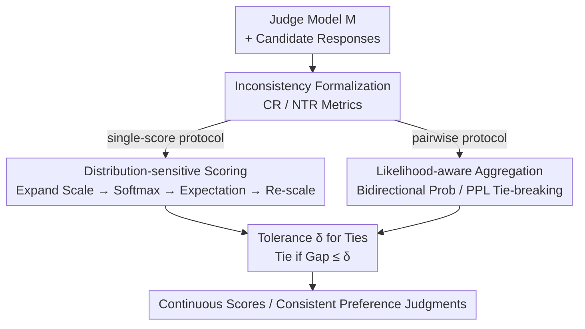

# TrustJudge: Inconsistencies of LLM-as-a-Judge and How to Alleviate Them

**Conference**: ICLR 2026  
**OpenReview**: [https://openreview.net/forum?id=4uPyOCeN6U](https://openreview.net/forum?id=4uPyOCeN6U)  
**Code**: https://github.com/TrustJudge/TrustJudge  
**Area**: LLM Evaluation / LLM-as-a-Judge  
**Keywords**: LLM evaluation, scoring inconsistency, transitivity, probabilistic scoring, perplexity  

## TL;DR
TrustJudge systematically reveals two long-overlooked "self-contradictions" within the LLM-as-a-judge framework: conflicts between scoring and pairwise comparisons, and transitivity cycles in pairwise comparisons. By attributing root causes to information loss in discrete scoring and ambiguous ties, the authors introduce "distribution-sensitive scoring + likelihood-aware aggregation" to significantly reduce inconsistency rates without training while maintaining or improving evaluation accuracy.

## Background & Motivation

**Background**: Utilizing large language models as judges (LLM-as-a-judge) has become a mainstream alternative to human evaluation. Two common protocols are employed: single-score (asking the judge to provide an integer score, e.g., 1–5, following the MT-Bench style) and pairwise comparison (asking the judge to compare two responses, A and B, using two-pass evaluation to mitigate position bias). These protocols are widely relied upon for automated evaluation, self-improvement, and peer-review workflows.

**Limitations of Prior Work**: The authors identify that these protocols are "inconsistent" with themselves on two levels. The first is **Score-Comparison Inconsistency**: where $R_x$ is assigned a lower score than $R_y$, yet $R_x$ wins in the pairwise comparison ($R_x \succ R_y$ despite $\text{score}(R_x) < \text{score}(R_y)$). The second is **Pairwise Transitivity Inconsistency**: where pairwise comparisons lead to non-transitive cycles ($R_x \succ R_y \succ R_z \succ R_x$) or tie-based contradictions ($R_x \equiv R_y \equiv R_z \neq R_x$), violating the fundamental transitivity law of rational preference.

**Key Challenge**: The root causes are attributed to two factors. First, **information loss in discrete scoring systems**—coarse scales (like 1-5) compress responses of varying quality into the same score (e.g., two different responses both receiving 4), resulting in low output entropy and an inability to distinguish actual quality gaps. Figure 1 shows that the average entropy of a 5-point scale is significantly lower than that of a 100-point scale. Second, **ambiguous tie judgments in pairwise comparisons**—many transitivity contradictions arise from ties where the judge arbitrarily declares a "tie" when uncertain, which easily breaks transitivity.

**Goal**: Resolve both types of inconsistencies without introducing additional training or requiring human annotation, while ensuring that evaluation accuracy is not compromised.

**Key Insight**: Since the problems stem from "discretization information loss" and "ambiguous ties," the judge should not output a compressed integer. Instead, the **probability distribution** over the judge's tokens should be preserved as a signal. Expected values from the distribution yield continuous scores, and probabilities/perplexity are used to break ties.

**Core Idea**: Replace "discrete, information-losing" integer judgments with "probabilistic, entropy-preserving" evaluation signals—distribution-sensitive scoring addresses the score-comparison conflict, while likelihood-aware aggregation resolves transitivity cycles.

## Method

### Overall Architecture

TrustJudge is a **probabilistic evaluation framework** that does not modify the judge model or require training; it only changes "how to extract results from the judge model." It first formalizes inconsistencies using quantitative metrics (Conflict Ratio and Non-Transitivity Ratio). It then provides probabilistic alternatives for both protocols: "distribution-sensitive scoring" for the single-score protocol and "likelihood-aware aggregation" for the pairwise protocol. Finally, a unified tolerance $\delta$ controls the strictness of tie judgments. The key to the pipeline is maintaining the probability distribution over candidate scores/results instead of taking a discrete label via argmax.

### Key Designs

**1. Formalizing Inconsistencies: Quantitative Measures for "Self-contradiction"**

To fix the problem, it must first be measurable. The authors define both inconsistencies as computable metrics. For score-comparison conflict, given integer scores $S_x, S_y$ and a pairwise result $C \in \{-1, 0, 1\}$ (1 for $R_x$ win, -1 for $R_y$ win, 0 for tie), an inconsistency is detected if:

$$(S_x > S_y \wedge C \le 0) \vee (S_x < S_y \wedge C \ge 0) \vee (S_x = S_y \wedge C \neq 0)$$

The overall conflict is measured by the **Conflict Ratio** $CR = \frac{1}{n}\sum_i \mathbb{I}[\text{pair } i \text{ inconsistent}]$. For transitivity, two violations are defined over subsets of size $k \ge 3$: **Circular Inconsistency** ($R_x \succ R_y \succ R_z \succ R_x$) and **Equivalence Inconsistency** ($R_x \equiv R_y \equiv R_z \neq R_x$). These are measured by the **Non-Transitivity Ratio** $NTR_k = V_k / \binom{n}{k}$, where $V_k$ is the number of violating $k$-element subsets.

**2. Distribution-sensitive Scoring: Use Expectation to Recover Compressed Entropy**

This addresses the information loss in scoring. The judge is first prompted to score on a finer scale (e.g., 100-point instead of 5-point). Logits for each candidate score in the expanded set $\Theta' = \{s'_{min}, \dots, s'_{max}\}$ are extracted, normalized via softmax into a **valid probability distribution** $P(s'_j|R)$, and the expected value is calculated and scaled back:

$$S = \left(\sum_{j=s'_{min}}^{s'_{max}} s'_j \cdot \frac{\exp(P_o(s'_j|R))}{\sum_k \exp(P_o(s'_k|R))}\right) \times \frac{s_{max}-s_{min}}{s'_{max}-s'_{min}}$$

Unlike G-Eval, which sums candidate probabilities directly (where $\sum_j P(s'_j|R) \neq 1$ because non-score tokens absorb probability), the softmax here ensures a well-defined distribution. Theorem 3.1 proves that this method can distinguish distributions that discrete scoring would map to the same value.

**3. Likelihood-aware Aggregation: Break Ties with Probabilistic Signals**

This addresses transitivity cycles. Two methods are proposed to "decide a winner instead of defaulting to a tie." Option A is **PPL-based**: compute the perplexity of the judge model $M$ for two different input orders. The result follows the order with lower perplexity:

$$C(R_x, R_y) = \begin{cases} C_{order1}, & \text{if } PPL(M, R_x, R_y) < PPL(M, R_y, R_x) \\ C_{order2}, & \text{otherwise} \end{cases}$$

Option B is **Bidirectional Probability Aggregation**: for both orders, sum the probabilities of results $k \in \{1, -1, 0\}$ as $m[k] = p_{order1}[k] + p_{order2}[-k]$, and take $\arg\max_k m[k]$. Proposition 3.2 shows that the confidence distribution constructed via PPL is more "certain" (lower entropy) than the raw judge output in ambiguous regions.

**4. Tolerance $\delta$: A Unified Knob for Tie Control**

Probabilistic evaluation yields nearly continuous scores, making exact equalities rare. The authors introduce a tolerance hyperparameter $\delta \ge 0$. Whether using absolute score differences, PPL differences, or probability margins, if the gap $\le \delta$, it is recorded as a tie. This allows users to adjust the granularity of the final ranking without retraining.

### Loss & Training
Ours is **completely training-free, requires no fine-tuning, and no human annotation**. All improvements occur during inference by reading internal signals (token probabilities/perplexity) from the judge model.

## Key Experimental Results

### Main Results

The dataset combines 80 prompts from MT-Bench and 500 from ArenaHard, with candidate responses sampled from various LLMs. 10.8k instances are used for the single-comparison protocol, and for pairwise transitivity, 43.2k ($k=4$) and 50.4k ($k=5$) relations are collected. Gold standards are human-verified. Judges include Llama-3 (3B/8B/70B), GPT-3.5/4o, Qwen2.5, and Gemma-2.

| Judge Model | Metric | Baseline | G-Eval | TrustJudge |
|--------|------|------|----------|------|
| Llama-3.1-70B | CR (%) | 23.32 | 15.77 | **14.89** |
| Llama-3.1-70B | NTR$_{k=5}$ (%) | 15.22 | — | **4.40** |
| Llama-3.2-3B | CR (%) | 36.65 | 29.50 | **29.15** |
| Llama-3.2-3B | NTR$_{k=5}$ (%) | 54.69 | — | **17.76** |
| GPT-4o | CR (%) | 27.95 | 23.18 | **22.60** |
| GPT-4o | NTR$_{k=5}$ (%) | 24.33 | — | **6.01** |

Using Llama-3.1-70B, CR dropped from 23.32% to 14.89% (absolute Gain: 8.43%), and $NTR_{k=5}$ dropped from 15.22% to 4.40% (absolute Gain: 10.82%). Accuracy also improved—pairwise exact match increased by 1.19%–6.85%, showing that the framework is particularly effective for smaller models.

### Ablation Study

| Config | L-3.1-70B | G-4o | Description |
|------|---------|------|------|
| 5-scale Baseline (CR) | 23.32 | 27.95 | Original 5-point scale, highest inconsistency |
| + Softmax | 17.08 | 25.50 | Added softmax normalization |
| + 100-scale | 17.94 | 24.01 | Added 100-point granularity |
| Pairwise Baseline (NTR$_{k=4}$) | 7.23 | 11.70 | Tie if two-pass results conflict |
| + Likelihood | **1.94** | **2.83** | Bi-directional aggregation, optimal |
| + PPL-Based | 2.18 | 4.48 | Perplexity-based, simpler implementation |

### Key Findings
- **Likelihood-aware aggregation (bidirectional prob) contributes most**: It pushes pairwise inconsistency to its minimum (e.g., only 1.94% for Llama 70B).
- **PPL-based method is slightly behind but easier to implement**: It operates directly on sequence probabilities without needing specific token positions.
- **Granularity + softmax are both effective**: Softmax normalization alone reduces CR by 0.32%–6.24%. Figure 3 shows CR decreases monotonically from 5 to 100 scales, confirming the information loss hypothesis.
- **Smaller judges benefit more**: 3B models, which suffer the most from inconsistency, see the most significant relative improvements.

## Highlights & Insights
- **Defining "internal self-consistency" as a standalone problem**: Previous work focused on alignment with humans; this paper is the first to systematically highlight conflicts like "scoring vs. comparison" and "transitivity cycles."
- **"Entropy Preservation" Perspective**: Attributing inconsistency to information loss and using distributions to preserve entropy is a clever insight that could be applied to any LLM-based structured judgment task.
- **Zero-training, plug-and-play**: The method only modifies the inference readout, making it applicable even to closed-source models like GPT-4o (provided logprobs are available).
- **PPL Tie-breaking**: Utilizing the model's own linguistic fluency (lower perplexity) as an additional tie-breaking signal is highly practical.

## Limitations & Future Work
- **Dependence on token-level probabilities/perplexity**: The method requires logprobs, which is problematic for black-box APIs that do not return them.
- **Reliability of fine-grained scoring**: While a 100-point scale reduces inconsistency, it is unclear if the judge truly distinguishes 100 levels reliably or if it introduces new noise.
- **Transitivity scale**: Tests were limited to $k=4, 5$. High-order cycles for larger $k$ are constrained by the $\binom{n}{k}$ computational cost.
- **Tolerance $\delta$ tuning**: Optimal $\delta$ varies by judge and protocol, requiring some parameter tuning for deployment.

## Related Work & Insights
- **vs G-Eval**: G-Eval also uses probabilistic scoring for human alignment but suffers from unnormalized probabilities due to non-score tokens. TrustJudge uses softmax for a well-defined distribution and outperforms G-Eval by 1–2% across benchmarks.
- **vs Mathematical Transitivity Fixes (e.g., Xu et al. / Zhang et al.)**: Those methods often require training to fit preference structures, which may hurt generalization. TrustJudge is training-free.
- **vs Conventional Two-pass Swapping**: Baseline methods default to ties when two-pass results conflict, which exacerbates transitivity violations. TrustJudge actively decides winners using bidirectional probabilities to avoid excessive ties.

## Rating
- Novelty: ⭐⭐⭐⭐⭐ First to formalize two types of internal inconsistency in LLM-as-a-judge.
- Experimental Thoroughness: ⭐⭐⭐⭐⭐ Extensive coverage of model families (3B–70B) and comprehensive ablations.
- Writing Quality: ⭐⭐⭐⭐ Rigid mathematical definitions; however, some metric choices require reading the appendix.
- Value: ⭐⭐⭐⭐⭐ Zero-training and highly effective for weak judges; significant utility for automated evaluation pipelines.

<!-- RELATED:START -->

## Related Papers

- [\[ICLR 2026\] Rethinking LLM-as-a-Judge: Representation-as-a-Judge with Small Language Models via Semantic Capacity Asymmetry](rethinking_llm-as-a-judge_representation-as-a-judge_with_small_language_models_v.md)
- [\[ICLR 2026\] BiasScope: Towards Automated Detection of Bias in LLM-as-a-Judge Evaluation](biasscope_towards_automated_detection_of_bias_in_llm-as-a-judge_evaluation.md)
- [\[ACL 2026\] How Hypocritical Is Your LLM Judge? Listener–Speaker Asymmetries in the Pragmatic Competence of Large Language Models](../../ACL2026/llm_evaluation/how_hypocritical_is_your_llm_judge_listener-speaker_asymmetries_in_the_pragmatic.md)
- [\[ICLR 2026\] Preference Leakage: A Contamination Problem in LLM-as-a-judge](preference_leakage_a_contamination_problem_in_llm-as-a-judge.md)
- [\[ICLR 2026\] Do LLM Agents Know How to Ground, Recover, and Assess? Evaluating Epistemic Competence in Information-Seeking Agents](do_llm_agents_know_how_to_ground_recover_and_assess_evaluating_epistemic_compete.md)

<!-- RELATED:END -->
