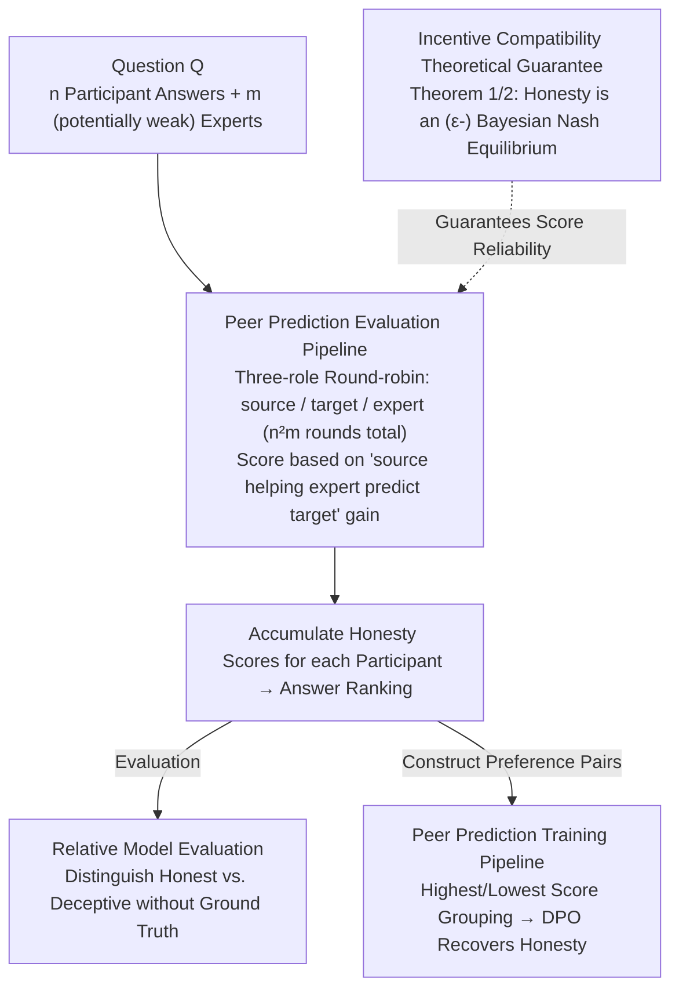

# Truthfulness Despite Weak Supervision: Evaluating and Training LLMs Using Peer Prediction

**Conference**: ICLR 2026  
**arXiv**: [2601.20299](https://arxiv.org/abs/2601.20299)  
**Code**: GitHub Repository (mentioned in the paper)  
**Area**: LLM Evaluation  
**Keywords**: Peer Prediction, LLM Evaluation, Honesty Training, Deception Resistance, Weak Supervision

## TL;DR
This paper proposes applying the Peer Prediction mechanism from game theory to LLM evaluation and training. By measuring the mutual predictability of participants' answers to distinguish honest from deceptive responses, honesty incentives are achieved without ground-truth labels. It demonstrates a surprising "inverse scaling" property—weaker experts are more resistant to deception from stronger models.

## Background & Motivation

**Background**: The evaluation and post-training of LLMs rely on supervision signals, with mainstream methods including Reinforcement Learning from Human Feedback (RLHF) and LLM-as-a-Judge. As model capabilities increase, these methods face "scalable oversight" issues—superhuman models can exploit and deceive evaluators weaker than themselves.

**Limitations of Prior Work**: LLM-as-a-Judge performs **worse than random guessing** when facing deceptive models that are 5-20 times stronger than the judge. Human evaluators are also susceptible to exploitation through sycophancy and reward over-optimization. There is a lack of evaluation methods with game-theoretic guarantees against deception for strong models.

**Key Challenge**: Strong supervision is unavailable for difficult tasks (due to insufficient evaluator capability), but weak supervision is easily exploited by strong models.

**Goal**: How to accurately evaluate strong LLMs using weak supervision? How to incentivize models to remain honest during training?

**Key Insight**: Introduce Peer Prediction methods from mechanism design literature—an information elicitation mechanism proven by game theory. The core intuition is that honest and informative answers better help predict the answers of others; thus, answer quality can be measured through "mutual predictability" without ground-truth labels.

**Core Idea**: Use the mutual predictability of answers among multiple models as a measure of honesty, utilizing the incentive compatibility in game theory to ensure that honest answering is the optimal strategy.

## Method

### Overall Architecture
This paper addresses "evaluating strong models with weak supervision": how to determine if a model is honest when the evaluator (expert) is much weaker than the evaluated model. The core mechanism is borrowed from Peer Prediction in mechanism design—honest and informative answers are better at helping others guess an answer because they carry more information about the "true state of the world." Therefore, "mutual predictability between answers" can serve as a proxy signal for honesty without ever touching ground-truth labels.

The workflow operates as follows: given a question $Q$, $n$ participant model answers $\{A_1, \ldots, A_n\}$, and $m$ (potentially very weak) expert models $\{J_1, \ldots, J_m\}$, participant pairs take turns acting as source/target. The expert measures "how much more accurate its prediction of the target answer becomes after seeing the source answer." By rotating through all source-target-expert role combinations (totaling $n^2 m$ rounds), an honesty score $S_i^A$ is accumulated for each participant. This scoring is backed by a game-theoretic theorem—honesty is its (approximate) Bayesian Nash Equilibrium. Thus, the scores can directly rank models for evaluation or be used to construct DPO preference pairs to train a deceptive model back to honesty.

### Key Designs

**1. Peer Prediction Evaluation Pipeline: Scoring via Mutual Predictability Instead of Ground Truth**

Traditional methods either require correct answers or let judges directly determine correctness; the former is unavailable for hard tasks, and the latter is easily deceived by strong models. This method changes the signal: honest and informative answers should better help others guess an answer because they carry more information about the "true state of the world." Scoring is implemented through three roles: Source (the evaluated), Target (the predicted), and Expert (the predictor, who can be weak and is not assumed to be honest). Each round focuses on evaluating the current Source's answer $A_s$ by seeing how much it helps the expert predict the Target's answer $A_t$:

$$S_s^A \mathrel{+}= \log \Pr_j(A_t \mid A_s) - \log \Pr_j(A_t)$$

This represents the increase in the log probability of the Expert's prediction of the Target answer $A_t$ after seeing the Source answer $A_s$ compared to before seeing it. All participants rotate through source/target roles, and experts are also iterated over, totaling $n^2 m$ rounds. The total score $S_i^A$ is the accumulation across roles (experts receive an auxiliary score $S_j^J$ using a logarithmic scoring rule to reward truthful probability reporting). The process ignores ground truth, utilizing only the structural relationship between answers—a more informative source can teach an expert to simulate a less informative target, but not vice versa—making it naturally harder for strong models to manipulate than simple "correctness judgment."

**2. Incentive Compatibility Theoretical Guarantee: Proving Honesty is the Optimal Strategy**

The scoring formula alone is insufficient; it must be proven that "telling the truth" is indeed the best choice for participants and experts. The paper provides two theorems. Theorem 1 (Shared Prior, following classic results): When everyone shares a prior $\mathcal{P}$, participants answering truthfully $A_i = A_i^*$ and experts truthfully reporting prior/posterior probabilities constitute a Bayesian Nash Equilibrium with maximum expected utility. The mechanism thus penalizes both deception and "withholding information." Theorem 2 is a new contribution, relaxing the unrealistic "shared prior" assumption. When participant and expert priors are sampled independently from the same distribution $\mathcal{D}$ (allowing for different "worldviews"), honesty remains an $\epsilon$-Bayesian Nash Equilibrium with confidence $1-\delta$, provided the group size satisfies:

$$m, n \geq \frac{16(I_0 + L_0)}{\epsilon} \log\!\left(\frac{I_0 + L_0}{\epsilon} + \frac{|\mathcal{A}|}{\delta}\right)$$

(where $I_0$ and $L_0$ bound probability fluctuations within and between priors). The intuition is that with a sufficiently large pool and representative priors, lies tailored for specific individuals are no longer profitable. This is key to its applicability in real-world multi-model ecosystems.

**3. Peer Prediction Training Pipeline: Using Scores as Reward Signals for DPO**

Since evaluation can distinguish honesty, the next step is to correct a "corrupted" model. For each question, multiple participants generate answers, which are ranked by $S_i^A$. The highest and lowest scoring answers are paired as preference samples for standard DPO contrastive training. In experiments, 4 Llama-3.1-8B clones acted as participants (one instructed to be deceptive), with SmolLM-135M as the sole expert. First, a "malicious model" was created via LoRA fine-tuning with 50k deceptive answers; then, honesty was recovered using LoRA DPO with 120k Peer Prediction high/low preference pairs. This works because the incentive compatibility of Design 2 translates "honesty is the equilibrium optimal strategy" into "the honest strategy is locally optimal for the training objective," pushing the model toward honesty.

### Loss & Training
- Evaluation Score: $S_s^A = \sum_{t,j} [\log \Pr_j(A_t \mid A_s) - \log \Pr_j(A_t)]$
- Expert Score: $S_j^J = \sum_{s,t} [\log \Pr_j(A_t \mid A_s) + \log \Pr_j(A_t)]$ (logarithmic scoring rule to reward experts for honest reporting)
- Training: Standard DPO loss, where preference pairs are constructed based on Peer Prediction score rankings.

## Key Experimental Results

### Main Results
Honest training: Recovering honesty from a maliciously fine-tuned model (37,079 questions, 85 domains):

| Method | Expert Size | In-domain Acc. Recovery | Out-of-domain Acc. Recovery | Note |
| :--- | :--- | :--- | :--- | :--- |
| Post-Malicious FT | - | Baseline (Major drop) | Baseline | Instructed to deceive |
| LLM-as-Judge | 0.135B | Minimal recovery | Minimal recovery | Weak judge cannot identify deception |
| LLM-as-Judge | 7B | Moderate recovery | Moderate recovery | Strong judge has some effect |
| **Peer Prediction** | **0.135B** | **Major recovery** | **Major recovery** | 0.135B expert outperforms 7B judge |

### Ablation Study (Deception Resistance Scaling)

| Scenario | Capability Gap | Peer Prediction | LLM-as-Judge | Note |
| :--- | :--- | :--- | :--- | :--- |
| 8B Participant, 7B Expert | ~1× | Slightly better | Close | Similar when gap is small |
| 8B Participant, 0.135B Expert| ~60× | Significantly superior| Worse than random | Inverse scaling |
| 27B Participant, 0.135B Expert| ~200× | Optimal | Far worse than random| PP stronger, Judge fails completely |
| 405B Participant, 7B Expert | ~58× | Effective separation | Failure | Ultra-large model validation |

### Key Findings
- **0.135B Expert with Peer Prediction outperforms 7B LLM-as-a-Judge**: In honesty training, a weak expert with a strong mechanism is more effective than a strong judge with a weak mechanism.
- **Inverse Scaling**: Contrary to intuition, the weaker the expert (relative to the participant), the stronger the deception resistance of Peer Prediction.
- **LLM-as-a-Judge fails completely under large capability gaps**: It performs worse than random when facing deceptive models 5-20x larger, and fails entirely at a 100x gap.
- **Triple Scaling**: Deception resistance increases with (1) the capability gap, (2) the number of participants, and (3) the number of experts.
- **Expert Ensembles**: Ensembles of multiple weak experts outperform the single best expert, and gains improve steadily with the number of experts.

## Highlights & Insights
- **Cross-disciplinary Application of Game Theory and AI Safety**: Introducing Peer Prediction theory from mechanism design into LLM evaluation is a noteworthy cross-domain transfer. Key insight: You don't need the "correct answer"; you only need to exploit the structural relationship between answers.
- **Deep Reason for Inverse Scaling**: Strong models' answers are more informative and distinguishable, making the mutual predictability signal stronger. The "ignorance" of weak experts becomes an advantage—their predictions rely more on information provided by the source than their own capabilities.
- **Meaning of Incentive Compatibility**: It penalizes not just deceptive answers, but also "under-informative" answers—models are incentivized to provide complete, informative responses. This is richer than simple "correct/incorrect" signals.
- **Practical Value of Theorem 2**: Relaxing the shared prior assumption to allow models to have different "worldviews" makes the method feasible in real-world multi-model ecosystems as long as the group is sufficiently large.

## Limitations & Future Work
- **Unresolved Collusion**: The theory only covers unilateral deception; guarantees for collusion among multiple participants are not provided. Preliminary discussions are in the appendix but are not exhaustive.
- **Computational Overhead**: The $n^2 m$ evaluation rounds scale quadratically/linearly with the number of participants and experts, posing challenges for large-scale deployment.
- **Granularity in Free-text Evaluation**: Currently, free-text answers are treated as a whole $A_i$, without fine-grained distinction for "partially correct" cases.
- **Prior Distribution Assumption**: Theorem 2 requires priors to be sampled from the same distribution, which might not hold if models have significantly different training data distributions.
- **Future Directions**: Exploring collusion-resistant Peer Prediction variants; studying token-level fine-grained mutual predictability; extending the method to online RLHF training (it was only tested on offline DPO).

## Related Work & Insights
- **vs. LLM-as-a-Judge**: LLM-as-a-Judge requires judges to be at least as capable as the evaluated models and is easily deceived. Peer Prediction has no such requirement, and its inverse scaling makes it stronger under weak supervision.
- **vs. Debate (Brown-Cohen et al.)**: Debate requires two adversarial models to challenge each other, which is structurally more complex. Peer Prediction is simpler—requiring only answer mutual predictability without adversarial interaction.
- **vs. RLHF**: RLHF requires high-quality human/AI preference labels (strong supervision). Peer Prediction requires no ground-truth labels and is a truly weak-to-strong supervision method.
- This paper provides direct inspiration for the "superalignment" direction: if future models surpass humans, Peer Prediction offers a way to evaluate honesty without needing to understand the correctness of the model's answers.

## Rating
- Novelty: ⭐⭐⭐⭐⭐ Introducing Peer Prediction to LLM evaluation is a fresh cross-domain innovation, and the discovery of inverse scaling is surprising.
- Experimental Thoroughness: ⭐⭐⭐⭐⭐ Extensive coverage from 135M to 405B models, 85 domains, 37K+ questions, dual validation of training and evaluation, and comprehensive scaling analysis.
- Writing Quality: ⭐⭐⭐⭐⭐ Complete logical chain from practical problems to theoretical guarantees and experimental validation; theorems and experiments are highly consistent.
- Value: ⭐⭐⭐⭐⭐ Provided a theoretically rigorous and practical solution to the core AI safety problem of scalable oversight.

<!-- RELATED:START -->

## Related Papers

- [\[ICLR 2026\] VideoJudge: Bootstrapping Enables Scalable Supervision of MLLM-as-a-Judge for Video Understanding](videojudge_bootstrapping_enables_scalable_supervision_of_mllm-as-a-judge_for_vid.md)
- [\[ICLR 2026\] Inverse IFEval: Can LLMs Unlearn Stubborn Training Conventions to Follow Real Instructions?](inverse_ifeval_can_llms_unlearn_stubborn_training_conventions_to_follow_real_ins.md)
- [\[ACL 2025\] CalibraEval: Calibrating Prediction Distribution to Mitigate Selection Bias in LLMs-as-Judges](../../ACL2025/llm_evaluation/calibraeval_calibrating_prediction_distribution_to_mitigate_selection_bias_in_ll.md)
- [\[ICLR 2026\] Mapping Post-Training Forgetting in Language Models at Scale](mapping_post-training_forgetting_in_language_models_at_scale.md)
- [\[ICLR 2026\] DARE-bench: Evaluating Modeling and Instruction Fidelity of LLMs in Data Science](dare-bench_evaluating_modeling_and_instruction_fidelity_of_llms_in_data_science.md)

<!-- RELATED:END -->
