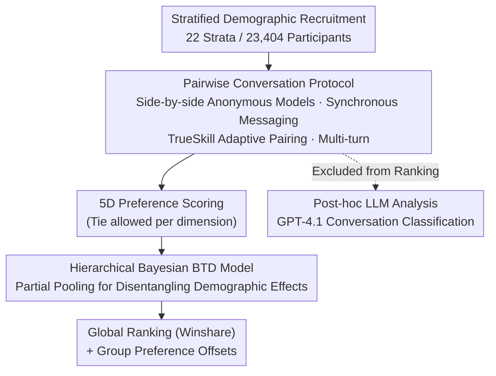

# Unpacking Human Preference for LLMs: Demographically Aware Evaluation with the HUMAINE Framework

**Conference**: ICLR2026  
**arXiv**: [2603.04409](https://arxiv.org/abs/2603.04409)  
**Code**: [Leaderboard](https://huggingface.co/spaces/ProlificAI/humaine-leaderboard) / [Dataset](https://huggingface.co/datasets/ProlificAI/humaine-evaluation-dataset)  
**Area**: LLM Evaluation  
**Keywords**: human evaluation, preference heterogeneity, demographic bias, Bradley-Terry-Davidson, LLM leaderboard, psychometrics

## TL;DR
The HUMAINE framework is proposed to evaluate human preference across 28 SOTA models via 23,404 demographically stratified participants. Using a multi-dimensional (5-dimensional), multi-turn conversation approach and a hierarchical Bayesian BTD model, the study reveals that age is the strongest driver of preference heterogeneity (average rank shift of $\pm 2.8$), proving that single aggregated leaderboards fail to reflect diverse population preferences.

## Background & Motivation

1.  **Evaluation Gap**: LLM evaluation suffers from two paradigm flaws:
    *   **Automated Benchmarks** (MMLU, HELM, BIG-Bench): Measure technical capability but ignore human-computer interaction quality, suffering from Goodhart's Law (optimizing metrics rather than user experience).
    *   **Human Preference Platforms** (Chatbot Arena): Suffer from three methodological flaws—(a) non-representative sampling due to anonymous self-selection; (b) shallow evaluation with minimal interaction; (c) metric simplification via binary voting.
2.  **Overlooked Preference Heterogeneity**: Santurkar et al. (2023) demonstrated that evaluator demographics significantly influence LLM preferences, yet existing leaderboards aggregate all populations into a single score.
3.  **Bias in the Third Paradigm**: LLM-as-a-judge exhibits scaling advantages but suffers from systematic biases (e.g., verbosity preference, positional bias) and should not replace human evaluation.
4.  **Goal**: Design a multi-dimensional, demographically aware evaluation framework to address validity threats related to sampling bias, insufficient evaluation depth, and metric simplification.

## Method

### Overall Architecture

HUMAINE redesigns "who evaluates, what is evaluated, and how it is aggregated." First, 23,404 representative participants are recruited via Prolific through demographic stratification. They engage in multi-turn, real-world conversations between two anonymous models. Preferences are then provided across five dimensions rather than a single binary vote. Finally, a hierarchical Bayesian Bradley-Terry-Davidson (BTD) model processes 119,890 judgments to simultaneously solve for "Global Rankings" and "Group-specific Preference Offsets." The human scoring is decoupled from LLM analysis: GPT-4.1 is used only after scoring is complete for structured classification (task type, domain, complexity, goal achievement) to provide post-hoc explanations of "what users talk about," ensuring it does not enter ranking calculations and avoids systematic biases like verbosity preference.

### Key Designs

**1. Stratified Demographic Recruitment: Replacing Self-selection Bias with Representative Samples**

Platforms like Chatbot Arena allow anonymous volunteers, resulting in tech-biased samples. HUMAINE recruits via Prolific at $£9/hr$, pre-defining 22 demographic strata covering geography (US/UK), age (18-34, 35-54, 55+), ethnicity (Asian, Black/African American, White, Other), and political affiliation (Democrat/Republican/Independent in the US; Conservative/Labour/Lib Dem/Green/Reform UK in the UK). Each stratum collects 1,848–2,636 comparisons, ensuring sufficient samples for statistical inference and enabling post-stratification to calibrate results to census distributions.

**2. Pairwise Conversation Protocol: Balancing Fair Comparison and Information Gain**

Participants interact with two side-by-side anonymous models on self-selected topics for at least 3 turns (median 6). Crucially, each message is **sent to both models simultaneously**, ensuring they are compared within the exact same context. Pairing is not random: the system uses **TrueSkill** to maintain skill means and uncertainty for each model, prioritizing matchups between models with the highest outcome uncertainty to maximize information gain. GPT-4o-mini monitors low-quality inputs (one-word replies, repeated pasting) in real-time, removing users after three warnings (affecting $<1.6\%$ of data).

**3. 5D Preference Scoring: Breaking the Information Compression of Binary Voting**

A simple "who is better" vote merges linguistic style, reasoning quality, and safety into one number. HUMAINE requires participants to state preferences (or a tie) across five dimensions. The tie rate of each dimension serves as a diagnostic signal for the discriminative power of that dimension—more ties indicate the models are harder to distinguish in that area.

| Dimension | Description | Discriminative Power |
|-----------|-------------|----------------------|
| Core Task Performance & Reasoning | Quality of task completion and reasoning | Medium |
| Communication Style & Presentation | Tone, style, and appropriateness of detail | Medium |
| Interaction Fluidity & Adaptiveness | Fluidity and contextual adaptation | Medium |
| Trust, Ethics & Safety | Reliability, transparency, and safety | Lowest (65% ties) |
| Overall Winner | Comprehensive preference judgment | Highest (10% ties) |

**4. Hierarchical Bayesian BTD Model: Handling Ties and Disentangling Demographic Effects**

This statistical engine extends the Bradley-Terry model to accommodate ties and population heterogeneity. For the probability of model $i$ defeating $j$ on metric $k$, the logit is defined as the global skill difference plus demographic group adjustments:

$$\text{logit}(P_{ij}^{(k)}) = \theta_i^{(k)} - \theta_j^{(k)} + \sum_g u_{ig}^{(k)} - \sum_g u_{jg}^{(k)}$$

Where $\theta_i^{(k)}$ represents global skill, $u_{ig}^{(k)}$ represents the preference offset for demographic group $g$, the tie parameter $\nu_k$ quantifies the discriminative power of the metric, and $\tau_g$ quantifies variation between groups. Since participants belong to multiple groups simultaneously (e.g., Asian + 18-34 + Democrat), the model uses **partial pooling** to attribute demographic effects correctly rather than simple data slicing. Final rankings use Winshare, the expected total score in a round-robin against all other models (Win=1, Tie=0.5, Max=27).

## Key Experimental Results

### Overall Ranking (Overall Winner)

| Rank | Model | Score (Winshare) | P(best) |
|------|-------|------------------|---------|
| 1 | google/gemini-2.5-pro | Highest | **95.6%** |
| 2 | deepseek/deepseek-chat-v3-0324 | Second Highest | - |
| 3–5 | mistral/magistral-medium, x-ai/grok-4, x-ai/grok-3 | Close Competition | - |

Gemini-2.5-pro leads by a significant margin, while subsequent models show highly overlapping confidence intervals.

### Demographic Heterogeneity

| Demographic Axis | Avg Rank Offset | Description |
|------------------|-----------------|-------------|
| **Age** | **$\pm 2.8$ ranks** | Strongest driver of heterogeneity |
| Political Affiliation | $\pm 1.5$ ranks | Medium |
| Ethnicity | $\pm 1.3$ ranks | Smallest |

**Specific Case of Age Effect**:
- mistral/magistral-medium: Ranked 1-2 among young users (18-34) but **dropped to 5-10 among 55+ users**.
- google/gemini-2.5-pro: Rank improved with age, securing a stable #1 in the 55+ group.
- The tie rate rose from 9.7% (18-34) to 12.5% (55+), a +29% increase, indicating older users find it harder to decide.

### Ranking Variation Across Dimensions

| Model | Task Performance | Communication Style | Interaction Fluidity | Trust & Safety |
|-------|------------------|---------------------|----------------------|----------------|
| x-ai/grok-3 | **2** | 8 | 8 | - |
| mistral/magistral-medium | 7 | - | **2** | 12 |
| google/gemini-2.5-pro | 1 | 1 | 1 | 1 |

Gemini-2.5-pro's advantage lies in **consistency across all dimensions**; other models show specialized strengths.

### Discriminative Power of Dimensions

| Dimension | Tie Rate | Interpretation |
|-----------|----------|----------------|
| Overall Winner | **10%** | Most decisive—users form clear overall preferences |
| Core Task Performance | ~30% | Medium |
| Communication Style | ~35% | Medium |
| Interaction Fluidity | ~40% | Medium-High |
| Trust, Ethics & Safety | **65%** | Highly ambiguous—models converge on safety or it is hard to assess in short chats |

## Highlights & Insights
- **Age is the largest driver of preference divergence**: Model rankings can shift by as much as $\pm 2.8$ positions across age groups, challenging any leaderboard using non-stratified anonymous samples.
- **"Best" is a context-dependent illusion**: Gemini-2.5-pro ranked only 13th on the technical HELM benchmark but secured 1st place with 95.6% probability in human preference, highlighting the gap between technical accuracy and user satisfaction.
- **Safety dimension is nearly indistinguishable**: A 65% tie rate suggests that safety evaluation in open dialogue requires entirely different methodological designs.
- **Methodological Innovation**: The combination of hierarchical Bayesian BTD, demographic post-stratification, and TrueSkill adaptive pairing significantly outperforms Chatbot Arena in statistical rigor.

## Limitations & Future Work
- **Geographical Limitation**: Covers only US and UK English users, excluding non-English languages and other cultural backgrounds.
- **Task Bias in Open Dialogue**: 71.5% of tasks are information retrieval, likely underestimating preference differences in specialized scenarios like coding or creative writing.
- **Safety Evaluation Ineffectiveness**: The low discriminative power of safety in open dialogue necessitates targeted scenarios (adversarial prompting, sensitive topics).
- **Participant Recurrence**: While handled by the hierarchical model, repeated participation may introduce learning effects.
- **Snapshot Nature**: Evaluation reflects 28 models at a specific point in time; continuous updates limit the long-term validity of specific rankings.

## Related Work & Insights
- **vs Chatbot Arena (Zheng et al., 2023)**: HUMAINE improves on three fronts—representative sampling (stratified vs. self-selected), evaluation depth (multi-turn + multi-dimensional vs. single-turn + binary), and statistical methods (hierarchical Bayesian vs. simple ELO).
- **vs Santurkar et al. (2023)**: While prior work proved demographics affect preferences, it lacked a systematic framework; HUMAINE operationalizes these findings into a scalable evaluation system.
- **vs LLM-as-a-judge**: Explicitly positions LLMs as interpretive tools rather than replacements—human preference data remains irreplaceable.
- **Insight**: Future LLM evaluation should consider customized leaderboards for different user cohorts—"who is evaluating" is as important as "what is evaluated."

## Rating
- Novelty: ⭐⭐⭐⭐ The demographically aware multi-dimensional framework is a new paradigm, though the core statistical method (BTD) is an engineered application of mature techniques.
- Experimental Thoroughness: ⭐⭐⭐⭐⭐ 23,404 participants × 28 models × 5 dimensions × 22 strata provides immense data scale and coverage.
- Writing Quality: ⭐⭐⭐⭐ Clear structure and strong presentation of findings, though some sections could be more concise.
- Value: ⭐⭐⭐⭐⭐ Exposes fundamental flaws in current LLM evaluation; the open release of the dataset and leaderboard is highly valuable to the community.

<!-- RELATED:START -->

## Related Papers

- [\[ICML 2026\] RouteJudge: An Open Platform for Reproducible and Preference-Aware LLM Routing](../../ICML2026/llm_evaluation/routejudge_an_open_platform_for_reproducible_and_preference-aware_llm_routing.md)
- [\[ICML 2026\] Nonparametric LLM Evaluation from Preference Data](../../ICML2026/llm_evaluation/nonparametric_llm_evaluation_from_preference_data.md)
- [\[ICLR 2026\] Preference Leakage: A Contamination Problem in LLM-as-a-judge](preference_leakage_a_contamination_problem_in_llm-as-a-judge.md)
- [\[ICLR 2026\] Don't Pass@k: A Bayesian Framework for Large Language Model Evaluation](dont_passk_a_bayesian_framework_for_large_language_model_evaluation.md)
- [\[ICLR 2026\] Talk, Evaluate, Diagnose: User-aware Agent Evaluation with Automated Error Analysis](talk_evaluate_diagnose_user-aware_agent_evaluation_with_automated_error_analysis.md)

<!-- RELATED:END -->
