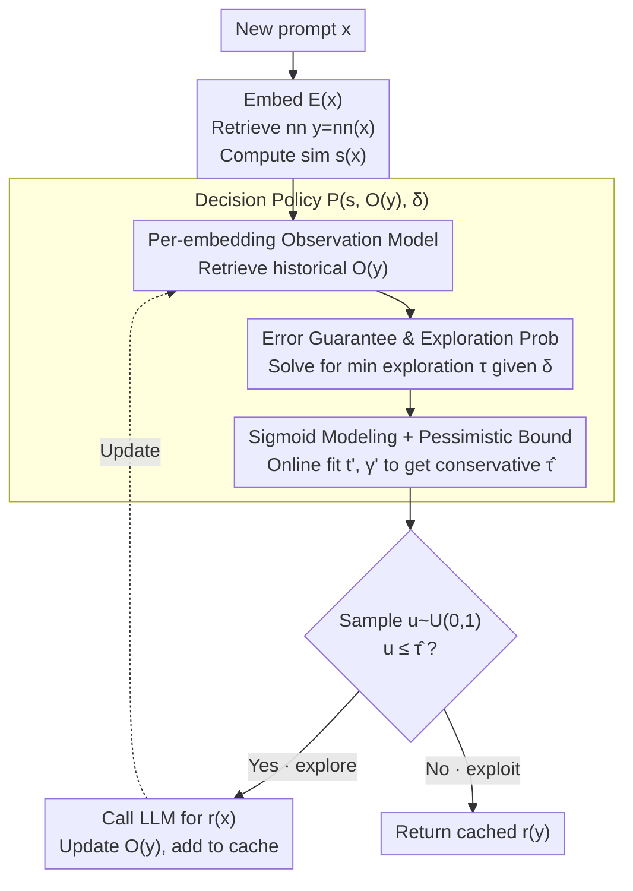

# vCache: Verified Semantic Prompt Caching

**Conference**: ICLR2026  
**arXiv**: [2502.03771](https://arxiv.org/abs/2502.03771)  
**Code**: [GitHub](https://github.com/vcache-project/vCache) | [Benchmarks](https://huggingface.co/vCache)  
**Area**: LLM Evaluation  
**Keywords**: Semantic Caching, LLM Inference Optimization, Error-Rate Guarantee, online learning, Per-Embedding Threshold  
**Authors**: Luis Gaspar Schroeder, Aditya Desai, Alejandro Cuadron, Kyle Chu, Shu Liu, Mark Zhao, Stephan Krusche, Alfons Kemper, Matei Zaharia, Joseph E. Gonzalez (UC Berkeley, TU Munich, ETH Zurich, Stanford)

## TL;DR

Ours proposes vCache—the first semantic caching system with **user-defined error-rate guarantees**. By utilizing online learning to independently estimate optimal similarity thresholds for each cached embedding without pre-training, it achieves up to 12.5× higher cache hit rates and 26× lower error rates compared to static baselines while satisfying correctness constraints.

## Background & Motivation

**High LLM Inference Cost**: Every prompt requires multiple forward passes, making deployment expensive and latency-prone.

**Value of Semantic Caching**: If "What is the capital of Canada?" is cached, a query like "Which city is Canada's capital?" should reuse the response, potentially reducing latency by up to 100×.

**Fundamental Flaws of Static Thresholds**:
   - Existing systems (GPTCache, Azure, AWS, etc.) use a **global fixed threshold** $t$, treating all prompts identically.
   - Experiments find (Figure 3) that the similarity distributions for correct and incorrect cache hits **overlap significantly**.
   - **Optimal thresholds vary drastically per embedding**, making it impossible for a single threshold to achieve both low error rates and high hit rates.

**Lack of Error-Rate Guarantees**: Existing systems cannot guarantee the correctness of returned cached responses, making them difficult to trust in production environments.

**Limitations of Embedding Fine-tuning**: Requires supervised training, is limited to open-source models, and generalizes poorly to OOD (Out-Of-Distribution) data.

## Core Contributions

1. The first verifiable semantic cache providing **user-defined error-rate guarantees**.
2. **Online Threshold Learning Algorithm**: Learns thresholds independently for each cached embedding without pre-training and remains independent of the embedding model.
3. Demonstration that **dynamic per-embedding thresholds** outperform static thresholds and fine-tuned embeddings.
4. Open-sourcing of 4 semantic caching benchmarks (LMArena/Classification/SearchQueries/Combo).

## Method

### Overall Architecture

vCache addresses the "trust" issue in semantic caching. Existing systems use a global threshold $t$ to judge if a new prompt is similar enough to a cached entry. However, the same similarity might imply a hit for one entry but require re-computation for another. vCache replaces the "binary" threshold comparison with a **probabilistic decision with user-defined error-rate guarantees**. For every new prompt $x$, it first computes the embedding $\mathcal{E}(x)\in\mathbb{R}^d$, retrieves the nearest neighbor $\text{nn}(x)=\arg\max_{y\in C}\text{sim}(\mathcal{E}(x),\mathcal{E}(y))$, and calculates similarity $s(x)$. It then retrieves the historical observations of this neighbor to fit a "similarity $\to$ correctness probability" curve online. This calculates the minimum exploration probability needed to maintain the user's error rate $\delta$. Finally, it samples a random number to decide whether to exploit (return the cached response $r(\text{nn}(x))$) or explore (call the LLM and update the entry's observations). This process learns on-the-fly during inference without offline training.

### Key Designs

**1. Per-embedding Observation Model: Memory for Cache Entries**

Static thresholds fail because "safe similarity" varies across embeddings. vCache stores the cache as triplets $\mathcal{D}=\{(\mathcal{E}(x_i),r(x_i),\mathcal{O}(x_i))\}_{i=0}^{n}$, where the observation set $\mathcal{O}(x_i)=\{(s(x_j),c(x_j))\mid \text{nn}(x_j)=x_i\}$ records the similarities of subsequent prompts that used $x_i$ as a nearest neighbor and their correctness labels $c(x)=\mathbb{1}[r(\text{nn}(x))=r(x)]$. This allows each embedding to accumulate local "similarity vs. correctness" experience.

**2. Error-Rate Guarantee & Exploration Probability: Translating Constraints**

The user specifies a maximum error rate $\delta$. vCache ensures $\Pr(\mathbf{vCache}(x)=r(x))\ge 1-\delta$. A correct answer comes from either exploration (calling LLM) or a correct cache hit:

$$\Pr(\text{Correct})=\Pr(\text{explore})+(1-\Pr(\text{explore}))\cdot\Pr(c(x)=1)$$

Setting this $\ge 1-\delta$ and solving for the **minimum exploration probability**:

$$\Pr(\text{explore}\mid x,\mathcal{D})\ge\frac{(1-\delta)-\Pr(c(x)=1)}{1-\Pr(c(x)=1)}=\tau_{\text{nn}(x)}(s(x))$$

If the cache is likely correct ($\Pr(c(x)=1)$ is high), less exploration is needed. This converts thresholding into a continuous exploration policy based on confidence.

**3. Sigmoid Modeling + Pessimistic Bound Estimation: Fitting Online**

Since $\Pr(c(x)=1)$ is unknown, vCache models its relationship with similarity using a sigmoid function:

$$\mathcal{L}(s(x),t,\gamma)=\frac{1}{1+e^{-\gamma(s(x)-t)}}$$

Parameters $t$ (decision boundary) and $\gamma$ (steepness) are estimated via Maximum Likelihood Estimation on $\mathcal{O}_{\text{nn}(x)}$. To handle uncertainty with limited samples, vCache uses **pessimistic values** $t'(\epsilon),\gamma'(\epsilon)$ from a $(1-\epsilon)$ confidence interval:

$$\hat{\tau}=\min_{\epsilon\in(0,1)}\frac{(1-\delta)-(1-\epsilon)\mathcal{L}(s(x),t'(\epsilon),\gamma'(\epsilon))}{1-(1-\epsilon)\mathcal{L}(s(x),t'(\epsilon),\gamma'(\epsilon))}\ge\tau_{\text{nn}(x)}(s(x))$$

This ensures that with fewer observations, the system is conservative (explores more). As data accumulates, the confidence interval narrows, $\hat\tau$ decreases, and the hit rate increases while maintaining the guarantee (Theorem 4.1).

## Key Experimental Results

### Context
- **Embedding Models**: GteLargeENv1-5, E5-large-v2, OpenAI text-embedding-3-small
- **LLMs**: Llama-3-8B-Instruct, GPT-4o-mini
- **Vector DB**: HNSW + Cosine Similarity

### Benchmarks

| Benchmark | Scale | Characteristics |
|------|------|------|
| SemCacheLMArena | 60K | LM-Arena open user prompts |
| SemCacheClassification | 45K | 3 Classification datasets |
| SemCacheSearchQueries | 150K | Web search queries |
| SemCacheCombo | 27.5K | Mixed, includes non-hitting prompts |

### Main Results

**vs. Static Threshold (GPTCache)**:
- On SemCacheLMArena: Up to **26× lower error rate** and **12.5× higher hit rate**.
- On SemCacheClassification: Consistently outperforms static baselines for $\delta > 1.5\%$.
- For $\delta < 1.5\%$, it is more conservative to prioritize correctness.

**Error-Rate Guarantee Verification**:
- vCache **satisfies the error rate constraint** across all $\delta$ values.
- GPTCache error rates **increase continuously** as samples grow, exposing the weakness of static thresholds.
- vCache hit rates grow over time due to online learning.

**vs. Fine-tuned Embedding Baselines**:
- Ours matches or exceeds the fine-tuned embedding methods (Zhu et al., 2024) **without any training**.
- Fine-tuned embeddings generalize poorly to OOD data, whereas vCache adapts online.

## Highlights & Insights

1. **Formal Correctness Guarantees**: First to provide a user-controllable error upper bound $\delta$ for semantic caching.
2. **Adaptive Per-embedding Thresholds**: Captures the drastic variance in optimal thresholds across different entries that global thresholds miss.
3. **Zero Pre-training Online Learning**: Model-agnostic, requires no labeled data, and learns during inference.
4. **Pessimistic Estimation**: Converts sample uncertainty into exploration frequency, ensuring safety during cold starts.

## Limitations & Future Work

1. **Judging Equivalence**: Long responses require LLM-as-a-judge (can be performed asynchronously).
2. **i.i.d. Assumption**: Guarantees may temporarily fail if prompt distributions shift abruptly.
3. **Sigmoid Assumption**: If the true correctness probability is not sigmoid, the analytical guarantee might be affected.
4. **Cold Start**: Tends towards full exploration for new embeddings with no history.
5. **Prompt Type**: Not suitable for prompts requiring precise reasoning (e.g., complex math) where semantic similarity is irrelevant.

## Related Work & Insights

| Method | Threshold Type | Error Guarantee | Training Required | Model Agnostic | Online Learning |
|------|----------|:----------:|:--------:|:--------:|:--------:|
| GPTCache | Global Static | ✗ | ✗ | ✓ | ✗ |
| Azure/AWS Cache | Global Static | ✗ | ✗ | ✓ | ✗ |
| Zhu et al. 2024 | Global Static | ✗ | ✓ | ✗ | ✗ |
| **vCache** | **Per-embedding Dynamic** | **✓** | **✗** | **✓** | **✓** |

- **RAG Integration**: vCache can cache retrieved results for high-frequency queries.
- **Conformal Prediction**: The framework is conceptually similar but avoids the need for a labeled calibration set.

## Rating
- Novelty: ⭐⭐⭐⭐⭐ — First with correctness guarantees; per-embedding online learning is a new direction.
- Experimental Thoroughness: ⭐⭐⭐⭐ — Comprehensive metrics, though lacks real-world deployment latency benchmarks.
- Writing Quality: ⭐⭐⭐⭐⭐ — Rigorous formalization and intuitive visualizations.
- Value: ⭐⭐⭐⭐⭐ — Solves the trust problem in semantic caching for production use.

<!-- RELATED:START -->

## Related Papers

- [\[ICLR 2026\] Contamination Detection for VLMs Using Multi-Modal Semantic Perturbations](contamination_detection_for_vlms_using_multimodal_semantic_perturbations.md)
- [\[ICLR 2026\] Textual Bayes: Quantifying Prompt Uncertainty in LLM-based Systems](textual_bayes_quantifying_prompt_uncertainty_in_llm-based_systems.md)
- [\[ICLR 2026\] Prompt and Parameter Co-Optimization for Large Language Models](prompt_and_parameter_co-optimization_for_large_language_models.md)
- [\[ICLR 2026\] AdaBlock-dLLM: Semantic-Aware Diffusion LLM Inference via Adaptive Block Size](adablock-dllm_semantic-aware_diffusion_llm_inference_via_adaptive_block_size.md)
- [\[ICLR 2026\] Rethinking LLM-as-a-Judge: Representation-as-a-Judge with Small Language Models via Semantic Capacity Asymmetry](rethinking_llm-as-a-judge_representation-as-a-judge_with_small_language_models_v.md)

<!-- RELATED:END -->
