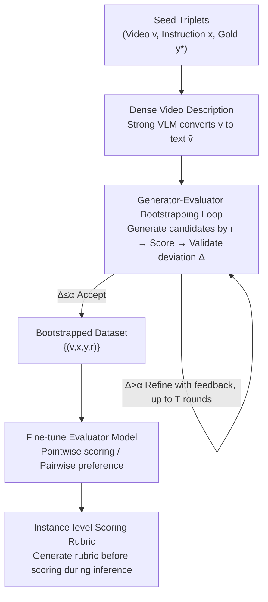

# VideoJudge: Bootstrapping Enables Scalable Supervision of MLLM-as-a-Judge for Video Understanding

**Conference**: ICLR 2026  
**OpenReview**: [https://openreview.net/forum?id=31CznLfRIS](https://openreview.net/forum?id=31CznLfRIS)  
**Code**: Available (The paper provides links to Code / Models & Data; refer to the original text for specific URLs ⚠️)  
**Area**: Multimodal VLM / LLM Evaluation  
**Keywords**: MLLM-as-a-Judge, Video Understanding Evaluation, Bootstrapping Data Synthesis, Generator-Evaluator, Instance-level Rubric

## TL;DR
VideoJudge utilizes a bootstrapping loop where a "generator creates samples according to target scores and an evaluator validates score alignment" to synthesize 100,000 video evaluation samples with score supervision without human labeling. This enables training 3B/7B small video evaluator models that match or exceed 32B/72B general-purpose MLLM judges on most meta-evaluation benchmarks.

## Background & Motivation

**Background**: Video understanding models (video captioning, video QA, long video understanding) are evolving rapidly, but evaluating their outputs in a "reliable, interpretable, and scalable" manner has become a bottleneck. Traditional reference-based metrics (BLEU, ROUGE, BERTScore) focus on surface-level word overlap and fail to capture semantic fidelity and temporal reasoning. Human evaluation remains the gold standard but is expensive, slow, and suffers from low inter-annotator consistency. Consequently, LLM-as-a-Judge has emerged as a promising alternative, proven effective in text generation and image-text tasks (MLLM-as-a-Judge).

**Limitations of Prior Work**: Applying MLLM-as-a-Judge to video understanding is largely unexplored due to temporal and multimodal complexity, along with two structural gaps. First, a **lack of large-scale evaluation resources**—there are few datasets with human preference signals and no standardized benchmarks to verify if model judgments align with humans. Existing work either relies on closed-source models like GPT-4/4o (nontransparent, irreproducible) or uses small open-source MLLMs in zero-shot settings (far below human-level reliability). Second, a **lack of principled evaluation criteria**—existing (M)LLM-as-a-Judge approaches either use vague general rubrics (ambiguous, brittle) or rely on manually written rubrics (cannot scale across tasks).

**Key Challenge**: Training a reliable video evaluator requires massive supervision data with "score annotations," but acquiring such data necessitates either expensive human labor or non-reproducible closed-source models. A contradiction exists between the "scalability" and the "reliability/reproducibility" of supervision signals.

**Goal**: To high-quality training data and standardized meta-evaluation benchmarks without relying on human labels, thereby training small yet powerful video evaluator models.

**Key Insight**: The authors draw inspiration from "self-consistency + self-verification" in self-refinement, setting up a **generator** and an **evaluator** to balance each other. The generator is tasked with creating answers across a quality gradient based on target scores; the evaluator then independently assigns scores for validation, retaining only samples where the two align. In this way, supervision signals are cross-validated from both directions, ensuring controllable quality.

**Core Idea**: A bootstrapping loop involving "generator creates samples by target score + evaluator validates score alignment + feedback-driven refinement for non-compliance" is used to amplify a small set of seed triplets into large-scale score-supervised data, which is then used to fine-tune small video evaluator models.

## Method

### Overall Architecture
The workflow of VideoJudge consists of two stages: **(1) Iterative Bootstrapping** to construct large-scale, fine-grained score-labeled training data; **(2) Fine-tuning Evaluation Models** for both pointwise (individual scoring) and pairwise (preference) settings. The core of the bootstrapping phase is a closed-loop collaboration between a generator $G$ and an evaluator $E$: starting from seed triplets $(v, x, y^*)$ (video, instruction, gold answer), a strong VLM first converts the video into a dense text description $\tilde v$ to serve as semantic context. The generator produces $N-1$ candidate answers with degrading quality according to target scores $r \in \{1,\dots,N-1\}$, with the gold answer $y^*$ taking the highest score $N$ (the paper uses $N=5$). The evaluator assigns a score $\hat r$ and provides a rationale for each candidate. If the deviation $\Delta=|r-\hat r|\le\alpha$, the sample is accepted; otherwise, the evaluator's feedback is fed back to the generator for refinement, looping for up to $T$ rounds. The resulting $\{(v,x,y,r)\}$ dataset is used to fine-tune evaluator models, and the same process is used to construct new pointwise/pairwise meta-evaluation benchmarks.

### Key Designs

**1. Generator-Evaluator Bootstrapping Loop: Controlled Quality Gradients via Mutual Checks**

This step directly addresses the lack of large-scale score-labeled training data without human or closed-source models. Given seed triplets $(x,\tilde v,y^*)$, the generator performs **initial generation**: prompted to "degenerate quality according to target score $r$," it creates one candidate $y^{(r)}_0 = G(p_{\text{gen}}\,\|\,\tilde v\,\|\,x\,\|\,y^*,\,r)$ for each target score $r\in\{1,\dots,N-1\}$. The gold answer $y^*$ is treated as the score $N$ answer. Next is **Feedback**: the evaluator independently scores candidates and provides rationales, $\hat r, f^{(r)}_t = E(p_{\text{eval}}\,\|\,\tilde v\,\|\,x\,\|\,y^*\,\|\,y^{(r)}_t)$, and calculates the deviation $\Delta^{(r)}_t = |r-\hat r|$. Finally, **Refinement**: for candidates where $\Delta^{(r)}_t>\alpha$, the feedback $f^{(r)}_t$ is fed back to the generator for rewriting, $y^{(r)}_{t+1} = G(p_{\text{ref}}\,\|\,\tilde v\,\|\,x\,\|\,y^*\,\|\,y^{(r)}_t\,\|\,f^{(r)}_t,\,r)$, until acceptance or the $T$ round limit. This ensures the supervise signal is **bidirectionally aligned** by generator intent and evaluator judgment.

**2. Dense Video Descriptions as Semantic Context: Faster and More Stable Bootstrapping**

To avoid the explosive cost of repeatedly reasoning over raw video frames during the bootstrapping loop, the authors use a strong VLM to convert video $v$ into a dense text description $\tilde v$. This $\tilde v$ acts as the semantic context for the generator and evaluator throughout the loop. This provides rich grounding while significantly reducing redundant computation on raw frames. This proxy also enables pure language models to serve as video judges in short-context benchmarks.

**3. Pointwise/Pairwise Dual Evaluation Training + Unified Meta-Benchmark Construction**

With the bootstrapped dataset $D=\{(v_i,x_i,y_i,t_i)\}$, the evaluator model is trained via standard negative log-likelihood to autoregressively generate the target sequence $t_i$:
$$\mathcal L(\theta) = -\frac{1}{M}\sum_{i=1}^{M}\sum_{j=1}^{|t_i|}\log P_\theta\big(t_{i,j}\mid t_{i,<j}, v_i, x_i, y_i\big)$$
In the **Pointwise** setting, the model first writes reasoning within `<thinking></thinking>` and then outputs a scalar score within `<score></score>` (optionally preceded by sample-specific criteria in `<rubric></rubric>`). In the **Pairwise** setting, the model reads two candidates and selects the better one in `<answer></answer>`. The same bootstrapping logic is reused to generate meta-benchmarks (VideoJudge-LLaVA, VideoJudge-VCG, and VideoJudge-Pairwise) from OOD seed instructions.

**4. Testing-time Instance-level Rubric Generation: Elevating Small Models to Large Model Levels**

To address the limitations of vague general rubrics and non-scalable manual rubrics, the evaluator is trained to **generate a specific rubric for the current sample before reasoning and scoring**. The model is trained to (i) create a rubric per instance, (ii) reason with the rubric, and (iii) output a score. This anchors the evaluation to clear, per-sample standards. For example, VideoJudgeR-3B (trained on only 10% pointwise data) reduced MAE from 1.15 to 0.59 and RMSE from 1.56 to 1.05, matching 32B/72B baselines.

### Loss & Training
The evaluator models utilize full fine-tuning in BF16 with a 128K max sequence length. Training uses up to 60 frames (fps=1) and testing up to 180 frames. Models are trained for 2 epochs with a batch size of 16, a learning rate of $2\times10^{-7}$ with cosine decay, 0.03 warmup ratio, 0 weight decay, and gradient clipping at 1. The final dataset includes 103,825 pointwise samples (20,765 unique video-instruction pairs). The backbones used are Qwen2.5-VL 3B and 7B.

## Key Experimental Results

### Main Results (Pointwise, Table 1)
Metrics: Lower RMSE/MAE is better; higher Spearman (S)/Pearson (P) correlation is better; lower ECE is better; higher PSup/∆(C-D) is better for long video preference.

| Model | VJ-LLaVA S↑ | VJ-VCG S↑ | VATEX RMSE↓ | LongVidB ∆(C-D)↑ |
|------|------|------|------|------|
| Qwen2.5-VL-3B | 0.63 | 0.51 | 2.27 | 0.20 |
| Qwen2.5-VL-7B | 0.77 | 0.65 | 2.36 | 0.35 |
| Qwen2.5-VL-32B | 0.80 | 0.69 | 1.43 | 1.08 |
| Qwen2.5-VL-72B | 0.80 | 0.76 | 1.40 | 1.06 |
| **VideoJudge-3B** | **0.82** | 0.59 | **1.33** | 0.70 |
| **VideoJudge-7B** | 0.78 | **0.74** | 1.46 | **1.16** |

VideoJudge-7B matches or exceeds the performance of baselines ~10× its size (32B/72B) across multiple benchmarks.

### Ablation Study (Pairwise, Table 3; Accuracy↑)

| Model | VAA (w/ FB) | VJ (w/ FB) | VJ-H (w/ FB) |
|------|------|------|------|
| Qwen2.5-VL-3B | 54.90 | 82.60 | 85.23 |
| Qwen2.5-VL-32B | 80.78 | 91.20 | 92.83 |
| Qwen2.5-VL-72B | 89.80 | 94.00 | 94.51 |
| **VideoJudge-3B** | 71.76 | 94.00 | 89.45 |
| **VideoJudge-7B** | 85.49 | **98.60**(w/o FB) | 93.67 |

The inclusion of feedback (FB) consistently improves 3B/7B baselines. Rubric ablation (Table 2) shows VideoJudgeR-3B significantly reduces MAE compared to the base model.

### Key Findings
- **Seeing Video Values More Than Long Reasoning**: Multimodal judges (Qwen2.5-VL) generally outperform pure text judges (Qwen3), and Chain-of-Thought (thinking mode) does not consistently improve evaluation—actual video input is crucial.
- **Rubric Supervision is Highly Cost-Effective**: VideoJudgeR-3B trained on 10% data rivaling 72B models proves that instance-level rubrics bridge the performance gap without scaling the model.
- **Frame Sweet Spot**: Performance saturates around 240 frames during training; ~120 frames are sufficient for most evidence capture during testing.
- **Hard Cases Clustered at 2-vs-3**: Discrepancies between generator and evaluator occur most frequently around scores 2 and 3, where human annotators also focus their effort.

## Highlights & Insights
- **"Generating by Score + Validating Alignment" transforms labeling into generation and verification**: This enables scalable, zero-human expansion. This paradigm can be applied to any open-ended generation evaluation task where scores are hard to label.
- **Unified Bootstrapping for Training and Evaluation**: Using the same process for both avoids circular reasoning while providing a robust framework.
- **Dense Descriptions as Semantic Proxies**: This reduces computation while allowing text-only models to participate, provided the initial description generation cost is acceptable.
- **Instance-level Rubric Generation**: Moving evaluation criteria from external rules to internal, per-sample outputs improves both interpretability and small-model performance.

## Limitations & Future Work
- **Dependency on Strong Models**: Generating dense descriptions and initial supervision requires powerful models (Qwen2.5-VL-72B / GPT-4o-mini), shifting costs from annotation to computation.
- **Narrow Score Scales**: Pointwise scoring is fixed at 1–5, and filtering for complete sets may discard many samples for certain instructions.
- **Hard Sample Bias**: Reliability in the ambiguous 2–3 score range remains a challenge for both models and humans.
- **Single Backbone Focus**: Most experiments rely on the Qwen2.5-VL series; transferability to other video backbones needs further verification.

## Related Work & Insights
- **vs. Traditional Metrics (BLEU/ROUGE/BERTScore)**: These rely on surface overlap and require references; VideoJudge aligns with human judgment and is more robust for open-ended tasks.
- **vs. Closed-source MLLM Judges (GPT-4o, etc.)**: VideoJudge achieves comparable reliability with small open-source models and provides a reproducible, open-source artifact suite.
- **vs. Text/Image-Text LLM-as-a-Judge**: While previous works focus on text or static images, this is the first framework for scalable MLLM judges across diverse video understanding tasks.

## Rating
- Novelty: ⭐⭐⭐⭐ First framework to use generator-evaluator bootstrapping for scalable video MLLM judges.
- Experimental Thoroughness: ⭐⭐⭐⭐ Pointwise/pairwise dual settings + 4 benchmarks + multiple analytical axes.
- Writing Quality: ⭐⭐⭐⭐ Clear architectural descriptions and logical flow.
- Value: ⭐⭐⭐⭐ High value for the video evaluation community due to open artifacts.

<!-- RELATED:START -->

## Related Papers

- [\[ACL 2026\] MM-JudgeBias: A Benchmark for Evaluating Compositional Biases in MLLM-as-a-Judge](../../ACL2026/llm_evaluation/mm-judgebias_a_benchmark_for_evaluating_compositional_biases_in_mllm-as-a-judge.md)
- [\[AAAI 2026\] LLM-as-a-Judge for Scalable Test Coverage Evaluation](../../AAAI2026/llm_evaluation/llm-as-a-judge_for_scalable_test_coverage_evaluation_accuracy_operational_reliab.md)
- [\[ICLR 2026\] Truthfulness Despite Weak Supervision: Evaluating and Training LLMs Using Peer Prediction](truthfulness_despite_weak_supervision_evaluating_and_training_llms_using_peer_pr.md)
- [\[ICLR 2026\] An Open-Ended Benchmark and Formal Framework for Adjuvant Research with MLLM](an_open-ended_benchmark_and_formal_framework_for_adjuvant_research_with_mllm.md)
- [\[ICLR 2026\] PerSpectra: A Scalable and Configurable Pluralist Benchmark of Perspectives from Arguments](perspectra_a_scalable_and_configurable_pluralist_benchmark_of_perspectives_from_.md)

<!-- RELATED:END -->
