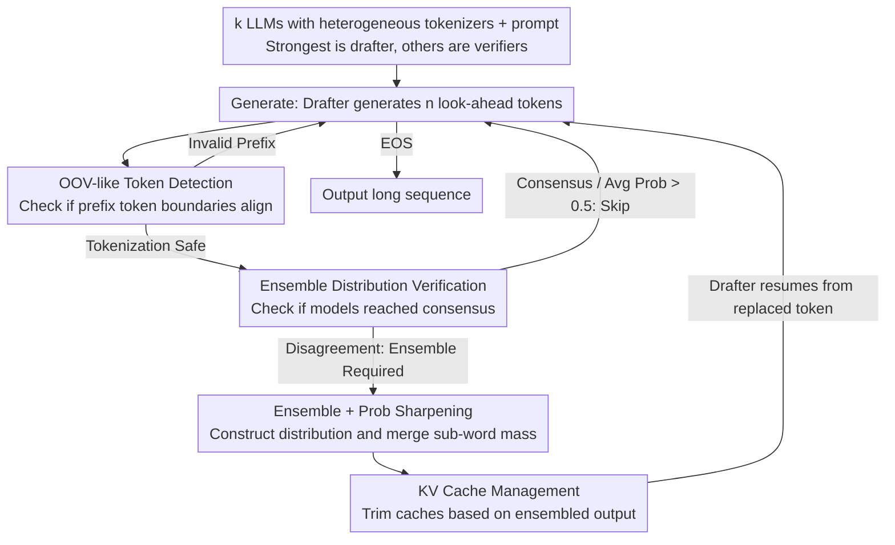

# When to Ensemble: Identifying Token-Level Points for Stable and Fast LLM Ensembling

**Conference**: ICLR 2026  
**arXiv**: [2510.15346](https://arxiv.org/abs/2510.15346)  
**Code**: [https://github.com/yoon6503/SAFE](https://github.com/yoon6503/SAFE)  
**Area**: LLM Evaluation  
**Keywords**: LLM Ensembling, Tokenizer Mismatch, OOV-like token, Speculative Ensembling, Probability Distribution Alignment

## TL;DR
Proposes SAFE (Stable And Fast LLM Ensembling), which selectively ensembles LLMs with heterogeneous tokenizers at the token level via a Generate-Verify-Ensemble loop. It resolves the OOV-like contamination caused by tokenizer mismatches in long-form generation. Ensembling on less than 1% of tokens significantly improves performance, raising UniTE from 59.6% to 77.4% on MATH500.

## Background & Motivation

**Background**: Aggregating next-token probability distributions is an effective method for leveraging the complementary strengths of multiple LLMs. Existing methods like UniTE and GaC perform well on short-form answers (MCQs, direct QA) but suffer from performance degradation or collapse in long-form generation (CoT reasoning).

**Limitations of Prior Work**: **(1) OOV-like token problem**—when an ensembled token does not align with a specific model's tokenization scheme, that model is forced to predict on an invalid prefix, leading to corrupted probability distributions and erroneous tokens (e.g., "Sofia" split as "So"+"fia" by one model versus a single token in another; "So" becomes an OOV-like token for the latter, causing garbled output like "Ã"). These errors accumulate in long sequences. **(2) Efficiency issues**—ensembling every token requires cross-vocabulary alignment, with overhead growing linearly with sequence length.

**Key Challenge**: UniTE's accuracy on MATH500 plummets from 72.4% to 59.6% (and even 43.4% for EXAONE+Qwen2.5) when using CoT, as it ensembles at every token. Ensembling performs worse than a single model in these cases.

**Goal**: Determine **when** to ensemble (which token positions) in long-form generation to achieve both stability and efficiency.

**Key Insight**: Identifying two critical factors for ensembling positions: (i) whether token boundaries are aligned (avoiding OOV-like contamination) and (ii) whether there is a consensus in probability distributions across models (skipping unnecessary ensembles). Borrowing from speculative decoding, a drafter-verifier architecture can reduce the number of autoregressive forward passes.

**Core Idea**: Not every token requires ensembling. Stability and efficiency are simultaneously achieved by ensembling only at positions where tokenization is safe and models disagree.

## Method

### Overall Architecture

SAFE addresses "when to ensemble" rather than "how to ensemble." Since most tokens in a long sequence achieve high consensus among models, token-by-token alignment is risky and computationally wasteful. SAFE utilizes a drafter-verifier structure where the strongest model acts as the drafter (responsible for generation) and the others act as verifiers. The generation proceeds in a three-step cycle: **Generate** (drafter generates a look-ahead sequence of $n$ tokens), **Verify** (verifiers check these $n$ tokens in a single forward pass for OOV-like safety and consensus), and **Ensemble** (ensemble only at the few selected tokens, applying probability sharpening if needed). This architecture keeps end-to-end latency close to that of a single model.

### Key Designs

**1. OOV-like Token Detection: Avoiding unsafe positions before errors occur**

The most fatal risk in heterogeneous ensembling is when a token chosen by the drafter "cuts" a complete token in a verifier's scheme. SAFE proactively identifies these positions. For each verifier $LLM_v$, it re-tokenizes the sequence $\mathbf{t}_{<i+n}$ using $LLM_v$'s tokenizer. If the decoding boundary of a drafter token $t_j$, specifically $\text{Decode}(\mathbf{t}_{<j+1})$, does not align with any of $LLM_v$'s boundaries, $t_j$ is marked as OOV-like, and ensembling at $t_{j+1}$ is skipped. This ensures ensembling only occurs at valid continuation points for all verifiers.

**2. Ensemble Distribution Verification: Skipping consensus tokens**

Constructing an ensemble distribution is expensive. SAFE provides two sufficient conditions to skip ensembling: **Unanimous Consensus** (all models share the same argmax token) or **Average Probability > 0.5**. Both conditions guarantee that the skipped token remains the top-1 token of the full ensemble distribution, saving computation without sacrificing accuracy.

**3. Probability Sharpening: Aggregating dispersed probability mass**

Heterogeneous tokenizers often disperse the probability of a word across multiple sub-words. SAFE sharpens the distribution using two strategies: **Heuristic Suffix Merging** (redistributing probabilities of morphological variants back to a common prefix, e.g., merging "Sofia" and "SofiaŢ" into "So") and **Geometric Mean** (replacing arithmetic mean to penalize low-probability tokens from any single model). Heuristic merging proved more robust in experiments.

**4. KV Cache Management: Re-aligning caches after replacement**

Ensembling may replace tokens, causing KV caches to diverge from the actual output. Unlike previous methods that recompute from scratch, SAFE implements a KV cache management system that updates all models' caches to align with the ensembled output. This is a primary driver for its near-single-model latency.

### Loss & Training

SAFE is a training-free, inference-time method. It is a plug-and-play framework that can be applied on top of existing ensembling methods like UniTE or GaC.

## Key Experimental Results

### Main Results
CoT ensembling using three models (Internlm3-8B + Qwen2.5-7B + EXAONE3.5-7.8B):

| Method | MMLU-redux | MATH500 | GSM8K | BBH | ARC-C | Avg |
|------|-----------|---------|-------|-----|-------|-----|
| Best Single Model | 76.89 | 74.8 | 91.81 | 82.26 | 90.44 | 82.87 |
| UniTE (Every token) | 73.39 | 59.6 | 75.06 | 79.58 | 87.97 | 75.12 |
| UniTE + SAFE (2 models) | **77.81** | **77.4** | **92.04** | **82.97** | 90.78 | **84.20** |
| UniTE + SAFE (3 models) | 77.60 | **79.0** | 92.04 | 82.77 | **91.55** | **84.59** |
| GaC | 77.00 | 74.2 | 91.28 | 82.34 | 90.61 | 83.09 |
| GaC + SAFE | 77.11 | 76.0 | 91.36 | 82.34 | 91.13 | 83.59 |

### Ablation Study

| Component | MATH500 | Note |
|------|---------|------|
| UniTE (w/o SAFE) | 59.6 | Per-token ensembling; severe OOV contamination |
| + OOV-like Detection | ~74 | Significant recovery by adding OOV checks |
| + Consensus Skip | ~76 | Further gain by reducing unnecessary ensembling |
| + Prob Sharpening | 77.4 | Full SAFE framework |
| E/T Ratio (MATH500) | 3.82% | Ensemble performed on <4% of tokens |

### Key Findings
- **SAFE rescues UniTE on MATH500**, improving it from 59.6% to 79.0% (3-model), outperforming the best single model by 4.2%.
- **Mathematics tasks require minimal ensembling**: The Ensemble-to-Token (E/T) ratio is only 4.85% due to high model consistency in structured expressions.
- **General domains require more ensembling**: E/T ratio is around 15% due to higher linguistic variance.
- **2-model ensembles often outperform 3-model ensembles** when the model rankings are known.
- **Latency is near single-model speed** due to the speculative strategy and selective ensembling.
- **Heuristic suffix merging is more robust** than geometric mean sharpening across different datasets.

## Highlights & Insights
- **Precise Problem Definition**: The concept of OOV-like tokens identifies the core bottleneck of cross-tokenizer ensembling.
- **"When" is more important than "How"**: Ensembling on <1% of tokens can outperform full ensembling, shifting the paradigm of LLM integration.
- **Migration of Speculative Decoding**: Successfully adapts speculative decoding from "single-model acceleration" to "multi-model ensembling acceleration."
- **High Practicality**: Training-free, supports heterogeneous tokenizers, and includes a full KV cache implementation for deployment.

## Limitations & Future Work
- **Model Scale**: Primarily tested on 7B-8B models; efficacy on 70B+ models is unexplored.
- **Drafter Selection**: Relies on a prior ranking to select the strongest model as the drafter.
- **Static Look-ahead**: The look-ahead length $n=5$ might not be optimal for all scenarios; adaptive adjustment could be beneficial.
- **Language Sensitivity**: Heuristic sharpening may behave differently across languages like Chinese.

## Related Work & Insights
- **vs. UniTE**: UniTE suffers catastrophic degradation in CoT due to per-token ensembling. SAFE surpasses it by ensembling <20% of tokens.
- **vs. GaC**: GaC ensembles when the primary model's probability $< 0.5$, which partially avoids OOV issues but lacks a systematic solution.
- **vs. Speculative Decoding**: Traditional speculative decoding requires identical tokenizers. SAFE extends this to heterogeneous tokenizers.
- **vs. Post-inference Ensembling (e.g., MoA)**: While post-inference methods avoid token-level issues, they require multiple full passes. SAFE works at the token level with single-pass efficiency.

## Rating
- Novelty: ⭐⭐⭐⭐ (Significant discovery of the OOV-like token issue.)
- Experimental Thoroughness: ⭐⭐⭐⭐⭐ (Comprehensive benchmarks and ablation studies.)
- Writing Quality: ⭐⭐⭐⭐ (Motivated well by clear visualizations.)
- Value: ⭐⭐⭐⭐ (Makes cross-tokenizer ensembling viable for long-form generation.)

<!-- RELATED:START -->

<!-- RELATED:END -->

## Related Papers

- [\[ICLR 2026\] When LLMs Get Significantly Worse: A Statistical Approach to Detect Model Degradations](when_llms_get_significantly_worse_a_statistical_approach_to_detect_model_degrada.md)
- [\[ICLR 2026\] FinSearchComp: Towards a Realistic, Expert-Level Evaluation of Financial Search and Reasoning](finsearchcomp_towards_a_realistic_expert-level_evaluation_of_financial_search_an.md)
- [\[ICLR 2026\] Credit-Budgeted ICPC-Style Coding: When Agents Must Pay for Every Decision](credit-budgeted_icpc-style_coding_when_agents_must_pay_for_every_decision.md)
- [\[ACL 2026\] HoWToBench: Holistic Evaluation for LLM's Capability in Human-level Writing using Tree of Writing](../../ACL2026/llm_evaluation/howtobench_holistic_evaluation_for_llms_capability_in_human-level_writing_using_.md)
- [\[NeurIPS 2025\] HybridNorm: Towards Stable and Efficient Transformer Training via Hybrid Normalization](../../NeurIPS2025/llm_evaluation/hybridnorm_towards_stable_and_efficient_transformer_training_via_hybrid_normaliz.md)

<!-- RELATED:END -->
