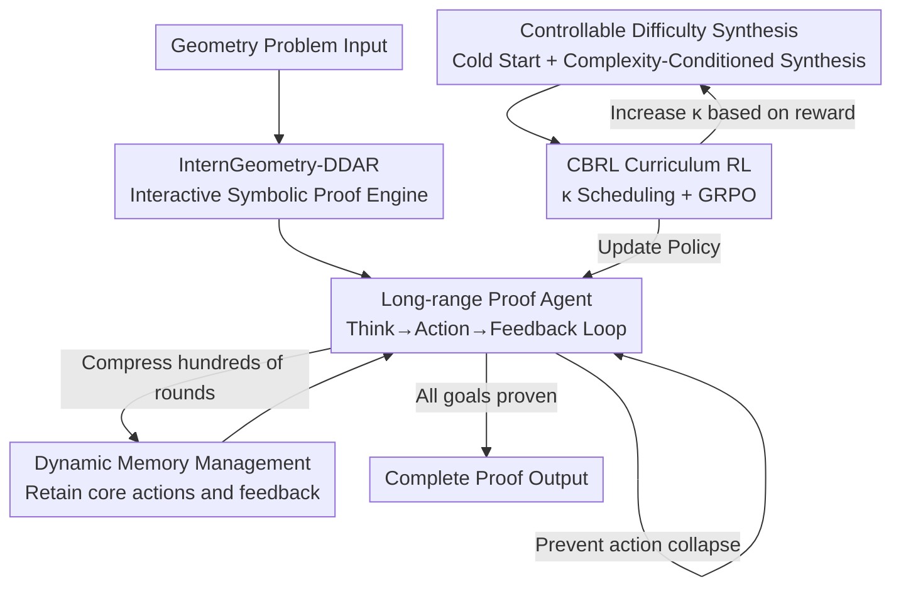

# Achieving Olympia-Level Geometry Large Language Model Agent via Complexity Boosting Reinforcement Learning

**Conference**: ICLR2026  
**OpenReview**: [https://openreview.net/forum?id=1sffPGGQyT](https://openreview.net/forum?id=1sffPGGQyT)  
**Code**: TBD  
**Area**: LLM Reasoning / Geometry Theorem Proving / Agent / Curriculum Reinforcement Learning  
**Keywords**: Geometry Theorem Proving, LLM Agent, Auxiliary Line Construction, Long-range Interaction, Complexity-Boosting Curriculum RL

## TL;DR
This paper introduces InternGeometry—the first geometry LLM agent to achieve medal-winning performance. By treating a symbolic engine as a tool, it utilizes an ultra-long-range "Think-Construct/Propose-Verify-Reflect" interaction (over 200 steps per problem) to overcome the lack of heuristics in auxiliary line construction. Combined with Complexity-Boosting RL (CBRL) to progressively increase the difficulty of synthetic problems, it solves 44 out of 50 geometry problems from IMO 2000–2024 using only 13K training samples (0.004% of AlphaGeometry 2), exceeding the average score of gold medalists.

## Background & Motivation
**Background**: LLM agents in mathematics and programming have demonstrated IMO-level performance by utilizing formal tools like LEAN for iterative reasoning and reflection, suggesting superior generalization. However, in the subfield of **geometry**, the dominant paradigm remains **expert models** such as AlphaGeometry 2 and SeedGeometry. These models rely on hundreds of millions of synthetic data points to train a specialized model for predicting auxiliary lines, which then guides a symbolic engine (DDAR) through large-scale searches.

**Limitations of Prior Work**: Geometry proof chains are exceptionally long, requiring not only the combination of various theorems but also **creative auxiliary line construction**. Reliable heuristics for "where to add a line" are nearly non-existent (weak heuristics), forcing humans to rely on trial and error. The expert model paradigm pays two major costs for this: first, **data explosion** (AlphaGeometry 2 used ~300 million synthetic samples); second, **poor generalization** (expert models only learn to predict constructions without the ability to generalize like universal reasoners).

**Key Challenge**: The mismatch between weak heuristics for auxiliary line construction and the "one-time construction prediction + massive search" paradigm of expert models. The latter sacrifices efficiency and universality by using sheer data and search volume to compensate for weak heuristics. The core issue is that weak heuristics should be overcome by **accumulating insights through exploratory trial-and-error**, rather than by a static, one-shot predictor.

**Goal**: (1) Enable a general-purpose LLM agent, rather than an expert model, to solve IMO-level geometry problems; (2) achieve or exceed expert model performance with minimal data; (3) retain the agent's generalization and creativity (e.g., providing auxiliary lines not found in standard human solutions).

**Key Insight**: It is observed that human experts gain insights into auxiliary lines through "exploratory attempts." If an agent is allowed to interact with a symbolic engine over **long durations and multiple rounds**-proposing propositions, adding auxiliary points, and adjusting based on engine feedback—the "weak heuristics" can be gradually transformed into "strong heuristics" (weak-to-strong heuristic transition).

**Core Idea**: Replace "one-time expert model prediction" with "ultra-long-range LLM–tool interaction + dynamic memory" to tackle weak auxiliary line heuristics, and use "Complexity-Boosting Curriculum RL" to efficiently train the agent to Olympiad difficulty.

## Method

### Overall Architecture
InternGeometry models geometry proof as a long-range dialogue between an agent and an **interactive symbolic engine**. Given a geometry problem, the agent performs natural language slow thinking (Think) at each step, then outputs an action (Action) in DSL format—this can be constructing a geometric object, adding an auxiliary line, or proposing a sub-proposition. After the engine executes the action, it returns feedback (Feedback) regarding the success of the action and current known properties. A dynamic memory module compresses hundreds of interaction rounds into a compact summary fed back to the agent, allowing it to explore for over 200 steps without being overwhelmed by the context. For training, CBRL uses a **difficulty-controlled data synthesis pipeline** to generate problems at the current "stuck" difficulty level, coupled with online GRPO to incrementally push the problem complexity, eventually equipping the agent with Olympiad-level capabilities.

### Key Designs

**1. InternGeometry-DDAR: Converting one-shot symbolic engines into interactive, stateful environments**

The DDAR (deductive database arithmetic reasoning) system used in the AlphaGeometry series follows a "construct all points first, then exhaustively deduce all possible theorems" approach—a one-shot mode unsuitable for an agent adding points during exploration. InternGeometry-DDAR is rebuilt based on the open-source Newclid system with two key modifications: first, the introduction of a stronger point-definition strategy (e.g., **global optimization of point placement** to satisfy constraints) to cover most IMO geometry problems; second, enabling the engine to **maintain state across steps**. The current geometry configuration, auxiliary points, and all proven premises/propositions are saved, allowing the agent to operate incrementally and propose "sub-proof goals" for verification. This transforms the symbolic engine from a static solver into a "formal sandbox" supporting long-range interaction.

**2. Long-range Proof Agent: Using Think–Action–Feedback loops + Rejection Sampling to transform weak heuristics into strong ones**

This is the core of the work. The agent $G$ outputs $[P_t, A_t] = G(X, W(H_{t-1}))$ at step $t$, where $P_t$ is natural language slow thinking, $A_t$ is formal action code, $H_{t-1}$ is history, and $W$ is the memory compressor. Action $A_t$ is executed by the engine to obtain $O_t, E_t = E_{t-1}(A_t)$, and $[P_t, A_t, O_t]$ is appended to the history. This loop can run for over 200 steps. This length is necessary because auxiliary lines lack reliable heuristics; the agent must **repeatedly propose propositions, add constructions, observe which are valid, and adjust its direction** to accumulate knowledge of the problem's geometric properties until a solution is found.

One side effect of long-range interaction is **action collapse**: the model may fall into bad patterns, repeatedly outputting highly redundant actions. A simple **rejection sampling** mechanism is implemented to prevent this. After sampling $[\hat P_t, \hat A_t]$, a rule-based `PassCheck` is applied—forbidding actions identical to history, endless thinking, rounds without valid actions, or consecutive identical action types. This ensures exploration diversity over hundreds of steps.

**3. Dynamic Memory Management $W$: Compressing history to maintain context and guide exploration**

Filling the context with hundreds of rounds of full thinking and detailed feedback would quickly overwhelm the agent. $W$ summarizes early interactions by discarding verbose thinking processes and detailed environmental feedback, **retaining only core action outputs and key environmental outcomes** (e.g., whether a line was successfully added). The feedback from the most recent round is kept intact so the agent knows exactly which propositions are currently known. This provides a concise "panorama" of past actions and their results, which not only compresses the context but also **guides future diverse exploration** by showing which paths have already been exhausted. Ablation studies show this is critical—removing memory compression drops IMO 50 performance from 44 to 20.

**4. CBRL: Using complexity scheduling to maintain problems at "medium difficulty" for efficient RL convergence**

Training directly on difficult problems fails due to extremely sparse rewards, while training only on simple problems fails to generalize to IMO levels. Complexity-Boosting RL (CBRL) **dynamically controls the difficulty of synthetic problems**. A cold-start phase uses a small amount of synthetic data for SFT (target $L_{st}$) to teach the agent the basic paradigm of slow thinking and tool usage. This is followed by an "interaction–training" loop optimized via GRPO. The reward design is **intentionally simple and automatically calculated**: $r = r_o \wedge r_s$. The outcome reward $r_o$ is 1 upon proof completion. The step validity reward $r_s$ checks if a "propose proposition" step was verified by the engine and if an "auxiliary line" step was actually used in the final proof—rewarding only effective steps in successful trajectories and penalizing all steps in failed ones.

Difficulty scheduling is the core of CBRL. Following the observation that IMO difficulty correlates with **DDAR proof steps**, the authors use proof steps $\kappa$ as the complexity metric. In each round, data is sampled with complexity $\kappa$ to train $\theta^* = \arg\max_\theta \mathbb{E}_{X\sim \mathcal{X}(\kappa)} J_{rl}(X,\theta)$, and difficulty is updated by $\kappa^* = \arg\max_\kappa \mathbb{E}_{X\sim\mathcal{X}(\kappa)}\mathbb{E}_{y}|A(X,y)|$—selecting the difficulty that maximizes the **average absolute advantage**. The paper posits that $\kappa^*$ approximately optimizes learning progress (Theorem 1) and that for binary rewards, the maximum average absolute advantage is 0.5, corresponding to a "medium difficulty" that is neither too hard nor too easy (Theorem 2). In practice, $\kappa$ is updated with a learning rate $\alpha$, creating a curriculum where problems become progressively harder.

**5. Controllable Difficulty Data Synthesis Pipeline: Replacing hundreds of millions of expert samples with 13K self-synthesized samples**

The feasibility of CBRL depends on a **difficulty-controllable** problem factory. The pipeline has two stages: (1) In the cold-start phase, due to the scarcity of DSL data, an InternThinker-32B is fine-tuned into an InternGeometry-Formalizer using expert iteration to formalize NL geometry problems, yielding 7K "problem + trajectory" pairs. (2) In the CBRL phase, to address the lack of hard problems, data is **dynamically synthesized** during RL by adding auxiliary lines to random geometric configurations based on statistical priors of a given complexity. InternGeometry-DDAR filters these into new problems with valid constructions, and the difficulty is controlled by the number of proof steps. A total of 6K problems are synthesized here. The combined 13K samples represent only 0.004% of AlphaGeometry 2's dataset. This automated synthesis is key to adjusting curriculum difficulty without limits.

### A Complete Example (IMO 2018 P6)
Problem: Convex quadrilateral $ABCD$ satisfies $AB\cdot CD = BC\cdot DA$. A point $X$ inside satisfies $\angle XAB=\angle XCD$ and $\angle XBC=\angle XDA$. Prove $\angle BXA + \angle DXC = 180°$. Most human solutions rely on inversion, trigonometry, or complex numbers. InternGeometry found an elegant pure geometric route: it picked point $T$ on $AC$ such that $\angle BDA = \angle TDC$, and defined point $K$ as the intersection of two circles—these two points formed a pair of isogonal conjugate points for $ABCD$ (indicating the agent discovered this hidden structure through exploration). It then constructed symmetric points of $T$ with respect to the sides, generalizing the use of isogonal conjugates in triangles to quadrilaterals. This chain was discovered through "propose construction → verify → reflect → propose again" trial-and-error over hundreds of steps, yielding a construction fundamentally different from standard human solutions.

## Key Experimental Results

### Main Results
The test set is IMO 50 (all geometry problems from IMO 2000–2024). Backbone: InternThinker-32B, Max 200 steps, Pass@256.

| Model | Type | Training Data Size | IMO 50 Pass@K |
|------|------|-----------|---------------|
| AlphaGeometry 2 | Expert Model | 300M | 42/50 |
| SeedGeometry | Expert Model | 230M | 43/50 |
| **InternGeometry** | **LLM Agent** | **13K** | **44/50** |

InternGeometry solves the most problems while using only 0.004%–0.006% of the data used by expert models. Its inference budget is also significantly lower than AlphaGeometry 2's beam ensemble. Including IMO 2025 (51 problems total), InternGeometry solves 45, covering all problems solved by AlphaGeometry 2 plus 2018 P6 and 2023 P6. Compared to SeedGeometry, it additionally solves 2001 P5 and 2009 P4b, but misses 2006 P1. Unsolved problems mostly involve calculations beyond pure geometric proof, which are outside DDAR's expressive capability.

### Ablation Study

Ablation of long-range components (Table 3, Pass@256):

| Configuration | IMO 50 | Description |
|------|--------|------|
| Full (Proposals + Slow Thinking + Compression + Rejection) | 44/50 | Complete |
| w/o Proposals (Only auxiliary lines allowed) | 35/50 | Removed proposition/long-range proof steps |
| w/o Proposals + w/o Slow Thinking | 23/50 | Further removed slow thinking |
| w/o Context Compression | 20/50 | Removed dynamic memory |
| w/o Rejection Sampling | 38/50 | Removed anti-collapse mechanism |

CBRL Ablation (Table 4, Pass@256):

| Training Setting | IMO 50 | Description |
|----------|--------|------|
| With CBRL | 44/50 | Full Curriculum RL |
| SFT Cold Start | 22/50 | Cold start only |
| Easy Data Only | 29/50 | Only low-difficulty data |
| Challenging Data Only | 24/50 | Only high-difficulty data |
| Same Data without Schedule | 38/50 | Same data but no difficulty scheduling |

### Key Findings
- **Long-range interaction is the lifeline**: Removing propositions/proof steps drops performance from 44 to 35; removing slow thinking further drops it to 23, and removing context compression drops it to 20. This confirms that the "weak-to-strong heuristic transition" relies on extended trial-and-error.
- **Longer trajectories are more cost-effective than repeated sampling**: Within the same inference budget (Samples K × Steps), increasing a single trajectory from 64 to 200 steps yields much faster improvements than multiple short samples, showing that long-range interaction is the superior way to accumulate heuristics in geometry.
- **Difficulty must be "Just Right"**: Using only easy (29) or only hard (24) problems is inferior to CBRL (44). Hard problems suffer from sparse rewards, while easy problems fail to generalize. Removing scheduling (38) also results in a significant drop. A major performance jump on IMO 50 occurs at the 6th training round.
- **Creativity**: Case studies show the agent can generate auxiliary line constructions not found in human solutions (e.g., the pure geometric isogonal conjugate construction for 2018 P6).

## Highlights & Insights
- **Shifting from "One-shot Expert Prediction" to "Long-range Agent Exploration"**: This is a paradigm shift. Instead of relying on a static predictor to brute-force weak heuristics, the system uses hundreds of interaction steps to gradually accumulate geometric insights. This saves 99.996% of data while retaining the generalization and creativity of universal reasoning.
- **Strong Theoretical Anchor for Difficulty Scheduling**: Using the "maximum average absolute advantage" as a difficulty selection target and proving that for binary rewards, the maximum is exactly 0.5 (corresponding to medium difficulty) transforms curriculum difficulty selection from empirical tuning into a computable optimization goal.
- **Minimalist Rule-based Reward**: $r = r_o \wedge r_s$ is calculated automatically without a trained reward model. The definition of "step validity" (auxiliary lines must be used in the final proof) cleverly pushes credit assignment down to the step level.
- **Dual Role of Dynamic Memory**: Compressing history saves context and guides future exploration by exposing the trajectory—it is the single most impactful component in the ablation study (dropping 44→20 when removed).

## Limitations & Future Work
- **Constraint by Symbolic Engine Expressiveness**: Most unsolved problems involve calculations beyond the scope of pure geometry, falling outside DDAR's capabilities.
- **Domain Scope**: The CBRL + long-range agent paradigm has not yet been verified in other mathematical subfields like algebra or combinatorics, which also feature weak heuristics and creative constructions.
- **Inference Budget**: While lower than AlphaGeometry 2, Pass@256 with 200 steps still implies high inference costs per problem.
- **Complexity Metrics**: $\kappa$ uses DDAR steps as a proxy for difficulty, but more steps do not always mean "harder for the model." Finer-grained metrics could yield smoother curricula.

## Related Work & Insights
- **vs AlphaGeometry 2 / SeedGeometry**: These follow the expert model paradigm, training specialized models on hundreds of millions of samples for one-shot prediction. Ours uses an LLM agent paradigm, achieving superior results with 13K data points through long-range trial-and-error and discovering novel constructions.
- **vs Mathematical RL Agents (DeepSeek-Prover, Seed-Prover)**: These typically use Python or LEAN for miniF2F or ProofNet and rarely address geometry. This work fills that gap by building an interactive DDAR engine specifically for geometry.
- **vs Curriculum RL Agents (Voyager, WebRL)**: These methods often rely on highly structured task templates. InternGeometry's data synthesis allows for automated, unbiased, and limitless synthesis at specific difficulty levels.

## Rating
- Novelty: ⭐⭐⭐⭐⭐ First medal-level geometry LLM agent; replaces expert models with a long-range interaction paradigm and provides theoretical difficulty characterization.
- Experimental Thoroughness: ⭐⭐⭐⭐⭐ Full coverage of IMO 50 + 2025; detailed ablations for both long-range components and CBRL; includes problem-by-problem comparisons and case studies.
- Writing Quality: ⭐⭐⭐⭐ Methodology and motivation are clear; formulas and diagrams are well-integrated. Some implementation details (point placement, synthesis) are relegated to the Appendix.
- Value: ⭐⭐⭐⭐⭐ Outperforms SOTA expert models with 0.004% of the data; provides a reusable paradigm for "Agent + Curriculum RL" in weak heuristic tasks.

<!-- RELATED:START -->

## Related Papers

- [\[ACL 2025\] Enhancing the Rule Learning Ability of Large Language Model Agent through Induction, Deduction, and Abduction](../../ACL2025/llm_nlp/idea_enhancing_the_rule_learning_ability_of_large_language_model_agent_through_i.md)
- [\[AAAI 2026\] TransMamba: A Sequence-Level Hybrid Transformer-Mamba Language Model](../../AAAI2026/llm_nlp/transmamba_a_sequence-level_hybrid_transformer-mamba_language_model.md)
- [\[ACL 2026\] Generative Floor Plan Design with LLMs via Reinforcement Learning with Verifiable Rewards](../../ACL2026/llm_nlp/generative_floor_plan_design_with_llms_via_reinforcement_learning_with_verifiabl.md)
- [\[ACL 2025\] Achieving Certification-by-Design Through Model-Driven Development](../../ACL2025/llm_nlp/achieving_certification-by-design_through_model-driven_development.md)
- [\[ICML 2026\] T$^2$PO: Uncertainty-Guided Exploration Control for Stable Multi-Turn Agentic Reinforcement Learning](../../ICML2026/llm_nlp/t2po_uncertainty-guided_exploration_control_for_stable_multi-turn_agentic_reinfo.md)

<!-- RELATED:END -->
