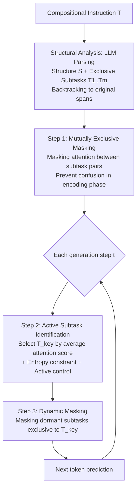

# Attend to the Active: Structure-Aware Dynamic Attention in LLMs for Compositional Instruction Following

**Conference**: ICLR 2026  
**OpenReview**: [https://openreview.net/forum?id=wwA0X3UfAn](https://openreview.net/forum?id=wwA0X3UfAn)  
**Code**: TBD  
**Area**: LLM / NLP (Instruction Following, Attention Steering)  
**Keywords**: Compositional Instruction Following, Attention Steering, Structure-Aware, Training-Free, Mutually Exclusive Subtasks, Inference-Time Intervention  

## TL;DR
ATA identifies the structural types of compositional instructions (Chaining/Branching/Paralleling) and decomposes mutually exclusive subtasks in a single forward pass without updating any parameters. By dynamically identifying the currently "active" subtasks at each generation step and masking the "dormant" ones using attention bias, it eliminates interference between subtasks and significantly improves LLM faithfulness to complex compositional instructions.

## Background & Motivation
**Background**: While LLMs excel at single instructions, real-world scenarios increasingly require them to handle "compositional instructions"—prompts containing multiple subtasks. However, prior research mostly focuses on coupled constraints that "must be satisfied simultaneously" (e.g., matching both semantics and format), with limited exploration of complex structures where subtasks are **logically independent or even mutually exclusive**.

**Limitations of Prior Work**: The authors categorize compositional instructions into three prototypical structures: **Chaining (sequential execution)**, **Branching (conditional selection)**, and **Paralleling (stacks of independent tasks)**. A shared characteristic is that at any generation step, only one subtask should be "active" to dominate the output, while others should remain "dormant." In practice, LLMs tend to diffuse attention across the entire context. Dormant subtasks, due to structural entanglement with active ones, "distract" the model's attention, causing three types of errors: **Wrong Generation (executing the wrong branch)**, **Mixed Generation (outputting interleaved information from exclusive subtasks)**, and **Omitted Generation (skipping required active subtasks)**.

**Key Challenge**: Existing solutions rely either on **fine-tuning** (expensive data and heavy resources) or **high-level planning / iterative self-reflection** (multiple reasoning rounds, dependence on intermediate step quality, and high overhead). Fundamentally, these methods fail to suppress attention toward dormant subtasks during inference. The root of the problem lies in attention allocation; external patches that bypass attention only treat symptoms rather than the cause.

**Goal**: To provide a "targeted remedy" at the attention level under a training-free, single-forward-pass setting by dynamically locking the active subtask and suppressing attention to dormant subtasks.

**Core Idea (Structure as Safety Guardrails)**: The LLM is first used to parse the instruction's structure and its mutually exclusive subtasks. This structural information serves as **guardrails to constrain the scope of attention intervention**—masking occurs only on the token spans of mutually exclusive subtasks without touching the rest of the context. This preserves global information while eliminating interference. This work is the first to systematically attribute LLM degradation in compositional instructions to attention mechanics and to incorporate "Paralleling" structures into the research.

## Method

### Overall Architecture
ATA (Attend To the Active) links structural analysis and attention steering into a training-free pipeline. First, the same LLM, with a carefully designed prompt, parses the instruction into `(structure type S, list of mutually exclusive subtasks T₁…Tₘ)` and **backtracks** each subtask to the original token spans to prevent extraction drift. Subsequently, a three-stage rewrite is applied to the raw attention in every generation step: masking mutual attention between exclusive subtasks (to prevent confusion), selecting the active subtask based on attention scores, and finally masking dormant subtasks exclusive to the active one (to prevent interference). The process only modifies the attention score matrix without updating weights and acts only on a few most relevant attention heads.

### Key Designs

**1. Structural Analysis and Subtask Backtracking: Decoupling "entangled instructions" into clean exclusive units.** While LLMs may fail at end-to-end execution of complex structures, they are adept at interpreting and decomposing subtasks. ATA uses a JSON prompt to output **structure labels** (Chain/Branch/Parallel) and **enumerated subtasks**: $S, T_1, \dots, T_m = \mathrm{LLM}(T\mid P)$. To prevent token-level extraction errors, each extracted subtask is **matched back to its corresponding span in the original text**, serving as the coordinate benchmark for all subsequent attention masking. The authors demonstrate the robustness of this design: since intervention only occurs within subtask spans, even if the structural recognition misses details, it merely masks "slightly less," remaining non-destructive to the global context.

**2. Mutually Exclusive Masking (Step 1): Making exclusive subtasks "invisible" to each other during encoding.** Sequential subtasks should not see future steps, branching subtasks should not reference each other to avoid ambiguity, and parallel tasks should not interfere with respective comprehension. ATA draws from the causal attention mechanism in LLMs, which uses $-\infty$ to mask future tokens, and applies a negative bias matrix $M$ to token sets of exclusive subtask pairs:

$$H^{(l,h)} = \mathrm{Softmax}\big(A^{(l,h)} + M^{(l,h)}\big)V, \quad M^{(l,h)}(T_i, T_j) = \begin{cases} -\alpha, & T_i \perp T_j \\ 0, & \text{otherwise} \end{cases}$$

After Softmax, attention between exclusive subtask pairs is compressed by $\exp(\alpha)$, ensuring decoupled representations and semantic independence. $\alpha$ controls masking strength; $\alpha = \log 100$ is fixed throughout experiments.

**3. Active Subtask Identification (Step 2): Dynamically locking the "protagonist" via attention scores and entropy confidence.** At generation step $t$, ATA scores each subtask by calculating the average attention its tokens receive from subsequent queries:

$$\mathrm{score}(T_i, t) = \frac{1}{|T_i|} \sum_{k \in T_i} \frac{1}{t-k} \sum_{k \le q \le t} A^{(l,h)}(q, k)$$

The subtask with the highest score is designated as the active subtask $T_{\text{key}}$. Because Step 1 has already isolated exclusive subtasks, this score is free from crosstalk. To prevent erroneous switching, ATA adds an **entropy constraint**: a switch is only accepted if the entropy of normalized subtask scores $H(\cdot) < \epsilon = \gamma\log(m)$ (where $\gamma=0.5$ adapts to the number of subtasks $m$). Lower entropy indicates higher confidence; if the threshold is exceeded, the previous masking state is maintained to avoid being misled by transient attention jitters. On top of this, **active control** is applied: Chaining/Paralleling only allows sequential $T_1\to T_2\to\cdots$ movement, while Branching locks onto a single active subtask once selected, preventing illegal structural transitions.

**4. Dynamic Attention Masking + Head Selection (Step 3): Focusing the model solely on the active subtask.** Once $T_{\text{key}}$ is locked, all mutually exclusive subtasks are deemed dormant. ATA applies the negative bias to their attention columns:

$$M^{(l,h)}(:, T_j) = \begin{cases} -\alpha, & T_j \perp T_{\text{key}} \\ 0, & \text{otherwise} \end{cases}$$

This suppresses attention to dormant subtasks while relatively boosting attention to the active one, precisely steering the model's "gaze." Notably, this rewrite is **applied only to a small subset of attention heads** specifically sensitive to the active subtasks (e.g., 50 heads for Branching, 20 for Chaining/Paralleling). Since attention head patterns are highly heterogeneous, a blanket application could damage global comprehension or cause model collapse. The total overhead is less than 7%, requiring no weight updates.

## Key Experimental Results

**Benchmarks**: Chaining (325 samples, subtask lengths 2–3, from Complexbench), Branching (435 samples, single to nested conditions, from Complexbench), Paralleling (450 samples, concatenated independent tasks from gsm8k). Models: Llama3-8B-Instruct, Mistral-7B-Instruct.

### Main Results (Follow Rate %, Avg.)

| Method | Chain | Branch | Parallel | All Avg. |
|---|---|---|---|---|
| **Llama-3-8B-Instruct** | | | | |
| Direct I/O | 59.21 | 54.63 | 59.80 | 57.88 |
| CoT Prompting | 57.69 | 55.02 | 64.97 | 59.23 |
| Decomposition | 54.63 | 50.04 | 62.58 | 55.75 |
| Think-Execute | 60.85 | 52.92 | 63.14 | 58.97 |
| Self-correction | 61.74 | 55.24 | 61.25 | 59.41 |
| **ATA (Ours)** | **62.98** | **58.74** | **69.91** | **63.88** |
| **Mistral-7B-Instruct** | | | | |
| Direct I/O | 56.31 | 48.83 | 34.89 | 46.67 |
| Self-correction | 56.94 | 47.65 | 35.22 | 46.60 |
| **ATA (Ours)** | **58.37** | **52.16** | **41.34** | **50.62** |

On the Parallel structure, ATA yields a +10.11% gain for Llama3-8B (59.80→69.91), while baselines like CoT or Decomposition are largely ineffective or even detrimental. Methods involving iterative feedback (Self-correction, Think-Execute) also lag behind; the authors suggest these rely on high-quality intermediate feedback and still distribute attention across all subtasks, introducing interference.

### Ablation Study

| Variant | Chain | Branch | Parallel |
|---|---|---|---|
| Direct (No intervention) | 59.21 | 54.63 | 57.88 |
| **ATA (Full)** | **62.98** | **58.74** | **69.91** |
| w/o Structure Info | 60.45 | 55.28 | 60.35 |
| w/o Mutual Mask | 61.82 | 57.03 | 67.42 |
| w/o Dynamic Mask | 60.74 | 56.65 | 64.31 |
| w/o Active Control | 61.14 | 57.23 | 66.82 |

Comparing attention steering strategies on Parallel: Direct 57.88 / SampleAttention 57.71 / PASTA 60.43 / **ATA 69.91**. ATA's "Misguided Steering" and "Random Steering" variants drop to 54.12 / 56.81, proving that **accurate steering direction** is critical.

### Key Findings
- **Structural information is vital**: Removing structural info causes the Parallel score to plummet from 69.91 to 60.35, as losing span constraints leads to unintentional masking of global context or overlapping of incomplete subtasks.
- **Masking modules serve distinct roles**: Mutually exclusive masking primarily eliminates Mixed/Wrong errors (preventing confusion during encoding), while dynamic masking ensures faithful execution of the active task. Figure 4(a) shows that the full ATA achieves the largest reduction across all three generation error types.
- **Robustness to structural recognition quality**: Even with partial structural information, performance remains significantly higher than Direct, validating the "non-destructive masking" design.
- **Head selection sweet spot**: Selecting 20–50 sensitive heads works best; using all heads causes degradation as global information is overly attenuated.
- **Negligible overhead**: Runtime overhead from attention rewriting is < 7% with zero parameter updates.

## Highlights & Insights
- **Attributing compositional instruction failure to "attention captured by dormant subtasks"**: A clean, explainable approach that treats the problem directly at the attention level with minimal intervention.
- **"Structure as guardrails" is the key insight**: By parsing the structure first and restricting intervention strictly to mutually exclusive subtask spans, ATA avoids the common pitfall where attention masking damages global context, making training-free intervention safe.
- **Dynamicity**: The active subtask migrates with generation steps. Coupled with entropy confidence and active control, this is more suited to the dynamic nature of compositional instructions than static steering methods like PASTA or autoPASTA.
- **Inclusion of Parallel structure**: ATA is the first to include and solve for the Parallel structure, filling a gap in the compositional instruction research landscape.
- **Plug-and-play and single forward pass**: No parameter updates required, making it easily attachable to various off-the-shelf LLMs with high practical utility.

## Limitations & Future Work
- **Reliance on LLM for structural parsing**: The structure types cover three prototypes (Chain/Branch/Parallel). For highly complex nested/hybrid structures or parsing failures, the guardrail may fail (though it is robust to minor omissions, it lacks protection against total misjudgment).
- **Heuristic hyperparameters and head selection**: Parameters such as $\alpha=\log100$, $\gamma=0.5$, and head counts (20/50) are empirical settings. Portability across different models or tasks requires further verification.
- **Limited scale**: Validation is restricted to 7-8B models (Llama3/Mistral). Gains and overhead ratios on larger models or specialized reasoning models (e.g., DeepSeek-R1) are unknown.
- **Dependency on attention score interpretability**: The method assumes active subtasks can reliably emerge from attention scores, which might not hold for models with "flatter" attention patterns or those specifically trained differently.

## Related Work & Insights
- **Compositional Instruction Following**: Compared to Chain-of-Instruction (sequential) or Complexbench (conditional) which cover limited structures and rely on fine-tuning/multi-round reasoning, ATA unifies three structures in a single forward pass.
- **Attention Steering**: While SampleAttention/SASK promotes efficiency via sparse attention (often losing context), and PASTA/autoPASTA magnifies pre-defined or self-selected regions (static), ATA differentiates by **restricting steering to exclusive spans** and **dynamically switching the active target** step-by-step.
- **Insights**: Inference-time steering is becoming a cost-effective path to modify behavior without touching parameters. ATA demonstrates a general paradigm: use LLMs to parse structural constraints and then use these constraints as safety boundaries for attention intervention. This could extend to long-document partitioning, multi-constraint generation, or agent subtask scheduling.

## Rating
- **Novelty**: ⭐⭐⭐⭐ — First to systematically attribute degradation to attention dispersion and introduce the Parallel structure with dynamic structure-aware steering.
- **Experimental Thoroughness**: ⭐⭐⭐⭐ — Includes three structures, two models, five strong baselines, and extensive ablation/robustness analysis; however, lacks evaluation on larger-scale models.
- **Writing Quality**: ⭐⭐⭐⭐ — Clear problem characterization (the three error types), well-defined structures, and a clear three-stage method combining formulas with intuition.
- **Value**: ⭐⭐⭐⭐ — Training-free, single forward pass, plug-and-play with <7% overhead; highly attractive for practical complex instruction handling.

<!-- RELATED:START -->

## Related Papers

- [\[ACL 2025\] Revisiting Compositional Generalization Capability of Large Language Models Considering Instruction Following Ability](../../ACL2025/llm_nlp/compositional_generalization_instruction.md)
- [\[ICLR 2026\] Enhancing Persona Following at Decoding Time via Dynamic Importance-Guided Token Estimation for Role-Playing Agents](enhancing_persona_following_at_decoding_time_via_dynamic_importance-guided_token.md)
- [\[ICLR 2026\] Prompt-MII: Meta-Learning Instruction Induction for LLMs](prompt-mii_meta-learning_instruction_induction_for_llms.md)
- [\[ICLR 2026\] Compositional-ARC: Assessing Systematic Generalization in Abstract Spatial Reasoning](compositional-arc_assessing_systematic_generalization_in_abstract_spatial_reason.md)
- [\[ACL 2025\] MDCure: A Scalable Pipeline for Multi-Document Instruction-Following](../../ACL2025/llm_nlp/mdcure_a_scalable_pipeline_for_multi-document_instruction-following.md)

<!-- RELATED:END -->
