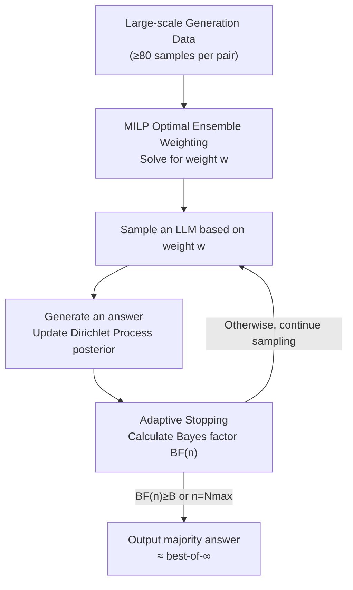

# Best-of-∞: Asymptotic Performance of Test-Time LLM Ensembling

**Conference**: ICLR2026  
**OpenReview**: [https://openreview.net/forum?id=3qiCnLf3jf](https://openreview.net/forum?id=3qiCnLf3jf)  
**Code**: https://github.com/jkomiyama/BoInf-code-publish/  
**Area**: LLM Inference / Test-time Compute / Ensembling  
**Keywords**: best-of-N, majority voting, adaptive sampling, Bayes factor, mixed-integer linear programming

## TL;DR
This paper frames majority voting as repeated sampling from a model's answer distribution, investigating the limit accuracy as the number of samples $N\to\infty$ (termed best-of-∞). It utilizes Bayes factors for adaptive stopping to approximate this limit within finite budgets and formalizes the "optimal weights for ensembling multiple LLMs" as a Mixed-Integer Linear Programming (MILP) problem, demonstrating that ensembling consistently outperforms any single model.

## Background & Motivation

**Background**: Increasing test-time compute is an effective means to improve LLM reasoning reliability. One of the simplest and most practical approaches is best-of-N (BoN): sampling $N$ answers for the same problem and selecting one. Selection methods primarily involve using Reward Models or LLMs as judges to pick the "best" one, or performing majority voting (self-consistency) to select the most frequent answer.

**Limitations of Prior Work**: Reward-model-based methods are prone to reward hacking and may overfit reward signals as $N$ increases. While majority voting is robust and tends to improve as $N$ grows, practitioners typically use a fixed, small $N$ (e.g., $N=8$ in technical reports). There is a lack of clarity regarding the theoretical performance limit as $N$ continues to increase, as well as how to optimally allocate generation budgets per problem under a total budget. Furthermore, when combining multiple open-source LLMs for joint majority voting, there was no computable solution for "optimal weights," as enumerating all answer combinations for finite $N$ is exponential.

**Key Challenge**: Majority voting with a fixed $N$ allocates compute **uniformly** across all problems, even though simple problems may only require a few samples while difficult ones require more. Simultaneously, the optimization objective for "optimal weight combinations" is **non-concave** over the weight simplex, causing gradient-based methods to get stuck in local optima, while exact combinatorial optimization remains exponentially complex for finite $N$.

**Goal**: (1) Provide a theoretical upper bound for "how good sampling can get" — best-of-∞; (2) Design a stopping rule that approximates this limit under finite budgets by adaptively allocating samples based on problem difficulty; (3) Transform the "optimal ensemble weights" problem into an optimization task solvable by off-the-shelf solvers.

**Key Insight**: The authors observe that **only in the $N\to\infty$ limit** does the ensemble objective function exhibit a "polytope" structure, which collapses the exponential combinatorial optimization into a standard MILP. In other words, taking the limit actually simplifies the optimization.

**Core Idea**: Treat majority voting as sampling from an unknown answer distribution. Use a Dirichlet Process prior + Bayes factors to determine if the "current top-voted answer is the true mode" to decide when to stop (adaptive approximation of best-of-∞). Leverage the polytope structure in the limit to solve for optimal ensemble weights via MILP.

## Method

### Overall Architecture

The method consists of **offline weight learning** and **online adaptive inference**. Offline: Use large-scale generation data (at least 80 samples per LLM-problem pair) to estimate the answer distribution of each model on each problem, then solve an MILP to obtain the ensemble weight vector $w=(w_1,\dots,w_K)$. Online: For a new problem, randomly select an LLM according to weights $w$ to generate an answer, update a Dirichlet Process posterior, and calculate the Bayes factor $\mathrm{BF}(n)$ to judge if the current most frequent answer is "credible enough" to be the true mode. Once $\mathrm{BF}(n)$ exceeds a threshold $B$ (or reaches a maximum $N_{\max}$), sampling stops and the majority answer is output.

### Key Designs

**1. Best-of-∞ Perspective: Majority voting as sampling from a distribution as $N\to\infty$**

The accuracy of fixed-$N$ majority voting fluctuates and lacks a clear ceiling. This paper adopts a different perspective: each generation is an independent sample from the LLM's true answer distribution $p=(p_1,p_2,\dots)$ for a specific problem. Majority voting uses the empirical mode to estimate the true mode. As $N\to\infty$, provided there is no tie for the first place (i.e., $p_1>p_2\ge\cdots$), the empirical mode almost surely converges to the true mode $\arg\max_j p_j$. The corresponding accuracy is best-of-∞ — a deterministic upper bound for the model (or ensemble) under infinite sampling. This perspective transforms the empirical question of "can sampling get better" into an analytical question of "what is the limit and how to approximate it with finite samples."

**2. Adaptive Stopping: Dirichlet Process posterior + Bayes factor**

Allocating fixed $N$ to every problem is wasteful. The difficulty lies in the fact that the **support of the LLM answer distribution is unknown** — sometimes only two candidates appear, sometimes five, or potentially infinitely many (e.g., open-ended integer answers). The authors utilize non-parametric Bayes: place a Dirichlet Process prior $\mathrm{DP}(H,\alpha)$ on the answer space, where $H$ is the base distribution and $\alpha>0$ is the concentration parameter. After $n$ rounds with $s(n)$ distinct answers and counts $N_1\ge N_2\ge\cdots$, the posterior is:

$$\mathrm{DP}\!\left(\frac{\alpha}{\alpha+n}H + \frac{1}{\alpha+n}\sum_{j=1}^{s(n)} N_j\delta_{A_j},\ \alpha+n\right).$$

The **Bayes factor** measures the evidence for hypothesis $H_1$ ("the top answer $A_1$ is the true mode") against its negation $H_0$: $\mathrm{BF}:=P(D(n)\mid H_1)/P(D(n)\mid H_0)$. Using Bayes' theorem and a uniform approximation for the prior ratio, this simplifies to $\mathrm{BF}(n)\approx s(n)\,\dfrac{P(H_1\mid D(n))}{1-P(H_1\mid D(n))}$. For $n \gg \alpha$, $P(H_1\mid D(n))$ can be approximated using a Dirichlet distribution as $\Pr[X_1\ge\max_{i\ne1}X_i]$ where $X\sim\mathrm{Dirichlet}(N_1,\dots,N_{s(n)},\alpha)$, estimated via Monte Carlo sampling. **Theorem 1 (Consistency)** guarantees that as $N_{\max},B\to\infty$, the algorithm's performance almost surely converges to best-of-∞.

**3. MILP Optimal Ensemble Weighting: Polytope structure in the limit**

Extending to $K$ LLMs: for each generation, model $i$ is chosen with probability $w_i$. The ensemble is equivalent to a majority vote on the distribution $\sum_i w_i p_{i,\cdot}$. The goal is to choose $w$ to maximize the number of correct problems $f(w)=\sum_q \mathbf{1}[a_q=g_q]$. **Lemma 1**: In best-of-one (Bo1), the optimal weight simply puts all weight on the single strongest model. **Lemma 2**: In best-of-∞, $f(w)$ is **non-concave** on the simplex. **Lemma 3 (Polytope Lemma)**: In the limit, the set $\{w:\sum_i w_i p^q_{ij}>\max_{j'\ne j}\sum_i w_i p^q_{ij'}\}$ where answer $j$ is the mode is an intersection of half-spaces and the simplex, forming a **polytope**. Maximizing correct answers is equivalent to finding $w$ contained in the maximum number of "correct" polytopes. This is formulated as an MILP (**Lemma 4**):

$$\max_{w\in\Delta_K,\,y\in\{0,1\}^N}\ \sum_q y_q \quad \text{s.t.}\ \ w_i\ge0,\ \textstyle\sum_i w_i=1,\ \ A_q w\ge -m(1-y_q)\ \forall q,$$

where the $j,i$-th entry of $A_q$ is $p^q_{i,g_q}-p^q_{i,j}$. This is the first **computable and provably optimal** weighting method for LLM majority voting ensembles.

**4. Max-margin Solution**

Since the optimal solution $f(w)$ often forms a continuous region, any interior point is optimal in best-of-∞. However, their performance at **finite $N$** differs; points closer to boundaries are less robust. The authors select a "max-margin" solution by introducing a margin $\xi>0$ into the constraints ($A_q w \ge \xi$) and performing a binary search to find the largest $\xi$ that does not decrease the objective $\sum_q y_q$. This selects the solution most robust to finite sampling noise.

### Loss & Training
Ours does not train model parameters. "Learning" refers to estimating $\{p^q_{ij}\}$ from offline data and solving the MILP once for $w$. Hyperparameters: $\alpha=0.3$, $1000$ Monte Carlo samples for Bayes factor, $N_{\max}=100$.

## Key Experimental Results

Experiments cover 11 open-source models (≤32B) and 4 reasoning benchmarks (AIME2024, AIME2025, GPQA-DIAMOND, MATH500), with at least 80 generations per "LLM-problem" pair.

### Main Results: Ensemble vs. Single Model / Majority Vote vs. Other Selectors

| Setting | Object | best-of-∞ Accuracy | Note |
|------|------|------------------|------|
| Single Model | GPT-OSS-20B (AIME2025) | 90.0% | Strongest single model |
| Single Model | Nemotron-Nano-9B-v2 (AIME2025) | 73.0% | Weak model |
| **Ensemble** | Weighted Ensemble of both (AIME2025) | **93.3%** | Complementary models improve performance |

On GPQA-Diamond, optimizing weights for 5 models yielded $w=(0.0176,0.0346,0.2690,0.4145,0.2644)$. The ensemble exceeds any single model at $N\ge5$. In AIME2025, using only 5 training problems allowed the learned weights to approximate the best single model; with more problems, it reached 93.3% (vs. 90.0% for the best single model). Transferability: weights learned on AIME2024 applied to AIME2025 showed that 64.2% of 3-model ensembles outperformed the strongest single model.

Comparison of selection methods on best-of-five (Bo5, GPT-OSS-20B, AIME2025):

| Selection Method | Accuracy Mean ± CI |
|----------|------------------|
| Omniscient (Upper bound, requires gold) | 91.04 ± 1.32 |
| **Majority Voting (Ours)** | **85.42 ± 2.01** |
| LLM-as-a-judge (tournament) | 82.92 ± 2.57 |
| LLM-as-a-judge (set) | 81.25 ± 2.42 |
| Skywork-Reward-V2-Qwen3-8B | 80.00 ± 2.51 |
| INF-ORM-Llama3.1-70B | 79.79 ± 2.54 |
| Self-certainty | 75.83 ± 2.47 |
| Random (≈ Bo1) | 76.25 ± 2.71 |

Majority voting outperforms Reward Models and LLM-as-a-judge under the same Bo5 budget.

### Key Findings
- **Adaptive stopping saves 2–5x compute**: On MATH500, adaptive $\bar N\approx3$ matches fixed $N=10$, and $\bar N\approx10$ matches $N=100$.
- **Weak models are useful**: If complementary to strong models, including weak models in a weighted ensemble can push the limit from 90.0% to 93.3%.
- **"Taking the limit" enables solvability**: While non-concavity makes gradient methods fail, the polytope structure at $N\to\infty$ makes the exponential problem solvable via MILP for $K\approx10$.

## Highlights & Insights
- **Perspective shift provides analyzability**: Reframing the problem as a limit + approximation allows for theoretical guarantees and consistency theorems.
- **Counter-intuitive benefit of the infinite limit**: While infinity is usually harder to compute, here it provides the polytope structure that simplifies combinatorial optimization into MILP.
- **Non-parametric Bayes for unknown support**: The Dirichlet Process handles both finite (MCQ) and infinite (open-ended) answer spaces, providing a natural stopping criterion via Bayes factors.
- **Max-margin selection**: Selecting the center of the optimal weight region balances best-of-∞ optimality with finite-$N$ robustness.

## Limitations & Future Work
- **Dependency on large-scale offline generation**: MILP requires distribution estimates (≥80 samples), which is costly for new tasks or models.
- **Boundaries of the limit assumption**: The theory relies on $p_1 > p_2$; for extremely hard problems with no stable majority, adaptive sampling will hit $N_{\max}$.
- **Restricted to objective/votable tasks**: Majority voting requires comparable answers (math, MCQ). It is not applicable to open-ended creative writing.
- **MILP scaling**: While currently solvable, MILP is NP-hard; scaling to much larger $K$ or answer sets may be challenging.

## Related Work & Insights
- **vs. Reward Models / LLM-as-a-judge**: These require extra models or compute and are prone to reward hacking. Ours is robust, monotonic with $N$, and superior in Bo5 experiments.
- **vs. Standard Self-consistency**: Ours provides a theoretical upper bound (best-of-∞) and uses Bayes factors for adaptive budget allocation, saving 2–5x compute.
- **vs. Prior Adaptive Stopping**: Unlike frequency-based or Beta-approximation methods, our Dirichlet Process handle cases where the number of possible answer categories is unknown.

## Rating
- Novelty: ⭐⭐⭐⭐⭐ The limit-based polytope/MILP transformation is a brilliant perspective shift.
- Experimental Thoroughness: ⭐⭐⭐⭐ Significant scale (11 models, 4 benchmarks, 80+ samples), though limited to objective tasks.
- Writing Quality: ⭐⭐⭐⭐ Clear theoretical derivation and consistent logic.
- Value: ⭐⭐⭐⭐ Provides a theoretically grounded and practical framework for test-time compute allocation and ensembling.

<!-- RELATED:START -->

## Related Papers

- [\[ICML 2025\] BEST-Route: Adaptive LLM Routing with Test-Time Optimal Compute](../../ICML2025/llm_nlp/best-route_adaptive_llm_routing_with_test-time_optimal_compute.md)
- [\[ICML 2026\] Rethinking LLM Ensembling from the Perspective of Mixture Models](../../ICML2026/llm_nlp/rethinking_llm_ensembling_from_the_perspective_of_mixture_models.md)
- [\[CVPR 2025\] Test-Time Visual In-Context Tuning](../../CVPR2025/llm_nlp/test-time_visual_in-context_tuning.md)
- [\[ACL 2025\] TestNUC: Enhancing Test-Time Computing Approaches and Scaling through Neighboring Unlabeled Data Consistency](../../ACL2025/llm_nlp/testnuc_enhancing_test-time_computing_approaches_and_scaling_through_neighboring.md)
- [\[ICLR 2026\] FACT: Fine-grained Across-variable Convolution for Multivariate Time Series Forecasting](fact_fine-grained_across-variable_convolution_for_multivariate_time_series_forec.md)

<!-- RELATED:END -->
## Related Papers

- [\[ICML 2025\] BEST-Route: Adaptive LLM Routing with Test-Time Optimal Compute](../../ICML2025/llm_nlp/best-route_adaptive_llm_routing_with_test-time_optimal_compute.md)
- [\[ICML 2026\] Rethinking LLM Ensembling from the Perspective of Mixture Models](../../ICML2026/llm_nlp/rethinking_llm_ensembling_from_the_perspective_of_mixture_models.md)
- [\[CVPR 2025\] Test-Time Visual In-Context Tuning](../../CVPR2025/llm_nlp/test-time_visual_in-context_tuning.md)
- [\[ACL 2025\] TestNUC: Enhancing Test-Time Computing Approaches and Scaling through Neighboring Unlabeled Data Consistency](../../ACL2025/llm_nlp/testnuc_enhancing_test-time_computing_approaches_and_scaling_through_neighboring.md)
- [\[ICLR 2026\] SPRIG: Improving Large Language Model Performance by System Prompt Optimization](sprig_improving_large_language_model_performance_by_system_prompt_optimization.md)

<!-- RELATED:END -->
