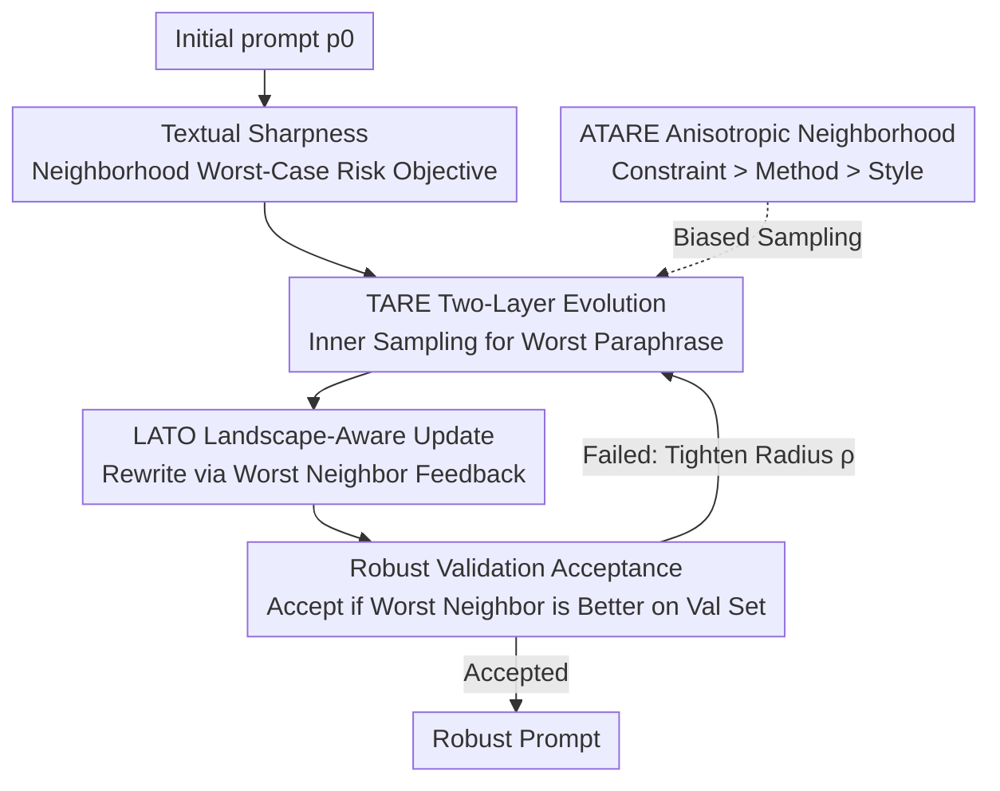

# Beyond Magic Words: Sharpness-Aware Prompt Evolving for Robust Large Language Models with TARE

**Conference**: ICLR 2026  
**OpenReview**: [https://openreview.net/forum?id=YEBDvqsniH](https://openreview.net/forum?id=YEBDvqsniH)  
**Code**: https://github.com/GuanchengWan/TARE  
**Area**: LLM / NLP (Prompt Optimization)  
**Keywords**: Prompt Optimization, Textual Sharpness, Sharpness-Aware Minimization, Evolutionary Search, Robustness

## TL;DR
The authors port "Sharpness-Aware Minimization (SAM)" from image/weight space to the discrete textual prompt space, proposing TARE/ATARE: a gradient-free evolutionary framework that "finds the worst paraphrase in the inner layer and selects the most stable neighborhood in the outer layer." This ensures optimized prompts maintain performance under synonymous rewrites, consistently outperforming TextGrad / Revolve across 4 reasoning benchmarks and 5 evaluated models.

## Background & Motivation
**Background**: LLM performance is highly dependent on how a prompt is written. Automatic prompt optimization has evolved from manual tuning to evolutionary/search methods using "LLMs as optimizers" (e.g., AutoPrompt, RLPrompt, APE, EvoPrompt, TextGrad) to automatically find high-performing prompts on fixed validation sets.

**Limitations of Prior Work**: These methods almost exclusively focus on **point-wise accuracy**—maximizing the score on a specific validation set. Consequently, the resulting prompts are extremely fragile: changing a word to a semantically equivalent synonym ("helpful" $\to$ "supportive", "count" $\to$ "tally") can cause significant accuracy fluctuations. The authors name this phenomenon of "crashing upon rewording" as the **textual sharpness** of the prompt landscape.

**Key Challenge**: The root cause lies in the optimization objective. Optimizing for point-wise accuracy is equivalent to finding a **sharp minimum** in the loss landscape—the point itself has low loss, but a slight shift (synonymous rewrite) causes the loss to spike. While deep learning research shows that **flat minima generalize better** and SAM explicitly pushes solutions toward flat regions, SAM relies on continuous parameter spaces and gradients, making it **impossible to apply directly to discrete, combinatorial text**.

**Goal**: Decomposition into two sub-problems—Q1: How to **formalize and quantify** the "sharpness neighborhood" of a prompt in a discrete semantic space? Q2: How to design a **gradient-free, black-box (API-only)** algorithm to find prompts that are both accurate and robust in this discrete landscape?

**Key Insight**: Traditional definitions of local neighborhoods utilizing "infinitesimal gradient perturbations" are meaningless for text. Thus, the authors use **semantic neighborhoods**—where a high-capability LLM judges if two prompts are semantically equivalent, treating paraphrasing/rephrasing as "local perturbations." Sharpness is defined as the **worst-case performance degradation** within this semantic neighborhood.

**Core Idea**: Adapt the min-max philosophy of SAM to text—inner maximization (finding the worst synonymous rewrite in the neighborhood) and outer minimization (selecting candidates whose neighborhoods remain strong overall). An LLM is used as both sampler and optimizer, without ever accessing model parameters.

## Method

### Overall Architecture
TARE formulates "finding robust prompts" as a discrete min-max problem: $\min_{p\in\mathcal{P}}\max_{p'\in B(p,\rho_\text{text})}\mathcal{L}(p')$. This involves taking the worst paraphrase within the semantic neighborhood $B(p,\rho_\text{text})$ of prompt $p$, then minimizing this worst-case loss. The pipeline is an iterative loop: starting with an initial prompt, **Inner Adversarial Search** samples semantic neighbors and selects the worst-performing adversary $p^\star_\text{adv}$, which is fed along with feedback to the **Outer Update**. The outer update uses a landscape-aware optimizer (LATO) to generate improved candidates, followed by a **Robust Validation** criterion to decide acceptance—a new prompt is accepted only if its worst neighbor performs better on an independent validation set. Otherwise, the search radius $\rho$ is tightened or the budget is increased. ATARE adds an **Anisotropic Neighborhood** layer: it estimates the sensitivity of different prompt components and biases inner sampling (less perturbation for sensitive components, more exploration for robust ones).

### Key Designs

**1. Textual Sharpness: Formalizing "Crashing upon Rewording" in Discrete Semantic Space**

This is the foundation of the work, addressing the limitation that "local flatness/sharpness" has never been defined for text. The authors first equip the prompt space with a **semantic dissimilarity** $d_\text{text}(p,p')$, which is **not a vector distance but a semantic judgment from a high-capability LLM**. This defines an isotropic neighborhood $B(p,\rho_\text{text}):=\{p'\in\mathcal{P}: d_\text{text}(p,p')\le\rho_\text{text}\}$. Within this neighborhood, the **textual sharpness-aware loss** is the local worst-case risk $\mathcal{L}_S(p,\rho_\text{text}):=\max_{p'\in B(p,\rho_\text{text})}\mathcal{L}_D(p')$. The corresponding robust optimization problem is $\min_{p}\mathcal{L}_S(p,\rho_\text{text})$. This step precisely replaces "parameter space perturbations" in SAM with "semantic space paraphrase perturbations," providing an optimizable objective—the optimizer no longer pursues single-point low loss but seeks **low loss across the entire semantic neighborhood**, thereby compressing the sharpness gap.

**2. TARE Two-Layer Evolution: Inner Adversarial Search for Worst Case, Outer Robust Selection + Validation**

This addresses the actual solution of the min-max problem in a discrete landscape. The inner layer uses a generator oracle $G$ to sample a candidate set $C_{K_t}(p_t):=\{p'_1,\dots,p'_{K_t}\}\sim\text{Sample}(G,p_t,\rho_t,K_t)$ within the neighborhood, then selects the one with the highest empirical loss on a minibatch as the worst adversarial neighbor $p^\star_{t,\text{adv}}:=\arg\max_{p'\in C_{K_t}}\hat{\mathcal{L}}(p';B_t)$. This step specifically exposes "harmless-looking but performance-crippling" synonymous rewrites. The outer layer uses an optimizer oracle $O$ to generate an improvement pool $U_{M_t}(p_t)$ given the current prompt and its worst neighbor, then performs **Robust Selection**: $p_{t+1}:=\arg\min_{p'\in\{p_t\}\cup U_{M_t}}\max_{q\in C_{\tilde K}(p')}\hat{\mathcal{L}}(q;B_t)$, picking the candidate with the **smallest neighborhood worst-case value**. This logic of "ascent to find the worst direction, then descent in that direction" mirrors SAM for text. To prevent robustness from being a result of minibatch noise, an **Acceptance Criterion** acts as a safeguard on an independent validation set: acceptance occurs only if $\hat{\mathcal{L}}(p^\star_{t+1,\text{adv}};D_\text{valid})\le\hat{\mathcal{L}}(p^\star_{t,\text{adv}};D_\text{valid})-\eta$ (with tolerance $\eta\ge0$). If not, the budget is increased or the radius is annealed $\rho_{t+1}=\gamma\rho_t$.

**3. ATARE Anisotropic Neighborhood: Adaptive Scaling via Component Sensitivity (Constraint > Method > Style)**

The isotropic ball $B(p,\rho)$ in TARE has an efficiency issue—it treats all parts of a prompt equally, whereas different components have vastly different sensitivities. The authors decompose a prompt into three levels: **Constraint (e.g., output format), Method (e.g., "Think step-by-step"), and Style (e.g., "You are a helpful...")**. Empirical observations show that changing constraints often triggers direct task failure (high sensitivity), while changing style has negligible impact. Formally, the sensitivity of component $j$ is defined as the worst performance degradation when it is perturbed: $s_{t,j}:=\max_{p'\in C_t}\mathbb{I}(p'\text{ modifies }j)\cdot[\mathcal{L}(p')-\mathcal{L}(p_t)]_+$, with anisotropic weights $w_{t,j}\propto s_{t,j}$ (where $s_\text{Constraint}>s_\text{Method}>s_\text{Style}$). The distance is changed to an ellipsoid metric $d_\text{ani}(p_t,p';W_{p_t})=\|W_{p_t}\Delta(p_t,p')\|_2$. During sampling, the probability of editing a component is **inversely proportional to its sensitivity**: $\Pr\{\text{edit }j\}\propto(1/w_{t,j})^\beta,\ \beta\ge1$. The effect is that high-sensitivity output format constraints are strictly protected (only reworded slightly), while low-sensitivity personas can be boldly rewritten—directing the search budget toward robust, explorable areas.

**4. LATO Landscape-Aware Textual Optimizer: Making the Outer Update "Landscape-Visible"**

The instantiation of the outer optimizer $O$ is critical. The authors propose LATO (Landscape-Aware Textual Optimizer). Unlike standard optimizers that only correct errors at the current position $p_t$, LATO feeds **two prompt-loss pairs** $(p_t,\hat{\mathcal{L}}(p_t))$ and $(p^\star_{t,\text{adv}},\hat{\mathcal{L}}(p^\star_{t,\text{adv}}))$ together with textual feedback from the worst neighbor: $\tilde p^{(i)}:=\text{LLM}(\Pi_\text{LATO}(p_t,p^\star_{t,\text{adv}},\hat{\mathcal{L}}(p_t),\hat{\mathcal{L}}(p^\star_{t,\text{adv}}),\text{Feedback},\delta_t))$. By seeing both the "steepness of the loss climb from $p_t$ to the worst neighbor" and "where the worst direction is," LATO gains an **awareness of the local sharpness geometry**. It adjusts the direction and magnitude of edits to push the prompt toward flatter semantic basins—for example, avoiding a concise but fragile "Count the items below" in favor of a robust "List the items one by one and count them" that remains stable across its neighborhood.

### Loss & Training
The process is entirely **gradient-free and API-based**: no model parameters are updated; only the prompt text is optimized. The core objective is the worst-neighborhood risk $\min_p\max_{p'\in B(p,\rho)}\mathcal{L}(p')$. Training involves three types of scheduling: radius annealing $\rho_{t+1}=\gamma\rho_t$ (shrinking when progress stalls), semantic budget $\delta_t$ (constraining edit magnitude to preserve task intent), and sampling budgets $(K_t,M_t,\tilde K)$ to balance computation and robustness. ATARE adds only **linear** overhead relative to the number of components compared to TARE. Experiments were conducted on 8 RTX 3090s.

## Key Experimental Results

### Main Results
4 reasoning tasks (BBH: Object Counting / Temporal Sequences / Tracking Shuffled Objects + GSM8K), 5 tested models. GPT-4o and Claude 3.5 Sonnet serve as optimizers/evaluators. Baselines include CoT, TextGrad, and Revolve. Metric: strict string exact match accuracy (%), ↑ indicates gain over TextGrad.

| Task (GPT-4o oracle) | Target Model | TextGrad | Revolve | TARE | ATARE |
|------|------|------|------|------|------|
| Object Counting | GPT-3.5 | 88.0 | 89.8 | 90.2 | **91.0** |
| Object Counting | Llama 3 8B | 85.8 | 86.8 | 88.7 | **90.3** |
| Temporal Sequences | GPT-3.5 | 81.0 | 84.0 | 87.5 | **88.0** |
| Tracking Shuffled Obj. | Gemini 1.5 Flash 8B | 83.0 | 82.5 | 88.6 | **93.7** |
| Tracking Shuffled Obj. | Llama 3 8B | 55.5 | 52.7 | 57.5 | **67.7** |
| GSM8K | Gemini 1.5 Pro | 93.3 | 93.0 | **95.5** | 94.7 |

TARE/ATARE outperform TextGrad and Revolve in almost all task × model combinations, with ATARE usually performing best. On the most difficult Tracking Shuffled Objects (Llama 3 8B), ATARE achieves a 12% gain over TextGrad.

### Ablation Study
Removing core components on Llama 3.1 8B (Figure 3):

| Configuration | Key Metric | Description |
|------|---------|------|
| Full TARE / ATARE | Best | All mechanisms present |
| w/o Inner Adv. Search | Sig. Drop | Cannot find hard perturbations; sharpness remains hidden |
| w/o LATO | Sig. Drop | Loss of landscape info makes updates blind |
| w/o Robust Validation | Sig. Drop | Gains fail to generalize |
| TARE → ATARE | Steady Gain | Direct ablation of anisotropic search |

### Key Findings
- **All three mechanisms are essential**: Inner adversarial search exposes fragility, LATO provides intelligent landscape-aware updates, and robust validation ensures generalization.
- **Anisotropy provides "free" gains**: ATARE's consistent improvement over TARE validates that allocating perturbation budgets according to sensitivity is effective.
- **Resilience**: Switching the GPT-4o oracle to a weaker Llama 3.1 8B results in performance drops generally under 5% (except for the Tracking task). Reducing the search budget $(K_t,\tilde K)$ to 1-2 only slightly degrades performance, proving the framework is robust and compute-efficient.

## Highlights & Insights
- **Naming a neglected failure mode**: The author's primary contribution is formalizing the phenomenon where "prompts crash upon rewording" as "textual sharpness" and providing an optimizable definition.
- **Cross-domain idea transfer**: Mapping SAM from continuous parameter space (min-max, flat minima, worst-case perturbations) to discrete text space (semantic neighborhood, paraphrase perturbations, LLMs as samplers) is a stellar example of applying established theory to new domains.
- **LLMs as semantic distance metrics**: Defining $d_\text{text}$ as an "LLM's semantic judgment" avoids the fundamental problem of lack of natural distance metrics in discrete text spaces.
- **Reusable sensitivity hierarchy**: The Constraint > Method > Style ranking is an intuitive and practical prior applicable to any work involving prompt editing, perturbations, or defenses.

## Limitations & Future Work
- **Heavy reliance on strong oracles**: The process relies on GPT-4o/Claude 3.5. While showing resilience to weaker oracles, the API cost remains high; no detailed token/cost budget comparison was provided.
- **Narrow task scope**: Evaluations are limited to 4 reasoning tasks with exact-match answers. Effectiveness for open-ended generation, long-context tasks, or multi-turn dialogues is yet to be proven.
- **Subjective neighborhood definition**: "Semantic equivalence" is judged entirely by an LLM, lacking objective calibration.
- **Theoretical depth**: The connection between textual sharpness and generalization remains largely metaphorical, lacking a formal generalization bound.

## Related Work & Insights
- **vs SAM / ASAM (Continuous Space Sharpness)**: SAM uses gradients to find flat minima; this work uses gradient-free sampling to instantiate the same idea in discrete text space.
- **vs TextGrad / Revolve (Strongest Baselines)**: These focus on point-wise accuracy using textual "gradients." TARE explicitly optimizes for neighborhood worst-case risk, making it more stable under rewording.
- **vs EvoPrompt / APE (Evolutionary Prompting)**: While all use LLM-driven evolution, these select "highest score" candidates, whereas TARE selects "minimum neighborhood worst-case" candidates. This change in selection criteria is the source of robustness.

## Rating
- Novelty: ⭐⭐⭐⭐⭐ Formally introducing sharpness to discrete prompts and defining operational robustness criteria is highly valuable.
- Experimental Thoroughness: ⭐⭐⭐⭐ A comprehensive grid of 5 models × 4 tasks × 2 oracles + ablation studies, though restricted to exact-match reasoning tasks.
- Writing Quality: ⭐⭐⭐⭐ The SAM-to-text analogy is clear, and the running example is helpful.
- Value: ⭐⭐⭐⭐ Systematic solution for prompt robustness; the sensitivity priors and semantic neighborhood approach are highly transferable.

<!-- RELATED:START -->

## Related Papers

- [\[ACL 2025\] Beyond Prompt Engineering: Robust Behavior Control in LLMs via Steering Target Atoms](../../ACL2025/llm_nlp/beyond_prompt_engineering_robust_behavior_control_in_llms_via_steering_target_at.md)
- [\[ICLR 2026\] SPRIG: Improving Large Language Model Performance by System Prompt Optimization](sprig_improving_large_language_model_performance_by_system_prompt_optimization.md)
- [\[ICLR 2026\] Spectral Attention Steering for Prompt Highlighting](spectral_attention_steering_for_prompt_highlighting.md)
- [\[ICLR 2026\] DreamOn: Diffusion Language Models For Code Infilling Beyond Fixed-size Canvas](dreamon_diffusion_language_models_for_code_infilling_beyond_fixed-size_canvas.md)
- [\[ICLR 2026\] The Lattice Representation Hypothesis of Large Language Models](the_lattice_representation_hypothesis_of_large_language_models.md)

<!-- RELATED:END -->
