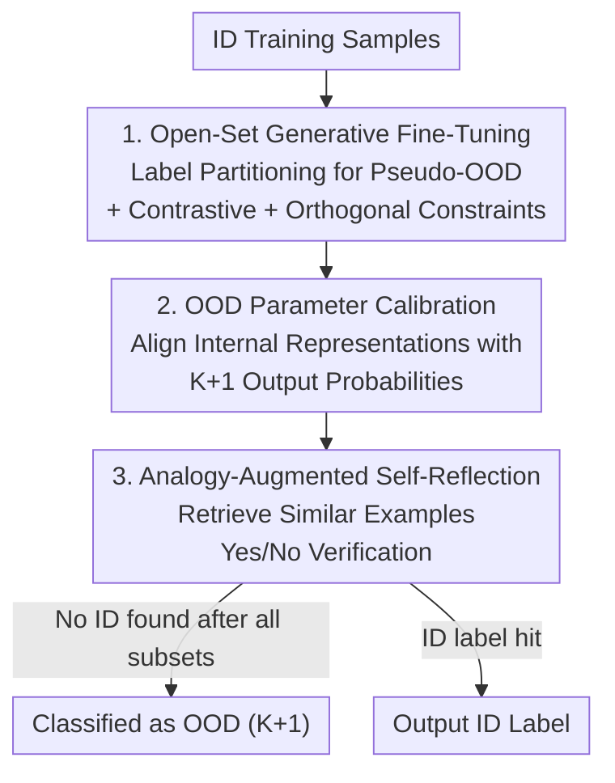

# Beyond the Known: An Unknown-Aware Large Language Model for Open-Set Text Classification

**Conference**: ICLR 2026  
**OpenReview**: [https://openreview.net/forum?id=BqLGlQF46f](https://openreview.net/forum?id=BqLGlQF46f)  
**Code**: https://github.com/cx9941/UnLLM  
**Area**: NLP Understanding / Open-Set Classification / OOD Detection  
**Keywords**: Open-Set Text Classification, OOD Detection, Large Language Models, Subset-Conditional Classification, Self-Reflective Reasoning

## TL;DR
This paper proposes UnLLM, which reformulates Open-Set Text Classification (OSTC) from "closed-set training + post-hoc OOD detection" into a partition-conditional classification task. By providing LLMs with partial label subsets and explicitly marking samples outside the candidates as "unknown," and employing a three-level "representation-probability-inference" optimization, the model consistently outperforms SOTA in K-F1 / N-F1 across six benchmarks.

## Background & Motivation

**Background**: Open-Set Text Classification (OSTC) requires models to correctly classify In-Distribution (ID) samples while reliably rejecting Out-of-Distribution (OOD) inputs. Mainstream approaches typically follow two steps: first, closed-set training on ID data (discriminative models like ADB / CLAP / KNNCon, or generative models like LLM-OOD), followed by applying a post-hoc OOD detection score (MSP, OpenMax, Energy) to determine a rejection threshold.

**Limitations of Prior Work**: Since closed-set training optimizes only on ID labels, the model never sees what "unknown" looks like, often leading to overconfident and biased predictions for OOD inputs. Discriminative fine-tuning compresses embeddings into narrow, dense clusters, which ironically damages OOD separability. While generative fine-tuning (LLM-OOD) leverages the wider output space and pre-trained knowledge of LLMs to create more isotropic and separable representations, it still assumes the label space equals the ID label set. Optimizing only the last token representation on ID label tokens creates a misalignment between training and testing label spaces, dragging down prediction performance.

**Key Challenge**: Authentic open-set training requires "OOD samples with correct supervision," but true OOD samples are unavailable during training. In Computer Vision, methods like VOS / NPO use synthetic virtual outliers to regularize boundaries, but these synthetic samples do not guarantee representation of real OOD distributions, especially introducing label noise and limiting generalization when ID coverage is sparse. Consequently, the authors ask: Is authentic open-set training with "guaranteed correct supervision" fundamentally impossible to achieve?

**Goal**: Transform OOD detection from a post-hoc judgment into an internalized capability during training, while avoiding the fidelity issues of synthetic outliers and addressing three implementation challenges: ① distribution gaps between conditional OOD and true OOD, ② misalignment between internal knowledge and output probabilities, and ③ overconfidence in OOD samples that are semantically similar to known labels.

**Key Insight**: The authors observe that LLM generative heads naturally possess a larger output space and can directly dedicate token dimensions to "unknown." By feeding LLMs a **partial subset** of labels during training—deliberately excluding the ground-truth label from candidates—one can construct "partition-conditional" OOD samples where the label is guaranteed to be correct, allowing the model to explicitly perceive open-set risks.

**Core Idea**: Reformulate the objective from $\max P(y\mid x)$ to $\max P(\tilde{y}\mid x, Y_p)$, where $Y_p$ is a subset of known labels, and $\tilde{y}=y$ if $y\in Y_p$, otherwise $\tilde{y}=K+1$. Using this zero-cost, guaranteed $K+1$ class supervision, the LLM head is directly optimized to refine parameters related to OOD tokens.

## Method

### Overall Architecture
UnLLM is a three-stage serial pipeline: Stage 1 utilizes "label partitioning" to transform ID training samples into both ID and pseudo-OOD supervision for open-set generative fine-tuning, while stacking contrastive learning and orthogonal constraints to separate ID/OOD representations. Stage 2, following training without backpropagation, calibrates the weights of $K+1$ class tokens in the LLM head to align internal representations with output probabilities. Stage 3 employs analogy-based retrieval and self-reflection during inference to suppress overconfidence in semantically confused samples. These three stages correspond to a three-level hierarchy of "Representation Modeling → Probability Calibration → Reflective Reasoning."

### Key Designs

**1. Open-Set Generative Fine-Tuning: Creating Guaranteed Pseudo-OOD via Label Partitioning**

To address the root cause that "closed-set training has never seen the unknown," the authors rewrite the classification objective as a subset-conditional form: $\max P(\tilde{y}\mid x, Y_p)$. Specifically, the label set is divided into $s$ mutually exclusive partitions $\{Y_{i}^{p}\}$. For an ID sample $x_i$, if its ground truth falls within the current candidate subset $Y_{i,j}^{p}$, it is labeled normally; otherwise, it is labeled as $K+1$ (unknown). Since the ground truth was intentionally excluded, this "unknown" label is guaranteed to be correct, avoiding the fidelity issues of synthetic outliers. The prompt lists the candidate categories alongside an "unknown" class for generative discrimination. The training loss is the autoregressive likelihood of the label tokens: $L_{gen}=\sum_{i,j}\sum_k \log P_\theta(\tilde{y}_{i,j,k}\mid x_i, Y_{i,j}^{p}, \tilde{y}_{i,j,<k})$. This step directly optimizes OOD-related token parameters in the LLM head.

To further separate representations, two regularizations are added: first, **Contrastive Learning**, using normalized representations of the last $\tilde{y}_{i,j}$ token to maximize inter-class variance and minimize intra-class variance through loss $L_{cl}$, pulling samples with the same $\tilde{y}$ closer while pushing others away. Second, **Orthogonal Constraints**, following ViM, assume class-conditioned Gaussian distributions $\mathcal{N}(\mu_k,\sigma_k^2)$ and sample virtual outliers from low $\epsilon$-likelihood regions to approximate boundary areas. PCA is used to extract the principal subspace $O$, and ID features are constrained to be orthogonal to it: $L_{orth}=\lVert H_{ID}O\rVert_F^2$. Unlike VOS/NPO, which use synthetic samples as direct supervision, this method uses them only to outline "boundary structure directions" and force ID samples away, avoiding estimation bias. The total loss is $L=\lambda_{cl}L_{cl}+\lambda_{orth}L_{orth}+L_{gen}$.

**2. OOD Parameter Calibration: Training-Free Alignment of Internal Representations and Output Probabilities**

After fine-tuning, the model can distinguish ID/OOD in the representation layer, but the authors observed a misalignment between internal knowledge (representation space) and external output (token probabilities). Standard generation relies on token-level probabilities, which fail to provide a meaningful OOD confidence score. To address this, they identify a "calibration direction" in the activation space to adjust the OOD token weight $W_{K+1}$ in the LLM head without backpropagation.

The process involves three steps: first, run the fine-tuned model on the partitioned validation set to identify pseudo-ID samples $X^p$, pseudo-OOD samples $X^o$, and correct samples $X^r$. Calculate their mean representations $h^p, h^o, h^r$ and define the calibration direction $\Delta h = h^p - h^o$. To avoid damaging correct predictions, project $\Delta h$ onto the subspace orthogonal to $h^r$, giving the closed-form solution $\Delta h^\perp=(h^r(h^{r\top}h^r)^{-1}h^{r\top})\Delta h$. Subtracting this provides the vector containing only the OOD adjustment component: $\Delta h'=\Delta h-\Delta h^\perp$. Finally, shift the weights along this direction: $\tilde{W}_{K+1}^\top = W_{K+1}^\top + \lambda_v \Delta h'$. This aligns the OOD mapping function using validation statistics.

**3. Analogy-Augmented Self-Reflection: Suppressing Overconfidence via Retrieval**

During inference, the model judges each test sample against label subsets sequentially, stopping if an ID label is hit. However, LLMs are often overconfident in texts that are semantically close to known labels. To address this, the authors propose analogy-augmented self-reflection: for a sample $x_i$ and its generated label $\hat{y}_{i,j}$, use PLM embeddings and cosine similarity $\mathrm{Sim}(x_i,a_j)=\cos(\mathrm{LM}(x_i),\mathrm{LM}(a_j))$ to retrieve the most similar training examples $\{a_1,a_2,\dots\}$ associated with $\hat{y}_{i,j}$. These analogy examples are fed back into the LLM with the question: "Does this text strictly belong to the specified category? Please answer Yes or No." Samples answered "No" are reclassified as OOD. By using real examples as references, the model better understands label semantics.

### Loss & Training
During training, the joint loss $L=\lambda_{cl}L_{cl}+\lambda_{orth}L_{orth}+L_{gen}$ is optimized. Stage 2 (parameter calibration) involves only validation set statistics and weight shifting without gradient updates. Stage 3 (self-reflection) occurs during inference via retrieval and a Yes/No prompt without modifying model parameters. The backbone used is LLaMA3.1-8B.

## Key Experimental Results

### Main Results
Evaluated across 6 OSTC benchmarks (BANKING, CLINC, StackOverflow, Reviews, Newsgroups, and THUCNews) with 3 ratios of known classes (25% / 50% / 75%). Metrics include K-F1 (Macro F1 for ID classification) and N-F1 (Macro F1 for OOD detection). The table below shows results for the 25% known class setting, comparing UnLLM against the second-best baselines:

| Dataset | Metric | UnLLM | Prev. SOTA (Sub-optimal) |
|--------|------|-------|----------|
| BANKING | K-F1 / N-F1 | 75.04 / 92.02 | 74.39 (VOS) / 90.82 (Energy) |
| CLINC | K-F1 / N-F1 | 83.90 / 93.58 | 83.10 / 91.46 (Energy) |
| StackOverflow | K-F1 / N-F1 | 88.65 / 96.00 | 86.01 / 95.60 (NPO) |
| Reviews | K-F1 / N-F1 | 62.16 / 91.94 | 61.35 (VOS) / 89.78 (NPO) |
| Newsgroups | K-F1 / N-F1 | 68.33 / 91.82 | 61.28 (VOS) / 85.49 (NPO) |
| THUCNews | K-F1 / N-F1 | 83.63 / 94.46 | 64.17 (LLM-OOD) / 92.79 (NPO) |

Average Gain: K-F1 increased by +4.40% / +2.80% / +2.55% and N-F1 increased by +1.63% / +1.53% / +5.09% for the 25%, 50%, and 75% settings respectively.

### Key Findings
- **LLM-OOD does not always beat discriminative baselines**: Generative LLM-OOD often ranks second but does not consistently outperform discriminative methods like EnergyBased, indicating previous generative strategies failed to capture discriminative decision boundaries. UnLLM's partition-conditional training elevates both classification accuracy and OOD detection.
- **LLM advantages in long texts**: On long-text datasets like Reviews and Newsgroups, BERT-based methods struggle, whereas generative LLMs better model complex semantic structures. Consequently, UnLLM's advantage is magnified (Newsgroups K-F1 68.33 vs. sub-optimal 61.28).
- **Difficulty increases with known class ratio**: As the ratio of known classes increases, K-F1 rises due to more ID labels, but N-F1 generally drops as models overfit to known labels. UnLLM maintains strong OOD detection by explicitly modeling the $K+1$ class, showing the largest N-F1 gain (+5.09%) in the 75% setting.

## Highlights & Insights
- **"Label Partitioning" is the most ingenious contribution**: It replaces unobtainable "true OOD supervision" with "guaranteed correct conditional OOD" samples using zero extra data and zero label noise. This directly addresses whether open-set training with correct supervision is feasible.
- **Three-level optimization targets distinct bottlenecks**: The representation layer (fine-tuning + contrastive + orthogonal) addresses distribution gaps, the probability layer (calibration) solves misalignment, and the inference layer (self-reflection) handles overconfidence. This hierarchical "layer-by-layer fix" is a highly transferable strategy.
- **Training-free parameter calibration** is highly practical: Aligning output probabilities with internal representations via validation statistics and weight shifting without a training loop can be applied to other generative classification/rejection tasks at near-zero cost.

## Limitations & Future Work
- Inference requires checking label subsets sequentially and performing retrieval plus an extra Yes/No reflection for each candidate, increasing computational overhead and latency when the number of categories is large.
- Self-reflection relies on an external PLM embedding model for similarity calculations, introducing an additional component. Retrieval quality is heavily dependent on this embedding model.
- The orthogonal constraint still assumes Gaussian class-conditioned distributions. If the actual representations are highly non-Gaussian, the boundary approximation might be distorted.
- While LLaMA3.1-8B was the primary backbone, the paper provides limited discussion on how the relative gains of the three-level optimization change with smaller or larger models.

## Related Work & Insights
- **vs. LLM-OOD (Generative Fine-Tuning)**: Both treat classification as text generation and use the last token representation. However, LLM-OOD remains a closed-set training approach (optimizing only on ID labels) with post-hoc detection; UnLLM internalizes OOD detection by explicitly including "unknown" in the training objective via partition-conditioning.
- **vs. VOS / NPO (Synthetic Virtual Outliers)**: These methods regularize boundaries directly using synthetic OOD supervision, which suffers from low fidelity and label noise. UnLLM's pseudo-OOD comes from real samples with "shuffled candidates," ensuring correct labels, and uses virtual outliers only to define boundary directions rather than as direct supervision.
- **vs. ADB / CLAP / KNNCon (Discriminative PLM Boundaries)**: These methods learn compact spherical or contrastive boundaries but often result in overly concentrated embeddings that damage OOD separability; UnLLM leverages the LLM's wider generative output space and orthogonal constraints to balance ID compactness with ID/OOD separation.

## Rating
- Novelty: ⭐⭐⭐⭐⭐ Changing the OSTC paradigm from "synthetic outliers" to "guaranteed conditional OOD via label partitioning."
- Experimental Thoroughness: ⭐⭐⭐⭐ 6 benchmarks × 3 ratios + multiple languages and baselines, though discussion on backbone and hyperparameter sensitivity is slightly brief.
- Writing Quality: ⭐⭐⭐⭐ Clear mapping between challenges and optimizations; comprehensive formulas.
- Value: ⭐⭐⭐⭐⭐ Provides a practical and transferable training paradigm for rejection/open-set classification in the LLM era.

<!-- RELATED:START -->

## Related Papers

- [\[ACL 2025\] Open-Set Living Need Prediction with Large Language Models](../../ACL2025/llm_nlp/open-set_living_need_prediction_with_large_language_models.md)
- [\[ICLR 2026\] Evaluating Text Creativity across Diverse Domains: A Dataset and Large Language Model Evaluator](evaluating_text_creativity_across_diverse_domains_a_dataset_and_large_language_m.md)
- [\[ICLR 2026\] Beyond Magic Words: Sharpness-Aware Prompt Evolving for Robust Large Language Models with TARE](beyond_magic_words_sharpness-aware_prompt_evolving_for_robust_large_language_mod.md)
- [\[ICLR 2026\] SPRIG: Improving Large Language Model Performance by System Prompt Optimization](sprig_improving_large_language_model_performance_by_system_prompt_optimization.md)
- [\[ICLR 2026\] DreamOn: Diffusion Language Models For Code Infilling Beyond Fixed-size Canvas](dreamon_diffusion_language_models_for_code_infilling_beyond_fixed-size_canvas.md)

<!-- RELATED:END -->
