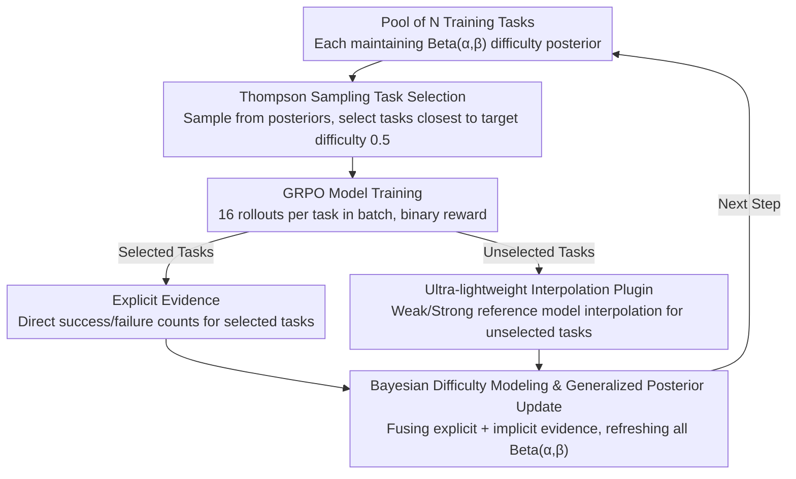

# BOTS: A Unified Framework for Bayesian Online Task Selection in LLM Reinforcement Finetuning

**Conference**: ICLR 2026  
**arXiv**: [2510.26374](https://arxiv.org/abs/2510.26374)  
**Code**: [GitHub](https://github.com/modelscope/Trinity-RFT/tree/main/examples/bots)  
**Area**: LLM/NLP  
**Keywords**: Reinforcement Finetuning, Online Task Selection, Bayesian Inference, Thompson Sampling, Curriculum Learning

## TL;DR

Proposes BOTS, a unified framework for online task selection in LLM reinforcement finetuning based on Bayesian inference. By fusing explicit evidence (historical pass rates from direct evaluation) and implicit evidence (inferred difficulty of unevaluated tasks via reference model interpolation) with Thompson sampling for exploration-exploitation balance, BOTS achieves up to 50% training acceleration on math, code, and logic tasks with only 0.2% additional overhead.

## Background & Motivation

**Background**: Reinforcement Finetuning (RFT) has become a core technology for aligning LLM capabilities and improving reasoning performance, as evidenced by the success of models like DeepSeek-R1 and OpenAI o1. However, the efficiency bottleneck of RFT lies in training data selection—determining which tasks the model should practice at each step. Current mainstream methods involve uniform sampling, which results in significant computational waste on tasks already mastered (pass rate = 1) or those that are completely unsolvable (pass rate = 0), making effective learning signals extremely sparse.

**Limitations of Prior Work**: Existing task selection solutions can be categorized into four types, each with significant drawbacks: (1) **Offline Curriculum Learning** (Parashar et al., Shen et al.) uses fixed schedules from easy to hard, failing to adapt to continuous variations in model capability; (2) **Oversampling/Filtering** (DAPO, StarPO) generates massive rollout batches and filters by pass rate, introducing 2-4x extra inference overhead; (3) **Explicit-only Methods** (LIMRL, TTRL/MoPPS) estimate difficulty based on historical direct evaluation, suffering from severe cold-start issues early in training when data is sparse; (4) **Implicit-only Methods** (AFRL/DOTS) predict pass rates using task similarity but still require extra rollouts for anchor tasks and discard valuable historical evaluation information.

**Key Challenge**: Explicit and implicit evidence have complementary advantages but are difficult to unify. The authors discovered a key complementarity pattern: explicit evidence (direct evaluation) provides accurate and stable difficulty estimates but suffers from slow starts for new tasks; implicit evidence (cross-task inference) provides rapid difficulty estimates for all tasks at zero history but loses reliability as the model evolves and deviates from the reference model. Relying on a single source inevitably leads to failure at certain stages.

**Goal**: (1) How to fuse two heterogeneous types of evidence in a unified framework to leverage their respective strengths at different stages? (2) How to implement online estimation of implicit evidence with minimal overhead? (3) How to automatically balance exploration (evaluating unknown tasks) and exploitation (selecting known appropriate tasks) under uncertain evidence?

**Key Insight**: The authors observed that task pass rates naturally follow a Bernoulli distribution, whose conjugate prior—the Beta distribution—can elegantly encode "beliefs about task difficulty." The $\alpha$ and $\beta$ parameters represent accumulated success and failure pseudo-counts. By designing appropriate posterior update rules to fuse both evidence types and using Thompson sampling for decision-making, both evidence fusion and the exploration-exploitation trade-off can be resolved simultaneously.

**Core Idea**: Reformulate online task selection as non-stationary Bayesian inference, fusing explicit and implicit evidence via generalized posterior updates and using Thompson sampling for automated exploration-exploitation trade-offs.

## Method

### Overall Architecture

BOTS executes a three-stage cycle at each training step: **Task Selection → Model Training & Evidence Collection → Posterior Update**. The input is a pool of $N$ training tasks $\{\mathcal{T}^k\}_{k=1}^N$, where each task maintains a Beta posterior $\text{Beta}(\alpha_t^k, \beta_t^k)$ representing the belief of the current model's success probability on that task. The process includes: sampling difficulty from the posterior → selecting tasks close to the target difficulty $p^*=0.5$ for training batch $\mathcal{B}_t$ → training the model using RL algorithms like GRPO → collecting direct evaluation (explicit evidence) for selected tasks and interpolated predictions (implicit evidence) for unselected tasks → fusing and updating posterior parameters for all tasks.

### Key Designs

**1. Bayesian Difficulty Modeling & Generalized Posterior Update**

The root of the cold-start problem is that only selected tasks yield difficulty data. BOTS models the success probability $p_t^k$ of each task $\mathcal{T}^k$ as a Beta distribution $\text{Beta}(\alpha_t^k, \beta_t^k)$. The key is the generalized posterior update that assimilates both evidence types:

$$\alpha_{t+1}^k = (1-\lambda)\,\alpha_t^k + \lambda\,\alpha_0^k + (1-\rho)\,s_t^k + \rho\,\tilde{s}_t^k$$

($\beta$ is updated symmetrically). Here, $s_t^k, f_t^k$ are explicit counts from direct evaluation, non-zero only for $k \in \mathcal{B}_t$; $\tilde{s}_t^k, \tilde{f}_t^k$ are fused pseudo-counts—equal to explicit counts for selected tasks and generated by the interpolation estimator $\tilde{p}(k, \mathcal{B}_t)$ for unselected tasks. This pseudo-count mechanism allows unselected tasks to receive updates at every step, solving the cold-start problem. Two hyperparameters manage the process: $\lambda \in [0,1]$ implements "forgetting" by pulling the posterior toward the prior $\alpha_0, \beta_0$ to handle non-stationarity as the model evolves; $\rho \in [0,1]$ controls the fusion weight between explicit and implicit evidence.

**2. Ultra-lightweight Interpolation Plugin**

To estimate difficulty for unevaluated tasks without rollout costs, BOTS uses two pre-evaluated reference models (one weak, one strong). Many RL datasets (e.g., GURU) already provide weak model pass rates $\bar{p}_w^k$ and strong model pass rates $\bar{p}_s^k$. Each step, the relative capability coefficient $\mu_t = (\bar{p}_t^{\text{ref}} - \bar{p}_w^{\text{ref}}) / (\bar{p}_s^{\text{ref}} - \bar{p}_w^{\text{ref}})$ is calculated based on current online results. The pass rate for any unevaluated task $k$ is estimated as $\tilde{p}(k, \mathcal{B}_t) = \text{clip}(\tilde{\mu}_t \cdot \bar{p}_s^k + (1-\tilde{\mu}_t) \cdot \bar{p}_w^k, 0, 1)$, filtered by momentum smoothing $\tilde{\mu}_t$. This requires only basic vector operations, keeping additional overhead $\leq 0.2\%$.

**3. Thompson Sampling Task Selection**

To prevent falling into local optima, BOTS avoids greedy selection. Instead, for each task, it samples $\hat{p}_k \sim \text{Beta}(\alpha_t^k, \beta_t^k)$ and ranks tasks by utility $\hat{u}_k = -|\hat{p}_k - p^*|$ (where target $p^* = 0.5$). The sampling noise is proportional to the posterior variance: tasks with fewer evaluations and wider posteriors are more likely to be "accidentally" sampled with extreme values and selected for exploration, while tasks with narrow posteriors favor stable exploitation.

### Loss & Training

BOTS is a task selection framework decoupled from specific RL algorithms. Experiments use GRPO (Group Relative Policy Optimization) as the underlying trainer, with $n=16$ rollouts per task and binary rewards (correct/incorrect) driving policy gradients. Task selection occurs in the outer loop of GRPO.

## Key Experimental Results

**Settings**: GURU dataset (math, code, logic), Qwen2.5-1.5B/7B-Instruct models, GRPO algorithm. Reference models: Qwen2.5-7B-Instruct (weak) and Qwen3-30B-A3B (strong). Benchmarks: MATH500, AMC23, AIME24, LiveCodeBench, ARC.

**Metrics**: ETR (Effective Task Ratio), TTB (Time to Benchmark, relative to random baseline, $<1$ is faster), BSF (Best Performance Ratio, relative to random, $>1$ is better).

### Main Results: Cross-domain Comparison (Qwen2.5-1.5B-Instruct)

| Method | Math TTB(50%↓) | Math TTB(100%↓) | Math BSF(25%↑) | Code TTB(50%↓) | Code BSF(25%↑) | Logic TTB(50%↓) | Logic BSF(25%↑) |
|------|:---:|:---:|:---:|:---:|:---:|:---:|:---:|
| Random | 1.00 | 1.00 | 1.00 | 1.00 | 1.00 | 1.00 | 1.00 |
| Offline (Easy→Hard) | 0.77 | 0.85 | 1.09 | 0.68 | 1.09 | 1.23 | 0.67 |
| BOTS-MoPPS (Explicit-only) | 1.02 | 0.89 | 0.98 | 0.78 | 1.09 | 0.87 | 1.13 |
| BOTS-DOTS (Implicit-only) | 0.70 | 0.73 | 1.08 | 0.67 | 1.17 | 0.66 | 1.28 |
| **BOTS (Default)** | **0.85** | **0.72** | **1.06** | **0.58** | **1.17** | **0.85** | **1.19** |

On the 7B model, BOTS achieved TTB(100%)=0.50 in the logic domain (50% acceleration). On the 1.5B model, it secured first place in 10 out of 18 metrics.

### Ablation Study: Impact of $\rho$ on Evidence Fusion (1.5B, Math)

| $\rho$ Setting | Meaning | TTB(50%↓) | TTB(100%↓) | BSF(25%↑) | BSF(100%↑) |
|:---:|:---|:---:|:---:|:---:|:---:|
| 0.0 | Explicit-only | 0.98 | — | 0.99 | 0.98 |
| 0.05 | Minor Implicit | 0.78 | 0.64 | 1.06 | 1.06 |
| **0.1** | **Default** | **0.85** | **0.72** | **1.06** | **1.05** |
| 1.0 | Implicit-only | 0.78 | 0.99 | 1.05 | 1.01 |

### Key Findings

- **Implicit evidence is vital for cold start**: $\rho=0$ (explicit-only) shows ETR similar to random sampling early on, as most tasks lack historical data. Setting $\rho > 0$ leads to a sharp climb in ETR by filtering unsolvable tasks.
- **Over-reliance on implicit evidence is harmful long-term**: High $\rho$ settings show ETR drops late in training as interpolation errors accumulate, causing mastered tasks to be incorrectly selected.
- **$\lambda$ controls adaptability**: $\lambda=0$ (no forgetting) causes overconfidence in stale data, while $\lambda=1$ renders Thompson sampling near-random due to high variance. $\lambda=0.1$ is optimal.
- **Computational overhead is negligible**: The entire process is based on simple vector math, with wall-clock overhead $\leq 0.2\%$ of training time.

## Highlights & Insights

- **Unified Bayesian Perspective**: The Beta-Bernoulli conjugate provides analytical updates without MCMC, naturally encodes uncertainty for exploration, and offers a clean interface for fusing heterogeneous evidence.
- **Quantitative Discovery of Complementarity**: The study precisely characterizes how the value of explicit evidence increases while implicit evidence decreases as training progresses.
- **Zero-marginal Cost Design**: By leveraging existing dataset labels as implicit evidence bases, BOTS avoids extra rollout costs during training.

## Limitations & Future Work

- **Reference Model Dependency**: Requires pre-evaluation by weak/strong models. While common in benchmarks like GURU, new datasets require a one-time rollout cost.
- **Linear Interpolation Coarseness**: The assumption of linear pass rate interpolation is accurate for interpolation but degrades during extrapolation (when the model exceeds the strong reference).
- **Binary Reward Assumption**: Modeling relies on 0/1 rewards. Extending to continuous or ranking rewards (e.g., Gaussian or Dirichlet) is a future direction.
- **Fixed Target Difficulty**: Utilizing a static $p^*=0.5$ might be suboptimal; adaptive $p^*$ scheduling (starting easy, then hard) could further improve results.

## Related Work & Insights

- **vs MoPPS (TTRL)**: MoPPS is essentially a special case of BOTS ($\lambda=0, \rho=0$). BOTS outperforms it by incorporating implicit evidence and forgetting mechanisms, addressing non-stationarity.
- **vs DOTS (AFRL)**: DOTS uses attention kernels for prediction and requires anchor task rollouts. BOTS-DOTS (the implicit-only version) achieves similar performance with lower costs.
- **Insight**: The BOTS framework—Bayesian belief maintenance + heterogeneous evidence fusion + Thompson sampling—is generalizable to other online selection scenarios like active learning or multi-task weight scheduling.

## Rating

- Novelty: ⭐⭐⭐⭐ Unified Bayesian perspective is elegant, though components are established techniques.
- Experimental Thoroughness: ⭐⭐⭐⭐⭐ Comprehensive cross-domain and cross-scale comparisons with systematic ablations.
- Writing Quality: ⭐⭐⭐⭐⭐ Clear mapping between theory and experiments; practical deployment advice is well-provided.
- Value: ⭐⭐⭐⭐ Addresses a real bottleneck in RFT with an open-source, plug-and-play solution with minimal overhead.

<!-- RELATED:START -->

## Related Papers

- [\[ICLR 2026\] Discovering Novel LLM Experts via Task-Capability Coevolution](discovering_novel_llm_experts_via_task-capability_coevolution.md)
- [\[ICLR 2026\] Near-Optimal Online Deployment and Routing for Streaming LLMs](near-optimal_online_deployment_and_routing_for_streaming_llms.md)
- [\[ICLR 2026\] ELLMob: Event-Driven Human Mobility Generation with Self-Aligned LLM Framework](ellmob_event-driven_human_mobility_generation_with_self-aligned_language_models.md)
- [\[ACL 2025\] SSUF: A Semi-supervised Scalable Unified Framework for E-commerce Query Classification](../../ACL2025/llm_nlp/a_semi-supervised_scalable_unified_framework_for_e-commerce_query_classification.md)
- [\[ACL 2025\] From Selection to Generation: A Survey of LLM-based Active Learning](../../ACL2025/llm_nlp/from_selection_to_generation_a_survey.md)

<!-- RELATED:END -->
