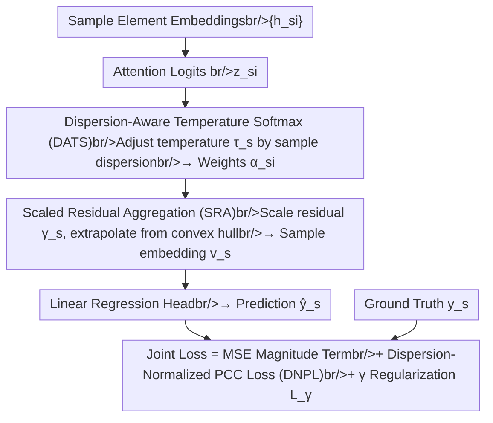

# Breaking the Correlation Plateau: On the Optimization and Capacity Limits of Attention-Based Regressors

**Conference**: ICLR 2026  
**arXiv**: [2602.17898](https://arxiv.org/abs/2602.17898)  
**Code**: None  
**Area**: LLM Evaluation  
**Keywords**: Pearson Correlation Coefficient, Attention Regression, PCC plateau, Convex Aggregation, Optimization Dynamics

## TL;DR
This paper provides the first theoretical analysis of the "PCC plateau" phenomenon in attention-based regression models during joint MSE+PCC training. It identifies the root causes as the conflict between MSE optimization and PCC gradients, as well as the capacity upper bound of softmax convex aggregation. It proposes the ECA (Extrapolative Correlation Attention) framework to break these limits using three components: scaled residual aggregation, dispersion-aware temperature softmax, and dispersion-normalized PCC loss.

## Background & Motivation

**Background**: Attention mechanisms are widely used in set-level regression tasks (e.g., digital pathology, video sentiment analysis, spatial transcriptomics), where each sample consists of multiple elements, and element embeddings are aggregated via attention to predict continuous target values. Training objectives usually adopt a joint MSE + PCC loss to focus on both the absolute magnitude and the rank/shape (correlation) of predictions.

**Limitations of Prior Work**: A **PCC plateau** phenomenon frequently occurs during training—PCC stops improving and flattens early, even as MSE continues to decrease. Increasing the weight of the PCC loss $\lambda_{\text{PCC}}$ does not resolve this issue. This phenomenon is particularly severe in scenarios where intra-sample data is highly homogeneous.

**Key Challenge**: 
   - **Optimization Aspect**: MSE optimization drives the predicted standard deviation $\sigma_{\hat{y}}$ toward the target standard deviation $\sigma_y$. However, the global scaling factor of the PCC gradient is inversely proportional to $\sigma_{\hat{y}}$. Thus, as $\sigma_{\hat{y}}$ increases, the PCC gradient signal is suppressed.
   - **Capacity Aspect**: Softmax attention is a convex combination, restricting aggregated results within the convex hull of intra-sample embeddings. The maximum improvement in PCC is constrained by the radius of this convex hull.

**Key Insight**: The authors start from the widely observed but theoretically unexplained phenomenon of PCC stagnation. They provide rigorous analysis from both optimization dynamics and model capacity dimensions and design targeted solutions based on these findings.

**Core Idea**: By theoretically revealing the dual bottlenecks where PCC gradients are suppressed by MSE optimization and constrained by the convex hull, the authors propose a three-pronged approach: "Extrapolation beyond the convex hull + Dispersion-adaptive temperature + Gradient normalization" to break the plateau.

## Method

### Overall Architecture

This paper addresses a recurring but poorly understood anomaly in attention-based regression: when training jointly with MSE + PCC, PCC often plateaus early even while MSE decreases steadily, and increasing $\lambda_{\text{PCC}}$ fails to help. The authors prove that this plateau is a structural bottleneck of softmax attention. Consequently, they design ECA (Extrapolative Correlation Attention)—a plug-and-play attention module that replaces standard softmax attention for end-to-end training.

The data flow remains consistent: input element embeddings $\{\mathbf{h}_{si}\}$ for each sample are aggregated into a sample-level embedding $\mathbf{v}_s$, which is then passed through a linear regression head to produce a scalar prediction $\hat{y}_s$. The modifications lie in the aggregation method and the loss function—the total loss superimposes a modified PCC term and a scaling regularization term onto the original MSE:

$$\mathcal{L}_{\text{Total}} = \mathcal{L}_{\text{MSE}} + \lambda_{\text{PCC}} \cdot \tilde{\mathcal{L}}_{\text{PCC}} + \mathcal{L}_{\gamma}$$

The data flow of the ECA module is as follows: element embeddings undergo **DATS** for temperature adjustment to obtain discriminative attention weights, followed by **SRA** to push the aggregation point outside the convex hull for the sample embedding. Final predictions are generated by a linear head and trained with a joint loss featuring **DNPL**.

### Theoretical Analysis: Why PCC Stagnates

The three components of ECA are derived from theoretical conclusions regarding why stagnation occurs.

**Proposition 2.1 (MSE Decomposition)**: Decomposes MSE into mean matching, standard deviation matching, and weighted correlation terms. The key observation is that PCC is invariant to affine transformations, while MSE is sensitive to both mean and scale. Consequently, the optimizer prefers lowering MSE by adjusting the mean and scale, providing weak motivation to improve correlation—the first root cause of the plateau.

**Theorem 2.1 (PCC Gradient)**: Provides the gradient of PCC with respect to attention logits $z_{si}$. it consists of a global factor $1/\sigma_{\hat{y}}$ multiplied by a local structural factor $\alpha_{si}\,\mathbf{w}^\top(\mathbf{h}_{si}-\mathbf{v}_s)$. The issue lies in $1/\sigma_{\hat{y}}$. Following this, **Corollary 2.1 (Gradient Ratio Decay)** shows that because MSE optimization pushes $\sigma_{\hat{y}}$ toward $\sigma_y$, the RMS ratio of the PCC gradient to the MSE gradient decays at a rate of $O(1/\sigma_{\hat{y}}^{3/2})$. As $\sigma_{\hat{y}}$ grows, the PCC gradient signal is overshadowed by MSE.

**Theorem 2.2 (PCC Gain Upper Bound for Convex Aggregation)**: Limits capacity by showing that the PCC improvement of any convex aggregator (including softmax) relative to mean pooling is capped by $2\tilde{R} / (\sigma_0/\|\mathbf{w}\|_2 - \tilde{R})$. Since the aggregated result must fall within the convex hull of intra-sample embeddings, the correlation gain is limited by the convex hull radius $\tilde{R}$. More homogeneous samples result in smaller convex hulls and lower upper bounds.

### Key Designs

The three components specifically address the identified bottlenecks:

**1. Dispersion-Aware Temperature Softmax (DATS): Re-establishing Attention in Homogeneous Samples**

Targeting the issue in Corollary 2.2 where highly similar embeddings (homogeneity) lead to small logit variance, standard fixed-temperature softmax collapses into nearly uniform weights $\alpha_{si}\approx 1/n_s$. DATS adaptively adjusts the temperature for each sample based on its internal dispersion:

$$\tau_s = T_{\min} + \beta \sqrt{\tfrac{1}{n_s} \sum_i \|\mathbf{h}_{si} - \boldsymbol{\mu}_s\|^2}$$

Homogeneous samples with low dispersion receive lower temperatures, sharpening the softmax to amplify subtle differences and restore attention selectivity, which increases the residual $\Delta \mathbf{v}_s$.

**2. Scaled Residual Aggregation (SRA): Moving Beyond the Convex Hull**

Theorem 2.2 proves that the correlation gain of convex aggregators is locked by the convex hull radius. SRA allows the aggregation result to move outside the convex hull by amplifying the attention residual using a learnable scaling factor $\gamma_s \geq 1$:

$$\mathbf{v}_s^{ECA} = \boldsymbol{\mu}_s + \gamma_s \sum_i \alpha_{si}(\mathbf{h}_{si} - \boldsymbol{\mu}_s), \quad \gamma_s = 1 + \text{Softplus}(\text{MLP}(\boldsymbol{\mu}_s))$$

When $\gamma_s > 1$, the aggregation point extrapolates along the residual direction, bypassing the constraints of Theorem 2.2. A regularization term $\mathcal{L}_\gamma = \frac{\lambda_\gamma}{S} \sum_s (\gamma_s - 1)^2$ controls the extrapolation magnitude.

**3. Dispersion-Normalized PCC Loss (DNPL): Restoring the PCC Gradient**

To address the $1/\sigma_{\hat{y}}$ decay revealed in Corollary 2.1, DNPL multiplies the PCC loss by $\sigma_{\hat{y}}$ to cancel the effect:

$$\tilde{\mathcal{L}}_{\text{PCC}} = \text{StopGrad}(\sigma_{\hat{y}}) \cdot (1 - \rho)$$

The $\sigma_{\hat{y}}$ factor negates the $1/\sigma_{\hat{y}}$ in the gradient, ensuring the PCC signal remains significant even as $\sigma_{\hat{y}}$ increases. The StopGrad operation ensures this scaling only affects gradient magnitude without shifting the stationary points of the loss.

## Key Experimental Results

### Main Results

| Dataset/Model | Metric | Baseline | +ECA | Gain |
|------------|------|----------|------|------|
| Appliance (UCI) | PCC↑ | 0.556 | **0.598** | +0.042 |
| Appliance (UCI) | MSE↓ | 6.108 | **5.790** | -5.2% |
| Online News (UCI) | PCC↑ | 0.408 | **0.420** | +0.012 |
| Superconductivity (UCI) | PCC↑ | 0.920 | **0.930** | +0.010 |
| 10xProteomic (Pathology) | PCC@F↑ | 0.602 | **0.690** | +14.6% |
| 10xProteomic (Pathology) | PCC@M↑ | 0.629 | **0.716** | +13.8% |
| 10xProteomic (Pathology) | MSE↓ | 0.056 | **0.051** | -9.8% |
| MOSI (Sentiment) | PCC↑ | 0.783 | **0.806** | +2.3% |
| MOSI (Sentiment) | F1↑ | 0.851 | **0.859** | +0.8% |

### Ablation Study

| Config (Appliance) | MAE↓ | MSE↓ | PCC↑ |
|-----------------|------|------|------|
| FT-Transformer (baseline) | 39.333 | 6.108 | 0.556 |
| +ECA (full) | **38.665** | **5.790** | **0.598** |
| +ECA w/o SRA | 39.208 | 5.994 | 0.575 |
| +ECA w/o DATS | 38.906 | 6.037 | 0.561 |
| +ECA w/o DNPL | 39.742 | 5.910 | 0.583 |

### Key Findings
- **All components are essential**: Removing DATS has the largest impact (PCC dropped from 0.598 to 0.561), highlighting the importance of temperature adaptivity for homogeneity issues.
- **Synthetic Data Validation**: Across different homogeneity levels ($\tilde{\sigma} \in [0.10, 0.73]$), ECA achieved PCC gains of 4.80% to 5.76% and MSE improvements of 20.3% to 66.7%.
- **Plateau Broken**: In the pathology dataset (fold 2), the EGN baseline PCC flattened around epoch 4, whereas EGN+ECA continued to improve, ultimately increasing validation PCC by approximately 16.5%.
- **Efficiency in Homogeneous Scenarios**: Gains were particularly significant in high-homogeneity scenarios like spatial transcriptomics ($\tilde{\sigma}=0.068$) and video sentiment ($\tilde{\sigma}=0.098$).

## Highlights & Insights
- **Theory-Driven Design**: Each component has a clear theoretical motivation—SRA addresses the convex hull limit in Theorem 2.2, DATS addresses the dispersion term in Corollary 2.2, and DNPL addresses the gradient decay in Corollary 2.1.
- **MSE-PCC Decomposition Insight (Proposition 2.1)**: Decomposing MSE reveals the intrinsic mechanism of why MSE reduction does not guarantee PCC improvement.
- **Generality of Extrapolation**: The concept of "extrapolating via scaled residuals" is not limited to regression and can be applied to any scenario using softmax attention pooling (e.g., MIL, document classification) to bypass capacity limits.
- **Dispersion-Adaptive Temperature**: DATS is more flexible than global temperature scheduling, especially in heterogeneous datasets where samples vary significantly in their internal homogeneity.

## Limitations & Future Work
- Theoretical analysis assumes single-layer attention aggregation with a linear head; the analysis of multi-layer Transformer interactions remains incomplete.
- The scaling factor $\gamma_s$ in SRA uses an additional MLP, increasing parameter and computational overhead.
- Experimental dataset scales are relatively small (e.g., MOSI has ~2200 video segments); performance in large-scale scenarios requires validation.
- The setting of $\gamma_{\max}$ (e.g., 2) is empirical and lacks an adaptive determination method.
- Different training strategies could be explored, such as warming up MSE before introducing DNPL.

## Rating
- Novelty: ⭐⭐⭐⭐ (First theoretical explanation of the PCC plateau with solid analysis)
- Experimental Thoroughness: ⭐⭐⭐⭐ (Evaluated across synthetic, UCI, pathology, and sentiment datasets with full ablation)
- Writing Quality: ⭐⭐⭐⭐⭐ (Clear theoretical derivations, excellent visualizations, and a fluent narrative)
- Value: ⭐⭐⭐⭐ (Plug-and-play module with transferable theory)

<!-- RELATED:START -->

## Related Papers

- [\[ICML 2026\] On the Limits of LLM Adaptability: Impact of Model-Internalized Priors on Annotation](../../ICML2026/llm_nlp/on_the_limits_of_llm_adaptability_impact_of_model-internalized_priors_on_annotat.md)
- [\[ICLR 2026\] SIPDO: Closed-Loop Prompt Optimization via Synthetic Data Feedback](sipdo_closed-loop_prompt_optimization_via_synthetic_data_feedback.md)
- [\[ICLR 2026\] SPRIG: Improving Large Language Model Performance by System Prompt Optimization](sprig_improving_large_language_model_performance_by_system_prompt_optimization.md)
- [\[ICLR 2026\] Spectral Attention Steering for Prompt Highlighting](spectral_attention_steering_for_prompt_highlighting.md)
- [\[ICLR 2026\] Efficient Multi-objective Prompt Optimization via Pure-exploration Bandits](efficient_multi-objective_prompt_optimization_via_pure-exploration_bandits.md)

<!-- RELATED:END -->
