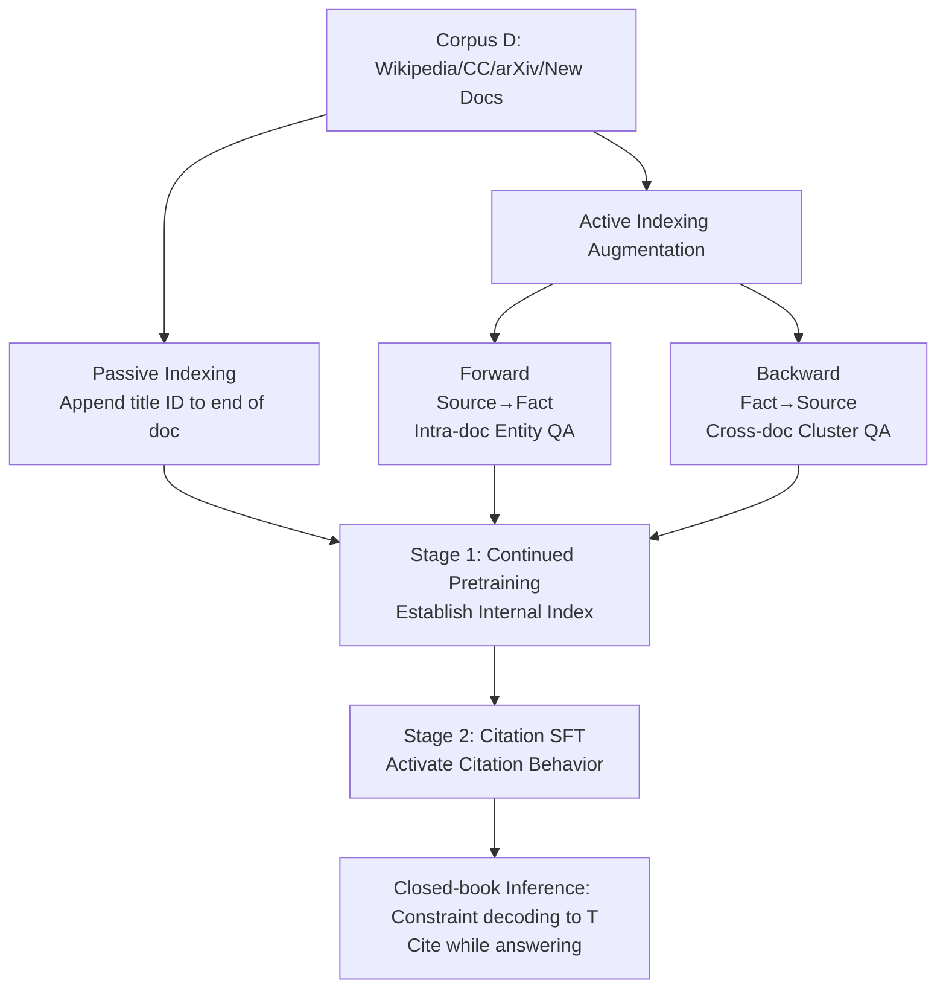

# Cite Pretrain: Retrieval-Free Knowledge Attribution for Large Language Models

**Conference**: ICLR 2026  
**OpenReview**: [https://openreview.net/forum?id=D9bLUj7wUW](https://openreview.net/forum?id=D9bLUj7wUW)  
**Code**: [https://github.com/kkkevinkkkkk/CitePretrain](https://github.com/kkkevinkkkkk/CitePretrain)  
**Area**: LLM / NLP (Knowledge Attribution / Citation Generation)  
**Keywords**: Internal Citation, Knowledge Attribution, Continued Pretraining, Active Indexing, Data Augmentation, Retrieval-Free

## TL;DR
By utilizing "Active Indexing" during the continued pretraining phase to bidirectionally bind facts to document identifiers, LLMs can provide verifiable citations while answering in a closed-book setting without any external retrieval, improving citation precision by up to 30.2%.

## Background & Motivation
**Background**: Trustworthy LLMs require answers that are both correct and verifiable. Currently, the mainstream approach is to use Retrieval-Augmented Generation (RAG) to attach citations at inference time—either by feeding retrieved documents into the context for generation or by performing alignment after generation.

**Limitations of Prior Work**: (1) "Internal citations" directly generated by LLMs themselves are highly unreliable, with hallucination rates as high as 86%–91.4% and misattribution rates of 24%–46%. (2) While external retrieval is effective, it introduces inference latency, long-context overhead, dependency on external infrastructure (e.g., web search), and retrieval noise or reasoning degradation when conflicting with parametric knowledge. (3) Many questions can be answered directly from parametric memory, making external retrieval a redundant cost. (4) External retrieval provides limited interpretability regarding what the model actually "knows" internally.

**Key Challenge**: Enabling a model to simultaneously produce correct answers and verifiable source identifiers in a single closed-book forward pass (without querying a retriever) is strictly harder than generative retrieval (GR, which only learns query-to-docID mappings). The model must not only learn the mapping but also internalize knowledge and appropriately use and cite it during answer generation.

**Goal**: Investigate whether LLMs can reliably attribute info to documents seen during the (continued) pretraining phase without test-time retrieval. For this purpose, the CitePretrainBench benchmark was constructed (mixing real corpora such as Wikipedia/Common Crawl/arXiv with entirely unseen documents to evaluate citation tasks for both single-fact short answers and multi-fact long answers).

**Core Idea**: **"Build the index" during continued pretraining, then "activate citation behavior" via instruction fine-tuning.** The key is upgrading Passive Indexing (passively appending IDs to the end of documents) to **bidirectional, diversely formatted Active Indexing (data augmentation)**. This ensures the model can locate the correct source even when facts are paraphrased or combined across documents.

## Method

### Overall Architecture
Two-stage training: **Stage 1 involves continued pretraining for indexing** (allowing the model to absorb facts and learn an internal index mapping any fact snippet $s \subset c_i$ to its title $t_i$), and **Stage 2 involves citation instruction fine-tuning** (enabling the model to output $(s_k, C_k)$, i.e., "fact statement + supporting titles set"). During inference, the citation decoding space is constrained to the known title set $\mathcal{T}$ to ensure verifiability. Passive Indexing acts as a baseline by merely appending document IDs to the end of documents, while Active Indexing uses synthetic data to strengthen the "fact $\leftrightarrow$ source" binding from both directions.

### Key Designs

**1. Passive Indexing and Failure Diagnosis: Why appending IDs is insufficient.** Passive Indexing appends natural language titles $t_i$ (preferring titles over numeric IDs as they are more memorable, scalable, and easier to deduplicate) to the end of document content $c_i$, teaching the model $f(c_i)=t_i$. This creates $c_i \to t_i$ training samples, consistent with the downstream "generate content then attach citation" order. However, on real corpora, the authors identified two fatal flaws: first, **complex facts $\neq$ original text**—many evaluation queries require synthesizing or paraphrasing information scattered throughout a document, which the model fails to associate with the correct document identifier. Second, **insufficient granularity**—inserting IDs closer to each fact (sentence or paragraph level) provides only marginal improvements; the model still cannot ground non-verbatim content. This necessitated Active Indexing.

**2. Forward Augmentation (Source $\to$ Fact, Intra-doc Recall).** The goal is to strengthen the mapping "given identifier $t_i$, recall its set of facts $S_i=\{s_{i1},\dots,s_{in_i}\}$," targeting scenarios requiring precise attribution to a single source. An auxiliary LLM first extracts $N$ salient entities $E_i=\{e_{i1},\dots,e_{iN}\}$ from each document. For each entity-document pair, several QA pairs $\{(q_{ijk}, a_{ijk})\}$ are generated, where the question $q_{ijk}$ references $t_i$ and asks about entity $e_{ij}$ (who/what/where/why/how), and the answer provides a detailed response based on $c_i$ containing facts from $S_i$. This serves as a closed-book training signal, encouraging the model to internalize and retrieve facts when prompted by $t_i$.

**3. Backward Augmentation (Fact $\to$ Source, Cross-doc Attribution).** This maps generated fact statements $s_k$ back to their source identifier set $C_k \subseteq \mathcal{T}$, emphasizing cross-document reasoning to simulate real-world tasks where facts are drawn from multiple documents. Each document is first split into blocks $C_i=\{c_{i1},\dots\}$ of $W$ words, indexed using BM25. **Block clusters** $C_\ell$ are then constructed by randomly sampling $N$ seed blocks and retrieving $M\sim\text{Uniform}(2,4)$ related blocks from different documents for each. Finally, an LLM generates instruction-answer pairs $(q_\ell, R_\ell)$ for each cluster, where $R_\ell=\{(s_{\ell k}, C_{\ell k})\}$ pairs fact statements with supporting title sets, perfectly aligning with the downstream form $g: q \to \{(s_k, C_k)\}$. To control costs, GPT-4.1-mini bootstraps a seed set, and a fine-tuned Qwen-2.5-3B performs batch expansion, filtering approximately 5% invalid doc-IDs. Combined, Forward and Backward augmentation totals 2.75B tokens (7.05$\times$ the original 390M tokens).

**4. Titles as Verifiable, Scalable Identifiers + Constrained Decoding.** Natural document titles are used instead of numeric IDs because they encapsulate salient content and fit the model's text-learning paradigm. Pre-experiments showed titles are better memorized than numeric or structured alternatives. For noisy sources like Common Crawl, LLM-generated names and deduplication ensure each document has a stable, unique ID. During inference, citation decoding is restricted to the known title set $\mathcal{T}$, mechanically ensuring that citations always point to existing corpus documents.

## Key Experimental Results

### Main Results
Performance of Qwen-2.5-7B across four QA datasets (Acc = Answer Accuracy, C-Pr = Citation Precision, C-Re = Citation Recall):

| Method | ASQA Acc/C-Pr | Eli5 Acc/C-Pr | SciQAG Acc/C-Pr | RepliQA Acc/C-Pr |
|------|---------------|---------------|------------------|-------------------|
| InsOnly (SFT only) | 19.1 / 20.0 | 11.5 / 5.9 | 65.9 / 0.6 | 24.2 / 0.9 |
| PassIdx (Passive) | 21.5 / 24.1 | 14.5 / 8.9 | 65.7 / 2.4 | 24.8 / 2.4 |
| Repeat | 22.5 / 20.5 | 14.5 / 11.2 | 62.4 / 2.5 | 27.1 / 2.5 |
| ActIdx-F (Forward only) | 25.8 / 26.7 | 14.6 / 18.6 | 65.6 / 23.6 | 30.3 / 12.6 |
| ActIdx-B (Backward only) | 25.4 / 31.4 | 17.1 / 28.0 | 66.5 / 30.8 | 29.1 / 21.6 |
| **ActIdx (F + B)** | **27.6 / 30.9** | **17.6 / 29.3** | **66.6 / 32.6** | **31.9 / 24.4** |
| GPT-4.1 (3-shot, unconstrained) | 52.7 / 23.0 | 29.6 / 0.0 | 93.0 / 0.0 | - |

Key comparison: SciQAG citation precision surged from 2.4 (Passive Indexing) to 32.6 (Active Indexing). While GPT-4.1 significantly outperforms Qwen2.5 in answer accuracy, its internal citation precision on Eli5/SciQAG is near zero, proving that "scale" cannot replace "targeted training."

### Ablation Study
Document ID Memory vs. Generalization (RepliQA-7B, Acc@1, transitioning from pure memory to downstream usage):

| Method | FullDoc | PartialDoc | GoldQA | ModelQA |
|------|---------|-----------|--------|---------|
| PassIdx | 27.0 | 5.8 | 8.6 | 7.8 |
| PassIdx-REP (Multi-replay) | 74.6 | 10.6 | 6.6 | 6.0 |
| **ActIdx** | **95.2** | **72.8** | **66.4** | **54.2** |

Title Semantic Shortcut Test (RepliQA, bucketed by semantic similarity rank of the true title to the statement):

| Bucket | Easy | Medium | Hard | Very Hard | Total |
|----|------|--------|------|-----------|-------|
| C-Pre | 55.9 | 49.6 | 40.1 | 40.0 | 46.7 |
| Avg Rank | 2 | 10 | 60 | 761 | 208 |

### Key Findings
- **F & B Complementarity**: Combining Forward and Backward methods yields the best results (e.g., RepliQA C-Pr 2.4 $\to$ 32.6), with Backward alone being stronger than Forward alone.
- **Replay is Harmful; Active Supervision is Critical**: Pure token replay is ineffective and can even degrade performance due to overfitting. Simple paraphrasing (PI-SCP) still lags—explicit training to use document IDs within QA contexts is required.
- **Continued Scaling Does Not Saturate**: Performance continues to rise even as augmentation data reaches 16$\times$ the original corpus, as cross-document synthesis creates high-value, diverse new tokens.
- **Non-Shortcut Learning**: In >90% of cases, the true title is not the most semantically similar (average rank 208/6822). Precision remains ~40% even in Hard/Very Hard buckets where semantic signals fail, proving the model learns actual "Fact $\to$ ID" associations.
- **Memory $\neq$ Generalization**: Multi-round replay improves FullDoc memory (27.0 $\to$ 74.6) but hurts downstream ModelQA (7.8 $\to$ 6.0). Active Indexing balances both.
- **Internal/External Complementarity**: Internal citation excels when retrieval quality is poor, while external citation wins when retrieval is strong. A Hybrid approach is generally optimal across all retrieval qualities. Internal citation also reduces input token counts by approximately 1/130 compared to RAG.

## Highlights & Insights
- **Internalizing the RAG Stack**: Transforms a multi-component RAG pipeline into an end-to-end single model. This aligns with the historical trend of replacing manual pipelines with unified models, offering zero inference overhead and zero external dependencies.
- **Bidirectional Training Objectives**: The Source $\to$ Fact goal handles "generating using sources," while Fact $\to$ Source handles "attributing one's own answers," covering both the writing and reading aspects of citation.
- **Diagnosis-Driven Methodology**: The authors first used real corpora to identify two failure modes of Passive Indexing—"complex facts $\neq$ citations" and "insufficient granularity"—then proposed Active Indexing as a targeted solution.
- **Built-in Verifiability**: Constraining decoding to a set of titles fundamentally eliminates hallucinations involving non-existent sources.
- **Complementary rather than Mutually Exclusive**: Pragmatically positions internal citation as a fallback for retrieval failure or a safeguard against retrieval noise, offering a robust Hybrid solution.

## Limitations & Future Work
- **High One-time Training Cost**: Augmenting the corpus to 7$\times$ (or 16$\times$) tokens for continued pretraining is expensive, shifting costs from inference time to training time.
- **Dependency on Teacher LLMs**: Entity extraction, QA generation, and name deduplication rely on GPT-4.1-mini or fine-tuned smaller models; the quality and potential bias of this synthetic data require further discussion.
- **Difficulty in Knowledge Updates**: Internal indices are bound to model weights. Adding or revising documents requires continued pretraining, making it less agile than external retrieval—which is why the Hybrid approach is maintained.
- **Gap from Oracle**: A performance gap remains between Hybrid and Hybrid Oracle. Improving the coordination between "retrieved evidence vs. memorized knowledge" (especially during conflicts) is an open problem.
- **Scale and Corpus Scope**: Primarily validated on Qwen-2.5-3B/7B; performance at the scale of ultra-large models or massive pretraining corpora remains to be investigated.

## Related Work & Insights
- **vs. RAG (External Citation)** (Nakano 2021, Gao 2023b, etc.): This work replaces inference-time retrieval with internal attribution, reducing overhead, improving interpretability, and avoiding retrieval noise.
- **vs. Generative Retrieval (GR)** (Tay 2022 DSI, etc.): GR only learns query-to-docID mappings, separating retrieval from answering, where QA remains open-book. This work unifies retrieval and answering in a closed-book model, which is strictly more challenging.
- **vs. Source-aware training** (Khalifa 2024): Prior work performed single-fact citation only on synthetic biographical data. This paper shows such methods do not generalize to real complex documents and bridges the gap with CitePretrainBench and Active Indexing.
- **Insight**: The combination of "diverse synthetic paraphrasing + explicit task-based supervision" can be extended to any scenario aimed at internalizing external capabilities into model parameters. The research paradigm of "diagnosing baseline failure modes before designing methods" is highly effective.

## Rating
- **Novelty**: ⭐⭐⭐⭐ Systematizing "retrieval-free internal citation" into two-stage training + bidirectional active indexing, paired with a complex real-world corpus benchmark.
- **Experimental Thoroughness**: ⭐⭐⭐⭐ Four datasets $\times$ multiple models (Qwen 3B/7B/14B, Llama, GPT-4.1), memory vs. generalization probes, semantic shortcut tests, 16$\times$ scaling, and internal/external hybrid analysis.
- **Writing Quality**: ⭐⭐⭐⭐ Clear logical progression from motivation to failure diagnosis, method, and validation.
- **Value**: ⭐⭐⭐⭐ Provides a verifiable, zero-inference-overhead attribution path, addressing regulatory requirements for training data transparency and contributing to trustworthy LLMs and interpretability.

<!-- RELATED:START -->

## Related Papers

- [\[ICLR 2026\] Parameters vs. Context: Fine-Grained Control of Knowledge Reliance in Language Models](parameters_vs_context_fine-grained_control_of_knowledge_reliance_in_language_mod.md)
- [\[AAAI 2026\] LoKI: Low-damage Knowledge Implanting of Large Language Models](../../AAAI2026/llm_nlp/loki_low-damage_knowledge_implanting_of_large_language_models.md)
- [\[ACL 2025\] Knowledge Boundary of Large Language Models: A Survey](../../ACL2025/llm_nlp/knowledge_boundary_survey.md)
- [\[ACL 2025\] Acquisition and Application of Novel Knowledge in Large Language Models](../../ACL2025/llm_nlp/acquisition_and_application_of_novel_knowledge_in_large_language_models.md)
- [\[ACL 2025\] JoPA: Explaining Large Language Model's Generation via Joint Prompt Attribution](../../ACL2025/llm_nlp/jopa_explaining_large_language_models_generation_via_joint_prompt_attribution.md)

<!-- RELATED:END -->
