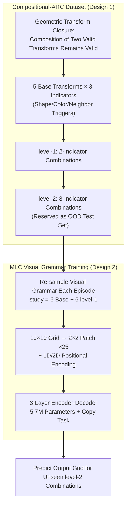

# Compositional-ARC: Assessing Systematic Generalization in Abstract Spatial Reasoning

**Conference**: ICLR 2026  
**arXiv**: [2504.01445](https://arxiv.org/abs/2504.01445)  
**Code**: To be confirmed  
**Area**: LLM/NLP  
**Keywords**: systematic generalization, meta-learning for compositionality, ARC, abstract reasoning, few-shot learning

## TL;DR
The authors propose the Compositional-ARC dataset to evaluate the systematic generalization capabilities of models in abstract spatial reasoning—specifically, generalizing from known basic geometric transformations (e.g., translation, rotation) to unseen combinations of these transformations. An MLC-trained encoder-decoder model with only 5.7M parameters reaches 78.26% on systematic tasks, matching the performance of the ARC Prize 2024 winner's 8B model + TTT, while significantly outperforming GPT-4o and o3-mini (<3%).

## Background & Motivation

**Background**: Systematic generalization is a core capability of human cognition—the ability to automatically generalize to new combinations after understanding known components. While LLMs have made progress in various fields, they perform poorly on compositional generalization tests.

**Limitations of Prior Work**: Meta-Learning for Compositionality (MLC) proposed by Lake & Baroni (2023) achieved human-level systematic generalization on pseudo-linguistic tasks, but whether this method applies to non-linguistic domains (such as spatial reasoning) remains unexplored.

**Key Challenge**: Current LLMs (including o3-mini and GPT-4o) perform excellently on standard reasoning tasks but fail systematically when faced with scenarios requiring the reorganization of basic components into new combinations. This is not due to a lack of capability, but rather a lack of training paradigms for compositional generalization.

**Goal**: (1) Design a benchmark to evaluate systematic generalization in spatial reasoning; (2) Verify that MLC can extend beyond the linguistic domain.

**Key Insight**: Leveraging the algebraic closure of geometric transformations (the combination of two valid transformations remains a valid transformation), the authors design ARC-style 2D grid tasks to test whether a model can infer unseen level-2 combinations from basic transformations and level-1 combinations.

**Core Idea**: Extend MLC from language to visual-spatial reasoning, proving that small models with the correct training paradigm can substantially outperform LLMs with 10,000x more parameters in compositional generalization.

## Method

### Overall Architecture

The core question this paper addresses is whether the MLC training paradigm, which induces human-level systematic generalization in language, remains effective for visual-spatial reasoning. To this end, the authors perform two primary tasks: first, they create the Compositional-ARC dataset, which precisely isolates "compositional generalization," and then they train an extremely small encoder-decoder model using MLC to evaluate it.

The data generation is hierarchical: based on the closure of geometric transformations, 5 basic transformations are defined, triggered by 3 types of indicators (shape/color/neighbor). Level-1 combinations involve two overlapping indicators, while level-2 combinations involve three. Level-2 combinations are reserved for the OOD (Out-Of-Distribution) test set. The model follows an episodic process: each episode randomly samples a "visual interpretation grammar" (which attribute type triggers which transformation). The 10x10 grid is divided into 2x2 patches and fed into the encoder-decoder. The model observes several study examples, infers the current grammar, and applies it to a query to predict the output grid. During evaluation, only examples of basic transformations and level-1 combinations are provided, forcing the model to infer unseen level-2 combinations.

### Key Designs

**1. Compositional-ARC Dataset: A clean and controllable compositional generalization testbed using geometric transformation closure**

To measure "systematic generalization," it is crucial that the task clearly separates "seen components" from "unseen combinations" to distinguish generalization from memorization. The authors exploit a property of geometric transformations—the composition of two valid transformations is still a valid transformation—to build a hierarchical task on ARC-style 2D grids. The foundation consists of 5 basic transformations: translation, rotation, reflection, expansion, and recoloring. Trigger conditions are determined by 3 types of indicators: shape (e.g., L-shaped objects translate), color (e.g., green objects reflect horizontally), and neighbors (expand to adjacent rows when coincident with designated objects).

Combinations are layered by the number of indicators: Level-1 is an overlap of 2 indicators (e.g., shape+color → translation+reflection), and Level-2 is an overlap of 3 indicators (shape+color+neighbor → translation+reflection+expansion). The core of the systematicity test is that study examples only display basic transformations and level-1 combinations, while level-2 combinations are reserved for the test set. Models must infer "how to handle three" from "knowing individual ones and combinations of two." Crucially, the data split ensures that level-2 combinations in the query do not overlap between the training and evaluation sets (e.g., training sees translation+rotation+reflection, while testing examines translation+rotation+expansion), providing a true OOD evaluation.

**2. Extending Meta-Learning for Compositionality (MLC) to Spatial Reasoning: Forcing the model to learn rules instead of memorizing mappings via dynamic grammars**

General LLMs fail on such tasks because they tend to memorize fixed "attribute → transformation" mappings, which fail when combinations are new. MLC circumvents this by allowing the mappings themselves to drift during training: each episode resamples a new visual interpretation grammar (e.g., "yellow objects translate" might become "yellow objects reflect horizontally" in another episode). Fixed memory thus becomes useless; the model's only viable strategy is to infer the grammar on-the-fly from the current study examples and then apply it compositionally.

In implementation, the 10x10 grids are sliced into 2x2 patches (25 patches per grid). Each patch is mapped to an embedding vector (a patch has up to $10^4$ possible values, corresponding to 10,000 embeddings). Special tokens `|` and `→` mark the boundaries between study examples and input/output grids. 1D positional encodings mark the order of grid pairs, while 2D positional encodings (row/column components) preserve spatial locations. During training, an auxiliary copy task is included—requiring the model to reproduce the outputs of the study examples—forcing it to "read" the examples more thoroughly. The model itself is small: a 3-layer encoder + 3-layer decoder, 8 heads, dim=128, FFN=768, GELU activation, totaling only 5.7M parameters.

### Loss & Training

The main loss is standard cross-entropy, predicting the patch sequence of the output grid. This is supplemented by an auxiliary copy task loss (reproduction of study example outputs). At the decoder end, target grid cell colors are randomly perturbed with a probability of 0.001 to enhance robustness. A total of 100,000 episodes were generated (each with a unique visual interpretation grammar), split into 82,908 / 8,546 / 8,546 for training / validation / testing. Level-2 combinations used in training and testing are non-overlapping to ensure OOD evaluation.

## Key Experimental Results

### Main Results

Exact Match Accuracy on the Systematicity task:

| Model | Parameters | Exact Match (%) | Note |
|------|--------|----------------|------|
| GPT-4o | ~hundreds of B | 0.99 | General LLM |
| Gemini 2.0 Flash | ~hundreds of B | 2.66 | General LLM |
| o3-mini (low) | ~hundreds of B | 0.53 | General LLM (Reasoning-enhanced) |
| Llama-3.2-3B-ReARC | 3B | 0.87 | ARC-specialized |
| Llama-3.2-3B-ReARC + TTT | 3B | 73.70 | + Test-Time Training |
| Mistral-8B-Full + TTT | 8B | 78.20 | ARC Prize 2024 Winner |
| **MLC (Ours)** | **5.7M** | **78.26** | Matches the Winner! |

### Ablation Study

| Configuration | Exact Match (%) | Description |
|------|----------------|------|
| MLC Full | 86.73 ± 6.03 | Mean across 4 splits |
| - No copy task | 69.05 ± 9.23 | Auxiliary task is important |
| - No basic transformation examples | 75.27 ± 12.95 | Moderate decrease |
| - No level-1 combination examples | 21.01 ± 19.07 | Severe collapse |
| MLC (More complex dataset) | 88.10 | Remains effective as transformation types increase |

### Key Findings
- **5.7M << 8B but matching performance**: The micro-model trained with MLC matches the performance of the ARC Prize 2024 winner (8B + TTT + significant engineering), despite a 1400x difference in parameter count.
- **Systematic generalization in general LLMs is near zero**: GPT-4o (0.99%) and o3-mini (0.53%) reach 22%/64% on 3-shot tasks respectively, but almost completely fail on the Systematicity task requiring compositional generalization.
- **Level-1 combination examples are critical**: Removing level-1 examples drops accuracy from 87% to 21%, indicating that intermediate compositional examples are essential for inferring higher-level combinations.
- **Copy task provides hidden gains**: The auxiliary copy task contributes a ~18pp Gain, forcing the model to deeper understand the study examples.
- **Different error patterns**: LLM errors primarily involve predicting the wrong shape or only performing a basic transformation; MLC errors involve minor shape deviations (rarely degrading into basic/level-1 transformations).

## Highlights & Insights
- **Prime example of "Correct paradigm > Large models"**: Comparing 5.7M vs 8B parameters, the core difference lies in the MLC training strategy rather than model size. This is a powerful counter-example to the "scaling is all you need" narrative.
- **Successful migration of MLC from language to vision**: Proves that MLC is not a language-specific trick, but a general training paradigm for compositional generalization—forcing the model to learn rules instead of memorization through dynamic grammar transformations.
- **Sophisticated research design**: The hierarchical task design of level-0/1/2 is both clean and deep, allowing for the precise isolation and measurement of compositional generalization capabilities.

## Limitations & Future Work
- **Relatively simple tasks**: Compiling 5 basic transformations on a 10×10 grid with 2 objects is still limited compared to real-world spatial reasoning.
- **Composition depth limited to level-2**: Whether deeper compositions (3+ transformations) remain generalizable has not been tested.
- **Fixed grid size**: Generalization to different grid sizes was not evaluated.
- **Differences from the original ARC dataset**: Transformations in Compositional-ARC are more regularized than the original ARC, which features higher diversity and abstraction.

## Related Work & Insights
- **vs Lake & Baroni (2023, Original MLC)**: The original work verified MLC on pseudo-linguistic tasks; this paper is the first to extend it to visual-spatial reasoning, proving its universality.
- **vs ARC Prize 2024 Winner (Franzen et al.)**: While the winner uses an 8B model with custom tokenizers, data augmentation, TTT, and DFS search, the MLC model matches it with just 5.7M parameters and simple training.
- **vs GPT-4o / o3-mini**: Exposes the fundamental flaw of current top-tier LLMs in compositional generalization—they can perform pattern matching but cannot achieve systematic composition.

## Rating
- Novelty: ⭐⭐⭐⭐⭐ First to extend MLC to visual-spatial reasoning; dataset design is elegant with impactful experimental conclusions.
- Experimental Thoroughness: ⭐⭐⭐⭐⭐ Comprehensive comparisons with multiple models, 4-split verification, detailed ablations, error analysis, and complexity extensions.
- Writing Quality: ⭐⭐⭐⭐⭐ Well-illustrated, logically clear, and concepts are introduced progressively.
- Value: ⭐⭐⭐⭐⭐ Significant contribution to the understanding of systematic generalization; the 5.7M model outperforming GPT-4o is highly instructive.

<!-- RELATED:START -->

## Related Papers

- [\[ACL 2025\] Systematic Generalization in Language Models Scales with Information Entropy](../../ACL2025/llm_nlp/systematic_generalization_in_language_models_scales_with_information_entropy.md)
- [\[ACL 2025\] A Systematic Study of Compositional Syntactic Transformer Language Models](../../ACL2025/llm_nlp/a_systematic_study_of_compositional_syntactic_transformer_language_models.md)
- [\[ICLR 2026\] Attend to the Active: Structure-Aware Dynamic Attention in LLMs for Compositional Instruction Following](attend_to_the_active_structure-aware_dynamic_attention_in_llms_for_compositional.md)
- [\[ICLR 2026\] Is the Reversal Curse a Binding Problem? Uncovering Limitations of Transformers from a Basic Generalization Failure](is_the_reversal_curse_a_binding_problem_uncovering_limitations_of_transformers_f.md)
- [\[ACL 2025\] Revisiting Compositional Generalization Capability of Large Language Models Considering Instruction Following Ability](../../ACL2025/llm_nlp/compositional_generalization_instruction.md)

<!-- RELATED:END -->
