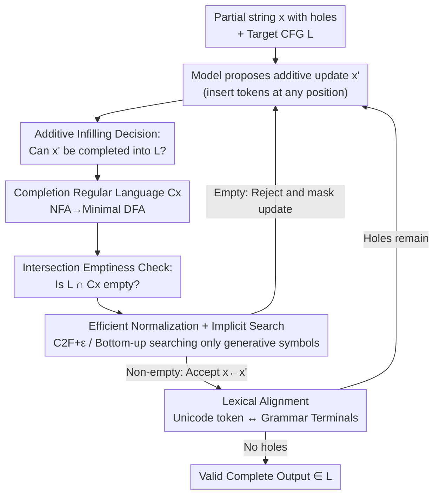

# Constrained Decoding of Diffusion LLMs with Context-Free Grammars

**Conference**: ICLR2026  
**OpenReview**: [https://openreview.net/forum?id=7Sph4KyeYO](https://openreview.net/forum?id=7Sph4KyeYO)  
**Code**: https://github.com/eth-sri/constrained-diffusion  
**Area**: LLM / NLP (Constrained Decoding, Formal Languages)  
**Keywords**: Constrained Decoding, Diffusion Language Models, Context-Free Grammars, Multi-Region Infilling, Formal Languages

## TL;DR
This paper proposes the first constrained decoding method to enforce **Context-Free Grammar (CFG)** constraints on **Diffusion Language Models (DLMs)**. It abstracts the question of "whether a partial text with holes in any order can be completed into a legal string" as an **additive infilling decision problem**, reduces it to checking whether the intersection of the target CFG and the regular language of all possible completions is empty, and utilizes highly optimized emptiness checking algorithms to bring the theoretical cubic complexity into a practical range. It increases syntactic correctness to nearly 100% on C++, JSON, and SMILES while slightly improving functional correctness.

## Background & Motivation
**Background**: LLMs are extensively used in scenarios like code completion and structured data extraction, which require outputs to strictly follow the syntax of a specific **formal language** (leagal C++, schema-compliant JSON). Since LLMs are probabilistic models, their outputs lack syntactic guarantees. The primary remedy is **constrained decoding**: using the target language grammar to perform incremental parsing/validation at each generation step to prune invalid token candidates, ensuring the output falls within the language without restarting inference. Commercial APIs (OpenAI, Anthropic) already offer options to restrict output to JSON or CFG.

**Limitations of Prior Work**: Existing constrained decoding methods assume generation is **left-to-right with prefixes extending step-by-step**, moving their parsers unidirectionally along the token stream. However, emerging **Diffusion Language Models** do not follow this pattern: DLMs start with a sequence of masks $\bot$ and fill in tokens at selected mask positions in any order until no masks remain. This "out-of-order infilling" paradigm invalidates traditional left-to-right parsing states. Previously, Melcer et al. (2024) could only handle infilling between fixed prefixes and suffixes, and Suresh et al. (2025)'s DINGO could only add **regular** constraints to DLMs—no work has yet enabled **CFG** constraints for DLMs (which are necessary to express recursive structures like matched parentheses and nested control flows in real programming languages).

**Key Challenge**: The algorithm for CFG constrained decoding assumes the output is a monotonically extended prefix, whereas DLM generation involves "localized modifications of a partial string with arbitrary holes in any order." The former has a unique and unidirectional parsing state, while the latter must answer a fundamentally harder question at each step: **can this collection of fragments still be completed into a valid full string?**

**Goal**: (1) Generalize the formal framework of constrained decoding to support "out-of-order updates with arbitrary filling regions," covering both **Multi-Region Infilling (MRI)** and **DLM** settings; (2) Provide a decision algorithm to enforce CFG constraints in this generalized setting; (3) Make the execution overhead of this algorithm acceptable for real models.

**Key Insight**: The authors observe that regardless of the order in which tokens are filled, the set of "all possible completions of a partial string $x$ with holes" actually forms a **regular language** $C_x$. Thus, checking if the fragments can be completed into a legal string is equivalent to asking whether the intersection $L \cap C_x$ of the target CFG language $L$ and $C_x$ is non-empty. Since the intersection of a CFL and a regular language is still a CFL, and emptiness testing for CFLs is solvable in polynomial time, this seemingly infinite completion problem is transformed into a decision problem with mature theoretical support.

**Core Idea**: Replace "left-to-right incremental parsing" with "**emptiness testing of the intersection between the target grammar and the completion regular language**," thus enabling CFG constraints for out-of-order diffusion LLMs for the first time.

## Method

### Overall Architecture
The method employs a standard "sample-check-accept/reject" constrained decoding loop (Algorithm 1) for diffusion or infilling generation. A partial output is represented as a sequence of string fragments and holes: $x = x_1\,\square\,x_2\,\square\,\dots\,\square\,x_n$. At each step, the model $M$ proposes an **additive update** $x'$ (inserting tokens in a hole or merging adjacent fragments). The algorithm then calls the decider `COMPLETABLE(x', L)` to determine if $x'$ can still be completed into a valid string in $L$. If it can, the update $x \leftarrow x'$ is accepted; otherwise, it is rejected and masked from the model's distribution. Once the last hole is filled and it remains completable, the output is guaranteed to belong to $L$.

The technical weight of the method lies in the `COMPLETABLE` decision, solved in four layers: formalizing fillability as an **additive infilling decision problem**; proving completions form a regular language and reducing the check to **CFG∩Regular emptiness checking**; reducing cubic overhead via **normalization + bottom-up implicit search**; and finally handling **lexical alignment** where LLM tokens do not align with grammar terminals.

### Key Designs

**1. Additive Infilling Decision Problem: Unifying Out-of-order Validity**
Traditional constrained decoding treats "output" as a monotonically extending prefix, an abstraction unsuitable for DLM's random-order insertion. This paper defines partial output as a sequence of fragments and holes $x = x_1\,\square\,\dots\,\square\,x_n$ ($x_i \in \Sigma^*$, $\square$ is a hole) and restricts each generation step to an **additive modification**: either inserting a string into a hole ($a\,\square\,c \to a\,\square\,b\,\square\,c$) or removing a hole by merging adjacent fragments. The Core Decision Problem (Definition 1) is: do $n-1$ words $y=(y_1,\dots,y_{n-1})$ exist such that $w = x_1 y_1 x_2 \dots y_{n-1} x_n \in L$? This **abstractly unifies both MRI and DLM settings**—MRI is naturally "fixed fragments + holes," while DLM can be modeled by adding implicit $\varepsilon$ tokens at the start and end and merging all contiguous non-masked tokens into fragments (e.g., $(a,\bot,\bot,b,c,\bot)$ becomes $x = a\,\square\,bc\,\square\,\varepsilon$). Since completability is maintained under additive updates, a sequence of additive updates always exists to reach $L$.

**2. Regular Characterization of Completion Language & Intersection Reduction**
This step is the theoretical foundation. The authors prove that the language $C_x$ of all possible completions of $x = x_1\,\square\,\dots\,\square\,x_n$ is a **regular language**. It can be constructed as an NFA: for each $x_i$, create an automaton $D_i$ accepting only $x_i$, follow it with a state $q_i$ with self-loops for any $\sigma$ (representing "fill anything"), link these fragments via $\varepsilon$ edges, and convert to a minimal DFA. Consequently, "$x$ is completable" is equivalent to the intersection language $L_\cap = L \cap C_x$ being non-empty. Using two classical facts—(a) the intersection of a CFL and a regular language is a CFL, whose grammar is constructible from grammar $G$ of $L$ and DFA of $C_x$; (b) CFL emptiness is decidable in polynomial time—the decision is complete. Symbols in the intersection grammar $G_\cap$ represent `${}_p\vec{A}_{q}$`, intuitively "deriving a word from $A$ while moving the DFA from state $p$ to $q$." The intersection is non-empty if words can be derived from ${}_{q_0}\vec{S}_{q_f}$. The cost is $G_\cap$ size being cubic: $|V_\cap| \in O(|V||Q|^2)$ and $|P_\cap| \in O(|P||Q|^3 + |P||Q|^2|\Sigma|)$, which subsequent optimizations address.

**3. Three Techniques to Squash Cubic Overhead: C2F+ε, Bottom-up Implicit Search**
Cubic blowup is the bottleneck for practicality. The authors use three optimizations: (i) **C2F+ε Normalization**—Standard intersection algorithms require Chomsky Normal Form ($A\to BC$ and $A\to a$), but CNF conversion causes quadratic production growth. The authors extend this to C2F+ε (allowing $A\to\varepsilon$ and $A\to B$), reducing growth to **linear**. (ii) **Generative-only Bottom-up Search**—A massive portion of symbols in the intersection grammar are "non-generative" (deriving no terminal strings). Instead of top-down checking from $S$, the authors use bottom-up search: symbols deriving terminals or empty strings ($A\to\sigma, A\to\varepsilon$) are marked "generative" and queued. Marks spread as productions have generative right-hand sides. Once $S$ is marked, non-emptiness is confirmed. This avoids **98%–99.99%** of productions. (iii) **Implicit Intersection Construction**—Instead of pre-building $G_\cap$, search rules are enumerated on-the-fly when accessing symbols like ${}_p\vec{B}_r$, skipping explicit construction of the massive grammar. Furthermore, recording used productions allows reconstructing a parse tree to **sample a valid completion at zero extra cost** to rescue the model from repetitive failures.

**4. Lexical Alignment: Bridging Unicode Tokens and Grammar Terminals**
CFGs are defined on terminals, but LLMs output Unicode tokens; their boundaries often mismatch, especially at hole edges. For example, partial output $\bot 2$ could be completed into `<int>` (filling `1` for `12`) or `<ident>` (filling `x` for `x2`). The authors treat **text on both sides of a hole as potentially incomplete terminals**: finding candidates $t$ in front of a hole where the string is a prefix of a terminal, and suffix candidates after the hole, allowing a terminal to span one or more holes. This enumerates all terminal sequences consistent with the partial output. If any sequence can complete a legal program, the output is admissible. Two optimizations control combinatorial explosion: merging all possible terminal sequences of $x$ into a **single NFA** and running the intersection algorithm once; and pre-processing disambiguation—when terminal language $t_\le$ is contained in $t_\ge$, overlap is removed and the CFG rewritten. Sampling from the intersection language yields terminal sequences, which are then combined with the Unicode partial output's regular language to sample a Unicode-level completion. The algorithm is proven **sound** (outputs are valid), **complete** (valid tokens aren't rejected), and minimally invasive under "maximal munch" assumptions.

## Key Experimental Results

### Main Results
Evaluated on **MRI/FIM** setting using 5 open-source infilling models (StarCoder2 7B, CodeGemma 7B, DeepSeek Coder 1.3B/6.7B/33B) on C++ HumanEval (164 problems) with 1–3 random spans. `Van.` is vanilla sampling, `Con.−` is constrained but counts timeouts as failures, `Con.` is constrained with random legal completion sampling for aborted instances.

| Setting | Metric | Van. (Mean Trend) | Con. | Description |
|------|------|------|------|------|
| 1-MRI | Syntax Accuracy | 88–94% | ~100% | CodeGemma/DeepSeek 33B reach 100% |
| 2-MRI | Syntax Accuracy | 55–66% | 93–99% | Gain increases as model struggles |
| 3-MRI | Syntax Accuracy | 24–36% | 83–96% | `Con.−` absolute gain reaches +31.5% |
| Average | Functional Accuracy | — | +2.8% | Syntactic validity is a prerequisite for functional correctness |

Constrained decoding (`Con.`) recovers syntactically legal completions in **95.8%** of instances on average; remaining failures are timeouts. `Con.−` shows significant improvement in multi-region settings (+5.2% / 22.5% / 31.5% for 1/2/3-MRI).

On the **DLM** setting, 4 diffusion models (LLaDA 8B, Dream 7B, DreamCoder 7B, DiffuCoder 7B) were evaluated on C++, JSON, and SMILES tasks, comparing against **Grammar Prompting (G.P.)**.

| Task | Metric | Van. | G.P. | Con.− | Con. |
|------|------|------|------|------|------|
| C++ | Syntax Accuracy (DreamCoder) | 11.0% | 9.1% | 19.0% | 99.2% |
| JSON | Syntax Accuracy (Mean) | 22～78% | Unstable | +14.7% mean | **100%** |
| SMILES | Syntax Accuracy (Dream) | 67.7% | 84.3% | 93.7% | 99.4% |

`Con.−` improves syntax accuracy by average of 16.1% / 14.7% / 26.0% for C++/JSON/SMILES; `Con.` reaches 100% for JSON and 99%+ for C++. Functional accuracy improves by 2.2% on average (e.g., +6.9% for Dream 7B on JSON).

### Ablation Study
| Configuration / Dimension | Key Data | Description |
|------|---------|------|
| Bottom-up Search | Bypasses 98%–99.99% productions | Most symbols in intersection are non-generative |
| MRI Overhead | Median 4.2 ms/token | 1-MRI 3.1 ms → 3-MRI 7.7 ms |
| DLM Completion Overhead | Median 0.1 s | Early termination can save up to 1 s |
| Abort Threshold | 100 Resamples | Only 0.7% of tasks requiring >50 resamples are functionally correct |
| vs DINGO (Regular Only) | Comparable accuracy | Ours is more general (CFG), <0.3 ms overhead, no pre-processing |

### Key Findings
- **Gain increases as model quality decreases**: On the hardest 3-MRI, vanilla syntax accuracy drops to 24–36% but is restored to 83–96%, showing constrained decoding is most valuable when models struggle with structure.
- **"Legal completion sampling" is crucial for ~100% accuracy**: Even with constraints, models often fail to converge to a legal string (e.g., DreamCoder C++ only 19.0% in `Con.−`). Sampling directly from the intersection language bridges this gap to 99.2%.
- **Grammar Prompting is unreliable**: Soft-constraints via prompts have a volatile impact on accuracy, underperforming compared to hard constraints.
- **Acceptable Overhead**: MRI median is 4.2 ms/token, DLM median 0.1 s; normalization and implicit search are vital to making the cubic complexity practical.

## Highlights & Insights
- **Reducing "out-of-order validity" to formal language intersection** is an elegant abstraction. Once recognized that all completions form a regular language, the problem inherits decades of theory, ensuring soundness and completeness.
- **MRI and DLM unified by Additive Infilling**: A single decider serves both, simply by adjusting masks and epsilon tokens.
- **Tractable cubic complexity**: Practicality is achieved via linear normalization, bottom-up pruning of 99% of non-generative symbols, and implicit construction—a toolbox for any CFL∩Regular decision scenario.
- **Transferability**: The lexical alignment strategy (handling cross-hole terminal split and containment-based disambiguation) is a valuable reference for any constrained generation involving token-to-terminal mismatch.

## Limitations & Future Work
- **Over-approximation of Space**: The method allows holes to be filled by arbitrary-length strings. Since LLMs have finite context, $C_x$ is slightly larger than the actual reachable completions, potentially accepting completions the model cannot actually generate.
- **Dependency on Maximal Munch**: The soundness proof relies on the target language following "maximal munch" lexical rules.
- **Limited Functional Gain**: Constraints only guarantee syntax. On SMILES, where vanilla functional accuracy is only ~1.5%, syntax constraints barely improve functional accuracy (+0.2%)—syntax $\neq$ semantics.
- **Worst-case Complexity**: The theoretical cubic blowup remains. Though heuristics lower **actual** costs, extremely complex grammars or long outputs may still trigger timeouts.
- **Future Directions**: Precisely modeling hole length to tighten approximation; exploring incremental reuse of decision results between decoding steps to further reduce costs.

## Related Work & Insights
- **vs Melcer et al. (2024) (FIM Constraints)**: They are limited to single-span infilling between fixed prefixes/suffixes. This work generalizes to **arbitrary holes and out-of-order updates**, covering DLMs, using intersection-based decisions.
- **vs DINGO (Suresh et al., 2025)**: DINGO is the closest work for DLMs but only supports **Regular** constraints. This work supports **CFG** (recursive structures), with comparable syntax accuracy, similar functional gains, <0.3 ms overhead, and no pre-processing.
- **vs Grammar Prompting (Wang et al., 2023)**: G.P. uses soft prompt guidance with no guarantees. Our hard constraints provide stable and significantly higher syntax accuracy.
- **vs Traditional Left-to-Right CFG Constraints**: Prior works (Poesia 2022, Beurer-Kellner 2024) assume monotonic prefixes and maintain single parsing states. This work builds the bridge to the diffusion paradigm via completion regular language intersection.

## Rating
- Novelty: ⭐⭐⭐⭐⭐ First CFG constraint method for diffusion LLMs with clean formal reduction.
- Experimental Thoroughness: ⭐⭐⭐⭐ Coverage of 9 models across 3 tasks with overhead analysis, though functional gains are modest.
- Writing Quality: ⭐⭐⭐⭐⭐ Theoretical and algorithmic progression is logical with clear diagrams.
- Value: ⭐⭐⭐⭐⭐ Extends structure guarantees from auto-regressive to diffusion paradigms, directly applicable to code/structured generation.

<!-- RELATED:START -->

## Related Papers

- [\[ICLR 2026\] Stopping Computation for Converged Tokens in Masked Diffusion-LM Decoding](stopping_computation_for_converged_tokens_in_masked_diffusion-lm_decoding.md)
- [\[ICLR 2026\] Don't Settle Too Early: Self-Reflective Remasking for Diffusion Language Models](dont_settle_too_early_self-reflective_remasking_for_diffusion_language_models.md)
- [\[ICLR 2026\] In-Context Algebra](in-context_algebra.md)
- [\[ICLR 2026\] d²Cache: Accelerating Diffusion-Based LLMs via Dual Adaptive Caching](d2cache_accelerating_diffusion-based_llms_via_dual_adaptive_caching.md)
- [\[ICML 2026\] Masks Can Be Distracting: On Context Comprehension in Diffusion Language Models](../../ICML2026/llm_nlp/masks_can_be_distracting_on_context_comprehension_in_diffusion_language_models.md)

<!-- RELATED:END -->
