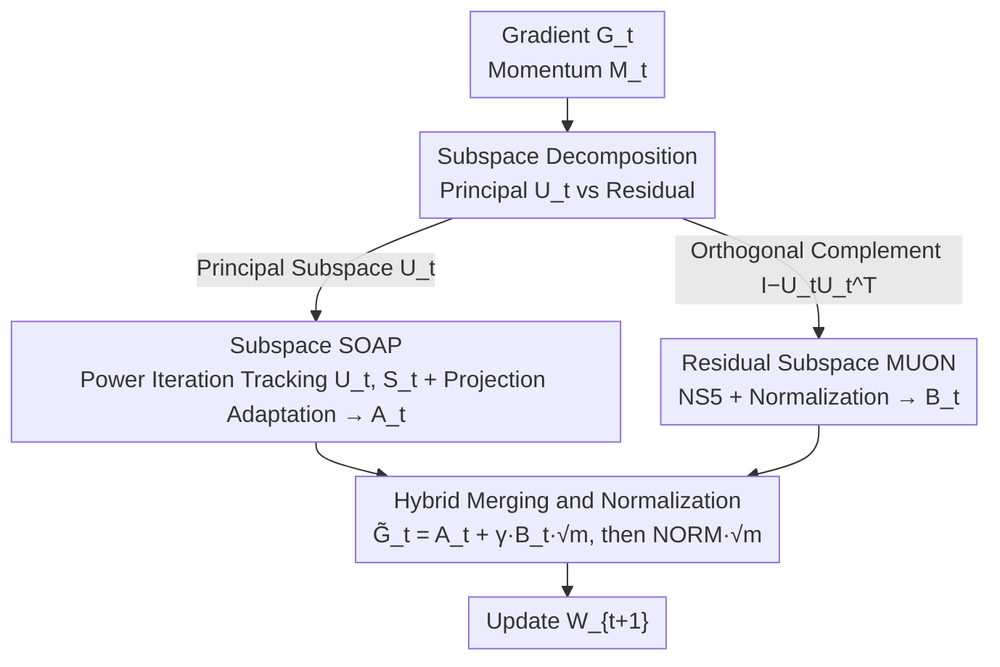

# COSMOS: A Hybrid Adaptive Optimizer for Efficient Training of Large Language Models

**Conference**: ICLR2026  
**OpenReview**: [https://openreview.net/forum?id=j2QTOOtM8R](https://openreview.net/forum?id=j2QTOOtM8R)  
**Code**: TBD  
**Area**: LLM Efficiency / Optimizers  
**Keywords**: Adaptive Optimizer, Memory-Efficient, Feature Subspace, SOAP, MUON

## TL;DR
COSMOS decomposes the gradient matrix into a "leading direction + residual" based on feature subspaces. It applies SOAP-style second-order preconditioning to the most informative low-dimensional principal subspace and uses the computationally cheap MUON for the remaining high-dimensional residuals. This achieves pre-training convergence comparable to or slightly better than SOAP while using memory close to MUON (approximately 1/5 of SOAP).

## Background & Motivation

**Background**: The dominant optimizer for LLM pre-training is AdamW, which maintains first and second moments coordinate-wise. To better capture dependencies between parameters, second-order methods like Shampoo and SOAP have emerged (using the eigenbasis of gradient covariance for preconditioning), alongside approximation methods like GaLore and MUON aimed at reducing memory and computational costs.

**Limitations of Prior Work**: Each of these paths has significant drawbacks. AdamW treats each coordinate independently, failing to capture curvature coupling and leading to sub-optimal updates. While SOAP captures coordinate dependencies, it must maintain dense $n \times n$ second moments $H_t$ and $n \times n$ rotation matrices, causing memory to explode quadratically with dimension (SOAP's optimizer state is reported at $66d^2$, nearly 3x that of Adam), making it infeasible for massive LLMs. GaLore retains momentum only in the top $r$ principal directions and discards the residual subspace gradient information entirely, leading to significant performance degradation when sequence lengths exceed 256. MUON estimates the feature subspace using only a single batch gradient without accumulating the distribution along the optimization trajectory, making it less robust than SOAP.

**Key Challenge**: There is a trade-off between memory efficiency and "preserving gradient second-order statistics/coordinate dependencies"—saving memory requires approximating or discarding statistics, which hurts performance; preserving statistics requires maintaining dense large matrices, which consumes excessive memory.

**Key Insight**: The authors observe that the **importance of different feature subspaces of the gradient matrix varies significantly**. The leading eigensubspace carries most of the optimization dynamics and warrants the sophisticated but expensive treatment of SOAP. While the residual subspace also influences convergence and cannot be discarded (as learned from GaLore), applying SOAP to it is "low value-for-money"; using the cheaper MUON is sufficient.

**Core Idea**: "Divide and conquer" based on subspace importance—apply SOAP to the principal subspace and MUON to the residual subspace. By strictly limiting SOAP to a low-dimensional principal subspace, it only needs to maintain $O(nr)$ state instead of $O(n^2)$.

## Method

### Overall Architecture

COSMOS is a per-layer hybrid optimizer. For an $m \times n$ weight matrix $W$ (assume $m > n$), after obtaining the stochastic gradient $G_t$ at each step, the momentum $M_t$ is first projected onto the currently estimated **leading eigensubspace** $U_t \in \mathbb{R}^{n \times r}$ ($r \ll n$) for SOAP-style adaptive updates to obtain component $A_t$. Then, the momentum on the **orthogonal complement** (residual) of the principal subspace is processed using MUON's Newton–Schulz transformation to obtain component $B_t$. Finally, the two components are weighted, merged, and globally normalized to update the weight. The entire process per layer only requires persistent storage of four matrices: $M_t \in \mathbb{R}^{m \times n}$, $U_t \in \mathbb{R}^{n \times r}$, $S_t \in \mathbb{R}^{r \times r}$, and $V_t \in \mathbb{R}^{m \times r}$, compressing SOAP's $n \times n$ blocks into slim low-rank blocks.

The principal subspace $U_t$ is not re-computed via SVD at every step but is tracked online via "one-step power iteration + QR": the low-rank second-moment proxy $U_{t-1}S_{t-1}U_{t-1}^\top$ from the previous step is synthesized with the new gradient's $G_t^\top G_t$ via EMA to form $\tilde H_t$. Then, a QR decomposition is performed on $\tilde H_t U_{t-1}$ to obtain the new $U_t$, and the projected second moment is refreshed as $S_t = U_t^\top \tilde H_t U_t$. Since this is calculated on $n \times r$, the QR complexity is $O(nr^2)$, allowing it to be performed every step with almost zero extra overhead (compared to SOAP's $O(n^3)$, which requires controlling preconditioning frequency).

### Key Designs

**1. Gradient Subspace Decomposition: Separating the "critical few" from the "trivial many"**

The starting point of COSMOS is "importance stratification" of the eigenvalue spectrum of the gradient second moment $H_t$. It splits the update into a projected component in the principal subspace $U_t$ and a residual component in the orthogonal complement $P_t^\perp = I - U_tU_t^\top$. The principal subspace dimension $r$ is extremely small (experimentally $r \approx 0.05d$; $r=64$ for a 130M model), yet it carries the primary optimization dynamics, so this "small but elite" part deserves SOAP's precise treatment. The residual subspace has high dimensionality but each direction contributes little, so the cheaper MUON serves as a safety net. This split avoids discarding residuals (preventing long-sequence degradation like GaLore) while avoiding expensive memory use for the full space (like SOAP).

**2. Subspace SOAP: Low-rank Projection + Online Tracking of Eigenbasis via Power Iteration**

This is the core of COSMOS's memory savings. While SOAP maintains $H_t = \beta_2 H_{t-1} + (1-\beta_2)G_t^\top G_t \in \mathbb{R}^{n \times n}$, COSMOS maintains only a low-rank proxy: an orthonormal basis $U_t \in \mathbb{R}^{n \times r}$ and a projected second moment $S_t \approx U_t^\top H_t U_t \in \mathbb{R}^{r \times r}$. During the update, $H_{t-1}$ is replaced by the rank-$r$ proxy $U_{t-1}S_{t-1}U_{t-1}^\top$, and the EMA becomes $\tilde H_t = \beta_2 U_{t-1}S_{t-1}U_{t-1}^\top + (1-\beta_2)G_t^\top G_t$. A single power iteration updates the basis $U_t = \mathrm{QR}(\tilde H_t U_{t-1})$, and $S_t = U_t^\top \tilde H_t U_t$ is refreshed. Subsequently, the EMA of the projected gradient $V_t \in \mathbb{R}^{m \times r}$ is maintained in the subspace spanned by $U_t$, following which a SOAP-style adaptation (with bias correction) is performed and projected back:

$$A_t = \left(\frac{M_t U_t / (1-\beta_1^t)}{\sqrt{(V_t + \epsilon) / (1-\beta_2^t)}}\right) U_t^\top .$$

The entire process occurs within $O(nr)$ memory, retaining SOAP's ability to capture coordinate dependencies while cutting the $n \times n$ overhead to a slim low-rank form. Because QR is computed on $n \times r$, the basis can be refreshed every step without the precision loss SOAP incurs from reducing eigendecomposition frequency to save compute.

**3. Residual Subspace MUON: Newton–Schulz Approximation of Matrix-Sign for Residual Momentum**

Residuals outside the principal subspace cannot be ignored, but SOAP is too "expensive" for them. COSMOS adopts the MUON approach: it takes the momentum component in the orthogonal complement $M_t - M_t U_t U_t^\top$, normalizes it, and feeds it into a 5-step Newton–Schulz iteration $\mathrm{NS}_5(\cdot)$, followed by a Frobenius norm normalization:

$$B_t = \mathrm{NORM}\!\left(\mathrm{NS}_5\!\left(\frac{M_t - M_t U_t U_t^\top}{\lVert M_t - M_t U_t U_t^\top \rVert_F}\right)\right).$$

$\mathrm{NS}_5$ uses polynomial iterations with fixed coefficients ($a=3.4445, b=-4.7750, c=2.0315$) to approximate the matrix-sign operator $\mathrm{MatSgn}(X) = UV^\top$ without SVD or extra matrix storage, relying purely on fast matrix multiplications. Notably, COSMOS adds a normalization step after NS (absent in standard MUON); ablations show that even if MUON is also normalized, COSMOS remains superior, indicating the gain comes from the "subspace SOAP" split.

**4. Hybrid Merging and Global Normalization: A Tuning-free $\gamma$**

The two components are merged via $\tilde G_t = A_t + \gamma B_t \sqrt m$, and updated via $W_{t+1} = W_t - \eta \, \mathrm{NORM}(\tilde G_t) \sqrt m$. Here $\mathrm{NORM}(X) = \sqrt n \, X / \lVert X \rVert_F$, which with $\sqrt m$ ensures the update's Frobenius norm stays in $\Theta(\sqrt{mn})$, aligning with MUON's scale for stability. The factor $\gamma$ controls the residual weight. The authors provide a heuristic $\gamma = \eta / \eta_0$ (where $\eta_0$ is the learning rate for Adam on embedding/output layers), which experiments prove falls within the optimal range of $0.25 \sim 0.5$, eliminating the need for a grid search.

### Loss & Training

COSMOS does not change the training objective, which remains the standard next-token prediction loss. Implementation-wise, Adam is used for embedding and output layers, while COSMOS is applied to all other weight matrices (consistent with SOAP/MUON practices). Default hyperparameters: momentum $(\beta_1, \beta_2)$, projection rank $r \ll n$ (64 for 130M), $\gamma = \eta/\eta_0$, max sequence length 1024.

## Key Experimental Results

### Main Results

Pre-training LLaMA (130M/350M/1B) on C4 with 5B–26B tokens, comparing final validation perplexity (lower is better):

| Model (Tokens) | Adam | Adam-mini | GaLore | SOAP | MUON | COSMOS |
| :--- | :--- | :--- | :--- | :--- | :--- | :--- |
| 130M (5B) | 21.28 | 21.78 | 24.07 | 20.59 | 20.69 | **20.54** |
| 350M (10B) | 17.28 | 18.03 | 19.03 | 16.32 | 16.49 | **16.21** |
| 1B (26B) | 12.97 | – | – | – | 12.57 | **12.46** |

COSMOS achieved the lowest perplexity across all scales, matching or slightly exceeding SOAP's token efficiency and consistently outperforming MUON. GaLore and Adam-mini lag significantly, confirming that "residuals cannot be discarded, and coordinate dependency is critical."

Memory and wall-clock time per step for the 1B model (batch=10):

| Method | VRAM | Time/Step |
| :--- | :--- | :--- |
| Adam | 62.75 G | 34.73 s |
| SOAP | 72.58 G | 39.51 s |
| MUON | 58.25 G | 35.56 s |
| COSMOS | **58.47 G** | 35.75 s |

COSMOS memory is 19.4% lower than SOAP and 6.8% lower than Adam, practically matching MUON, while time overhead is only slightly higher than MUON and much faster than SOAP. Theoretical memory for optimizer states: Adam $24d^2$, SOAP $66d^2$, MUON $12d^2$, COSMOS only $13d^2$ (at $r = 0.05d$). On an A100-80G, COSMOS's max batch size is 14 (same as MUON; SOAP is 10), and throughput is 10.8% faster than SOAP.

### Ablation Study

| Configuration | Key Result | Explanation |
| :--- | :--- | :--- |
| Different LR ($\gamma = \eta / \eta_0$) | Ppl 21.17 $\to$ 20.54 $\to$ 20.62 $\to$ 21.00 for LR 2e-4 $\to$ 2e-3 | COSMOS is insensitive to LR and consistently outperforms MUON. |
| Different $r, \gamma$ | Only ($r=128, \gamma=1$) was slightly worse than MUON; all others won. | Robust to rank and discount factor; $\gamma \in [0.25, 0.5]$ is optimal. |
| Norm added to MUON | COSMOS still superior (Fig. 7). | Gains come from Subspace SOAP, not just normalization. |
| Long Sequence (>256) | COSMOS does not degrade; GaLore degrades significantly. | Value of retaining residual subspace information. |

### Key Findings
- **Subspace SOAP is the core source of gain**: Adding normalization to MUON does not bridge the gap, proving the performance stems from the SOAP partition.
- **Larger rank $r$ can be worse**: Larger $r$ introduces smaller eigenvalues into the top-$r$ set, increasing the approximation error of the one-step power iteration. Hence, small ranks (e.g., 64) are more stable.
- **GaLore's long-sequence degradation reproduced**: Discarding the residual subspace is costly for long sequences; COSMOS is immune as it retains this information.
- **Cross-setting robustness**: COSMOS consistently wins over MUON/Adam on FineWeb with LLaMA-130M (large batch 4096, strong weight decay), Modded-NanoGPT, and GPT-2 small/medium on WikiText-103.

## Highlights & Insights
- **Subspace importance stratification as a transferable concept**: Not all directions deserve equal compute. Allocating expensive methods to the few principal directions and cheap methods to the residual is essentially "budget allocation based on information density," applicable to other memory-constrained scenarios like fine-tuning or distributed preconditioning.
- **One-step power iteration + QR for online tracked eigenbasis**: This avoids the $O(n^3)$ bottleneck of SOAP's periodic SVD, making "per-step preconditioning refresh" virtually free in a low-rank setting.
- **Practically useful $\gamma = \eta / \eta_0$ heuristic**: It binds a hyperparameter to the existing learning rate, falling naturally into the optimal range and saving a grid search, which is very engineering-friendly.
- The design acts as a "complementary set" of the failures of GaLore (discarding residuals) and SOAP (full space is too expensive).

## Limitations & Future Work
- **Lack of extreme-scale validation**: No SOAP baseline for the 1B scale due to compute; ablations at 350M+ are less exhaustive. Whether the "principal subspace dominates dynamics" assumption holds at 10B+ remains to be verified.
- **Fixed rank $r$**: Larger ranks worsen power iteration error, but the paper uses a fixed rank. No adaptive rank mechanism is provided.
- **Pre-training only**: MUON/GaLore vary in fine-tuning performance; COSMOS's behavior in instruction tuning or long-context continued training is untested.
- **Approximation error of one-step power iteration**: This increases when eigenvalues in the principal subspace are close; it may be unstable for layers with "flat" spectra.

## Related Work & Insights
- **vs SOAP**: SOAP maintains dense second moments ($66d^2$ state, $O(n^3)$ decomposition) in full $n$-dimensional space. COSMOS performs SOAP in rank-$r$ subspace ($13d^2$ state, $O(nr^2)$) and uses MUON for residuals; it matches/exceeds performance while cutting memory to ~1/5.
- **vs MUON**: MUON applies NS5 to the whole momentum (single-batch estimate, no trajectory accumulation). COSMOS maintains EMA second moments in the subspace, providing better robustness across learning rates.
- **vs GaLore**: GaLore discards residuals, causing degradation on sequences >256. COSMOS retains residuals using MUON, avoiding this.
- **vs Adam / Adam-mini**: Coordinate-wise only; fails to capture dependencies. COSMOS's subspace preconditioning preserves coordinate coupling, leading to significantly higher token efficiency.

## Rating
- Novelty: ⭐⭐⭐⭐ The hybrid SOAP+MUON approach based on subspace importance is a clean and effective combination.
- Experimental Thoroughness: ⭐⭐⭐⭐ Multi-model scales + memory/throughput profiling + rich ablations, though SOAP comparison at 1B+ is limited.
- Writing Quality: ⭐⭐⭐⭐ Logical flow from motivation to algorithm to memory analysis.
- Value: ⭐⭐⭐⭐ Provides a practical optimizer for LLM pre-training that offers MUON-level memory with SOAP-level performance.

<!-- RELATED:START -->

<!-- Paper links would go here -->

<!-- RELATED:END -->

## Related Papers

- [\[ICLR 2026\] PT2-LLM: Post-Training Ternarization for Large Language Models](pt2-llm_post-training_ternarization_for_large_language_models.md)
- [\[ACL 2025\] Semantic Exploration with Adaptive Gating for Efficient Problem Solving with Language Models](../../ACL2025/llm_nlp/semantic_exploration_adaptive_gating.md)
- [\[ACL 2025\] A Survey on Efficient Large Language Model Training: From Data-centric Perspectives](../../ACL2025/llm_nlp/a_survey_on_efficient_large_language.md)
- [\[ICLR 2026\] The Lattice Representation Hypothesis of Large Language Models](the_lattice_representation_hypothesis_of_large_language_models.md)
- [\[ACL 2026\] GRASS: Gradient-based Adaptive Layer-wise Importance Sampling for Memory-Efficient LLM Fine-tuning](../../ACL2026/llm_nlp/grass_gradient-based_adaptive_layer-wise_importance_sampling_for_memory-efficien.md)

<!-- RELATED:END -->
