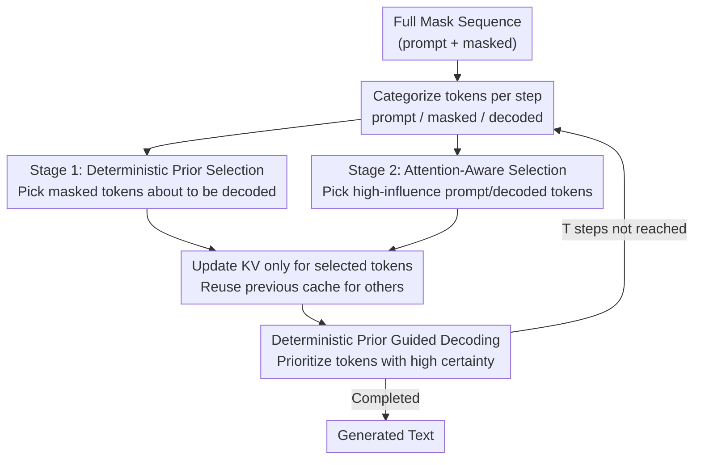

# d²Cache: Accelerating Diffusion-Based LLMs via Dual Adaptive Caching

**Conference**: ICLR 2026  
**arXiv**: [2509.23094](https://arxiv.org/abs/2509.23094)  
**Code**: [https://github.com/Kamichanw/d2Cache](https://github.com/Kamichanw/d2Cache)  
**Area**: LLM/NLP  
**Keywords**: Diffusion LLM, KV Cache, Inference Acceleration, dLLM, Attention Pruning

## TL;DR
Proposed d²Cache, a training-free approximate KV caching framework for Diffusion-based LLMs (dLLMs). It achieves a $4.1\times$ inference speedup while improving generation quality through a two-stage strategy: deterministic-prior-guided masked token selection combined with attention-aware non-masked token selection.

## Background & Motivation

**Background**: Diffusion-based LLMs (dLLM, e.g., LLaDA, Dream) generate text through iterative denoising. Utilizing bidirectional attention, they compete with Autoregressive Models (ARMs) in reasoning and instruction-following tasks.

**Limitations of Prior Work**: dLLMs use bidirectional attention. Updating any masked token at each step changes the context of all tokens, rendering **standard KV caching completely unusable**—every step requires recomputing the KV states for the entire sequence. Existing approximate KV cache methods (dLLM-Cache, Fast-dLLM) are coarse-grained, partitioning sequences into static/dynamic segments with fixed update windows, which lack flexibility or require complex hyperparameter tuning.

**Key Challenge**: The bidirectional attention mechanism in dLLMs provides advantages in context modeling but sacrifices the natural KV cache acceleration capabilities of ARMs. How can cache acceleration be restored without compromising generation quality?

**Goal**: Design a fine-grained, adaptive KV cache strategy that accurately identifies which tokens truly need KV updates at each step.

**Key Insight**: Fine-grained analysis reveals that the KV states of masked tokens undergo three stages (slow change $\rightarrow$ rapid change $\rightarrow$ stable); updates are only necessary during the rapid change stage. Furthermore, attention in prompt/decoded tokens is highly concentrated, requiring updates only for high-attention tokens.

**Core Idea**: A two-stage fine-grained token selection process—Stage 1 selects masked tokens based on a deterministic prior, and Stage 2 selects the remaining tokens based on attention scores. Only the KV states of a few critical tokens are updated per step, while the rest are reused from the cache.

## Method

### Overall Architecture
A dLLM generates text starting from a fully masked sequence through $T$ iterative denoising steps. Bidirectional attention normally forces recomputation of all KVs at every step. d²Cache identifies exactly when KV states change (via three-stage analysis) to select a small subset of tokens for updating at **each step**. Tokens are categorized into three types (prompt / masked / decoded) and filtered through two complementary channels: Stage 1 selects "about-to-be-decoded" masked tokens using a deterministic prior, and Stage 2 selects "high-influence" prompt/decoded tokens using attention scores. Only selected tokens recompute KVs; others reuse the previous step's cache. Interestingly, the deterministic prior used in Stage 1 also guides the decoding order, resulting in a quasi-left-to-right generation that saves time and improves quality.

> The three-stage analysis of KV states (slow change $\rightarrow$ rapid change $\rightarrow$ stable) is the foundational observation supporting the strategy, explaining why updating few tokens suffices.

### Key Designs

**1. Three-Stage Analysis of KV States: Understanding when masked token KVs change**

Fine-grained caching requires knowing which tokens' KVs actually change. Using PCA to plot the KV trajectories of masked tokens, the authors found three distinct phases: first, **early slow change**, where KV states remain nearly static when a masked token is far from the current decoding position; second, **proximal rapid change**, where KVs change drastically within one or two steps as the token is about to be decoded; and third, **post-decoding stability**, where KVs freeze once the token is determined. This dictates the logic: only tokens in the rapid change phase must be recomputed.

**2. Stage 1 (Deterministic-Prior-Guided Selection): Selecting masked tokens about to be decoded**

Since rapid changes concentrate on masked tokens "about to be decoded," Stage 1 selects this subset. The authors define a position-aware deterministic density:

$$D(i) = \sum_{j \notin M} \exp\!\left(-|i-j|^2 / 2\sigma^2\right)$$

This uses a Gaussian kernel to measure the density of known (non-mask) tokens around masked token $i$. Higher $D(i)$ indicates it's likely to be decoded soon. The final selection score multiplies this spatial prior with the model's prediction confidence, updating KVs for the top-$k$ masked tokens with the highest $D(i) \cdot s^i$. Empirical evidence shows ~90% of tokens are decoded within 10 steps of the previous decoding position, confirming this prior's reliability.

**3. Stage 2 (Attention-Aware Selection): Updating only important prompt and decoded tokens**

For prompt and decoded tokens, KVs do not need recomputation every step. Stage 2 builds on the observation that bidirectional attention in dLLMs, like in ARMs, is concentrated on a few salient tokens. Using Attention Rollout, attention matrices are recursively aggregated across layers:

$$C^{(l)} = W^{(l)} \cdot C^{(l-1)}$$

A global influence score $c_j = \sum_i C_{ij}^{(N)}$ is derived. Tokens are selected in descending order of influence until their cumulative probability exceeds threshold $p$. Updating only these tokens minimizes computation with negligible impact on output.

**4. Deterministic-Prior-Guided Decoding: Turning a caching prior into a better decoding order**

The deterministic density from Stage 1 can also determine the decoding order as a zero-cost byproduct. Instead of purely using prediction confidence, the model prioritizes tokens with high certainty (near decoded areas), making the process quasi-left-to-right. This mitigates a common dLLM issue where tokens at the end of a sequence become prematurely overconfident, thus improving generation quality.

### Loss & Training
d²Cache is a **completely training-free** inference acceleration framework. It does not modify model parameters; all optimizations are performed online during inference.

## Key Experimental Results

### Main Results

**LLaDA-8B-Instruct (GSM8K, 4-shot)**:

| Method | Throughput | Latency | Accuracy |
|------|--------|------|--------|
| Vanilla | 2.77 (1.0×) | 110.26s | 77.6 |
| dLLM-Cache | 8.29 (3.0×) | 30.34s | 76.8 |
| Fast-dLLM | 9.64 (3.5×) | 26.15s | 77.0 |
| **Ours (d²Cache)** | **11.39 (4.1×)** | **22.41s** | **79.2** |

The method achieves a $4.1\times$ speedup while increasing accuracy by $1.6\%$.

### Ablation Study

| Config | Speedup | Quality | Description |
|------|--------|------|------|
| Full d²Cache | 4.1× | ↑ | Complete two-stage strategy |
| Stage 1 only | ~3× | ↑ | Lacks prompt/decoded token selection |
| Stage 2 only | ~2.5× | ≈ | Lacks efficient masked token selection |
| Deterministic Prior Decoding | - | ↑↑ | Replaces confidence-based decoding; major quality gain |

### Key Findings
- d²Cache is consistently effective across different dLLMs (LLaDA, Dream), **simultaneously improving speed and quality**—a rarity in acceleration methods.
- Deterministic-prior-guided decoding yields higher quality than default confidence-based decoding by enforcing a more structured, quasi-left-to-right generation order.
- The discovery that 90% of tokens are decoded within 10 steps of the previous position reveals strong locality in dLLM decoding, despite theoretical support for arbitrary orders.
- The observation of attention concentration in prompt and decoded tokens is directly transferable to other dLLM optimization research.

## Highlights & Insights
- **Speed-Quality Win-Win**: By guiding the decoding order via a deterministic prior, the method not only accelerates inference but also mitigates premature overconfidence. "A good caching strategy = a good decoding strategy" is a profound insight.
- **Value of Fine-Grained Analysis**: The three-stage KV dynamic analysis provides foundational knowledge for the dLLM inference optimization field.
- **Training-Free Plug-and-Play**: Can be applied directly at inference time without retraining. Adapting to new dLLMs only requires running an Attention Rollout analysis.

## Limitations & Future Work
- Attention Rollout introduces $O(NL^2)$ overhead; while cheaper than full forward passes, it is non-negligible.
- Parameters like the Gaussian kernel width $\sigma$ and threshold $p$ are hyperparameters that may require tuning for different tasks.
- Validated only on LLaDA and Dream; effectiveness on future, larger dLLMs remains to be verified.
- Synergies with other techniques like quantization or sparsity were not explored.

## Related Work & Insights
- **vs dLLM-Cache**: Moves beyond coarse-grained prompt/response segmentation and fixed frequency updates to a flexible per-token adaptive strategy.
- **vs Fast-dLLM**: Provides more flexibility than block-level semi-autoregressive decoding by using per-token selection.
- **vs ARM KV Cache Pruning**: Successfully generalizes observations of attention saliency from ARMs to the bidirectional attention context of dLLMs.

## Rating
- Novelty: ⭐⭐⭐⭐ The dLLM KV cache field is nascent; the fine-grained analysis and two-stage design are solid.
- Experimental Thoroughness: ⭐⭐⭐⭐ Covered two dLLMs and multiple datasets, though very large-scale verification is pending.
- Writing Quality: ⭐⭐⭐⭐⭐ Analysis-driven design logic is clear with excellent visualizations.
- Value: ⭐⭐⭐⭐ dLLM inference acceleration is a current hotspot; $4.1\times$ speedup with quality gains is highly practical.

<!-- RELATED:START -->

## Related Papers

- [\[ICML 2026\] SPA-Cache: Singular Proxies for Adaptive Caching in Diffusion Language Models](../../ICML2026/llm_nlp/spa-cache_singular_proxies_for_adaptive_caching_in_diffusion_language_models.md)
- [\[ICLR 2026\] Stopping Computation for Converged Tokens in Masked Diffusion-LM Decoding](stopping_computation_for_converged_tokens_in_masked_diffusion-lm_decoding.md)
- [\[ICLR 2026\] Toward Safer Diffusion Language Models: Discovery and Mitigation of Priming Vulnerabilities](toward_safer_diffusion_language_models_discovery_and_mitigation_of_priming_vulne.md)
- [\[ICLR 2026\] DreamOn: Diffusion Language Models For Code Infilling Beyond Fixed-size Canvas](dreamon_diffusion_language_models_for_code_infilling_beyond_fixed-size_canvas.md)
- [\[ICLR 2026\] Constrained Decoding of Diffusion LLMs with Context-Free Grammars](constrained_decoding_of_diffusion_llms_with_context-free_grammars.md)

<!-- RELATED:END -->
