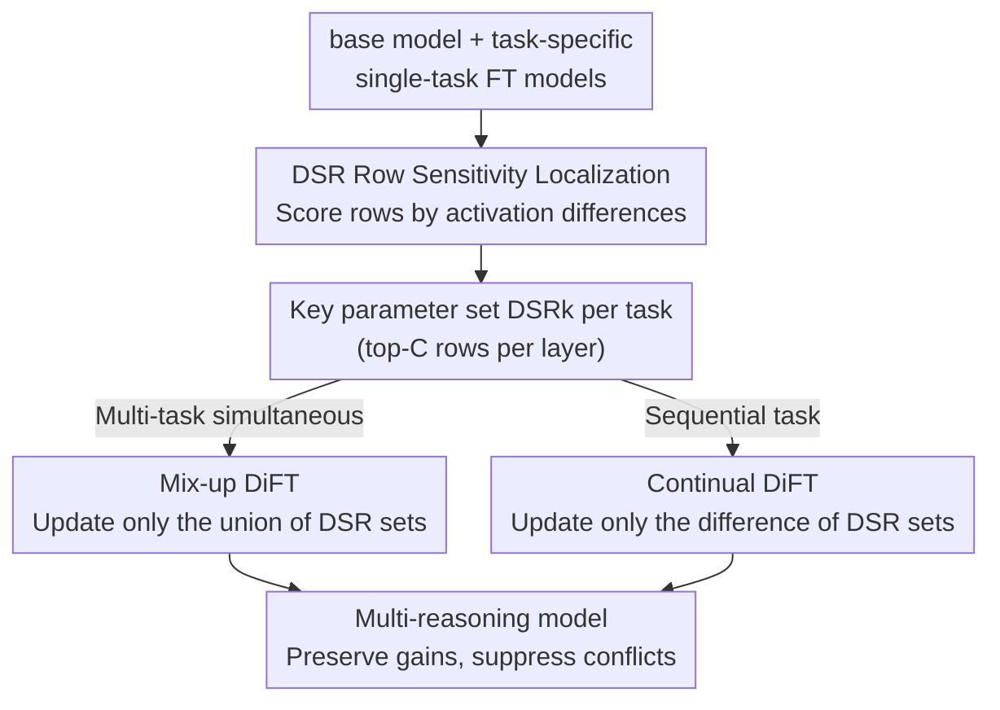

# Differential Fine-Tuning Large Language Models Towards Better Diverse Reasoning Abilities

**Conference**: ICLR2026  
**OpenReview**: [https://openreview.net/forum?id=aIhn4GhTBW](https://openreview.net/forum?id=aIhn4GhTBW)  
**Code**: To be confirmed  
**Area**: LLM Reasoning / Supervised Fine-Tuning / Multi-task Learning  
**Keywords**: Differential Fine-Tuning, Parameter Sensitivity, Multi-task Conflict, Continual Learning, Reasoning Abilities

## TL;DR
This paper discovers that different reasoning abilities (math/code/logic/commonsense) correspond to their own "exclusive" key parameters within LLMs. It proposes DiFT (Differential SFT): first locating key parameter rows for each task using DSR scores, then updating only the union of these key parameters during mix-up fine-tuning, and only the current task's unique key parameters during continual fine-tuning. This approach preserves gains for each reasoning task while avoiding mutual interference during joint training.

## Background & Motivation
**Background**: Supervised Fine-Tuning (SFT) is the primary method for injecting reasoning abilities into LLMs—fine-tuning on single datasets like math (MathInstruct), code (Code Bagel), logic (LogiCoT), or commonsense (CommonsenseQA) consistently improves performance. In practice, researchers aim for models with multiple reasoning abilities, leading to mix-up (simultaneous) or continual (sequential) training.

**Limitations of Prior Work**: Systematic experiments revealed a counter-intuitive phenomenon: neither mix-up nor continual training can reliably maintain the performance of "single-dataset SFT." Results are sometimes better but often worse. For example, on Llama3-8B, `Mix-Math-Code` improves GSM8k from 61.64% to 64.82% (synergy between math and code), but the code metric xGLUE is slightly lower than `Code-only`. `Continual-Math-Logic` drops math performance from 39.42% to 10.99%, showing severe negative transfer. This indicates that vanilla SFT both promotes reasoning and introduces conflicts.

**Key Challenge**: Previous works (HFT, LoTA, DMT) mostly treat task interactions as purely "harmful interference" to be suppressed or focus only on the data level, ignoring the full landscape of task relationships—**beneficial, conflicting, and neutral**. The root cause lies in whether different reasoning abilities share the same parameters (leading to conflict) or occupy distinct ones (allowing non-interference). This had not been clarified at the parameter level.

**Goal**: (1) Understand the origins of gains and conflicts between reasoning abilities. (2) Design a fine-tuning strategy to preserve gains and suppress conflicts in mix-up/continual SFT, potentially exceeding single-dataset SFT.

**Key Insight**: The authors analyze **parameter changes** relative to the base model during reasoning, assuming that the parameters "responsible" for a specific ability can be localized.

**Core Idea**: Use a DSR score measuring parameter sensitivity to identify "exclusive key parameters" for each task. Then, **update only the necessary parameters while freezing others**—mix-up training updates the union of key parameters, while continual training updates only the part unique to the new task, mitigating unnecessary conflicts at the source.

## Method

### Overall Architecture
DiFT involves two steps. **Step 1 is Analysis**: Given a base model $M_{base}$ and models fine-tuned on single tasks $\{M_{ft}^k\}$, sample a small amount of data. Compare the **output activation differences** at each layer between base and fine-tuned models during the forward pass. Score each parameter row using DSR (delta-scale row) and take the top-$C$ rows per layer as the key parameter set $DSR_k$. **Step 2 is Differential Fine-Tuning**: Depending on the scenario (mix-up or continual), combine $DSR_k$ sets and only unfreeze those parameters for training. The key is that "what to update and what to freeze" is entirely driven by DSR analysis rather than random selection or data ordering.

### Key Designs

**1. DSR Score: Locating "Exclusive Parameter Rows" via Activation Delta**

Differential fine-tuning requires knowing which parameters are critical. The authors start from the essence of fine-tuning: $W^{s+1}=W^s-\eta_s g_s$ implies weight change $\Delta W_k=-\int_0^T g_k(\tau)\,d\tau$. A second-order Taylor expansion of the loss $\Delta L_k=-g_k\Delta W_k-\tfrac{1}{2}H_{kk}(\Delta W_k)^2+o(\cdot)$ shows that only rows with non-trivial $|\Delta W_k|$ participate in loss reduction. Instead of comparing $\Delta W$ directly, the authors look at output activation changes: for input $X$, compare the delta in output $\Delta Y_t^k=Y_{ft}^k(t)-Y_{base}^k(t)=X_t\Delta W_k$ for row $k$, defining the DSR score as:

$$s_k=\mathbb{E}_t\big[\lVert \Delta Y_t^k\rVert_2^2\big]=\lVert \Delta W_k\rVert^2\,\mathbb{E}_t\big[\lVert X_t\rVert^2\big]$$

In practice, it is estimated via $s_k=\tfrac{1}{N}\sum_{t=1}^N \lVert\Delta Y_t^k\rVert_2^2$. High-scoring rows indicate significant activation changes reshaped by the task.

An empirical regularity emerges: using different random seeds (42/43/44), the **DSR distribution for the same reasoning task is highly stable** (e.g., math peaks consistently at rows 284, 1992, 9246), while **high-score rows differ across tasks** (Math and Logic share rows 284, 1992, but Code peaks at 6280, 9246). This confirms that reasoning abilities have exclusive parameters, and overlapping parameters cause gains/conflicts.

**2. Mix-up DiFT: Training the Union of Key Parameters**

For mix-up fine-tuning with multiple tasks, let $S_A=DSR_A$ and $S_B=DSR_B$. DiFT calculates the union of all involved tasks' sets:

$$DSR_{union}=\bigcup_{k=0}^{K-1}DSR_k$$

Only these parameters are updated using the mixed data $\bigcup_k D_k$; the remaining parameters $1-S_A\cup S_B$ are frozen. This protects the fundamental performance of tasks A and B while suppressing interference from parameters outside the key sets that might cause conflict.

**3. Continual DiFT: Updating Task-Specific Parameters to Guard Historial Abilities**

Continual fine-tuning suffers from catastrophic forgetting and reasoning conflicts. DiFT's approach for step $k$ ($k\ge 2$) is to update only the parameters that are critical for $k$ but were never critical for previous tasks:

$$DSR_{diff}=DSR_k \setminus \bigcup_{j=0}^{k-1}DSR_j$$

Starting from $M_{ft}^{k-1}$, only $DSR_{diff}$ is updated. Reasoning suggests that freezing $S_A$ blocks the negative impact of task B on A, while using $S_B-S_A$ decouples "learning new things" from "old representations."

### Loss & Training
DiFT uses standard SFT cross-entropy loss without modification. The innovation lies solely in the **trainable parameter mask**, unfreezing rows based on $DSR_{union}$ or $DSR_{diff}$. All results are based on top-100 DSR sets. DSR analysis only requires small-scale SFT (~1k samples) and inference on a few samples, making it computationally lighter than task-vector or gradient-based methods.

## Key Experimental Results

### Main Results
Models tested: Qwen2.5-3B / Llama3-8B / Mistral-7B / Qwen2.5-14B. Benchmarks: GSM8k (Math), xGLUE (Code pass rate), LogiQA2 (Logic), CSQA (Commonsense). Metric: ATA (average target accuracy), where code pass rate is scaled by 50 to match other metrics.

| Scenario | Combination | Model | Best Baseline | DiFT (Ours) | ATA Gain |
|------|------|------|----------|-------------|----------|
| Mix-up | Mix-Math-Code | Llama3-8B | 59.91 (CoBa) | **60.35** | Preserved Math/Code synergy |
| Mix-up | Mix-Math-Code | Mistral-7B | 52.87 (vanilla) | **54.80** | +1.93 (vanilla showed little synergy) |
| Mix-up | Mix-Code-Logic | Mistral-7B | 46.44 (vanilla) | **47.64** | Both abilities increased |
| Mix-up | Mix-Logic-CSQA | Mistral-7B | 52.90 (vanilla) | **53.07** | Preserved under conflict |
| Continual | Math→Code | Llama3-8B | 48.28 (HFT) | **49.55** | +2.62 vs Vanilla |
| Continual | Math→Code | Mistral-7B | 57.43 (HFT) | **65.81** | +1.23 with stronger Code |

DiFT consistently outperforms baselines (DMT, CoBa, HFT) across models and task combinations.

### Ablation Study

| Configuration | Key Finding | Note |
|------|---------|------|
| DSR Stability | High-score rows are consistent across seeds | Key parameters insensitive to specific data samples |
| DSR Cross-task Difference | Math/Logic top-2: 284/1992 vs Code: 6280/9246 | Different reasoning abilities occupy different parameters |
| $DSR_{diff}$ vs $1-S_B$ | $DSR_{diff}$ is superior | Difference-set updates are more stable for continual learning |
| Causality Verification | Gains come from conflict mitigation, not regularization | Eliminated the "fewer parameters" explanation |

### Key Findings
- **Structured Task Relationships**: Math and code tend to be synergistic (sharing calculation-based reasoning backgrounds), while logic and commonsense tend to conflict (rigid rules vs. general knowledge). This aligns with DSR parameter overlap.
- **Asymmetric Gains**: In `Mix-Math-Code`, math benefits more while code shows little gain, suggesting one task may capture most benefits in synergistic pairs.
- **Conflict Independent of Forgetting**: Reasoning conflicts exist even alongside catastrophic forgetting in continual scenarios. DiFT can be combined with data-driven methods (DiFT-SSR) to mitigate both.

## Highlights & Insights
- **Parameter-Level Observability**: DSR scores make task relationships visible through distribution peaks, providing a concrete explanation for conflict beyond general theory.
- **"Grasp the Main" Engineering Philosophy**: By focusing only on key parameters and freezing others, the method remains simple and deployable without complex loss designs.
- **Low Cost & Transferable**: DSR parameter identification is lightweight and applicable to various multi-task SFT contexts or model merging.
- **Theoretical Grounding**: DSR is derived from second-order Taylor expansion and activation deltas, linking weight changes to loss impact more clearly than heuristic freezing.

## Limitations & Future Work
- **Intra-key-set Conflicts**: DiFT does not resolve fine-grained conflicts within overlapping key sets. Performance may drop when key parameters are highly shared.
- **Dependency on Single-task Models**: DSR analysis requires pre-existing single-task fine-tuned models for comparison.
- **Fixed Hyperparameters**: The selection of top-$C$ rows is not yet layer- or task-adaptive.
- **Scope of Evaluation**: Benchmarks focus on 4 reasoning types on small/medium models; scalability to larger models or diverse tasks remains to be explored.

## Related Work & Insights
- **vs HFT**: HFT uses **random freezing** to resist forgetting; DiFT uses **precise localization** to protect actually critical historical parameters.
- **vs LoTA**: LoTA uses task vectors and sparse adapters with gradient projection; DiFT is computationally lighter by updating parameter subspaces directly.
- **vs DMT**: DMT focuses on data ordering; DiFT focuses on parameters. They are orthogonal and can be combined.

## Rating
- Novelty: ⭐⭐⭐⭐ Links reasoning conflicts to DSR parameter rows with theoretical backing.
- Experimental Thoroughness: ⭐⭐⭐⭐ Covers various models and scenarios, though task types are limited.
- Writing Quality: ⭐⭐⭐⭐ Clear logical chain from analysis to findings to method.
- Value: ⭐⭐⭐⭐ Provides a practical parameter-level solution for multi-task reasoning SFT.

<!-- RELATED:START -->

## Related Papers

- [\[ACL 2025\] HFT: Half Fine-Tuning for Large Language Models](../../ACL2025/llm_nlp/hft_half_fine-tuning_for_large_language_models.md)
- [\[ICLR 2026\] IA2: Alignment with ICL Activations improves Supervised Fine-Tuning](ia2_alignment_with_icl_activations_improves_supervised_fine-tuning.md)
- [\[ICML 2025\] Safe Delta: Consistently Preserving Safety when Fine-Tuning LLMs on Diverse Datasets](../../ICML2025/llm_nlp/safe_delta_consistently_preserving_safety_when_fine-tuning_llms_on_diverse_datas.md)
- [\[NeurIPS 2025\] Triplets Better Than Pairs: Towards Stable and Effective Self-Play Fine-Tuning for LLMs](../../NeurIPS2025/llm_nlp/triplets_better_than_pairs_towards_stable_and_effective_self-play_fine-tuning_fo.md)
- [\[NeurIPS 2025\] Sparse MeZO: Less Parameters for Better Performance in Zeroth-Order LLM Fine-Tuning](../../NeurIPS2025/llm_nlp/sparse_mezo_less_parameters_for_better_performance_in_zeroth-order_llm_fine-tuni.md)

<!-- RELATED:END -->
