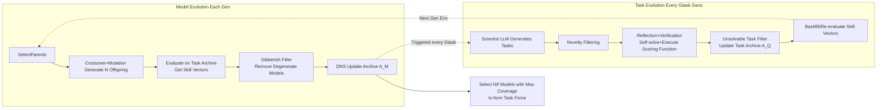

# Discovering Novel LLM Experts via Task-Capability Coevolution

**Conference**: ICLR 2026  
**OpenReview**: [https://openreview.net/forum?id=efNINVs2So](https://openreview.net/forum?id=efNINVs2So)  
**Code**: To be confirmed  
**Area**: LLM / Open-ended Evolution / Model Merging  
**Keywords**: open-endedness, coevolution, model merging, quality-diversity, collective intelligence, LLM discovery  

## TL;DR
The AC/DC framework is proposed to facilitate the coevolution of a population of LLMs (evolved through evolutionary model merging) and a set of synthetic tasks (generated by a "Scientist LLM"). This automatically discovers a complementary suite of small expert models in a single run, whose collective Coverage exceeds that of larger models within the same family and even approaches or surpasses GPT-4o, while utilizing significantly fewer total parameters.

## Background & Motivation
**Background**: Development of frontier models aims for the continuous emergence of diverse capabilities. However, current "pre-training + post-training" paradigms require manual intervention to initialize new training runs with static datasets or reward functions whenever a new capability is needed. Even with synthetic data and broad reward-based self-improvement, only **one** massive and static model is produced per cycle.

**Limitations of Prior Work**: Relying on a single large static model for all real-world problems presents two dilemmas: first, "fractured entangled representations" and high inference costs make it difficult for a single model to robustly cover all tasks; second, the high barrier of scaling models and datasets is inaccessible for most ML researchers.

**Key Challenge**: Developers are forced to push frontiers via incremental improvements in static data, environments, algorithms, or architectures. The process is "manually initialized, single-model output," which fundamentally conflicts with the goal of "continuous, open-ended accumulation of new capabilities"—knowledge accumulation is open-ended, but training paradigms remain closed and directed.

**Goal**: Drawing on Collective Intelligence (CI) and open-endedness (OE), this work aims to automatically discover a **group** of small, accessible, and complementary expert LLMs in a **single run**. The system does not explicitly optimize for any specific benchmark but allows newer, more complex skills to emerge continuously over time.

**Core Idea**: **[Model-Task Coevolution]** Open-ended coevolution is extended to LLM discovery for the first time. The framework evolves an LLM population via evolutionary model merging (crossover + mutation) while simultaneously evolving a task population using a "Scientist LLM" via synthetic data generation; the two act as each other's environment, becoming more difficult and diverse together. **[Minimal Criteria + Quality-Diversity]** Minimal Criteria (MC) are used to filter degenerate models and unsolvable tasks, while Quality-Diversity (QD) selection ensures the population is both high-quality and behaviorally diverse.

## Method

### Overall Architecture
AC/DC (Assessment Coevolving with Diverse Capabilities) maintains two continuously updated archives: a **Model Archive $A_M$** (active LLMs selected by DNS based on skill vectors) and a **Synthetic Task Archive $A_Q$** (a set of increasingly complex and novel challenges). Each generation performs "Model Evolution"—selecting parents, generating offspring via merging/mutation, evaluating on tasks to obtain skill vectors, filtering degenerate models, and updating the archive with DNS. Every $G_{task}$ generations, "Task Evolution" is triggered—the Scientist LLM generates new tasks, filters for novelty/solvability, and backfills skill vectors for models. Finally, $N_{tf}$ models with the highest collective coverage of the synthetic task distribution are selected as a "Task Force" for evaluation on OOD real-world benchmarks.

### Key Designs

**1. Evolutionary Model Merging: Generating LLM Populations via Crossover and Singular Value Mutation** — AC/DC does not train from scratch; it uses existing LLMs as "stepping stones" for gradient-free evolution. Crossover involves weighted linear interpolation of task vectors $\tau_{p_i}=\theta_{\text{parent}_i}-\theta_{\text{base}}$ from two parents (following the CycleQD approach). Mutation is performed by applying Singular Value Decomposition (SVD) $W=U\Sigma V^T$ to each weight matrix $W$ of the merged model, adding noise only to the top-$k$ singular values in $\Sigma$ before reconstruction. This changes the representation structure while preserving the overall geometry of the weight matrix, avoiding destructive mutations. This operator reduces the cost of "creating a new expert" from a training run to a single merge.

**2. Coverage Metric + Skill Vectors: Aiming for Collective Complementarity** — The value of the population is measured by **collective solvability** rather than individual model accuracy. Given $Q$ queries and $N$ models, Coverage is defined as:
$$\text{Coverage}=\frac{1}{Q}\sum_{q=1}^{Q}\left(\bigvee_{i=1}^{N}(x_{q,i}=y_q)\right)$$
where the task is covered if **any** model in the population answers correctly ($\bigvee$ is logical OR). Each model is represented by a binary **skill vector**, acting as a behavioral signature. This allows direct comparison of model differences without pre-defining niches like in MAP-Elites. The distance between skill vectors drives diversity selection.

**3. Dominated Novelty Search (DNS) for Quality-Diversity: Rewarding Models Far from the Strongest** — While traditional optimization seeks a single global optimum, QD seeks a **group** of high-quality and diverse solutions. AC/DC uses DNS in the skill vector space. For model $i$, let $D_i$ be the set of solutions stronger than $i$. The local competition fitness is calculated based on the $k$ nearest neighbors $K_i$ within $D_i$:
$$\tilde{f}_i=\begin{cases}\frac{1}{k}\sum_{j\in K_i}d_{i,j} & \text{if }|D_i|>0\\ +\infty & \text{otherwise}\end{cases}$$
This rewards experts that occupy unique behavioral niches where stronger models do not excel. Ablations show DNS and gibberish filtering are critical, with removals causing performance drops of 2.39% and 2.46% respectively (at N=3).

**4. Task Coevolution: Scientist LLM with Difficulty Adaptation and Triple Filtering** — Tasks are a "living environment" that adapts. The Scientist LLM synthesizes "QA pairs + Python scoring functions" following simplified METR standards. Generation involves four steps: (1) **Task Proposal**—adjusting difficulty based on population pass rates; (2) **Novelty Filtering**—using embedding cosine similarity to ensure distinctness; (3) **Reflection and Verification**—the Scientist LLM self-solves and executes the scoring function, triggering auto-correction for errors; (4) **Quality Assurance & MC**—removing unsolvable tasks where no model succeeds.

## Key Experimental Results

### Main Results: Coverage Gain (Across 4 Model Families, Average % Gain vs. Baselines)

| Base Model | vs Experts(N=3) | vs Control N=8 | vs Big Model N=8 | vs GPT-4o N=8 |
|---|---|---|---|---|
| Qwen2 7B | +2.06 | +0.69 | -6.08 | +2.05 |
| Qwen2.5 7B | +4.40 | +3.85 | +1.02 | +6.95 |
| Qwen3 14B | -0.21 | +4.22 | +5.45 | +10.71 |
| DeepSeek V1 7B | +9.69 | +1.96 | -18.46 | -7.72 |
| **Average** | **+3.99** | **+2.68** | **-4.52** | **+2.99** |

- High Parameter Efficiency: Qwen2.5 7B utilizes only **29%** of the parameters of a 72B model but achieves 3.85% higher Coverage at N=3, increasing to +9.78% at N=8.
- The N=8 population exceeds GPT-4o in Coverage; 3 Qwen2.5 7B models (N=3) are sufficient to surpass GPT-4o.

### Best-of-N Single Answer Selection (Average % Gain vs. Baselines)

| Base Model | vs Experts(N=3) | vs Control N=8 | vs Big Model N=8 |
|---|---|---|---|
| DeepSeek V1 7B | +11.73 | +7.92 | +4.94 |
| Qwen3 14B | -0.49 | +0.50 | +1.37 |
| **Average** | **+1.34** | **+1.05** | **-0.25** |

- DeepSeek 7B at N=3 approaches the performance of the 67B model within 1.27% (using 17% parameters) and surpasses it by 4.94% at N=8.

### Ablation Study

| Configuration | N=3 | N=8 |
|---|---|---|
| AC/DC (Ours) | 60.82 | 69.00 |
| DNS | 60.18 | 66.48 |
| CQD | 59.85 | 65.42 |

- Removing **all** evolutionary components results in a drop of 2.36% (N=3) and **7.02%** (N=8).
- Coevolution outperforms "model-only evolution on static data" by 3.62% at N=8.

### Key Findings
1. **OOD Generalization**: The models achieve high coverage on OOD benchmarks without direct optimization, indicating the discovery of generalized complementary skills rather than benchmark overfitting.
2. **Emergent Specialization**: Eight models exhibit distinct expertise (e.g., Model 4 in Chemistry, Model 6 in CS/Business, Model 3 in Biology), whereas control groups show minimal variance and weaker overall performance.
3. **Continuous Improvement**: More generations of coevolution lead to sustained performance increases in the test population.

## Highlights & Insights
- **Paradigm Shift**: The focus shifts from "training a large static model" to "growing a population of small experts in one run," utilizing Coverage as the "North Star" metric for collective intelligence.
- **Mutual Environment**: Tasks adapt to population competence, while models are forced to cover new tasks, creating an open-ended arms race that avoids saturation.
- **Pragmatic Engineering**: The use of merging over training, SVD-based mutation, and Python-based execution verification enables an "unattended long-run" discovery process.
- **Parameter Efficiency**: Providing empirical evidence that a collective of small models can approach or exceed frontier large models using 17%–29% of the parameters.

## Limitations & Future Work
- **Best-of-N Bottleneck**: While Coverage is high, realizing this benefit in single-answer deployment requires better BoN selection; current BoN performance still lags behind GPT-4o (Average -7.17% at N=8).
- **Stability Variance**: Performance varies across families (e.g., DeepSeek shows significant fluctuations against larger models), suggesting a need for improved robustness.
- **Dependency on Teacher Models**: Task generation and novelty filtering rely on frontier LLMs as judges, which may introduce biases.
- **Task Scope**: Evaluation remains focused on QA/MCQ/Math/Code; creative or interactive tasks have yet to be fully explored.

## Related Work & Insights
- **Evolutionary Model Merging**: Builds on EvoMerge (automated merging via CMA-ES) and CycleQD (task vector interpolation). AC/DC upgrades simple merging to "merging + task coevolution."
- **Quality-Diversity**: Follows the lineage of MAP-Elites and Dominated Novelty Search, but adapts to LLMs by using skill vectors instead of pre-defined niches.
- **Open-Endedness**: Implements the "AI-generating algorithms" philosophy by applying coevolution with minimal criteria to LLM discovery.

## Rating
- **Novelty**: ⭐⭐⭐⭐⭐ First to extend open-ended coevolution to joint discovery of LLMs and synthetic tasks with Coverage-oriented goals.
- **Experimental Thoroughness**: ⭐⭐⭐⭐ Comprehensive evaluation across 4 families and multiple metrics; however, BoN results lag, and cross-family stability varies.
- **Writing Quality**: ⭐⭐⭐⭐ Clear motivation and algorithmic visualization, though some technical details are dense in the appendices.
- **Value**: ⭐⭐⭐⭐⭐ Significant value for low-resource researchers as a viable alternative to large-scale training via continuous evolutionary discovery.

<!-- RELATED:START -->

## Related Papers

- [\[ACL 2025\] Re-TASK: Revisiting LLM Tasks from Capability, Skill, and Knowledge Perspectives](../../ACL2025/llm_nlp/re-task_revisiting_llm_tasks_from_capability_skill_and_knowledge_perspectives.md)
- [\[ICLR 2026\] BOTS: A Unified Framework for Bayesian Online Task Selection in LLM Reinforcement Finetuning](bots_a_unified_framework_for_bayesian_online_task_selection_in_llm_reinforcement.md)
- [\[ICML 2026\] Multi-Agent Teams Hold Experts Back: 自组织 LLM 团队为什么留不住「专家」](../../ICML2026/llm_nlp/multi-agent_teams_hold_experts_back.md)
- [\[ICLR 2026\] VERIFY: A Novel Multi-Domain Dataset Grounding LTL in Contextual Natural Language via Provable Intermediate Logic](verify_a_novel_multi-domain_dataset_grounding_ltl_in_contextual_natural_language.md)
- [\[ACL 2025\] Enhancing Open-Domain Task-Solving Capability of LLMs via Autonomous Tool Integration from GitHub](../../ACL2025/llm_nlp/paper_2312_17294.md)

<!-- RELATED:END -->
