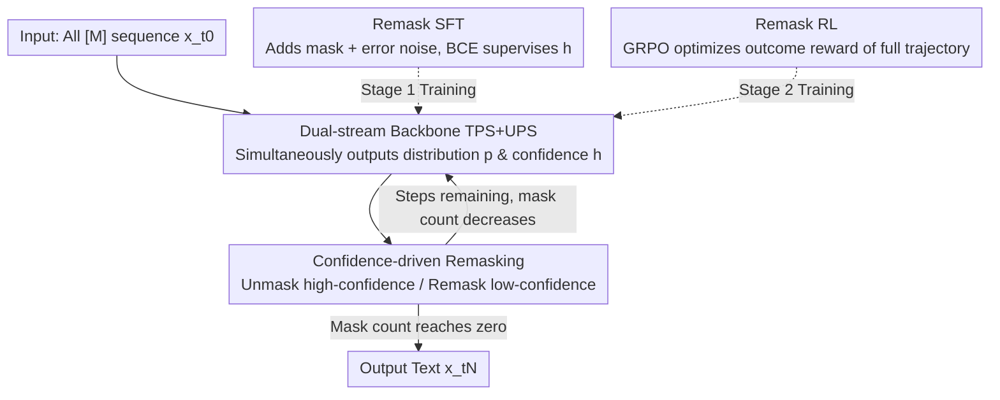

# Don't Settle Too Early: Self-Reflective Remasking for Diffusion Language Models

**Conference**: ICLR2026  
**OpenReview**: [https://openreview.net/forum?id=BsZeTuB5fD](https://openreview.net/forum?id=BsZeTuB5fD)  
**Code**: https://github.com/maple-research-lab/RemeDi  
**Area**: Diffusion Language Models / Text Generation / LLM  
**Keywords**: Diffusion Language Models, Remasking, Self-Reflection, Confidence Prediction, SFT+RL

## TL;DR
Addressing the inherent flaw in masked diffusion language models where "tokens are fixed once unmasked and cannot be corrected," this paper proposes RemeDi. The model simultaneously predicts token distributions and per-token confidence during each generation step. Based on confidence levels, it decides which positions to unmask and which previously generated tokens to revert to masks for resampling. Coupled with a two-stage "Remask SFT + Remask RL" training protocol, it achieves SOTA results among open-source diffusion language models (GSM8K 89.1%, HumanEval 73.2%).

## Background & Motivation
**Background**: Diffusion Language Models (DLMs) are emerging as attractive alternatives to Autoregressive (AR) models. The primary variant is the mask-based DLM (e.g., LLaDA, Dream), where the forward process gradually replaces clean text with a special mask token `[M]`, and the reverse process iteratively unmasks tokens starting from an all-mask sequence over $N$ steps. Unlike AR models, DLMs are not restricted to left-to-right order, allowing for parallel prediction and flexible generation sequences.

**Limitations of Prior Work**: Masked DLMs suffer from a fatal assumption: **once a position is unmasked, it is treated as a fixed correct answer and never modified in subsequent steps**. However, in the early stages of generation, context is sparse, making it easy for the model to produce incorrect tokens. Even when more context becomes available later to identify these errors, existing frameworks lack a mechanism to correct them. These errors propagate through to the final output. The title "Don't Settle Too Early" specifically targets this issue.

**Key Challenge**: Correcting errors requires allowing "unmasked tokens to be reverted to masks for resampling." However, this conflicts with a fundamental requirement of diffusion models: the noise level (number of mask tokens) must **decrease monotonically** across steps to zero to ensure convergence. Arbitrarily remasking tokens may cause the mask count to increase, disrupting the diffusion process. Existing fixes either rely on random remasking during inference (inefficient and lacks error awareness) or modify the diffusion process with uniform noise/edit operations (without guaranteed monotonicity). **No method has provided a principled way to "identify which tokens are wrong" and selectively correct them.**

**Goal**: To equip masked DLMs with "self-reflective remasking" capabilities—effectively identifying and remasking likely errors while ensuring monotonic mask reduction to maintain convergence.

**Key Insight**: The decision of "whether to unmask" is essentially a learnable **per-token confidence** problem. If a model can output a confidence score for each position, high-confidence tokens can be unmasked while low-confidence ones (regardless of whether they were previously unmasked) can be kept as or reverted to masks. This transforms remasking from "random perturbation" into "informed self-correction."

**Core Idea**: The model is trained to **simultaneously predict token distributions and per-token confidence** at each diffusion step. This confidence drives "unmasking / remasking" decisions. The capability is developed via "Remask SFT" (teaching the model to identify and remask errors) and "Remask RL" (optimizing the full generation trajectory based on outcome rewards).

## Method

### Overall Architecture
RemeDi extends the standard Transformer into a **dual-stream architecture**: a Token Prediction Stream (TPS) predicts the token distribution $p^i_\theta(\cdot|x_t)$ at masked positions, while an Unmasking Policy Stream (UPS) outputs a confidence score $h^i_\theta$ for every position. Generation begins with an all-mask sequence and proceeds through $N$ denoising iterations. In each step, the UPS generates confidence scores to select a subset $\mathcal{U}_n$ for unmasking. If an unmasked token is selected, it remains; if a masked token is selected, it is sampled from the TPS distribution. Crucially, **tokens with low confidence are reverted to masks**, even if previously unmasked, for resampling in later steps with richer context. A noise schedule ensures that the "total number of unmasked tokens" grows linearly from 0 to the sequence length $L$, guaranteeing convergence.

### Key Designs

**1. Dual-stream Transformer: Decoupling Token Prediction and Confidence Estimation**

To support self-reflection, the model must determine its certainty alongside predicting the token. Instead of a simple classification head, RemeDi uses a dual-stream setup. The TPS consists of Transformer blocks predicting the probability $p^i_\theta(\cdot|x_t)$ as usual. The UPS consists of separate blocks outputting per-token confidence scores $h^i_\theta$. These streams run in parallel with **bidirectional feature sharing**: the UPS layers are conditioned on TPS features $f_\text{TPS}$, and UPS outputs are fed back into the TPS. Final linear heads produce $p$ and $h$ from their respective streams. The UPS integration uses **zero initialization** to avoid disrupting the pre-trained DLM backbone (adapted from LLaDA-8B-Instruct). Dedicated streams are used because the unmasking policy requires global context and independent representation capacity.

**2. Confidence-driven Remasking: Unified Selection for Unmasking and Reverting**

This is the core mechanism distinguishing RemeDi. At each step $n$, the UPS predicts confidence scores $h^i_{\theta,n}$. The model selects the subset $\mathcal{U}_n$ with the highest confidence scores. Unlike traditional methods where tokens are "locked" once unmasked, RemeDi **reevaluates every token at every step**. A previously generated token may be reverted to a mask if its confidence score drops. To maintain diffusion convergence, the noise schedule enforces that the number of unmasked tokens increases linearly to $L$, ensuring masks strictly decrease. This allows "informed self-correction": for example, the model might first generate the verb "making," then revert and change it to "developing" once the object "tests and estimators" is generated and reveals a poor collocation.

**3. Remask SFT: Treating "Incorrect Tokens" as a Second Type of Noise**

Standard DLM SFT only uses random masks, so models never encounter "incorrect unmasked tokens" and cannot learn to identify them. RemeDi introduces a **second type of noise** in SFT: in addition to a mask ratio $\rho_{t,\text{mask}}$, a fraction $\rho_{t,\text{incorrect}}$ of the remaining tokens are randomly replaced with incorrect tokens to simulate errors in the reverse process. To ensure mask counts can decrease, the ratios must satisfy:
$$\lceil \rho_{t,\text{incorrect}}\cdot(1-\rho_{t,\text{mask}})\cdot L\rceil < \lceil \rho_{t,\text{mask}}\cdot L\rceil$$
The authors set $\rho_{t,\text{mask}}=t$ and $\rho_{t,\text{incorrect}}=4r\cdot t(1-t)$ with $r=0.1$. Training uses a standard diffusion loss $L_\text{diffusion}$ and a BCE loss for UPS: clean tokens ($x^i_t=x^i_0$) get label $y^i=1$, incorrect tokens get $y^i=0$, and masked tokens get **soft labels** $y^i=p^i_\theta(x^i_0|x_t)$. The UPS loss is:
$$L_\text{UPS}(\theta)=\sum_i \text{BCE}\big(\sigma(h^i_\theta),\, y^i\big)$$

**4. Remask RL: Outcome-Oriented Optimization of Generation Trajectories**

SFT only supervises single-step denoising. Remask RL uses **Reinforcement Learning** to optimize the full $N$-step trajectory. The unmasking policy uses a Plackett–Luce model to sample $K_n$ positions based on confidence:
$$\pi^\text{unmask}_{\theta,n}(\mathcal{U}_n\mid x_{t_{n-1}})=\prod_{k=1}^{K_n}\frac{\exp(h^{u_n(k)}_{\theta,n})}{\sum_{j\notin\{u_n(1),\dots,u_n(k-1)\}}\exp(h^{j}_{\theta,n})}$$
The joint policy combines this with the token prediction policy. **GRPO** is used for trajectory-level optimization with outcome rewards (verifiable correctness for Math/Code, Reward Model scores for QA). Unlike methods that only reinforce token prediction, RemeDi optimizes the **unmasking/remasking policy itself**.

## Key Experimental Results

### Main Results
RemeDi (adapted from LLaDA) was evaluated against other open-source DLMs and AR models of similar scale.

| Dataset | Metric | RemeDi(+SFT) | RemeDi(++RL) | Prev. SOTA DLM | Description |
|--------|------|------|------|----------|------|
| GSM8K | acc | 86.3 | **89.1** | 88.1 (LLaDOU) | Math Reasoning |
| MATH | acc | 51.4 | **52.9** | 44.6 (LLaDOU) | Math |
| HumanEval | pass | 71.3 | **73.2** | 59.8 (Dream) | Code |
| MBPP | pass | 57.8 | **59.4** | 59.6 (Dream) | Code |
| ARC-C | acc | 85.2 | **87.7** | 83.9 (LLaDA) | Commonsense QA |
| IFEval | acc | 81.9 | **85.4** | 73.5 (LLaDA1.5) | Instruction Following |
| AlpacaEval | win | 12.5 | **24.8** | 13.9 (LLaDA1.5) | Human Preference |

RemeDi achieves SOTA across nearly all benchmarks for open-source DLMs and even surpasses similar-sized AR models (matching DeepseekMath on GSM8K). RL significantly boosted AlpacaEval performance (+12.3% over SFT).

### Ablation Study

| Configuration | GSM8K | MATH-500 | HumanEval | MBPP | Note |
|------|------|---------|-----------|------|------|
| Baseline (Var-length block) | 80.3 | 34.7 | 41.5 | 42.6 | Starting point |
| Vanilla SFT | 83.1 | 40.1 | 48.2 | 43.4 | Standard SFT |
| Remask SFT | 83.6 | 42.7 | 50.0 | 44.0 | Ours |

Remask SFT consistently outperforms Vanilla SFT. Compared to LLaDOU RL, Remask RL converges faster and reaches higher final accuracy (e.g., 83.33% vs 82.35% on GSM8K at 200 steps).

### Key Findings
- **Remasking frequency increases with structural constraints**: Code > Math > General (28.5 times per block for HumanEval vs 2.8 for AlpacaEval).
- **Harder problems require more remasking**: In MATH-500, remasking increased from 9 tokens (difficulty 1-2) to nearly 14 (difficulty 4-5).
- **Learned confidence scores are reliable signals**: Correct tokens receive high scores, while those with low scores are effectively identified as errors.

## Highlights & Insights
- **Modeling remasking as learnable confidence**: This allows the model to identify errors autonomously while naturally adhering to monotonic diffusion constraints.
- **Error tokens as a second noise source**: Introducing random replacements in SFT is a generalizable "recipe" for teaching iterative models to recognize and fix mistakes.
- **Optimizing unmasking policy via RL**: Using Plackett–Luce for differentiable sampling allows RL to optimize "where to change" rather than just "what to predict."
- **Enabling "Write and then Revise"**: RemeDi demonstrates the ability to perform substitutions, insertions, and deletions during generation—capabilities native to diffusion but impossible for standard AR models.

## Limitations & Future Work
- **Reliance on manual noise schedules**: The $\rho_{t,\text{incorrect}}$ schedule and hyperparameters like $r$ are manually set; their optimality remains unexplored.
- **Backbone adaptation**: As there are no native variable-length block-wise DLMs, the adaptation from LLaDA might inherit structural bottlenecks.
- **Performance drop on GPQA during RL** (32.6 → 29.5): Outcome-based RL may be detrimental to some knowledge-intensive tasks.
- **Inference overhead**: Correction improves quality but increases the number of denoising steps.

## Related Work & Insights
- **vs. Inference-time Random Remasking (ReMDM)**: These rely on random perturbations and require many steps; RemeDi uses **targeted** error identification.
- **vs. Editing-based Diffusion (Seed Diffusion)**: These methods often break monotonic mask reduction; RemeDi preserves convergence through its noise schedule.
- **vs. LLaDOU RL**: LLaDOU reinforces trajectories without remasking; RemeDi's joint policy optimizes the correction mechanism itself.
- **vs. AR-LLMs**: AR models cannot revise past tokens; RemeDi leverages non-autoregressive diffusion to achieve superior self-correction.

## Rating
- Novelty: ⭐⭐⭐⭐⭐ Modeling unmasking as learnable confidence to drive remasking under diffusion constraints is a highly original solution.
- Experimental Thoroughness: ⭐⭐⭐⭐ Comprehensive comparison across nine benchmarks; solid ablation studies, though speed/quality trade-off analysis could be deeper.
- Writing Quality: ⭐⭐⭐⭐⭐ Clear progression of motivation, well-defined dual-stream structure, and effective visualizations.
- Value: ⭐⭐⭐⭐⭐ Sets a new SOTA for open-source DLMs and provides a reusable framework for self-correcting iterative generation.

<!-- RELATED:START -->

## Related Papers

- [\[ICML 2026\] Reasoning on the Manifold: Bidirectional Consistency for Self-Verification in Diffusion Language Models](../../ICML2026/llm_nlp/reasoning_on_the_manifold_bidirectional_consistency_for_self-verification_in_dif.md)
- [\[AAAI 2026\] IROTE: Human-like Traits Elicitation of Large Language Model via In-Context Self-Reflective Optimization](../../AAAI2026/llm_nlp/irote_human-like_traits_elicitation_of_large_language_model_via_in-context_self-.md)
- [\[ICLR 2026\] Toward Safer Diffusion Language Models: Discovery and Mitigation of Priming Vulnerabilities](toward_safer_diffusion_language_models_discovery_and_mitigation_of_priming_vulne.md)
- [\[ICLR 2026\] Constrained Decoding of Diffusion LLMs with Context-Free Grammars](constrained_decoding_of_diffusion_llms_with_context-free_grammars.md)
- [\[ACL 2026\] Unlocking the Potential of Diffusion Language Models through Template Infilling](../../ACL2026/llm_nlp/unlocking_the_potential_of_diffusion_language_models_through_template_infilling.md)

<!-- RELATED:END -->
