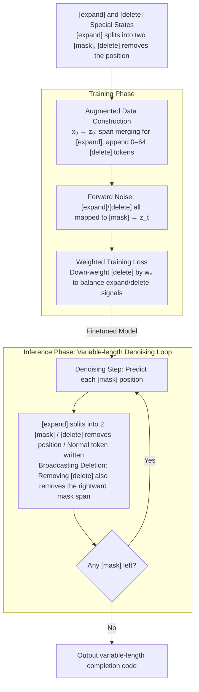

# DreamOn: Diffusion Language Models For Code Infilling Beyond Fixed-size Canvas

**Conference**: ICLR 2026  
**arXiv**: [2602.01326](https://arxiv.org/abs/2602.01326)  
**Code**: [https://github.com/DreamLM/DreamOn](https://github.com/DreamLM/DreamOn)  
**Area**: LLM/NLP  
**Keywords**: diffusion language model, code infilling, variable-length generation, discrete diffusion, DLM

## TL;DR
DreamOn resolves the fixed-length generation constraint of Diffusion Language Models (DLMs) by introducing two special states, `[expand]` and `[delete]`. This enables variable-length code infilling without architectural modifications, achieving a 26.4% average improvement on HumanEval-Infilling compared to diffusion baselines and reaching performance parity with state-of-the-art (SOTA) autoregressive models.

## Background & Motivation

**Background**: Diffusion Language Models (DLMs, e.g., LLaDA, Dream, DiffuCoder) achieve flexible, arbitrary-order generation through iterative denoising, making them naturally suited for code infilling—generating missing code between a given prefix and suffix. Autoregressive (AR) models require cumbersome Fill-in-the-Middle (FIM) hacks for infilling, which disrupt the natural contextual structure.

**Limitations of Prior Work**: A critical bottleneck of DLMs is the **requirement to pre-specify a fixed-length mask sequence**. Inputs and outputs must be of equal length, preventing the model from dynamically determining the generation length. When the preset mask length does not match the ground truth completion length, performance drops significantly (e.g., too few masks lead to incomplete code; too many leads to redundant errors). Experiments show an average performance degradation of 38% due to this mismatch.

**Key Challenge**: While the bidirectional attention of DLMs is ideal for infilling, the fixed-length constraint offsets this advantage. The challenge lies in enabling the model to dynamically adjust the output length while maintaining the original DLM architecture.

**Goal**: To enable DLMs to autonomously decide whether to expand or contract the sequence length during the generation process.

**Key Insight**: Introduce two special states into the diffusion process as length control signals: predicting `[expand]` indicates "more space is needed here," and predicting `[delete]` indicates "this position is redundant."

**Core Idea**: Encode length control as two special tokens in the diffusion vocabulary (`[expand]` splits into two `[mask]` tokens, `[delete]` removes the position). By training the model to predict these states via data augmentation, variable-length generation is achieved with zero architectural changes.

## Method

### Overall Architecture
DreamOn addresses the "fixed sequence length" deadlock in DLMs by adding `[expand]` and `[delete]` special states to the diffusion vocabulary, transforming length adjustment into a standard token prediction task without modifying the model architecture. The pipeline consists of two phases: during training, the original code sequence $\mathbf{x}_0$ is augmented into sequence $\mathbf{z}_0$ containing special states (via span merging to create `[expand]` and appending `[delete]` at the end). Standard masked diffusion is then applied to $\mathbf{z}_0$ to learn to restore masked positions into either normal tokens or special states using weighted cross-entropy. During inference, denoising starts from an initial `[mask]` sequence; each predicted `[expand]` splits a position into two `[mask]` tokens (lengthening), and each `[delete]` removes a position (shortening), until no `[mask]` remains. The output length naturally converges to the required completion length.

### Key Designs

**1. [expand] and [delete] Special States: Encoding length control as predictable tokens**

The limitation of DLMs is that sequence length is fixed by the initial number of masks. DreamOn sidesteps structural changes by adding two extra tokens to the vocabulary. If the model predicts `[expand]` at a position, it is replaced by two `[mask]` tokens (extending the sequence); if it predicts `[delete]`, that position is removed (shortening the sequence). These primitives are Turing-complete—any initial length can converge to the ground truth length through sequences of expand/delete operations, effectively reducing dynamic length control to a token prediction problem.

**2. Data Augmentation: Training the model to recognize special states**

Since original code $\mathbf{x}_0$ does not contain these signals, DreamOn constructs augmented sequences $\mathbf{z}_0$ before adding noise. `[expand]` is created via "span merging"—collapsing a continuous sequence of tokens into a single `[expand]`, teaching the model that this position should eventually expand. `[delete]` is created by appending 0–64 random tokens at the end of the sequence, teaching the model these are redundant. The proportion of `[expand]` is controlled by merge scheduling, mixing static and dynamic inverse schedulers at a 1:1 ratio to prevent special tokens from overwhelming the original generation quality.

**3. Weighted Training Loss: Calibrating the signal of [delete]**

The construction method creates an imbalance: while an `[expand]` represents multiple tokens, each `[delete]` corresponds to only one `[mask]`. This naturally over-amplifies the presence of `[delete]` in the cross-entropy loss, potentially biasing the model toward deletion. DreamOn introduces a weight $w_n$ for `[delete]`, ensuring the total contribution of a sequence of `[delete]` tokens is equivalent to a single `[mask]`, thereby balancing the learning of expand and delete operations.

**4. Broadcasting Deletion: Batch removal of redundant masks**

Predicting `[delete]` tokens individually during inference can be computationally expensive. DreamOn observes that if a position is predicted as `[delete]`, the subsequent continuous string of `[mask]` tokens to its right is likely redundant as well. "Broadcasting Deletion" removes all subsequent contiguous masks upon detecting a `[delete]`, compressing multi-step deletions into a single step to accelerate inference without sacrificing accuracy.

### Loss & Training
- Employs weighted cross-entropy loss from standard masked diffusion, with the vocabulary expanded to include `[expand]` and `[delete]`.
- Fine-tuned on DreamCoder-7B/DiffuCoder-7B using only 110K Python code pairs for 10 epochs.
- Training took approximately 5 hours on 8×H800 GPUs.
- **Training compute is only 0.15% of the pre-training cost**, making it extremely lightweight.

## Key Experimental Results

### Main Results

| Model | HE-Single (Pass@1) | HE-Multi (Pass@1) | SantaCoder (EM) |
|------|--------------------|--------------------|-----------------|
| Qwen2.5-Coder-7B (AR) | 92.6 | 58.7 | 79.8 |
| Seed-Coder-8B (AR) | 89.7 | 59.3 | 77.2 |
| DreamCoder-7B (DLM) | 55.5 | 43.2 | 59.3 |
| **DreamCoder + DreamOn** | **92.1** (+36.6) | **63.8** (+20.6) | **79.0** (+19.7) |
| DiffuCoder + DreamOn | 92.2 (+38.5) | 63.1 (+18.1) | 77.4 (+19.4) |

DreamOn enables DLMs to **outperform** SOTA AR models in multi-line infilling.

### Ablation Study

| Configuration | Single-line Avg | Multi-line Avg | Notes |
|------|----------------|----------------|------|
| DreamCoder-7B Baseline | 55.3 | 26.0 | Fixed mask=64 |
| + DreamOn (Full) | **90.8** | **57.1** | Both states used |
| w/o Delete | 67.4 | 39.2 | No shortening; degrades with long masks |
| w/o Expand | 73.4 | 43.2 | No extension; degrades with short masks |
| Oracle (GT Length) | 91.6 | 69.0 | Upper bound reference |

### Key Findings
- **DreamOn nearly reaches Oracle performance** (Single-line: 90.8 vs 91.6), proving the effectiveness of length adaptation.
- **Expand and Delete are complementary**: Removing Delete causes severe degradation with long masks; removing Expand causes degradation with short masks.
- **Highly robust to initial mask length**: Performance remains stable (88.7-92.1) as initial mask length varies from 4 to 64, whereas the baseline fluctuates from 24.9 to 55.5.
- Huge improvements achieved with **only 0.15% of pre-training compute**.
- Broadcasting Deletion significantly reduces inference steps without loss of precision.

## Highlights & Insights
- **Elegant Minimalist Design**: Solving a fundamental DLM constraint using only two special tokens and data augmentation, necessitating zero architectural changes.
- **First DLM Infilling to Reach AR Parity**: Demonstrates that the inherent bidirectional advantages of DLMs can be fully realized once the length constraint is removed.
- **Portability**: DreamOn works effectively across different DLMs (Dream-7B, DiffuCoder-7B), suggesting it is a model-agnostic enhancement.
- **Broadcasting Deletion Insight**: The heuristic that a `[delete]` prediction implies subsequent masks are redundant provides a simple but effective acceleration.

## Limitations & Future Work
- Each `[expand]` only extends the sequence by one `[mask]`, meaning large extensions require multiple forward passes.
- Currently only validated on code infilling; effectiveness on natural language infilling (e.g., text editing, story continuation) remains to be explored.
- The maximum expansion length $L_{max}=128$ is a manually set limit, which may restrict very long code completions.
- Generalization to multi-lingual code infilling is yet to be verified, as training was focused on Python.

## Related Work & Insights
- **vs. AR FIM (Qwen2.5-Coder etc.)**: FIM requires sequence reordering during training and special prompting during inference. DLM + DreamOn naturally supports infilling with bidirectional context.
- **vs. Fixed-length DLM (LLaDA, Dream)**: DreamOn addresses the most significant practical bottleneck of DLMs, making them competitive for real-world infilling.
- **vs. Edit-based Methods**: Unlike methods that use explicit insert/delete operations for editing, DreamOn integrates these operations directly into the diffusion process.

## Rating
- Novelty: ⭐⭐⭐⭐⭐ Simple yet powerful solution for a fundamental DLM limitation.
- Experimental Thoroughness: ⭐⭐⭐⭐ Strong results across three DLM baselines, though limited to code tasks.
- Writing Quality: ⭐⭐⭐⭐⭐ Intuitive illustrations, clear algorithmic descriptions, and thorough ablation analysis.
- Value: ⭐⭐⭐⭐⭐ Solves a core bottleneck in the DLM field, making DLMs viable competitors for AR models in infilling scenarios.

<!-- RELATED:START -->

## Related Papers

- [\[ACL 2026\] Unlocking the Potential of Diffusion Language Models through Template Infilling](../../ACL2026/llm_nlp/unlocking_the_potential_of_diffusion_language_models_through_template_infilling.md)
- [\[ICLR 2026\] Toward Safer Diffusion Language Models: Discovery and Mitigation of Priming Vulnerabilities](toward_safer_diffusion_language_models_discovery_and_mitigation_of_priming_vulne.md)
- [\[ICLR 2026\] Beyond Magic Words: Sharpness-Aware Prompt Evolving for Robust Large Language Models with TARE](beyond_magic_words_sharpness-aware_prompt_evolving_for_robust_large_language_mod.md)
- [\[ICLR 2026\] Rethinking Code Similarity for Automated Algorithm Design with LLMs](rethinking_code_similarity_for_automated_algorithm_design_with_llms.md)
- [\[ICLR 2026\] Beyond the Known: An Unknown-Aware Large Language Model for Open-Set Text Classification](beyond_the_known_an_unknown-aware_large_language_model_for_open-set_text_classif.md)

<!-- RELATED:END -->
