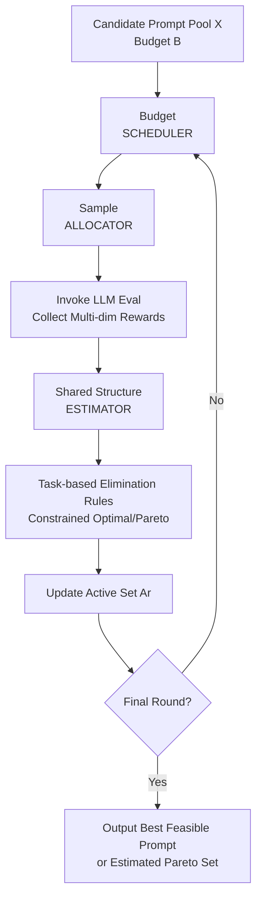

# Efficient Multi-objective Prompt Optimization via Pure-exploration Bandits

**Conference**: ICLR2026  
**OpenReview**: [https://openreview.net/forum?id=M0n3gtwHNg](https://openreview.net/forum?id=M0n3gtwHNg)  
**Code**: None (Paper not open-sourced)  
**Area**: LLM NLP / Prompt Optimization  
**Keywords**: Multi-objective prompt optimization, Pure-exploration Bandit, Constrained optimal prompt, Pareto frontier, Fixed budget  

## TL;DR
This paper extends prompt selection from single-metric optimization to multi-objective fixed-budget optimization. It proposes two types of algorithms, GENSEC and GENPSI, based on pure-exploration bandits. These methods significantly outperform uniform sampling baselines in summarization tasks and provide theoretical error upper bounds under linear structures.

## Background & Motivation
**Background**: Current Prompt Engineering has evolved from manual trial-and-error to automatic searching. However, most methods still define a "good prompt" as being optimal for a single metric, such as accuracy or ROUGE. This setting is common in research papers but often fails in real-world applications.

**Limitations of Prior Work**: Many NLP tasks are naturally multi-objective. For instance, in summarization, the model output must achieve high information coverage (e.g., ROUGE) while satisfying requirements like length, conciseness, readability, and factuality. Optimizing for a single metric typically sacrifices other dimensions, leading to unstable performance in production.

**Key Challenge**: Under a limited evaluation budget, developers cannot exhaustively test all candidate prompts across all dimensions. Continuous use of uniform sampling wastes significant budget on clearly suboptimal or infeasible prompts, failing both to find the best feasible solution and to recover a high-quality Pareto frontier.

**Goal**: The authors decompose the problem into two fundamental goals: first, finding the feasible prompt with the "highest primary objective" under constraints (best feasible prompt identification); second, recovering the true Pareto set when no hard constraints exist (Pareto prompt set identification).

**Key Insight**: The authors map multi-objective prompt selection to pure-exploration bandits. Each prompt is treated as an arm, and each evaluation is a pull that returns a multi-dimensional stochastic reward (e.g., ROUGE and Brevity). This allows for the direct application of theoretical tools and efficient sampling strategies from multi-objective bandits.

**Core Idea**: Replace static uniform evaluation with a "round-based elimination + structured estimation" bandit framework. This prioritizes the exploration of the most promising prompts under a fixed budget and reduces the probability of misidentification in a provable manner.

## Method
The authors propose a unified "fixed-budget, round-based elimination" framework, instantiated as GENSEC (constrained optimal) and GENPSI (Pareto set recovery). The focus is not on generating new prompts but on more efficiently selecting prompts from an existing candidate pool.

### Overall Architecture
The input consists of a candidate prompt set $\mathcal{X}$, a budget $B$, multi-objective evaluation functions $f_1, \dots, f_m$ (primarily ROUGE and Brevity in experiments), and an optional prompt feature map $\phi(x)$. The output is either the optimal feasible prompt $x^*$ or the estimated Pareto set $\hat{\mathcal{X}}^*$.

The algorithm runs in rounds $r=1, \dots, R$. In each round, the scheduler allocates the budget, the allocator decides which arms to pull, reward estimates are updated based on new observations, and elimination is performed according to task objectives. Eliminated prompts no longer consume budget until the final solution or set is output.

### Key Designs
**1. GENSEC Ranking-Elimination: Feasibility first, then optimality, to resolve "Conflict between Feasibility and Primary Objective"**

In the best feasible task, the objective is defined as maximizing the primary objective $\mu_1(x)$ while satisfying constraints $\mu_j(x) \ge \tau_j$ (e.g., Brevity above a threshold). Each round constructs an empirical feasible set $\hat{\mathcal{F}}_r = \{x : \hat\mu_{2,r}(x) > \tau\}$ and applies hierarchical ranking: the feasible set is ranked by the primary objective, while the infeasible set is ranked by the constraint metric.

This step is crucial because it distinguishes "deceiver" arms (high primary objective but violating constraints) from truly feasible arms. Retaining the top $l_r$ arms prioritizes the protection of potentially optimal feasible arms under limited budget, preventing them from being displaced by accidentally high-scoring infeasible arms.

**2. Universal Four-Component Framework: Pluggable Scheduler / Allocator / Estimator / Eliminator**

The paper does not lock the method into a single algorithm but provides a composable framework. The scheduler can use Successive Rejection or Sequential Halving; the allocator can use uniform sampling or G-optimal design; the estimator can use sample means, least squares, or MLPs.

This design makes the same family of methods compatible with both "unstructured" and "shared structure" scenarios. The unstructured approach is more stable and simpler, while the structured approach leverages parameter sharing across prompts to improve sample efficiency. The CSR, MLP-CSR, EGE, and MLP-EGE variants in the experiments are all instances of this framework.

**3. Structured Modeling and Theoretical Guarantees: Trading Shared Parameters for Faster Convergence**

The authors consider the general form $\mu(x) = g_\theta(\phi(x))$ and focus on the linear case $\mu(x) = \phi(x)^\top \theta$. In this setup, a single arm pull not only updates the estimate for the current prompt but also improves estimates for other prompts via the shared parameter $\theta$.

Under the linear setting, the paper provides a result where the misidentification probability decays exponentially with the budget, expressed as:
$$
\Pr[x^* \notin A_R] \le C \lceil \log_2 K \rceil \exp \left( -c \cdot \frac{B / \lceil \log_2 K \rceil}{d H} \right),
$$
where $K$ is the candidate pool size, $d$ is the feature dimension, and $H$ represents problem difficulty determined by constraint gaps. Intuitively, as the budget increases and discriminability improves, the error probability drops rapidly.

### Loss & Training
Since this work focuses on "pure-exploration selection" rather than generative training, there is no traditional task loss function. The optimization targets are the "identification error probability under a fixed budget" and the "Pareto recovery quality."

In implementation, the evaluation pipeline samples inputs from a dataset, invokes a frozen LLM (Llama-3-8B-instruct or Gemma-7B-it) to generate summaries, and calculates multi-objective rewards. The structured versions use prompt embeddings (extracted via GPT-3.5-turbo and reduced by PCA) as $\phi(x)$, learning the shared mapping within the estimator.

## Key Experimental Results

### Main Results
The paper evaluates on XSum and CNN/DailyMail with candidate pools of size 30/50/100, focusing on two tasks: Best Feasible Prompt Identification and Pareto Set Recovery.

| Task | Dataset/Model | Baseline | Ours | Key Result |
|------|-------------|------|----------|----------|
| Best Feasible Prompt ID | XSum + Gemma-7B (K=100) | Uniform | CSR / MLP-CSR | With sufficient budget, Ours recovers >90% of best feasible utility; Uniform only ~20%-50% |
| Best Feasible Prompt ID | CNN/DM + Llama3-8B (K=100) | Uniform | CSR / MLP-CSR | Ours is significantly higher across all budget levels, with larger gains at low budgets |
| Pareto Set Recovery | Multi-dataset/model (K=100) | Uniform | EGE / MLP-EGE | At b=8/10, Ours recovers ~90% of true Pareto Hypervolume, while baseline is in the 80s |

Based on the overall trends in the paper, the bandit elimination strategy yields the highest returns when "budgets are constrained and candidates are numerous," as it shifts budget from low-quality arms to boundary arms.

### Ablation Study
The paper provides equivalent analysis through different instantiations (Uniform/CSR/MLP-CSR, Uniform/EGE/MLP-EGE).

| Configuration | Key Metric | Description |
|------|----------|----------|
| Uniform pulling | Soft constrained reward / HV | No adaptive allocation; serves as the weakest baseline |
| CSR / EGE | Same as above | No shared structure; improves sample efficiency solely via elimination |
| MLP-CSR / MLP-EGE | Same as above | Introduces shared structure estimation; further enhances low-budget performance in some scenarios |

### Key Findings
- In multi-objective prompt optimization, "how evaluation budget is allocated" determines the performance ceiling more than the complexity of the generator; the paper proves substantial gains by simply replacing the selection strategy.
- Shared structures do not always outperform unstructured methods, but they frequently offer advantages at very low budgets or with large candidate sets, indicating that generalization across prompts saves samples.
- For Pareto tasks, Hypervolume (HV) is an effective unified metric that reflects both the quality and diversity of the solution set without requiring a manually weighted scalar.

## Highlights & Insights
- Formally modeling multi-objective prompt selection as pure-exploration bandits is the core contribution. It transforms the previously empirical prompt trial-and-error process into a statistical decision problem with theoretical boundaries.
- GENSEC's ranking-elimination rule is highly practical: determining feasibility before comparing primary objectives aligns with real-world business logic of "meeting the red line before pursuing performance." This logic is transferable to LLM inference strategy selection under safety, latency, or cost constraints.
- The unified framework covers both best feasible and Pareto tasks, reducing engineering complexity. In deployment, one can run Pareto to find candidates and then switch to best feasible for final production selection based on business thresholds.
- The error upper bound for the linear case provides a quantitative "budget-performance" relationship, which is valuable for evaluation cost management. Teams can use this to determine the budget needed to suppress misidentification risk to an acceptable level.

## Limitations & Future Work
- The verification is primarily conducted on summarization tasks and two open-source models; the task domain remains somewhat narrow. For code generation, dialogue safety, or long-context agent tasks, metric noise and objective conflicts might be more complex.
- Candidate prompts still come from pre-generated and human-filtered discrete pools. The method solves "whom to evaluate/retain," not "how to generate stronger new prompts." If the pool quality is low, the algorithm's ceiling will be restricted.
- Constraints are currently centered on fixed thresholds. Real systems often involve dynamic thresholds or hierarchical SLAs (e.g., cost, latency, and risk linkage). Future work could extend to context-dependent or risk-aware constraints.
- Structured versions depend on the quality of prompt embeddings. If the feature mapping correlates weakly with true performance, parameter sharing may introduce bias. Robust non-linear uncertainty estimation or adaptive feature updates could be considered.

## Related Work & Insights
- **vs. Single-objective Prompt Selection (TRIPLE / INSTINCT, etc.)**: Single-objective methods compress all gains into one score. While simple to optimize, they risk selecting prompts that are "optimal on paper but unusable in practice" due to constraint violations. This work avoids such mismatches via explicit feasibility regions and Pareto objectives.
- **vs. Multi-objective Prompt Generation (EMO-Prompts / GEPA, etc.)**: These focus on "how to build prompts" but often use naive sampling for evaluation. This paper focuses on "how to efficiently select prompts," making the two approaches complementary.
- **vs. Multi-objective Bandit Theory (EGE/GEGE, etc.)**: The value of this paper lies in grounding these theoretical tools in the context of LLM prompt optimization, adding best feasible identification and structured implementation details to bridge the gap between theory and application.

## Rating
- Novelty: ⭐⭐⭐⭐☆ (4.5/5)
- Experimental Thoroughness: ⭐⭐⭐⭐☆ (4.3/5)
- Writing Quality: ⭐⭐⭐⭐☆ (4.2/5)
- Value: ⭐⭐⭐⭐⭐ (4.7/5)

## Related Papers

- [\[ACL 2025\] SEE: Strategic Exploration and Exploitation for Cohesive In-Context Prompt Optimization](../../ACL2025/llm_nlp/see_strategic_exploration_exploitation_prompt_optimization.md)
- [\[ICLR 2026\] LLEMA: Evolutionary Search with LLMs for Multi-Objective Materials Discovery](llema_evolutionary_search_with_llms_for_multi-objective_material_design.md)
- [\[ACL 2025\] RiOT: Efficient Prompt Refinement with Residual Optimization Tree](../../ACL2025/llm_nlp/riot_efficient_prompt_refinement_with_residual_optimization_tree.md)
- [\[ACL 2025\] Gradient-Adaptive Policy Optimization: Towards Multi-Objective Alignment of Large Language Models](../../ACL2025/llm_nlp/gapo_multi_objective_alignment.md)
- [\[ICLR 2026\] SIPDO: Closed-Loop Prompt Optimization via Synthetic Data Feedback](sipdo_closed-loop_prompt_optimization_via_synthetic_data_feedback.md)

<!-- RELATED:END -->

<!-- RELATED:START -->

## Related Papers

- [\[ACL 2026\] When Gradients Collide: Failure Modes of Multi-Objective Prompt Optimization for LLM Judges](../../ACL2026/llm_nlp/when_gradients_collide_failure_modes_of_multi-objective_prompt_optimization_for_.md)
- [\[ACL 2025\] SEE: Strategic Exploration and Exploitation for Cohesive In-Context Prompt Optimization](../../ACL2025/llm_nlp/see_strategic_exploration_exploitation_prompt_optimization.md)
- [\[ICLR 2026\] LLEMA: Evolutionary Search with LLMs for Multi-Objective Materials Discovery](llema_evolutionary_search_with_llms_for_multi-objective_material_design.md)
- [\[ACL 2025\] RiOT: Efficient Prompt Refinement with Residual Optimization Tree](../../ACL2025/llm_nlp/riot_efficient_prompt_refinement_with_residual_optimization_tree.md)
- [\[ICLR 2026\] SIPDO: Closed-Loop Prompt Optimization via Synthetic Data Feedback](sipdo_closed-loop_prompt_optimization_via_synthetic_data_feedback.md)

<!-- RELATED:END -->
