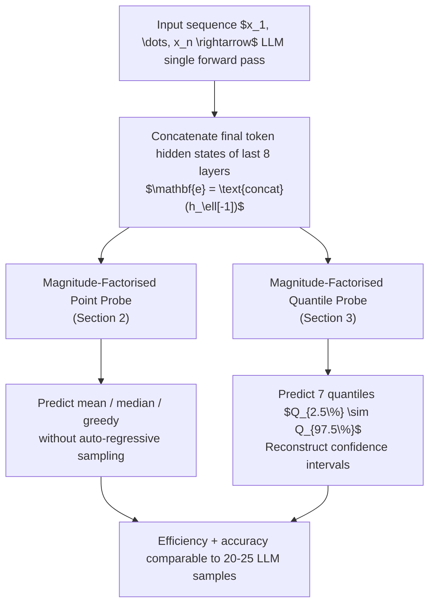

# Eliciting Numerical Predictive Distributions of LLMs Without Auto-Regression

**Conference**: ICLR 2026  
**Code**: https://github.com/kasia-kobalczyk/guess_llm  
**Area**: LLM Numerical Prediction / Internal Representation Probing  
**Keywords**: LLM Probing, Uncertainty Quantization, Numerical Prediction, Auto-regression Alternative, Time Series Forecasting

## TL;DR

By training lightweight "Magnitude-Factorised Probes" on the hidden states of the final layers of an LLM, the mean, median, and quantiles of the LLM's numerical prediction distribution can be directly recovered without auto-regressive sampling. This approach achieves an inference efficiency equivalent to 20-25 samples with well-calibrated confidence intervals.

## Background & Motivation

**Background**: LLMs have demonstrated strong in-context learning capabilities in structured data tasks such as tabular regression and time series forecasting, even rivaling specialized models in few-shot scenarios. To obtain the prediction distribution of an LLM (to quantify uncertainty or improve precision), it is typically necessary to perform repeated auto-regressive sampling on the same input, generating an entire number each time.

**Limitations of Prior Work**: Auto-regressive decoding is inherently unfriendly to continuous numerical outputs—a real number often spans multiple tokens. Coupled with the need for repeated sampling to estimate the distribution, this leads to extremely high inference latency and computational costs. For instance, estimating just the mean requires dozens of forward passes.

**Key Challenge**: Does the LLM "decide" the number it is going to generate within its internal hidden states beforehand, or are the numerical magnitudes (decimal positions, number terminators) determined only during token-by-token decoding? If distribution information can be read from hidden states before token generation, auto-regressive sampling would become unnecessary.

**Goal**: To investigate whether the statistical metrics (point estimates and uncertainty) of an LLM's numerical prediction distribution can be reconstructed solely from the internal representations of a single forward pass, thereby bypassing expensive auto-regressive sampling.

**Key Insight**: Using one-step time series forecasting as a specific task, lightweight probes are designed to be trained on LLM hidden states to directly predict the distribution mean, median, and quantiles.

**Core Idea**: The numerical "reasoning" of an LLM primarily occurs during the input encoding stage. The hidden states have already sufficiently encoded the number to be generated and its uncertainty; auto-regressive decoding merely "reads" this result rather than computing it.

## Method

### Overall Architecture

The paper proposes a two-stage probing framework: first, embeddings $\mathbf{e}$ are obtained by concatenating the final token hidden states from the last 8 layers of the LLM (Llama-2-7B). Then, two types of probes are trained: point estimation probes (predicting mean, median, or greedy output) and quantile probes (predicting multiple quantile values to reconstruct the predictive distribution). Both probes share the core "Magnitude-Factorised" architecture.

### Key Designs

**1. Magnitude-Factorised Probe: Addressing gradient instability in cross-magnitude regression**

When performing regression directly on raw numerical values, the MSE loss is dominated by large-magnitude values, causing gradients for small-magnitude predictions to nearly vanish. To solve this, the authors split the prediction into two series sub-tasks: **Magnitude Classification** $f_{\text{order}}: \mathbb{R}^{d_{\text{input}}} \to \mathbb{R}^M$ first predicts the category of the target value $y$'s magnitude $m(y) = \lfloor\log_{10}|y|\rfloor$, outputting a softmax probability vector $\mathbf{p}(x)$; **Conditional Value Regression** $f_{\text{val}}: \mathbb{R}^{d_{\text{input}}+1} \to \mathbb{R}^M$ predicts the scaled residual $r_k$ for each magnitude class $m_k$. The final prediction is $\hat{y}_k = r_k \cdot 10^{m_k}$. During inference, the top-K weighted expectation $\mathbb{E}_K[\hat{y}] = \sum_{k \in \text{top-K}} p_k \hat{y}_k$ is used. A two-stage freezing strategy is employed during training: first, freeze the regression head to train the classification head (cross-entropy loss), then freeze the classification head to train the regression head (MSE loss). Experiments show this design maintains 90%+ magnitude prediction accuracy and a Pearson R of 0.98 across datasets spanning 8 orders of magnitude.

**2. Quantile Regression Probe: Recovering distribution uncertainty directly from hidden states**

Following point estimation, the authors ask: do LLM hidden states also encode the "width" of the predictive distribution? The quantile probe follows the magnitude-factorized structure, with separate classification/regression heads for $S=7$ target quantiles (0.025, 0.05, 0.25, 0.5, 0.75, 0.95, 0.975). The training objective is the pinball loss, using 100 ground-truth samples $\{y^j\}$ from the LLM as supervision:

$$\mathcal{L} = \sum_{s=1}^{S} \left( \mathcal{L}^s_{\text{order}} + \beta \cdot \mathcal{L}^s_{\text{val}} \right)$$

where $\mathcal{L}^s_{\text{val}}$ calculates the pinball loss for each LLM sample. Results show the probe faithfully recovers distribution dispersion: the Spearman correlation between predicted IQR and sampled IQR reaches 0.90. Across four datasets with different magnitudes, the actual coverage of 50%/90%/95% confidence intervals is approximately 50%/91%/95%, highly consistent with nominal levels.

**3. Generalization: Three levels of transfer (Length, Distribution, Synth-to-Real)**

A practical probe must work in settings unseen during training. The authors evaluate generalization across three dimensions: (a) **Context Length Generalization**—models trained on a limited range [10, 20] show only a slight drop in coverage outside that range, while those trained on [3, 40] are more robust; (b) **Real Data Generalization**—on 31 subsets of Darts + Monash (approx. 45,000 sequences), a model trained on subsets of all domains (Real-all) achieves 48.8%/88.5%/94.3% coverage; (c) **Synth-to-Real Transfer**—models trained only on synthetic data (Synth) perform significantly worse on real data. This is primarily due to drastic shifts in magnitude distribution (real data spans $10^{-3}$ to $10^{13}$), indicating magnitude distribution matching is a key bottleneck for generalization.

## Key Experimental Results

### Main Results

| Target | Probe MSE | LLM Direct Sampling MSE | Mean Baseline | Last-Value Baseline |
|------|----------|-----------------|---------|-----------|
| mean (predict $x_{n+1}$) | **0.0562** | 0.0555 | 0.3454 | 0.1226 |
| median | **0.0561** | 0.0553 | 0.3454 | 0.1226 |
| greedy | **0.0652** | 0.0668 | 0.3454 | 0.1226 |

Probe performance is nearly parity with direct LLM sampling and outperforms simple mean or last-value baselines.

### Point Estimation Accuracy (scale=1.0 dataset)

| Target | Probe MSE | Dataset Mean Baseline | Sequence Mean Baseline | Last-Value Baseline |
|------|---------|-------------|------------|-----------|
| mean | **0.006** | 0.256 | 0.035 | 0.085 |
| median | **0.006** | 0.260 | 0.041 | 0.087 |
| greedy | **0.015** | 0.273 | 0.065 | 0.109 |

### Confidence Interval Calibration (Quantile Probe)

| Dataset Magnitude | 50% CI Coverage | 90% CI Coverage | 95% CI Coverage |
|-----------|-------------|-------------|-------------|
| 1.0 | 52.0 ± 0.4 | 90.9 ± 0.3 | 95.5 ± 0.2 |
| 10.0 | 52.7 ± 0.5 | 91.3 ± 0.3 | 96.1 ± 0.2 |
| 1000.0 | 51.4 ± 0.3 | 90.7 ± 0.3 | 95.7 ± 0.2 |
| 10000.0 | 48.2 ± 0.3 | 90.5 ± 0.2 | 95.4 ± 0.2 |

### Key Findings
- Magnitude classification accuracy exceeds 90% across all scales; Pearson R for mean/median targets reaches 0.98.
- Probe efficiency is equivalent to 20-25 LLM samples; for scenarios with $N < 25$ samples, probe error is actually lower.
- Greedy targets are harder to predict than mean/median (MSE is ~2.5x higher), as greedy output is a byproduct of decoding rather than an explicit distribution statistic.
- Calibration slightly degrades on real data (Real-5fold 90% CI coverage is ~82%), and the synth-to-real gap is larger (67%).

## Highlights & Insights
- **Hidden states encode numbers before tokens**: This finding challenges the intuition that numerical capability relies on token-by-token decoding. It suggests numerical reasoning is completed during the Transformer forward pass, with decoding merely "reading" the conclusion.
- **Generality of Magnitude-Factorised design**: The strategy of splitting regression into magnitude classification and conditional value regression is applicable to any neural network regression scenario involving outputs across multiple orders of magnitude.
- **Replacing samples with a single forward pass**: Probes only require one LLM forward pass to extract hidden states, significantly saving computation compared to multiple full samplings. This provides a new path for deploying LLMs in resource-constrained scenarios.
- **Uncertainty without sampling**: This is the first systematic demonstration that an LLM's predictive uncertainty (distribution width) is also encoded in hidden states, opening a new direction for non-sampling uncertainty quantification.

## Limitations & Future Work
- Requires access to internal LLM activations (not applicable to API-only deployment).
- Probes are model-specific; changing the LLM architecture or tokenizer requires retraining.
- Training the probe itself requires high initial costs to obtain labels via LLM sampling (~100 samples/sequence).
- Synth-to-real generalization is limited; magnitude distribution shift remains a bottleneck.
- Currently only validated for one-step prediction; multi-step and multivariate scenarios remain to be explored.

## Related Work & Insights
- **vs. LLM Time Series Forecasting (Gruver et al., 2024)**: Methods like LLaMA-TS still rely on auto-regressive sampling for distributions; this probe can serve as a direct replacement for inference acceleration.
- **vs. Tuned Lens / Linear Probing**: Traditional probes focus on classification; this is among the first systematic works extending probing to continuous numerical regression and introducing magnitude factorization.
- **vs. Confidence Calibration**: Most calibration methods operate on the output layer; this approach calibrates directly from intermediate hidden states, providing earlier uncertainty signals.
- **Insights on Numerical Capability**: Results imply LLMs have mechanisms similar to "internal planning" when handling continuous values, echoing recent research on LLM output planning (Lindsey et al., 2025).

## Rating
- Novelty: ⭐⭐⭐⭐ Probing for distribution recovery is a novel problem setting; the magnitude-factorised architecture is a practical innovation.
- Experimental Thoroughness: ⭐⭐⭐⭐ Validated across multiple scales, synthetic/real data, and multiple models; systematic generalization analysis.
- Writing Quality: ⭐⭐⭐⭐ Concepts progress logically (point estimate $\to$ uncertainty $\to$ efficiency $\to$ generalization) with clear structure.
- Value: ⭐⭐⭐⭐ Provides a lightweight path for efficient LLM uncertainty quantification, significant for AI safety and reliable deployment.

<!-- RELATED:START -->

## Related Papers

- [\[ICLR 2026\] Statistical Advantage of Softmax Attention: Insights from Single-Location Regression](statistical_advantage_of_softmax_attention_insights_from_single-location_regress.md)
- [\[ACL 2025\] How Numerical Precision Affects Arithmetical Reasoning Capabilities of LLMs](../../ACL2025/llm_nlp/how_numerical_precision_affects_arithmetical_reasoning_capabilities_of_llms.md)
- [\[ACL 2025\] Token Prepending: A Training-Free Approach for Eliciting Better Sentence Embeddings from LLMs](../../ACL2025/llm_nlp/token_prepending_training_free.md)
- [\[AAAI 2026\] Collaborative LLM Numerical Reasoning with Local Data Protection](../../AAAI2026/llm_nlp/collaborative_llm_numerical_reasoning_with_local_data_protection.md)
- [\[ICML 2026\] Stop Automating Peer Review Without Rigorous Evaluation](../../ICML2026/llm_nlp/stop_automating_peer_review_without_rigorous_evaluation.md)

<!-- RELATED:END -->
