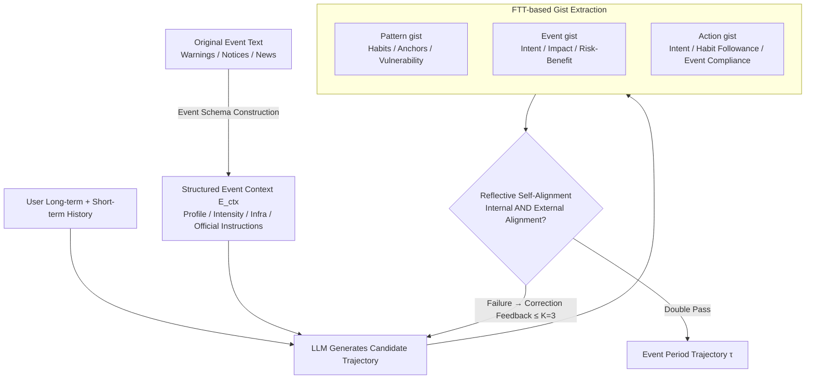

# ELLMob: Event-Driven Human Mobility Generation with Self-Aligned LLM Framework

**Conference**: ICLR 2026  
**arXiv**: [2603.07946](https://arxiv.org/abs/2603.07946)  
**Code**: [GitHub](https://github.com/deepkashiwa20/ELLMob)  
**Area**: LLM/NLP  
**Keywords**: Human Mobility Generation, Event-Driven Trajectories, LLM Self-Alignment, Fuzzy-Trace Theory, Cognitive Decision Making  

## TL;DR

The ELLMob framework is proposed based on the Fuzzy-Trace Theory (FTT) from cognitive psychology. It reconciles the competition between user daily patterns and social event constraints by extracting and iteratively aligning "habit gists" and "event gists," achieving explainable event-driven trajectory generation.

## Background & Motivation

Human mobility generation aims to synthesize plausible spatio-temporal trajectory data, widely used in urban planning, traffic management, and public health. While LLMs have succeeded in regular trajectory generation, they face two critical issues:

1.  **Evaluation Bias due to Data Scarcity**: Existing methods are primarily developed and evaluated on non-event day (stable period) data, leaving their reliability under sudden social events (natural disasters, public health emergencies) questionable.
2.  **Lack of Competitive Decision Reconciliation Mechanisms**: Real-world mobility during events exhibits both habitual regularity and shock-induced deviation—users retain daily activities for key anchors (e.g., workplace) but adjust other behaviors. Existing methods either default to habitual patterns or are dominated by event constraints.

Specific manifestations:
-   During typhoons: Staying away from coastal areas, canceling non-essential commutes.
-   During COVID-19: Self-restricting the range of activities.
-   During the Olympics: Restricted areas and traffic congestion.

## Method

### Overall Architecture

ELLMob formalizes event-driven trajectory generation as a mapping $F: (D_{\text{long-term}}^{(u)}, D_{\text{short-term}}^{(u)}, E_{ctx}) \mapsto \tau$. It takes the user's long-term history $D_{\text{long-term}}^{(u)}$, recent short-term trajectories $D_{\text{short-term}}^{(u)}$, and structured event context $E_{ctx}$ as inputs to output the trajectory $\tau$ during the event. The core challenge is that real-world mobility during events both preserves habits (going home, going to work) and is rewritten by events (avoiding danger zones, canceling non-essential trips); existing methods tend to favor one side. ELLMob's strategy is to structure messy event texts into reason-able constraints, use the "gist" concept from cognitive psychology to verbalize the forces of "habit" and "event," and finally use a reflection-correction loop to force the model to satisfy both. It consists of three sequential modules: **Event Schema Construction** compresses free-text events into a four-dimensional structured context; the LLM then generates candidate trajectories while extracting **Three Categories of Gists** (habitual, event-based, and current decision-based); finally, **Reflective Self-Alignment** audits candidates along internal and external dimensions. If requirements are not met, the failure reasons are fed back for regeneration, looping up to $K=3$ times.

### Key Designs

**1. Event Schema Construction: Compressing Free-text Events into Structured Constraints for LLM Reasoning**

Original event descriptions like typhoon warnings or pandemic notices are lengthy, unstructured texts. LLMs easily overlook critical information affecting mobility during generation. This step uses an LLM to decompose event narratives into four fixed dimensions: Event Profile (type, name, time, affected area, providing spatio-temporal anchors), Intensity and Scale (quantitative indicators like wind speed or rainfall to evaluate travel risk), Infrastructure Impact (operational status of transport and public places, defining physical constraints), and Official Instructions (government orders and their applicable population/geography, ensuring policy compliance). Each event is mapped to a consistent set of fields in the structured event context $E_{ctx}$, allowing subsequent reasoning to directly reference discrete facts like "which railway is suspended" rather than parsing raw text, reducing hallucination risks and ensuring constraint traceability.

**2. Three Categories of Gists based on Fuzzy-Trace Theory (FTT): Externalizing Competition between Habit and Event via Verbal "Points"**

FTT suggests that decision-making under uncertainty relies on distilled "gists" (bottom-line essentials, e.g., "high typhoon risk" rather than "15% strike probability") rather than verbatim details. Crucially, gists can be expressed in natural language—a feature exploited here to make decision logic transparent. ELLMob extracts three layers of gists: **Pattern gist** summarizes core behaviors from historical trajectories (daily commute), inertial anchors (home), and vulnerabilities (reliance on potentially suspended railways); **Event gist** distills primary intentions from the event context (high outdoor risk, incentive to stay home), behavioral impacts (evacuating coasts), and risk-benefit assessments; **Action gist** extracts the primary intent, habit adherence (e.g., deviation from normal commute), and event compliance (e.g., avoiding danger zones) from the candidate trajectory itself. Mapping these to a shared space makes habit demands and event constraints comparable and alignable.

**3. Reflective Self-Alignment: Dual-dimension Auditing + Correction Feedback for Iterative Convergence**

Candidate trajectories from a single decoding often fail in two ways: ignoring event constraints to follow habits, or being so event-dominated that work anchors are suppressed. ELLMob uses a reflection-refinement loop instead of single-pass decoding. The first stage is an alignment audit, checking candidates against two binary dimensions with reasoned justifications: Internal Alignment asks "Does the trajectory coherently reflect user habits and current behavioral tendencies?"; External Alignment asks "Is the trajectory a reasonable and compliant response to event constraints?". A candidate is only accepted if both pass. If a dimension fails, the second stage—correction refinement—feeds the specific failure reasons back to the generator to guide targeted regeneration. The loop iterates up to $K=3$ times; in rare timeouts, a fallback strategy selects the last verified trajectory and reports unmet constraints. This alignment specifically serves the "habit vs. event" dilemma; ablation shows it provides an average 69.5% performance gain over non-aligned variants.

### Loss & Training

ELLMob does not use fine-tuning. The backbone uses GPT-4o-mini (2025-01-01-preview), with temperature set to 0.1 and Top-p to 1 for decision stability. Trajectories are modeled at a 10-minute resolution, with spatial grid parameter $S=10$ and maximum self-alignment iterations $K=3$.

## Key Experimental Results

### Main Results

**Comparison across three major events (JSD↓, lower is better):**

| Model | Typhoon SI | Typhoon SD | Typhoon CD | Typhoon SGD |
| :--- | :--- | :--- | :--- | :--- |
| LSTM | 0.1336 | 0.1039 | 0.0555 | 0.1111 |
| DeepMove | 0.1697 | 0.0826 | 0.0266 | 0.0759 |
| LLM-MOB | 0.1214 | 0.0468 | 0.0285 | 0.0344 |
| LLM-Move | 0.1267 | 0.0392 | 0.0136 | 0.0303 |
| LLMOB | 0.0949 | 0.1195 | 0.0123 | 0.0256 |
| **Ours (ELLMob)** | **0.0642** | **0.0200** | **0.0041** | **0.0173** |

| Model | COVID SI | COVID SD | COVID CD | COVID SGD |
| :--- | :--- | :--- | :--- | :--- |
| LLM-MOB | 0.1166 | 0.0532 | 0.0234 | 0.0353 |
| LLM-Move | 0.1408 | 0.0567 | 0.0127 | 0.0503 |
| LLMOB | 0.1013 | 0.1051 | 0.0186 | 0.0286 |
| **Ours (ELLMob)** | **0.1003** | **0.0444** | **0.0080** | **0.0268** |

| Model | Olympic SI | Olympic SD | Olympic CD | Olympic SGD |
| :--- | :--- | :--- | :--- | :--- |
| LLMOB | 0.0973 | 0.0274 | 0.0110 | 0.0051 |
| LLM-Move | 0.1967 | 0.0298 | 0.0101 | 0.0057 |
| **Ours (ELLMob)** | **0.0617** | **0.0061** | **0.0022** | **0.0035** |

**Key Figures:** ELLMob improves the SI metric by 32.3% in Typhoon scenarios and the SD metric by 16.5% in COVID-19 scenarios compared to the strongest baseline, outperforming the best baseline by an average of 46.9%.

### Ablation Study

| Variant | Typhoon SI | Typhoon SD | COVID SI | COVID SD |
| :--- | :--- | :--- | :--- | :--- |
| Full ELLMob | 0.0642 | 0.0200 | 0.1003 | 0.0444 |
| w/o I.A.&E.A. | 0.1304 | 0.1270 | 0.2331 | 0.1077 |
| w/o I.A. (Ext only) | 0.0835 | 0.0720 | 0.1235 | 0.0950 |
| w/o E.A. (Int only) | 0.0680 | 0.0258 | 0.2237 | 0.0860 |
| w/o Eve. Ext. | 0.0736 | 0.0273 | 0.2037 | 0.0741 |

Key Ablation Findings:
-   Removing External Alignment led to a 132.4% degradation in SI in the COVID-19 scenario—external alignment is crucial for handling major behavioral deviations.
-   Removing Internal Alignment led to over-correction by the model (e.g., irrationally increasing health-related trips).
-   Cognitive self-alignment improved performance by an average of 69.5% over non-aligned variants.

### Key Findings

1.  **LLM methods generally outperform deep learning methods**: Particularly in spatial consistency metrics (SD, SGD), thanks to event context integration.
2.  **Existing LLM baselines fail significantly in event scenarios**: Either defaulting to habitual patterns (underestimating health trips) or over-responding to event constraints (completely suppressing social activities).
3.  **Disaster decision tasks**: ELLMob achieved the highest F1-score in identifying active users during typhoons (binary classification), with a recall of 59.3%.
4.  **Distinct roles for Internal/External Alignment**: Internal alignment provides foundational plausibility, while external alignment provides scenario-specific corrections.

## Highlights & Insights

1.  **Theory-driven AI Framework Design**: Incorporating Fuzzy-Trace Theory (FTT) into LLM trajectory generation is a structural design grounded in cognitive science rather than simple prompt engineering.
2.  **First Event-labeled Mobility Dataset**: Covering three distinct event types (natural disaster, public health, major sports), filling a critical data gap.
3.  **Explicit Reconciliation of Competitive Decisions**: Shifts trajectory generation from "maximizing statistical likelihood" toward "cognitive plausibility," making the decision process traceable through gist alignment.
4.  **Extensive Experimental Coverage**: 12 baselines (6 DL + 4 LLM + variants), 4 evaluation metrics, and 4 scenarios.
5.  **Average Improvement of 46.9%** is highly significant and maintains optimality across all three event types.

## Limitations & Future Work

1.  **Regional Limitations**: Only utilizes Twitter/Foursquare check-in data from the Tokyo Metropolitan Area; generalization requires further validation.
2.  **LLM API Costs**: The iterative alignment process requires multiple API calls, leading to higher inference costs.
3.  **Manual Design of Event Schemas**: Defining four-dimensional event schemas relies on domain expertise, limiting automation.
4.  **Check-in Data Sparsity**: Social media check-ins may not fully reflect true mobility patterns.
5.  **Coarse Temporal Resolution**: A 10-minute resolution might miss fine-grained behavioral changes.

## Related Work & Insights

-   **LLM-MOB** (Wang et al., 2023), **LLM-Move** (Feng et al., 2024), and **LLMOB** (Wang et al., 2024) are the primary LLM baselines.
-   **Fuzzy-Trace Theory** (Reyna & Brainerd, 1995) provides the theoretical foundation—the verbalizable nature of gists makes combining FTT with LLMs feasible.
-   **Self-alignment/Self-reflection**: Unlike general self-alignment for correcting hallucinations, the alignment here focuses on reconciling competitive decisions.
-   Insight: Cognitive science theories can provide principled guidance for LLM architecture design beyond empirical prompt engineering.

## Rating

-   **Novelty**: ⭐⭐⭐⭐⭐ — The first event-driven mobility framework; FTT-gist alignment is a unique design concept.
-   **Technical Depth**: ⭐⭐⭐⭐ — Rigorous combination of cognitive theory and LLM; clear problem formalization.
-   **Experimental Thoroughness**: ⭐⭐⭐⭐ — 12 baselines, 4 scenarios, multi-dimensional evaluation, comprehensive ablation.
-   **Value**: ⭐⭐⭐⭐ — Direct application value for emergency management and urban planning.
-   **Writing Quality**: ⭐⭐⭐⭐ — Clear framework diagrams and well-explained cognitive theory.

**Total**: ⭐⭐⭐⭐ (4.5/5) — A highly creative interdisciplinary work merging cognitive psychology with LLM trajectory generation. It features a novel problem definition and excellent experimental performance, representing a strong example of LLM-for-Science.

<!-- RELATED:START -->

## Related Papers

- [\[AAAI 2026\] Whispering Agents: An Event-Driven Covert Communication Protocol for the Internet of Agents](../../AAAI2026/llm_nlp/whispering_agents_an_event-driven_covert_communication_protocol_for_the_internet.md)
- [\[ICLR 2026\] BOTS: A Unified Framework for Bayesian Online Task Selection in LLM Reinforcement Finetuning](bots_a_unified_framework_for_bayesian_online_task_selection_in_llm_reinforcement.md)
- [\[ICLR 2026\] Optimas: Optimizing Compound AI Systems with Globally Aligned Local Rewards](optimas_optimizing_compound_ai_systems_with_globally_aligned_local_rewards.md)
- [\[ACL 2025\] HyGenar: An LLM-Driven Hybrid Genetic Algorithm for Few-Shot Grammar Generation](../../ACL2025/llm_nlp/hygenar_an_llm-driven_hybrid_genetic_algorithm_for_few-shot_grammar_generation.md)
- [\[ICLR 2026\] Neologism Learning for Controllability and Self-Verbalization](neologism_learning_for_controllability_and_self-verbalization.md)

<!-- RELATED:END -->
