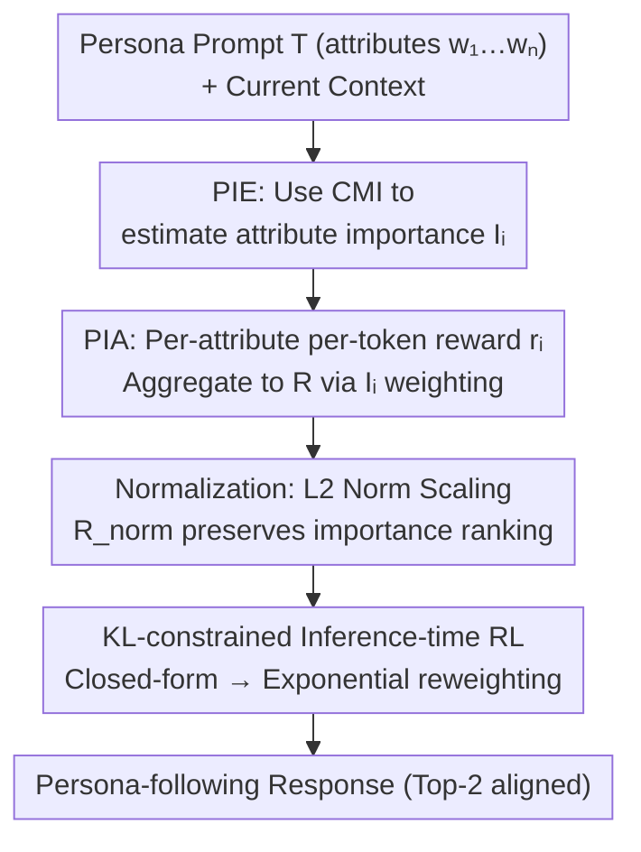

# Enhancing Persona Following at Decoding Time via Dynamic Importance-Guided Token Estimation for Role-Playing Agents

**Conference**: ICLR 2026  
**arXiv**: [2603.01438](https://arxiv.org/abs/2603.01438)  
**Code**: Not released  
**Area**: LLM/NLP  
**Keywords**: Role-playing agents, Persona following, Inference-time alignment, Conditional mutual information, Multi-objective reward decoding  

## TL;DR

The Persona Dynamic Decoding (PDD) framework is proposed, which dynamically estimates the context-dependent importance of persona attributes through conditional mutual information and integrates these importance scores into multi-objective reward-guided decoding to achieve training-free inference-time persona following.

## Background & Motivation

Role-playing language agents (RPLAs) are increasingly important in sociological research (e.g., voting behavior analysis, rumor propagation dynamics), but existing methods face two core limitations:

1.  **Insufficient Dynamic Adaptability**: Psychological research (such as the Cognitive-Affective Personality System theory, CAPS) indicates that the influence of personality on behavior is context-dependent—different personality attributes hold varying degrees of influence in different situations. However, existing methods (prompt engineering/fine-tuning) treat all attributes equally and fail to dynamically identify context-relevant persona attributes.
2.  **Heavy Data Dependency**: Parametric methods (SFT/LoRA) require large-scale behavioral data. In social simulations, roles are diverse and personalities are complex, making data collection extremely expensive.

Classification and limitations of existing methods:
-   **Non-parametric methods** (Direct Prompting, ICL, RAG): Rely on semantic recognition and lack deep understanding of persona attributes.
-   **Parametric methods** (SFT, LoRA): Require significant computational resources and labeled data.
-   Both types of methods fail to achieve context-aware dynamic persona following.

## Method

### Overall Architecture

PDD (Persona Dynamic Decoding) decomposes "persona following" into two tasks performed entirely at inference time without modifying any parameters, relying solely on log-probability differences of the model. Given a persona prompt filled with attributes and the current dialogue context, the framework first uses **PIE** to self-supervise the estimation of "how important each persona attribute is in the current context," yielding a set of importance scores. Then, **PIA** transforms these scores into weighted multi-objective rewards to modulate the base model's generation probabilities token-by-token. To prevent weighted sums from being biased by attributes with large numerical values, a **reward normalization** step is inserted to preserve the importance ranking estimated by PIE. Finally, these rewards are integrated into an inference-time RL objective with KL constraints to obtain a closed-form solution for token-wise distribution reweighting, generating the persona-following response.

### Key Designs

**1. PIE: Quantifying Attribute Importance via Conditional Mutual Information**

Persona prompts often contain a long list of attributes, but only a few are truly effective in a specific dialogue. Treating all attributes equally is the root of insufficient dynamic adaptability. PDD measures "whether the model would still generate the same output if a certain attribute were removed"—formalized as the conditional mutual information $I(Y; w_i \mid T_i) = H(Y\mid T_i) - H(Y\mid w_i, T_i)$ of output $Y$ regarding attribute $w_i$, where $T_i = T \setminus \{w_i\}$ is the prompt after removing attribute $w_i$. Since the true output distribution is unavailable, PIE uses the response $G = \pi_\theta(T)$ generated by the base model as a proxy, approximating importance as the difference between log-likelihoods $I_i \triangleq \log \frac{\Pr(G \mid T)}{\Pr(G \mid T_i)}$. The intuition is clear: if the generation probability drops sharply after removing an attribute, that attribute is pivotal to the current context. Theoretically, as long as the probability of the model generating $G$ is positively correlated with the ground-truth $GT$, $I^{\text{model}}$ serves as a reliable proxy for the true mutual information $I^{\text{true}}$. This step is completely zero-shot and avoids the data dependency of parametric methods.

**2. PIA: Injecting Importance Scores into Multi-objective Reward Decoding**

Once importance is obtained, the generation must be biased toward important attributes. PIA first defines a stepwise reward for each attribute $r_i(T, y_{<t}) = \sum_{t'=t-1}^{t} \log \frac{\pi_\theta(y_{t'} \mid T, y_{<t'})}{\pi_\theta(y_{t'} \mid T_i, y_{<t'})}$, which is essentially the log-probability ratio of the current token under "with attribute" vs. "without attribute" conditions. These are then aggregated using importance $I_i$ as weights into a multi-objective reward $R(T, y) = \sum_{i=1}^{n} I_i \cdot r_i(T, y)$. This grants more significant attributes higher influence during decoding, achieving context-aware rather than one-size-fits-all persona modulation. In practice, only the top-2 highest importance attributes are aligned to balance fidelity and computational overhead.

**3. Reward Normalization: Maintaining Importance Ranking of Attributes**

Simple weighted summation carries a risk—a single attribute reward $r_i$ with a large numerical value could dominate the total, destroying the importance hierarchy estimated by PIE. PDD solves this via L2 norm normalization of the reward vector: $R_{\text{norm}} = \frac{\sum_{i=1}^{n} I_i \cdot r_i(T, y)}{\|\mathbf{r}\|_2}$. According to the Cauchy-Schwarz inequality, $R_{\text{norm}} \leq \|\mathbf{I}\|_2$, where equality holds if and only if $\mathbf{r} \propto \mathbf{I}$. Thus, maximizing $R_{\text{norm}}$ no longer rewards the absolute magnitude of a single dimension but encourages the direction of the reward vector $\mathbf{r}$ to align with the importance vector $\mathbf{I}$, ensuring the reward ranking of attributes remains consistent with their context importance.

### Loss & Training

PDD involves no training. The rewards are solved within an inference-time RL objective with KL constraints: $\max_{p_r} \mathbb{E}_{p_r}\!\left[\frac{\sum_{i=1}^{n} I_i r_i(T, y)}{\|\mathbf{r}\|_2} - \beta D_{\text{KL}}(p_r \| \pi_\theta)\right]$, which attempts to approach the normalized reward while using the KL term to ensure the distribution does not deviate too far from the base model $\pi_\theta$. This objective has a closed-form token-wise optimal solution $p_r(y_t \mid T, y_{<t}) = \frac{1}{Z(T, y_{<t})} \pi_\theta(y_t \mid T, y_{<t}) \exp\!\left(\frac{1}{\beta} R_{\text{norm}}(T, y_{<t})\right)$, interpreted as multiplying the base model distribution by an exponential reweighting factor determined by the normalized reward. The calculation utilizes only inference-time log-probabilities with temperature $\beta = 1.0$ and greedy decoding.

## Key Experimental Results

### Main Results

**General Role-playing Tasks — GPT-4o Pairwise Evaluation (Win%):**

| PDD vs. | CharacterEval (Qwen) | CharacterEval (LLaMA) | BEYOND DIALOGUE (Qwen) | BEYOND DIALOGUE (LLaMA) |
|---------|---------------------|---------------------|----------------------|----------------------|
| SP | 51.2% win | 52.5% win | 63.9% win | 56.2% win |
| PP | 48.7% win | 39.1% win | 43.0% win | 46.8% win |
| ICL | 65.3% win | 63.1% win | 60.9% win | 64.2% win |
| OPAD | 52.8% win | 48.2% win | 49.0% win | 47.6% win |

**CharacterEval Automatic Evaluation (CharacterRM Metrics):**

| Model | Method | KE | KA | KH | PB | PU | Average |
|------|------|-----|-----|-----|-----|-----|---------|
| GPT-4o | PP | 2.58 | 3.02 | 2.99 | 2.83 | 2.91 | 2.87 |
| Qwen-7B | PDD | 2.25 | 2.93 | 2.99 | **3.08** | **3.01** | **2.85** |
| LLaMA-8B | PDD | 2.39 | 2.68 | **3.03** | 3.00 | 2.96 | **2.81** |

PDD's performance on small open-source models competes with the commercial GPT-4o model.

**PERSONALITYBENCH Big Five Personality Traits Evaluation (Qwen2.5-7B):**

| Personality Trait | SP | PP | ICL | OPAD | PAS | NPTI | **PDD** |
|---------|------|------|------|------|------|------|---------|
| Agreeableness | 4.81 | 4.90 | 4.81 | 4.53 | 4.83 | 4.73 | **4.92** |
| Conscientiousness | 4.47 | 4.98 | 4.19 | 4.66 | 4.61 | 4.74 | **4.97** |
| Extroversion | 4.68 | 4.59 | 4.32 | 4.26 | 4.65 | 4.71 | **4.66** |
| Neuroticism | 3.02 | 3.45 | 3.12 | 3.79 | 3.74 | 3.39 | **3.54** |
| Openness | 4.56 | 4.75 | 4.67 | 4.44 | 4.61 | 4.83 | 4.75 |
| **Average** | 4.31 | 4.53 | 4.22 | 4.34 | 4.49 | 4.48 | **4.57±0.22** |

PDD achieves the highest average score with the lowest variance (0.22 vs. 0.32-0.53 for other methods), indicating stronger robustness.

### Ablation Study

**Reliability Validation of PIE Importance Estimation:**

Evaluated across 5 dimensions (Context Relevance, Attribute Utility, Context Coverage, Attribute Independence, Ranking Consistency) using 3 LLM judges (DeepSeek-R1, GPT-4o, GPT-5) and human expert scores:
- PDD received consistently strong scores (Likert 1-5 scale) across all dimensions.
- Importance distributions were consistent across different base models (Qwen/LLaMA), confirming cross-model stability.

**Context-Aware Visualization Cases:**
- Scene 1 (Character discussing martial arts): High weights → personality traits, unique skills.
- Scene 2 (Character mentoring another): High weights → outlook on life, educational views.
- Confirms PIE's ability to dynamically adjust attribute weights based on context.

### Key Findings

1.  **Effectiveness of Inference-time Alignment**: PDD surpasses or matches training-based methods (NPTI, PAS) on multiple benchmarks without fine-tuning.
2.  **Competitiveness of Small Models**: Open-source models with 7-8B parameters achieve GPT-4o-level role-playing capabilities via PDD.
3.  **Criticality of Normalized Multi-objective Rewards**: The Cauchy-Schwarz-inspired ranking preservation ensures the hierarchy of persona attributes.
4.  **Top-2 Alignment as the Efficiency-Effectiveness Sweet Spot**: Aligning more attributes increases computation with diminishing marginal returns.
5.  **Statistical Significance**: Meets $p\text{-value} < 0.05$ across all Big Five personality dimensions.

## Highlights & Insights

1.  **Theory-driven Design**: From CAPS psychological theory to CMI quantification and Cauchy-Schwarz normalization, every step is theoretically grounded.
2.  **Zero-shot Persona Importance Estimation**: Quantifies attribute importance using only the model's own log-probability differences without ground-truth supervision—this is the most elegant design point.
3.  **Normalization Trick for Multi-objective Alignment**: Ensures the direction of the reward vector aligns with the importance vector by dividing by $\|\mathbf{r}\|_2$, rather than simple weighting.
4.  **Comprehensive Experimental Design**: Includes Chinese and English role-playing, Big Five personality traits, human evaluation, LLM-as-Judge, and RewardModel.
5.  **Training-agnostic**: Operates entirely at inference time, transferable to any character without per-character data preparation.

## Limitations & Future Work

1.  **High Inference Overhead**: Requires calculating conditional and unconditional probabilities for each token and attribute ($n+1$ forward passes), which may lead to latency bottlenecks in practical applications.
2.  **Top-2 Alignment as an Engineering Compromise**: Complex characters might require simultaneous alignment of more attributes.
3.  **Theoretical Assumptions of CMI Approximation**: The positive correlation assumption may not hold in all scenarios.
4.  **Evaluation Limitations**: LLM-as-Judge may exhibit biases toward specific personality expressions.
5.  **Unexplored Persona Consistency in Long Dialogues**: Experiments were mostly conducted in single-turn or short-dialogue scenarios.

## Related Work & Insights

-   **CAPS Theory** (Sherman et al., 2015): Provides a psychological basis for dynamic personality modeling.
-   **OPAD** (Zhu et al., 2025a): Single-objective inference-time preference alignment; PDD extends this to multi-objective.
-   **NPTI** (Deng et al., 2025): Neuron-level personality trait induction; requires training probes.
-   **CharacterEval** (Tu et al., 2024): A benchmark for Chinese role-playing evaluation.
-   Insight: Conditional mutual information can serve as a metric for attribute importance, extendable to other scenarios requiring dynamic attribute weights (e.g., stylized writing, multi-constraint generation).

## Rating

-   **Novelty**: ⭐⭐⭐⭐ — The combination of CMI importance estimation and normalized multi-objective rewards is an original contribution.
-   **Technical Depth**: ⭐⭐⭐⭐⭐ — Solid execution from theoretical derivation to implementation details, with effective use of information and optimization theories.
-   **Experimental Thoroughness**: ⭐⭐⭐⭐ — Three datasets, multiple baselines, combined human and automatic evaluation, and ablation studies.
-   **Utility**: ⭐⭐⭐⭐ — Training-free inference-time solutions are highly favorable for practical deployment.
-   **Writing Quality**: ⭐⭐⭐⭐ — Clear mathematical derivations and informative framework diagrams.

**Overall**: ⭐⭐⭐⭐ (4/5) — A theoretically rigorous and elegantly designed inference-time persona alignment framework. CMI importance estimation and normalized multi-objective rewards are the highlights, demonstrating the competitiveness of training-free methods across multiple benchmarks.

<!-- RELATED:START -->

## Related Papers

- [\[ACL 2026\] PersonaArena: Dynamic Simulation for Evaluating and Enhancing Persona-Level Role-Playing in Large Language Models](../../ACL2026/llm_nlp/personaarena_dynamic_simulation_for_evaluating_and_enhancing_persona-level_role-.md)
- [\[ICLR 2026\] Attend to the Active: Structure-Aware Dynamic Attention in LLMs for Compositional Instruction Following](attend_to_the_active_structure-aware_dynamic_attention_in_llms_for_compositional.md)
- [\[ACL 2025\] Nudging: Inference-time Alignment of LLMs via Guided Decoding](../../ACL2025/llm_nlp/nudging_inference_time_alignment.md)
- [\[ICLR 2026\] FACT: Fine-grained Across-variable Convolution for Multivariate Time Series Forecasting](fact_fine-grained_across-variable_convolution_for_multivariate_time_series_forec.md)
- [\[ICLR 2026\] Stopping Computation for Converged Tokens in Masked Diffusion-LM Decoding](stopping_computation_for_converged_tokens_in_masked_diffusion-lm_decoding.md)

<!-- RELATED:END -->
