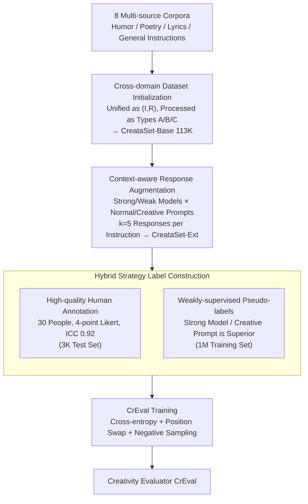

# Evaluating Text Creativity across Diverse Domains: A Dataset and Large Language Model Evaluator

**Conference**: ICLR 2026  
**arXiv**: [2505.19236](https://arxiv.org/abs/2505.19236)  
**Code**: [Project Page](https://creval-creative-evaluation.github.io)  
**Area**: LLM/NLP  
**Keywords**: creativity evaluation, LLM-as-a-judge, pairwise comparison, text creativity, dataset construction, CrEval, cross-domain evaluation

## TL;DR

A context-aware pairwise comparison framework is proposed to evaluate text creativity. The authors constructed the CreataSet dataset, containing 100K+ human-level and 1M+ synthetic data points, and trained the CrEval evaluator, which outperforms GPT-4o by 18.7% in alignment with human judgment.

## Background & Motivation

- **Creativity evaluation is a frontier challenge for LLM assessment**: As LLMs demonstrate creativity in creative writing, literature, and humor, accurately evaluating their creative output becomes increasingly important.
- **Three major limitations of existing methods**:
  1. **Poor cross-domain applicability**: Most methods only evaluate a single domain (e.g., problem-solving, humor, metaphors), where creativity is entangled with other concepts, making generalization difficult.
  2. **Insufficient granularity**: Most methods evaluate at the model or subject level, failing to distinguish which of two responses to the same prompt is more creative (text-level creativity).
  3. **Unreliable automation**: Directly prompting LLMs to evaluate creativity results in unreliable, inconsistent judgments with high costs.
- **Annotation consistency issues**: In the absence of context guidance, human annotators show inconsistent understanding of creativity (ICC only 0.59); providing shared instructions improves ICC to 0.75.
- **Scarcity of creative data**: Training a reliable evaluator requires large-scale data, but data labeled with creativity is extremely scarce.

## Method

### Overall Architecture

This work redefines "evaluating text creativity" as a context-aware pairwise comparison task: given an instruction $I$ and two responses $R_1, R_2$, determine which one is more creative. To achieve this, the authors built the CreataSet dataset via a three-step pipeline: initializing cross-domain instruction-response pairs from multi-source corpora (CreataSet-Base), augmenting multiple responses with varying creativity levels for the same instruction (CreataSet-Ext), and finally labeling the comparison relationships using "high-quality human annotation + weak-supervised pseudo-labels" to train the CrEval evaluator.

### Key Designs

**1. Cross-domain Dataset Initialization: Solving the single-domain coverage of creative corpora**

Creativity evaluation has long been limited by data; most existing creative corpora focus only on humor or poetry, causing evaluators to fail when switching domains. The authors collected corpora from 8 sources and unified them into $(I, R)$ instruction-response formats, categorized into three types: Type A includes naturally creative datasets (e.g., Oogiri-GO humor, Ruozhiba); Type B includes independent corpora with creative text but lacking instructions (poetry, lyrics, prose), for which the authors fine-tuned an inverse instruction model to derive instructions from responses; Type C includes general instruction-tuning datasets (Infinity-Instruct) to supplement domain diversity. The integrated CreataSet-Base contains 113K+ creative samples across 17 core domains and 87 subdomains, far exceeding previous single-domain datasets.

**2. Context-aware Response Augmentation: Creating comparable creativity gradients for same instructions**

Pairwise comparison requires "same prompt, different quality" response pairs, but original corpora often provide only one response. The authors generated $k=5$ responses $(I, R_1, \ldots, R_k)$ with varying creativity levels for each instruction using two orthogonal dimensions: models with significantly different capabilities (Strong: Qwen2.5-14B-Instruct vs. Weak: MiniCPM-2B-SFT) and two types of prompts (Normal Prompt $\text{Prompt}_o$ and Creativity-oriented Prompt $\text{Prompt}_c$). For general Type C data, an additional high-creativity response was generated by GPT-4o to raise the ceiling. This naturally formed a creativity hierarchy interweaving model strength and prompt style.

**3. Hybrid Strategy Label Construction: Ensuring precision with human labels and scale with weak supervision**

A reliable evaluator requires both high-quality labels and massive data. The authors used different strategies for the test and training sets. The test set (3K samples) was annotated by 30 people using a 4-point Likert scale, achieving high consistency (ICC(2k)=0.92), then converted into pairwise relations: score difference $>0.3$ is discriminable, while $<0.1$ is a tie. The training set used weakly-supervised pseudo-labels based on two empirical assumptions: stronger models typically produce more creative responses (86.6% accuracy), and creative prompts typically outperform normal prompts (81.4% accuracy).

**4. CrEval Training: Transforming pairwise judgment into a learnable classification task**

CrEval receives the triplet $(I, R_1, R_2)$ and outputs which response is more creative (or a tie). The loss is the cross-entropy of this classification:

$$\mathcal{L} = -\sum_{(I,R_1,R_2) \in \mathcal{D}} \log P(y \mid I, R_1, R_2)$$

Output labels are in text format, following the LLM-as-a-judge pairwise comparison paradigm. Two specific techniques were used: position bias mitigation (swapping $R_1, R_2$ order and flipping labels) and negative sampling (randomly selecting responses as "least creative" controls) to force the model to truly understand the context $I$.

## Key Experimental Results

### Main Results

**Comparison of CrEval and Baselines (CreataSet Test Set)**

| Method | F1 | Kappa | Agreement |
|------|-----|-------|-----------|
| PPL (Perplexity) | 0.357 | -0.042 | 0.430 |
| DSI (Semantic Divergence) | 0.480 | 0.175 | 0.457 |
| Creativity Index | 0.531 | 0.231 | 0.568 |
| GPT-4o | 0.703 | 0.519 | 0.642 |
| Claude-3.5-Sonnet | 0.727 | 0.609 | 0.740 |
| o3 | 0.721 | 0.578 | 0.725 |
| DeepSeek-R1 | 0.653 | 0.457 | 0.547 |
| CrEval-7B | **0.732** | **0.601** | **0.745** |
| CrEval-14B | **0.735** | **0.613** | **0.762** |

CrEval-7B outperforms all general LLMs of similar or larger scales. CrEval-14B achieves a 9.7% higher Kappa than DeepSeek-V3 and a 12.6% higher Agreement than GPT-4o.

**Grain of CrEval Relative to Base Models**

| Metric | CrEval-7B vs Qwen2.5-7B |
|------|---------------------------|
| F1 | +19.2% |
| Kappa | +49.1% |
| Agreement | +29.8% |

### Ablation Study

**Data Source Ablation**

| Data Configuration | F1 | Kappa |
|----------|-----|-------|
| Synthetic Data Only | 0.689 | 0.513 |
| Human Data Only | 0.701 | 0.548 |
| Synthetic + Human Mixed | **0.732** | **0.601** |

Conclusion: The combination of human and synthetic data is indispensable for training a robust evaluator.

**Cross-domain Generalization**

Traditional metrics (PPL, DSI) fail in cross-domain scenarios (Kappa near 0). The Gemma series performs well on short text and lyrics but generalizes poorly to humor (Oogiri-GO, Ruozhiba) and classical styles. CrEval shows balanced and robust performance across all creative domains.

### Key Findings

1. **Traditional metrics fail completely**: PPL's Kappa is near 0, indicating perplexity is almost unrelated to human creativity judgment.
2. **Reasoning models are not necessarily better**: DeepSeek-R1's F1 (0.653) is significantly lower than GPT-4o's (0.703), suggesting reasoning chains provide limited help for creativity evaluation.
3. **CrEval can improve LLM creativity**: Using CrEval as a preference signal for training can enhance the creative output of LLMs themselves.

## Highlights & Insights

1. **Context-aware Annotation Protocol**: Providing shared instructions as context improved human annotation ICC from 0.59 to 0.75—a simple yet effective methodological innovation.
2. **Large-scale Weakly-supervised Construction**: Leveraging model capability and prompt differences to generate pseudo-labels (86.6% and 81.4% accuracy) effectively solves the creative data scarcity problem.
3. **7B Model Outperforms Frontier LLMs**: CrEval-7B surpasses GPT-4o and o3 in creativity evaluation, proving the value of domain-specific training.
4. **Broad Cross-domain Coverage**: Datasets spanning 87 subdomains far exceed the domain coverage of existing creative datasets.
5. **Practical Feedback Loop**: CrEval not only evaluates creativity but also serves as a preference signal to improve LLM creativity.

## Limitations & Future Work

1. **Language Limitation**: The dataset is primarily in Simplified Chinese; cross-lingual generalization remains unverified.
2. **Subjectivity of Creativity**: Creativity is highly subjective and culture-dependent; biases may exist in the 87 domain classifications and scoring standards.
3. **Weak-supervised Label Noise**: Assumptions like "stronger models are more creative" are not always true (13.4% error rate), potentially passing noise into training.
4. **Scalability of Pairwise Comparison**: Large-scale ranking requires $O(n^2)$ comparisons; absolute creativity scoring might be more practical but is not covered in this work.

## Related Work & Insights

- **Difference from traditional creativity tests**: RAT and TTCT evaluate human divergent thinking at the subject level; this work is the first to systematically evaluate cross-domain creativity at the text level.
- **Relation to LLM-as-a-judge**: Inherits the Arena-style pairwise comparison paradigm but focuses specifically on creativity, the most difficult dimension to evaluate.
- **Difference from LitBench**: LitBench only covers creative writing; this work covers 87 domains and addresses annotation consistency.
- **Implications for Evaluation Infrastructure**: Creativity evaluators can be used alongside safety and helpfulness evaluators to build a more comprehensive LLM evaluation system.

## Rating

- **Novelty**: ⭐⭐⭐⭐ First cross-domain text-level creativity evaluation framework with an ingenious context-aware protocol.
- **Experimental Thoroughness**: ⭐⭐⭐⭐⭐ Compared against 25+ baselines (including frontier LLMs); ablations cover data sources, domain generalization, and model scales.
- **Value**: ⭐⭐⭐⭐ Both the dataset and evaluator can be open-sourced, offering direct value for improving LLM creativity.
- **Writing Quality**: ⭐⭐⭐⭐ Clear structure, rich charts, and well-explained motivations.
- **Overall**: ⭐⭐⭐⭐ A solid systematic work that fills the gap in automated cross-domain text creativity evaluation.

<!-- RELATED:START -->

## Related Papers

- [\[ACL 2025\] AgentGym: Evolving Large Language Model-based Agents across Diverse Environments](../../ACL2025/llm_nlp/agentgym_evaluating_and_training_large_language_model-based_agents_across_divers.md)
- [\[ICLR 2026\] WebDevJudge: Evaluating (M)LLMs as Critiques for Web Development Quality](webdevjudge_mllm_web_development.md)
- [\[ICLR 2026\] TEXT2ARCH: A Dataset for Generating Scientific Architecture Diagrams from Natural Language Descriptions](text2arch_a_dataset_for_generating_scientific_architecture_diagrams_from_natural.md)
- [\[ICLR 2026\] First is Not Really Better Than Last: Evaluating Layer Choice and Aggregation Strategies in Language Model Data Influence Estimation](first_is_not_really_better_than_last_evaluating_layer_choice_and_aggregation_str.md)
- [\[ICLR 2026\] SPRIG: Improving Large Language Model Performance by System Prompt Optimization](sprig_improving_large_language_model_performance_by_system_prompt_optimization.md)

<!-- RELATED:END -->
