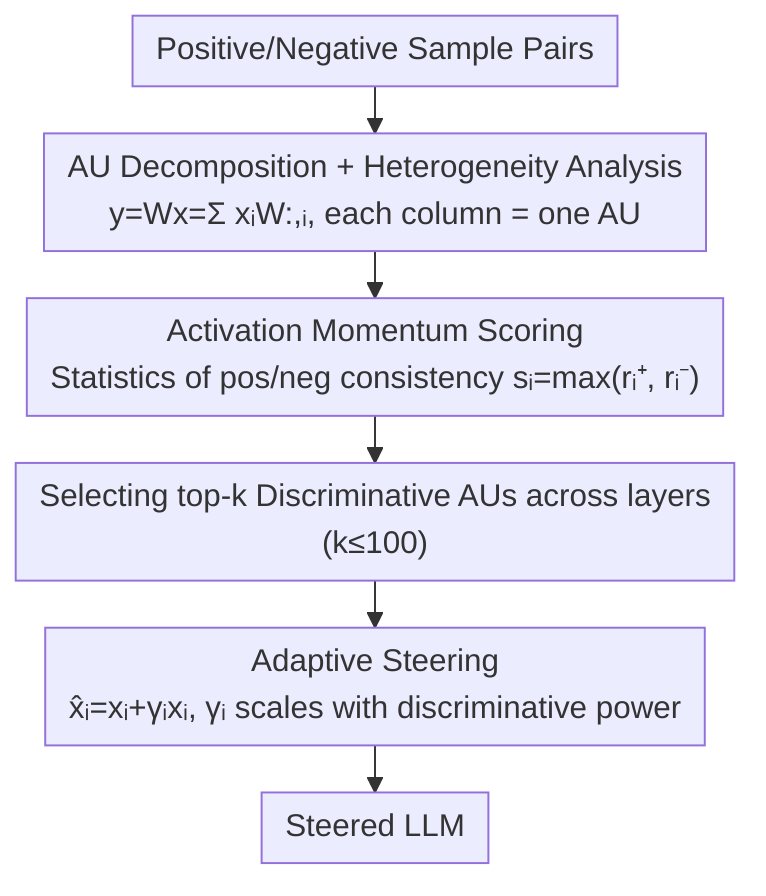

# Fine-Grained Activation Steering: Steering Less, Achieving More

**Conference**: ICLR 2026  
**arXiv**: [2602.04428](https://arxiv.org/abs/2602.04428)  
**Code**: [https://github.com/zijian678/AUSteer](https://github.com/zijian678/AUSteer)  
**Area**: LLM NLP  
**Keywords**: Activation Steering, Atomic Unit, Fine-grained Intervention, Interpretability, Inference-time Alignment

## TL;DR
AUSteer discovers that block-level activation steering is inherently heterogeneous—different dimensions control different token distributions, and mixed steering amplifies both beneficial and harmful signals. It proposes fine-grained steering at the Atomic Unit (AU) level: using activation momentum to locate discriminative dimensions and adaptively adjusting steering strength. By steering $\leq 100$ dimensions, it significantly outperforms state-of-the-art methods that steer thousands of dimensions.

## Background & Motivation

**Background**: Activation steering is a low-cost method for modifying LLM behavior, where steering vectors are extracted and injected into intermediate activations during inference. Methods like ITI, CAA, and SADI operate at the **block level** within attention heads, FFNs, or residual streams.

**Limitations of Prior Work**:
   - Block-level activations contain hundreds to thousands of dimensions, mixing beneficial, irrelevant, and harmful features.
   - Block-level steering inevitably shifts both useful and harmful token directions—it is coarse-grained, inefficient, and overly intrusive.
   - Steering a single dimension can **outperform** steering an entire block, suggesting that block-level operations are suboptimal.

**Key Challenge**: Block-level steering binds all dimensions together, yet different dimensions control probability distributions for different output tokens—this is a fundamental heterogeneity problem.

**Key Insight**: Each column of the weight matrix is defined as an "Atomic Unit" (AU), corresponding to a single dimension of activation. By decomposing $\mathbf{y} = \mathbf{W}\mathbf{x} = \sum_i x_i \mathbf{W}_{:,i}$, block-level intervention is decomposed into AU-level scalar interventions.

**Core Idea**: Steering fewer dimensions yields better results because steering only beneficial AUs avoids the side effects of harmful AUs.

## Method

### Overall Architecture
AUSteer addresses the counter-intuitive problem: why do block-level methods steering thousands of dimensions underperform compared to steering only a few? The solution treats each column of the weight matrix as an "Atomic Unit" (AU). Since $\mathbf{y} = \mathbf{W}\mathbf{x} = \sum_i x_i \mathbf{W}_{:,i}$, block-level activation is a superposition of AU scalar contributions, allowing coarse-grained interventions to be decomposed. The authors prove AU heterogeneity (different dimensions push toward conflicting token distributions) to show that block-level steering is inefficient due to the simultaneous amplification of beneficial and harmful dimensions. A training-free two-step pipeline is designed: using activation momentum on contrastive samples to score AU discriminative power, selecting the top-k most beneficial AUs across layers, and applying input-adaptive steering based on their discriminative strength. By intervening in $\leq 100$ dimensions, beneficial signals are amplified while avoiding harmful side effects.

### Key Designs

**1. AU Decomposition and Heterogeneity: Why Block-level Steering is Suboptimal**

AUSteer decomposes block-level activation into the sum of AU scalar contributions $\mathbf{y} = \mathbf{W}\mathbf{x} = \sum_i x_i \mathbf{W}_{:,i}$, enabling dimension-wise analysis. Critical heterogeneity is observed: different dimensions within the same block control distinct output token distributions. Let $s$ denote steering intensity. As $s$ increases, the model output converges to the token distribution preferred by the steered AU. The KL divergence between output distributions of two different AUs increases monotonically with $s$, indicating they push the model in conflicting directions. In a classification task, steering a beneficial dimension (e.g., $x_{84}$) increases the probability of the correct token "yes," while steering a harmful dimension (e.g., $x_{44}$) increases irrelevant tokens. Block-level steering amplifies both, explaining why "more steering is worse" and justifying the selection of only beneficial AUs.

**2. Locating Discriminative AUs via Activation Momentum: Global Scoring for Cross-layer Comparison**

To identify beneficial AUs among thousands, a cross-layer comparable score is required. For each AU $u_i$, the activation difference $m_i^j = x_i^{j,pos} - x_i^{j,neg}$ is calculated over $N$ pairs of contrastive samples. The ratios of positive differences $r_i^{pos}$ and negative differences $r_i^{neg}$ are calculated. The final discriminative score is $s_i = \max(r_i^{pos}, r_i^{neg})$. Consistency ratios are used instead of raw magnitude because activation magnitudes accumulate across layers, which would bias selection toward deeper layers. Count-based ratios in $[0,1]$ allow rank-ordering of all AUs across the entire model to select the top-k.

**3. Adaptive Steering: Scaling by Current Activation and Discriminative Power**

Instead of adding a constant, selected AUs undergo proportional scaling $\hat{x}_i = x_i + \gamma_i x_i$. This maintains the original sign while adapting to input-specific activation magnitudes, preventing over-steering of weak activations. The coefficient $\gamma_i$ is linked to discriminative power: $\gamma_i = \alpha \cdot r_i^{pos}$ for promotive AUs and $\gamma_i = -\alpha \cdot r_i^{neg}$ for suppressive AUs, where $\alpha$ is a global intensity hyperparameter. AUs with higher consistency receive stronger steering, concentrating the intervention budget on the most reliable dimensions.

### Loss & Training
The method is entirely training-free, requiring no gradient updates. All information is derived from activation momentum statistics on contrastive samples. By steering only $k \leq 100$ dimensions, it involves far fewer interventions than block-level methods and can be applied to MHA, FFN, or residual streams.

## Key Experimental Results

### Main Results (LLaMA2-7B-Chat, Commonsense Reasoning)

| Method | Steering Dimensions | BoolQ↑ | COPA↑ | WinoGrande↑ |
|------|----------|--------|-------|------------|
| Baseline | 0 | 70.5 | - | - |
| ITI (Block) | 128 | 71.6 | - | - |
| SADI (Block) | 4224 | 73.7 | - | - |
| **AUSteer (Ours)** | **≤100** | **76.0+** | **Gain** | **Gain** |

### Ablation Study

| Configuration | Performance |
|------|------|
| Single Dimension Steering $x_{84}$ | 74.5% (Exceeds block-level SADI's 73.7%) |
| Combination of 4 Positive Dimensions | 76%+ |
| Mixed Positive + Negative Dimensions | Performance Drop (Validates heterogeneity) |
| Impact of Dimension Count $k$ | $k=50-100$ is optimal; too many leads to degradation |

### Key Findings
- **Single Dimension > Entire Block**: Steering only the 84th dimension (74.5%) outperforms 128-dimensional ITI (71.6%) and 4224-dimensional SADI (73.7%).
- **100 Dimensions > 4000 Dimensions**: AUSteer with $\leq 100$ AUs significantly outperforms state-of-the-art methods steering thousands of dimensions.
- **Cross-model Consistency**: Effective across LLaMA2-7B/13B, Mistral-7B, and others.
- **Multi-task Generality**: Effective for commonsense reasoning, math problem solving, detoxification, and human preference alignment.
- **Cross-layer Comparability**: Count-based scoring avoids magnitude bias induced by layer depth.

## Highlights & Insights
- **"Steering Less, Achieving More" is a counter-intuitive yet profound discovery**: While intuition suggests more intervention provides stronger control, precise intervention at a few key points in a heterogeneous system is superior to coarse global intervention. This principle may extend to pruning and knowledge editing.
- **Token distribution interpretation of AUs** provides a clear theoretical foundation for activation steering—each AU act like a "micro-expert" controlling output probabilities for specific token types, implying modularity within Transformers.
- **Training-free and contrastive statistic-based** nature makes AUSteer extremely lightweight and more general than SAE-based methods (like STA) which require pre-trained SAEs for specific models.

## Limitations & Future Work
- Activation momentum depends on contrastive sample statistics—sample quality and quantity affect AU selection reliability.
- Currently requires independent AU localization per task, lacking cross-task transferability.
- Theoretical analysis is based on linear projection decomposition; non-linear interactions in attention mechanisms are not fully modeled.
- Combination with LoRA/SFT has not been explored.
- Effectiveness on larger models (70B+) remains to be validated.

## Related Work & Insights
- **vs ITI (Li et al.)**: ITI steers at the attention head level (128 dimensions); AUSteer further decomposes to single dimensions, achieving better performance with fewer interventions.
- **vs SADI (Wang et al.)**: SADI is the block-level SOTA (4224 dimensions); AUSteer outperforms it using $\leq 100$ dimensions.
- **vs STA (Wang et al.)**: STA uses "atoms" from SAEs but injects at the residual stream block level; AUSteer directly operates on weight matrix columns without relying on SAEs.

## Rating
- Novelty: ⭐⭐⭐⭐⭐ AU decomposition + Heterogeneity analysis + Momentum localization.
- Experimental Thoroughness: ⭐⭐⭐⭐⭐ Comprehensive multi-model, multi-task, ablation, and human evaluations.
- Writing Quality: ⭐⭐⭐⭐⭐ Highly clear "Steering Less, Achieving More" narrative.
- Value: ⭐⭐⭐⭐⭐ Foundational contribution to activation steering; simple and practical.

<!-- RELATED:START -->

## Related Papers

- [\[ICLR 2026\] FACT: Fine-grained Across-variable Convolution for Multivariate Time Series Forecasting](fact_fine-grained_across-variable_convolution_for_multivariate_time_series_forec.md)
- [\[ACL 2025\] Steering off Course: Reliability Challenges in Steering Language Models](../../ACL2025/llm_nlp/steering_off_course_reliability_challenges_in_steering_language_models.md)
- [\[ICLR 2026\] Spectral Attention Steering for Prompt Highlighting](spectral_attention_steering_for_prompt_highlighting.md)
- [\[ICML 2026\] The Cylindrical Representation Hypothesis for Language Model Steering](../../ICML2026/llm_nlp/the_cylindrical_representation_hypothesis_for_language_model_steering.md)
- [\[ICLR 2026\] Parameters vs. Context: Fine-Grained Control of Knowledge Reliance in Language Models](parameters_vs_context_fine-grained_control_of_knowledge_reliance_in_language_mod.md)

<!-- RELATED:END -->
