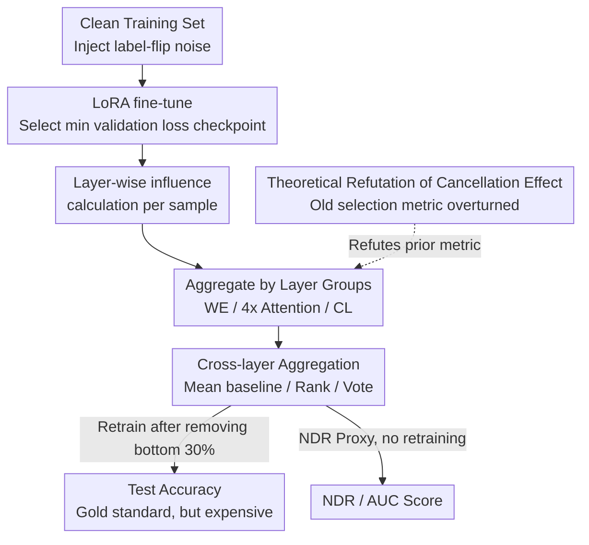

# First is Not Really Better Than Last: Evaluating Layer Choice and Aggregation Strategies in Language Model Data Influence Estimation

**Conference**: ICLR 2026  
**arXiv**: [2511.04715](https://arxiv.org/abs/2511.04715)  
**Code**: Yes  
**Area**: LLM/NLP (Other)  
**Keywords**: Influence Functions, Data Attribution, Layer Analysis, LLM Interpretability, Training Data Quality

## TL;DR
This work demonstrates theoretically and experimentally that the conclusion from prior work—claiming the first layer (embedding) is most suitable for influence estimation—is unreliable. It finds that middle attention layers are superior choices and proposes two new cross-layer aggregation strategies, Rank and Vote, along with the Noise Detection Rate (NDR) proxy metric, significantly improving the detection of harmful training samples in LLMs.

## Background & Motivation

**Background**: Influence functions are essential tools for assessing the impact of training data on model decisions (e.g., TracIn, DataInf, Cosine). Due to the massive parameter counts of modern LLMs, influence is typically calculated only on a subset of layers to ensure feasibility.

**Limitations of Prior Work**: Yeh et al. (2022) concluded that the first layer (word embedding) is best for influence estimation based on the "cancellation effect" hypothesis. However, this was only verified on small models (RoBERTa) and a single method (TracIn), and the reliability of the cancellation effect itself has never been rigorously tested.

**Key Challenge**: The cancellation effect metric $C(W)$ measures gradient cancellation through the norm aggregation of parameter subsets. However, this aggregation can mask extreme cancellations in individual parameters, making the metric an unreliable predictor of actual layer-wise influence performance. Furthermore, standard mean aggregation strategies may reduce discriminative power due to hedging effects.

**Goal**: (RQ1) Is the cancellation effect reliable? (RQ2) Which layers are most suitable for influence estimation? (RQ3) How can influence scores be better aggregated across layers? (RQ4) Is there a proxy metric to evaluate influence methods without retraining?

**Key Insight**: Starting from a theoretical counterexample to the cancellation effect, the study conducts large-scale experiments across multiple models and datasets to systematically evaluate layer choice and aggregation strategies.

**Core Idea**: Middle attention layers are more suitable for influence estimation than the embedding layer. Vote aggregation significantly outperforms mean aggregation, and NDR serves as a reliable proxy metric that does not require retraining.

## Method

### Overall Architecture

This paper does not propose a new influence algorithm but builds a controlled experimental framework to answer questions regarding layer choice and aggregation. The pipeline centers on a verifiable signal: injecting known synthetic noise (label flipping) into the training set, under the premise that a good influence method should rank these contaminated samples at the bottom. The process follows five steps: LoRA fine-tuning on noisy data and selecting the checkpoint at the minimum validation loss; calculating the influence of each training sample layer-by-layer for all tunable layers; grouping layers into three categories—Word Embedding (WE), four groups of Attention layers, and Classification Head (CL)—and aggregating total influence per group; finally, retraining after removing the bottom 30% of samples to judge performance via test accuracy. The contributions address different stages: theoretically dismantling the prior layer selection metric, introducing Rank and Vote aggregation strategies, and using the NDR proxy to bypass the expensive "remove-retrain-evaluate" cycle.

### Key Designs

**1. Theoretical Refutation of Cancellation Effect: Proving the old metric is unreliable**

The preference for the embedding layer in Yeh et al. (2022) relied on the cancellation effect metric $C(W)$, which uses the norm aggregation of parameter subset gradients to measure "gradient offset," assuming layers with less cancellation are better for influence estimation. This paper uses Theorem 5.1 to construct a counterexample: a validation point $\bar{x}_3$ exists such that the influence score $\Delta I_{\theta,\omega}$ (retaining high-cancellation weight $\omega$) distinguishes noise better than $\Delta I_{\theta}$ (using only low-cancellation weight $\theta$). High-cancellation parameters are not useless; norm aggregation simply averages out extreme cancellations. Combined with Spearman correlation analysis ($\rho$ between $C$ and downstream performance is near 0), the results show that the cancellation effect neither explains why the embedding layer works nor predicts which layer is actually better.

**2. Rank Aggregation: Eliminating scale differences across layers**

Standard practice involves taking the mean of influence scores across layers. However, score magnitudes vary drastically between layers, allowing a few extreme values to dominate the mean. Rank aggregation converts original scores into ranks: for each validation sample and layer, training samples are sorted by influence, and ranks are accumulated:

$$\operatorname{Rank}(I') = \sum_{x',l} \sum_{y} \mathbb{I}(I'(y,\cdot) < I'(\cdot,\cdot))$$

Only validation samples correctly predicted by the model are included to avoid misleading signals. Ranks are ordinal and naturally scale-invariant, preventing extreme scores from disproportionately affecting the result.

**3. Vote (Positional Voting): Focusing on the tail of the ranking**

While Rank eliminates scale issues, the entire ranking (including irrelevant middle samples) still enters the summation. Vote uses truncation—each validation sample/layer only "votes" for the bottom $k$ training samples, with weights decreasing as the rank improves:

$$\operatorname{Vote}_k(I') = -\sum_{x',l} \max(k - \operatorname{rank}, 0)$$

By setting $k$ to the number of samples intended for removal, only those at the very bottom (most likely harmful) are counted. This design allows even poorly performing configurations to become effective. $k \in [10, 50]$ performed best in experiments.

**4. Noise Detection Rate (NDR) Proxy: Evaluating influence without retraining**

The previous points rely on "remove-retrain-evaluate" cycles. NDR shortcuts this: it measures the proportion of injected noise samples within the bottom $k\%$ of the influence ranking (higher proportion indicates better detection). The accompanying AUC measures the skewness of noise distribution across the entire ranking. Unlike the cancellation effect, NDR shows a high Spearman correlation (0.5–0.9) with actual downstream performance, making it a reliable, low-cost proxy.

### Loss & Training

Standard cross-entropy fine-tuning (LoRA) is used, with checkpoints selected at the lowest validation loss. Each configuration is repeated with 10 seeds. Comparisons of configuration performance use win rates and Pareto front analysis.

## Key Experimental Results

### Main Results

| Model | Best Layer | Worst Layer | Best Method + Layer | Win Rate |
|------|--------|--------|------------|----------|
| RoBERTa-Large | Attn 18-23 | CL | DataInf + Attn 18-23 | 0.70 |
| Qwen-2.5 1.5B | Attn 07-13 | CL | Cosine + Attn 07-13 | Top-1 |
| Mistral 7B | Attn 08-15 | CL | DataInf + Attn 08-15 | 0.71 |
| Llama-3.2 1B | Attn 04-07 | CL | DataInf + Attn 04-07 | 0.64 |

The best layers outperform the worst layer (CL) by 10-15% in post-filtering accuracy.

### Ablation Study

| Aggregation Strategy | Effect | Description |
|---------|------|------|
| Mean (baseline) | Baseline | Standard cross-layer mean |
| Rank | Moderate Gain | Eliminates scale differences; outperforms Vote in some scenarios |
| Vote (k=10-50) | Significant Gain | TracIn CL win rate increased from 0.10 to top-1; DataInf 00-07 win rate reached 0.84 |

| Proxy Metric | Correlation with Downstream (Spearman ρ) |
|-----------|---------------------------|
| Cancellation Effect C | -0.3 to 0.2 (Weak/None) |
| NDR@30% (Mean) | 0.4 to 0.7 (Moderate to Strong) |
| NDR@30% (Vote) | 0.8 to 0.9 (Strong) |

### Key Findings
- **Middle attention layers consistently outperform embedding layers and the classification head** across models and methods, refuting Yeh et al.
- **The classification head (CL) is the worst choice across all models**, likely due to over-sensitivity to noise.
- **Vote aggregation can elevate poor configurations to top-1 performance** (e.g., TracIn CL on Mistral moved from rank 12 to 1).
- **DataInf and Cosine generally outperform TracIn**, especially in middle layers of larger models.
- **Llama-3.2 1B proved the most challenging model**—no influence method beat random filtering, possibly due to specific training characteristics.

## Highlights & Insights
- **Dual evidence (theoretical counterexample + large-scale empirical data)** successfully challenges a field-standard assumption. The methodology—proving something *can* be wrong with a theorem, then proving it *is* wrong with data—is exemplary.
- **The simplicity and effectiveness of Vote aggregation**: By adjusting a single parameter $k$, unusable layers (like CL) become highly effective, suggesting the bottleneck of influence estimation lies in aggregation rather than the underlying methods.
- **Practical value of NDR as a proxy**: Researchers can rapidly evaluate influence methods without the high cost of retraining.
- Inter-layer influence correlation analysis reveals three distinct layer groups (early/middle/late), a structure consistent with findings in knowledge editing (e.g., ROME/MEMIT).

## Limitations & Future Work
- Experiments are restricted to GLUE benchmarks and do not cover generative tasks or in-context learning.
- The failure of influence functions on Llama-3.2 1B remains without a fully convincing explanation.
- The hyperparameter $k$ in Vote requires searching and can decrease performance for the Cosine method.
- Noise injection (label flipping) is relatively simple; more complex data quality issues (e.g., backdoor attacks) were not tested.
- Only LoRA fine-tuning was evaluated; behaviors might differ under full-parameter fine-tuning.

## Related Work & Insights
- **vs Yeh et al. (2022)**: Directly challenges the core conclusion. While Yeh et al. utilized small models and a single method to claim embedding is best, this work proves middle layers are superior across 4 models, 5 methods, and 8 datasets.
- **vs ROME/MEMIT**: Knowledge editing finds middle MLP layers encode the most factual information, aligning with the finding that middle layers exhibit the strongest influence.
- **vs Li et al. (2025)**: They found influence functions perform poorly on LLMs, but used default settings (mean aggregation + all layers). This work shows that selecting the correct layers and using Vote aggregation significantly improves results.

## Rating
- Novelty: ⭐⭐⭐⭐ (Refuting standard hypotheses + Rank/Vote aggregation + NDR proxy)
- Experimental Thoroughness: ⭐⭐⭐⭐⭐ (4 models × 5 methods × 8 datasets × 10 seeds)
- Writing Quality: ⭐⭐⭐⭐ (Clear RQ-driven structure)
- Value: ⭐⭐⭐⭐ (Directly informs influence function research and practical applications)

<!-- RELATED:START -->

## Related Papers

- [\[ICLR 2026\] Evaluating Text Creativity across Diverse Domains: A Dataset and Large Language Model Evaluator](evaluating_text_creativity_across_diverse_domains_a_dataset_and_large_language_m.md)
- [\[NeurIPS 2025\] The Last Vote: A Multi-Stakeholder Framework for Language Model Governance](../../NeurIPS2025/llm_nlp/the_last_vote_a_multi-stakeholder_framework_for_language_model_governance.md)
- [\[ACL 2025\] Evaluating Language Models as Synthetic Data Generators](../../ACL2025/llm_nlp/evaluating_lms_synthetic_data_gen.md)
- [\[ACL 2025\] Wait, that's not an option: LLMs Robustness with Incorrect Multiple-Choice Options](../../ACL2025/llm_nlp/llm_robustness_incorrect_mcq.md)
- [\[ACL 2025\] Training Language Model to Critique for Better Refinement](../../ACL2025/llm_nlp/training_language_model_to_critique_for_better_refinement.md)

<!-- RELATED:END -->
